# DotOcpi Architecture

## Table of Contents

- [1. System Context](#1-system-context)
- [2. Package Architecture](#2-package-architecture)
- [3. OCPI Version Strategy](#3-ocpi-version-strategy)
- [4. Server-Side Pipeline (Receiving from CPOs)](#4-server-side-pipeline-receiving-from-cpos)
- [5. Client-Side Pipeline (Calling CPOs)](#5-client-side-pipeline-calling-cpos)
- [5.1 Pull Synchronization](#51-pull-synchronization)
- [6. Credentials & Registration](#6-credentials--registration)
- [7. Module Architecture](#7-module-architecture)
- [8. Multi-Party Support](#8-multi-party-support)
- [9. Token Management](#9-token-management)
- [10. CPO Connection Registry](#10-cpo-connection-registry)
- [11. Error Handling](#11-error-handling)
- [12. Serialization](#12-serialization)
- [13. Pagination](#13-pagination)
- [14. Observability](#14-observability)
- [15. Project Structure](#15-project-structure)
- [16. Testing Architecture](#16-testing-architecture)

### Related Documents

| Document | Description |
|---|---|
| [Module: Locations](modules/locations.md) | Location/EVSE/Connector models per version, receiver endpoints |
| [Module: Sessions](modules/sessions.md) | Session models, CdrToken, ChargingPreferences |
| [Module: CDRs](modules/cdrs.md) | CDR models, CdrLocation, SignedData, cost breakdown |
| [Module: Tariffs](modules/tariffs.md) | Tariff models, TariffElement, PriceComponent |
| [Module: Tokens](modules/tokens.md) | Token models, real-time authorization flow |
| [Module: Commands](modules/commands.md) | Command types, async callback flow |
| [Module: Charging Profiles](modules/charging-profiles.md) | Smart charging (2.2+ only) |
| [Module: Credentials](modules/credentials.md) | Credentials object, version discovery |
| [Module: Common Types](modules/common-types.md) | Shared types, status codes, primitives |
| [CPO Registry](cpo-registry.md) | Registry design, multi-instance, identification, health monitoring |
| [Strategies](strategies.md) | Validation, .NET compat, minimal API, retry, resilience, observability, **logging**, PATCH handling, type conventions, exceptions, testing |
| [Performance](performance.md) | Source-gen JSON, memory optimization, async patterns, hot-path design, benchmarks |
| [Testing](testing.md) | Unit/integration strategy, multi-version test matrix, security tests, CI pipeline, test data |
| [Implementation Guide](implementation-guide.md) | 15-phase step-by-step build order with dependencies, acceptance criteria, and code structure |

---

## 1. System Context

DotOcpi operates as the eMSP side of the OCPI protocol. It communicates with one or more CPOs, each potentially using a different OCPI version and receiving a different eMSP identity.

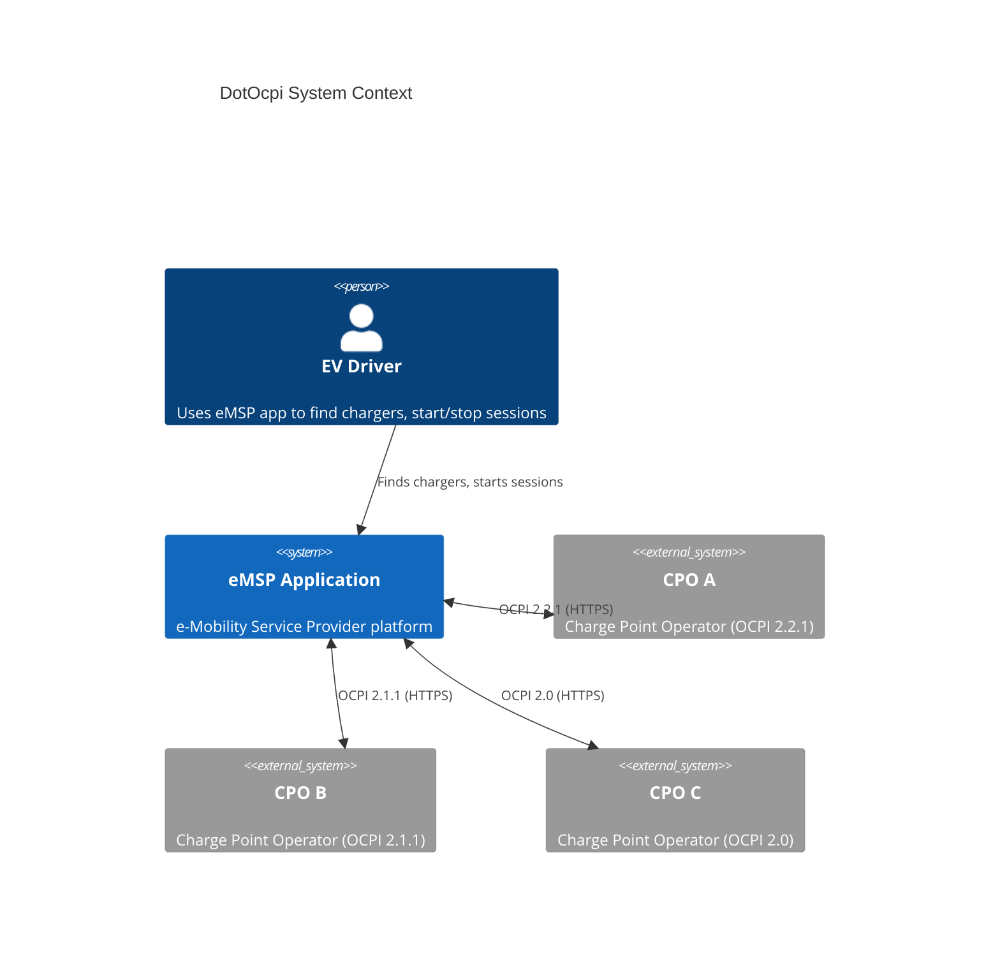

### eMSP Dual Role

The eMSP acts as both **client** and **server** in OCPI:

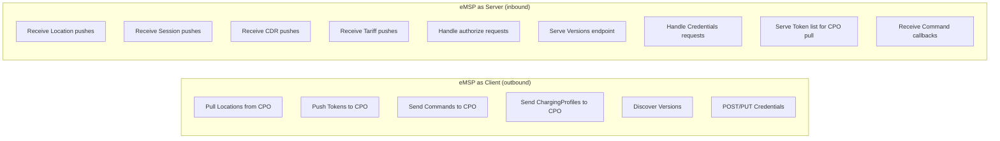

---

## 2. Package Architecture

### Package Dependency Graph

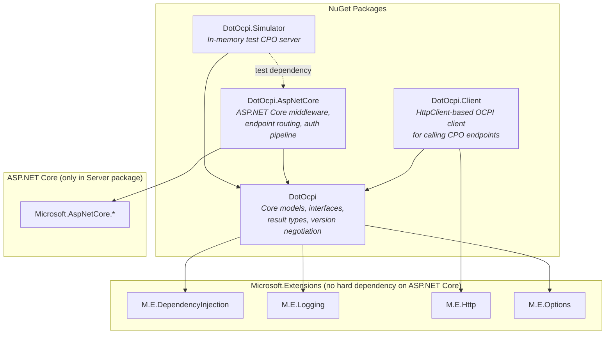

### Package Responsibilities

| Package | Depends On | Contains |
|---|---|---|
| **DotOcpi** | `M.E.DependencyInjection`, `M.E.Logging`, `M.E.Options`, `System.Text.Json` | Version-specific models, `OcpiResult<T>`, `ITokenStore`, `ICpoRegistry`, module receiver/sender interfaces, version negotiation, OCPI status codes, JSON converters, `ActivitySource` |
| **DotOcpi.Client** | `DotOcpi`, `M.E.Http` | `IOcpiClient`, typed HTTP clients per module, pagination handling, request/response pipeline, `X-Request-ID`/`X-Correlation-ID` generation |
| **DotOcpi.AspNetCore** | `DotOcpi`, `Microsoft.AspNetCore.*` | OCPI auth middleware, endpoint routing, version/credentials endpoints, module receiver endpoints, request ID middleware |
| **DotOcpi.Simulator** | `DotOcpi`, `Microsoft.AspNetCore.App` (framework ref) | `OcpiCpoSimulator`, configurable module responses, handshake simulation, failure injection |

---

## 3. OCPI Version Strategy

### Design: Separate Models, Shared Infrastructure

OCPI model shapes change substantially between versions. The library uses **completely separate model types per version** with a **strategy pattern** to select the correct handler at runtime.

```mermaid
graph TD
    subgraph "Shared Infrastructure"
        VP[Version Pipeline]
        Auth[Auth Middleware]
        TM[Token Management]
        Reg[CPO Registry]
        Result["OcpiResult&lt;T&gt;"]
        Pagination[Pagination Handler]
        Headers[Request ID / Correlation ID]
    end

    subgraph "DotOcpi.Models.V2_0"
        M20_Loc[Location]
        M20_Sess[Session]
        M20_Cdr[Cdr]
        M20_Tok[Token]
        M20_Tar[Tariff]
        M20_Cred[Credentials]
    end

    subgraph "DotOcpi.Models.V2_1_1"
        M211_Loc[Location]
        M211_Sess[Session]
        M211_Cdr[Cdr]
        M211_Tok[Token]
        M211_Tar[Tariff]
        M211_Cmd[Command]
        M211_Cred[Credentials]
    end

    subgraph "DotOcpi.Models.V2_2_1"
        M221_Loc[Location]
        M221_Sess[Session]
        M221_Cdr[Cdr]
        M221_Tok[Token]
        M221_Tar[Tariff]
        M221_Cmd[Command]
        M221_CP[ChargingProfile]
        M221_Cred["Credentials<br/>(roles array)"]
    end

    VP --> M20_Loc & M211_Loc & M221_Loc
```

### Version Negotiation Flow

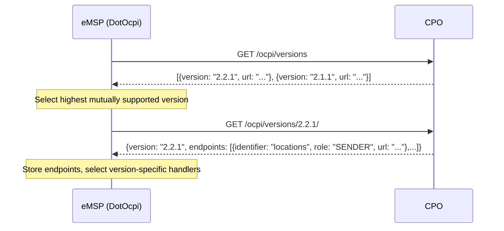

### Version Handler Resolution

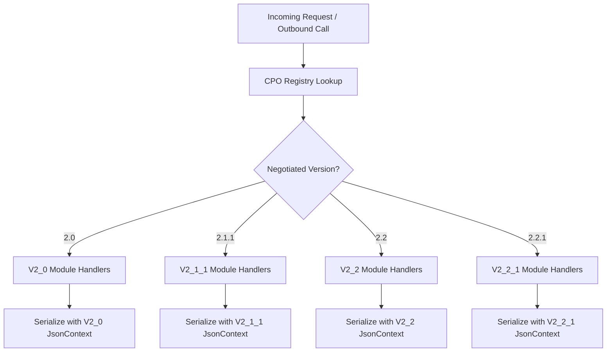

### Key Version Differences That Drive Separation

| Aspect | 2.0 / 2.1.1 | 2.2 / 2.2.1 |
|---|---|---|
| Receiver URL pattern | `/{object_id}` | `/{country_code}/{party_id}/{object_id}` |
| Credentials object | Flat: `party_id`, `country_code`, `business_details` at top level | `roles` array of `CredentialsRole` |
| Token model | `auth_id`, `TokenType {RFID, OTHER}` | `contract_id`, `TokenType {RFID, APP_USER, AD_HOC_USER, OTHER, EMAID}` |
| Session model | Embedded `Location` object | Separate `location_id`, `evse_uid`, `connector_id` |
| CDR model | Full `Location` object, `total_cost` as number | `CdrLocation`, `total_cost` as `Price` object, cost breakdown fields |
| Connector | `voltage`, `amperage`, `tariff_id` (singular) | `max_voltage`, `max_amperage`, `tariff_ids` (array) |
| Modules | No Commands in 2.0 | Commands, ChargingProfiles, HubClientInfo |

---

## 4. Server-Side Pipeline (Receiving from CPOs)

### Request Pipeline

The pipeline uses a combination of middleware (runs on every request) and endpoint filters (runs per-endpoint). Two separate filter pipelines exist:

**Data endpoints + Credentials PUT/GET/DELETE** (Token B auth, requires CpoConnection):

1. **OcpiRequestIdMiddleware** (middleware) — Extract/generate `X-Request-ID` and `X-Correlation-ID`
2. **OcpiSecurityHeadersMiddleware** (middleware) — Add `X-Content-Type-Options: nosniff`, `Cache-Control: no-store`, `X-Frame-Options: DENY`
3. **OcpiExceptionMiddleware** (middleware) — Catch unhandled exceptions, return OCPI 3000 error envelope
4. **OcpiAuthFilter** (endpoint filter) — Extract `Authorization: Token` header, validate Token B, look up CpoConnection
5. **OcpiRateLimitFilter** (optional endpoint filter) — Rate limiting per CPO
6. **OcpiMetricsFilter** (endpoint filter) — Record request metrics
7. Per-module: **OcpiContextFilter** + **OcpiBodySizeLimitFilter** (endpoint filters)

**Credentials POST** (Token A auth, initial registration — no CpoConnection exists):

1–3. Same middleware as above (request IDs, security headers, exception handling)
4. **OcpiTokenAAuthFilter** (endpoint filter) — Validate Token A, reject Token B, store TokenEntry
5. **OcpiMetricsFilter** (endpoint filter) — Record request metrics
6. **OcpiRegistrationContextFilter** + **OcpiBodySizeLimitFilter** (endpoint filters)

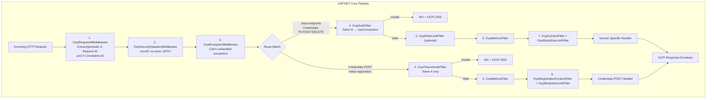

### Server Endpoint Registration

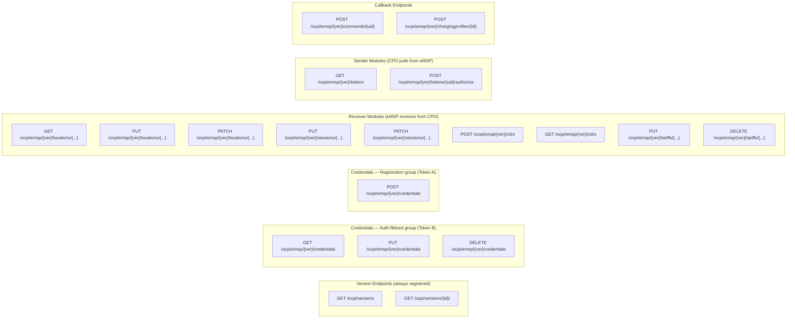

### Consumer Integration Point

The consumer implements interfaces to handle incoming OCPI data. The library handles protocol concerns; the consumer handles business logic:

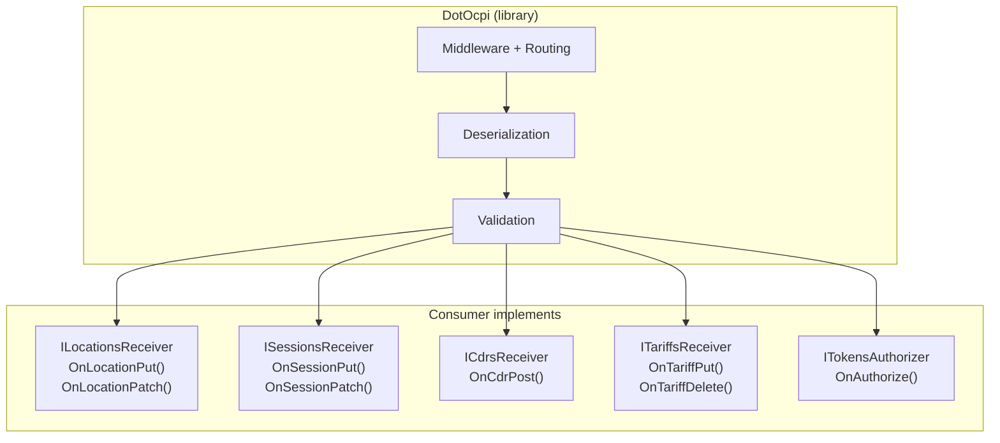

### OcpiRequestContext

Every consumer handler receives an `OcpiRequestContext` — a read-only object carrying all protocol metadata for the current request. This is the primary way consumers access connection details without coupling to the auth/routing pipeline.

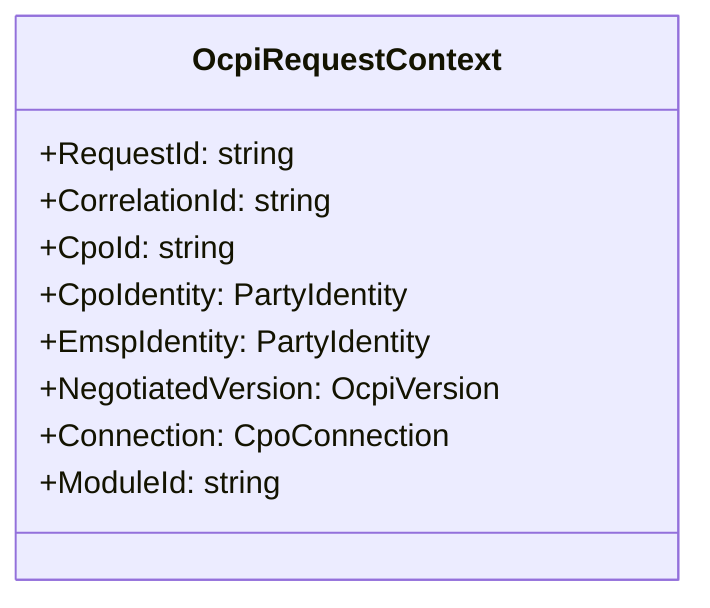

| Property | Description |
|---|---|
| `RequestId` | Value of `X-Request-ID` header (generated if missing) |
| `CorrelationId` | Value of `X-Correlation-ID` header (generated if missing) |
| `CpoId` | Deterministic composite ID (`"DE_ABC"`) |
| `CpoIdentity` | CPO's `country_code` + `party_id` |
| `EmspIdentity` | eMSP identity used for this CPO connection |
| `NegotiatedVersion` | OCPI version negotiated with this CPO |
| `Connection` | Full `CpoConnection` record (endpoints, status, etc.) |
| `ModuleId` | Module being invoked (`"locations"`, `"sessions"`, etc.) |

The context is created by the auth filter, stored in `HttpContext.Items`, and retrieved via `httpContext.GetOcpiContext()`.

---

## 5. Client-Side Pipeline (Calling CPOs)

### Outbound Request Pipeline

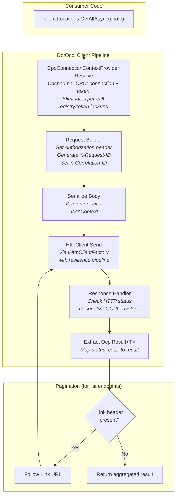

### Client Interface Hierarchy

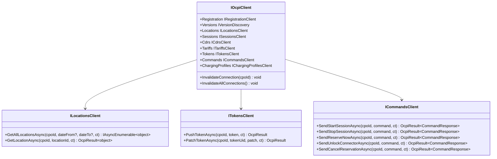

---

## 5.1 Pull Synchronization

The client package includes a pull sync infrastructure that periodically fetches data from CPO endpoints and delivers it to consumers via a callback interface.

### Data Flow

```
OcpiPullSyncBackgroundService (PeriodicTimer, 30s tick)
  │
  ├── For each Connected CPO in ICpoRegistry:
  │     ├── Resolve enabled modules (PullSyncOptionsResolver)
  │     ├── Check if interval has elapsed since last sync (ISyncStateStore)
  │     └── Call IOcpiSyncService.SyncModuleFromCpoAsync()
  │
  └── OcpiSyncService.SyncModuleCoreAsync()
        ├── Resolve CpoConnectionContext (cached token + registry data)
        ├── Build initial HTTP request (PullClientHelper)
        ├── Stream pages (PaginationHandler.StreamPagesAsync)
        │     ├── Parse OCPI response → OcpiPageResult
        │     ├── Follow Link headers for next page
        │     └── Stop after MaxPages (10,000) or no NextLink
        ├── For each page with items:
        │     └── IOcpiSyncHandler.OnPageReceivedAsync(context, items)
        ├── IOcpiSyncHandler.OnSyncCompletedAsync(context, result)
        └── ISyncStateStore.SetLastSyncAsync() (only on success)
```

### Configuration Hierarchy

`PullSyncOptions` supports four levels of configuration, resolved in priority order:

1. **CPO + module specific** — `CpoOverrides["DE:ALL"].ModuleOverrides["locations"].Interval`
2. **CPO default** — `CpoOverrides["DE:ALL"].DefaultInterval`
3. **Module-level** — `ModuleOverrides["locations"].Interval`
4. **Global default** — `DefaultInterval` (1 hour)

Each CPO can also override which modules are enabled via `CpoOverrides[cpoId].EnabledModules`.

### Key Design Decisions

- **Page-level delivery**: Items are delivered to `IOcpiSyncHandler` in page-sized batches matching OCPI pagination boundaries, enabling efficient bulk persistence.
- **Handler is optional**: `IOcpiSyncHandler` is resolved via `GetService<T>()` (nullable). Without a handler, syncs still run and update timestamps — useful for manual invocation via `IOcpiSyncService`.
- **Timestamp after handler**: `ISyncStateStore` is only updated after `OnSyncCompletedAsync` succeeds. If a handler throws or the sync fails, the next run re-fetches from the same point.
- **Deterministic jitter**: `OcpiPullSyncBackgroundService` uses `HashCode.Combine(cpoId, moduleId)` for stable per-pair jitter, preventing thundering herd without timer drift.
- **Startup validation**: `PullSyncOptionsValidator` (IValidateOptions) rejects zero/negative intervals, negative jitter, and invalid module names at startup.

---

## 6. Credentials & Registration

### Full Handshake Sequence

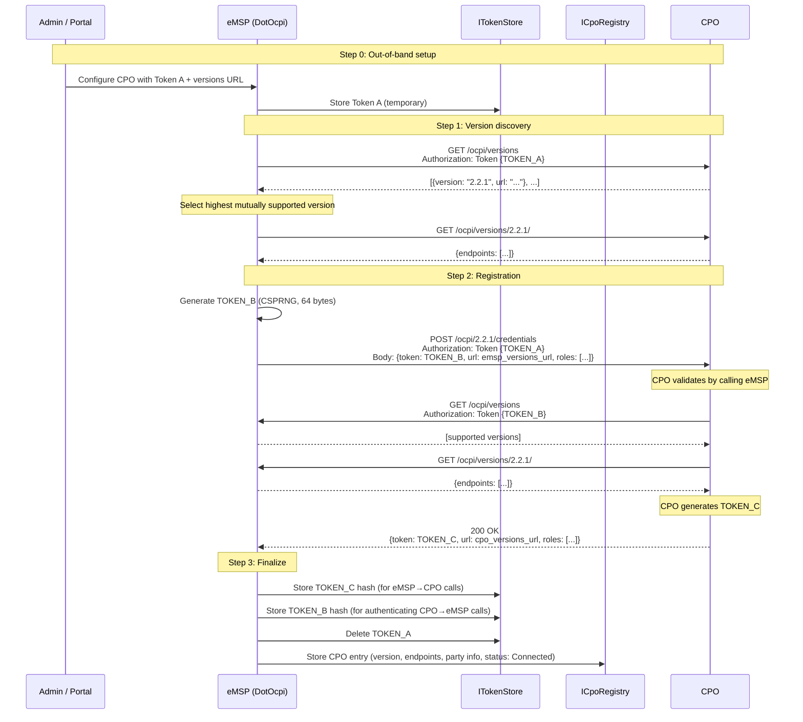

### Token Lifecycle State Machine

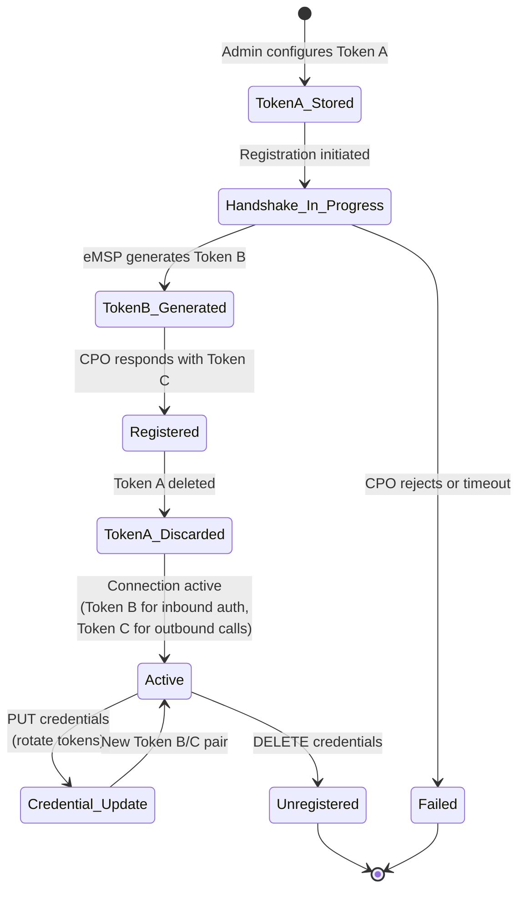

### Credential Update (Token Rotation)

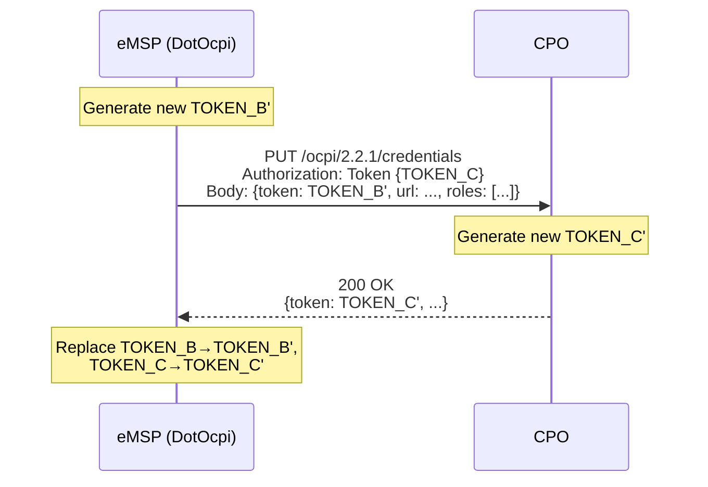

### Registration Client API

Consumers initiate CPO registration via the `IOcpiClient.Registration` interface:

```csharp
public interface IRegistrationClient
{
    /// <summary>
    /// Full automated handshake: discover versions → negotiate → POST credentials → store.
    /// </summary>
    Task<RegistrationResult> RegisterAsync(
        RegistrationRequest request,
        CancellationToken cancellationToken = default);

    /// <summary>
    /// Rotate tokens with an already-registered CPO.
    /// </summary>
    Task<RegistrationResult> RotateCredentialsAsync(
        CredentialRotationRequest request,
        CancellationToken cancellationToken = default);

    /// <summary>
    /// Unregister from a CPO (DELETE /credentials).
    /// </summary>
    Task UnregisterAsync(
        UnregisterRequest request,
        CancellationToken cancellationToken = default);
}

// Request/result types:
public record RegistrationRequest(
    string VersionsUrl,
    string TokenA,
    string EmspCountryCode,
    string EmspPartyId,
    string EmspVersionsUrl,
    string EmspBusinessName,
    IReadOnlyList<OcpiVersion>? SupportedVersions = null);

public record RegistrationResult(CpoConnection Connection, string CpoToken);

// Consumer usage:
var result = await ocpiClient.Registration.RegisterAsync(new RegistrationRequest(
    VersionsUrl: "https://cpo.example.com/ocpi/versions",
    TokenA: "pre-shared-secret-from-cpo",
    EmspCountryCode: "DE",
    EmspPartyId: "ABC",
    EmspVersionsUrl: "https://my-emsp.com/ocpi/versions",
    EmspBusinessName: "My eMSP"));

Console.WriteLine($"Registered with {result.Connection.CpoCountryCode}:{result.Connection.CpoPartyId}");
```

For custom flows, the building blocks are available individually:

```csharp
// Manual step-by-step registration
var versions = await ocpiClient.Versions.GetAllAsync(cpoVersionsUrl, tokenA, ct);
var detail = await ocpiClient.Versions.GetDetailAsync(cpoVersionsUrl, selectedVersion, tokenA, ct);
var credentials = await ocpiClient.Credentials.PostAsync(cpoCredentialsUrl, tokenA, myCredentials, ct);
```

---

## 7. Module Architecture

### Handler Interface Pattern

Each module defines a receiver or sender interface. Version-specific implementations handle the model differences. The consumer implements the version-agnostic callback interfaces.

The `IModuleHandler` interface is internal to `DotOcpi.AspNetCore.Handlers`. Consumers do not implement it directly. Instead, the `ModuleHandlerFactory` resolves the correct version-specific handler at runtime based on the negotiated OCPI version for each CPO connection.

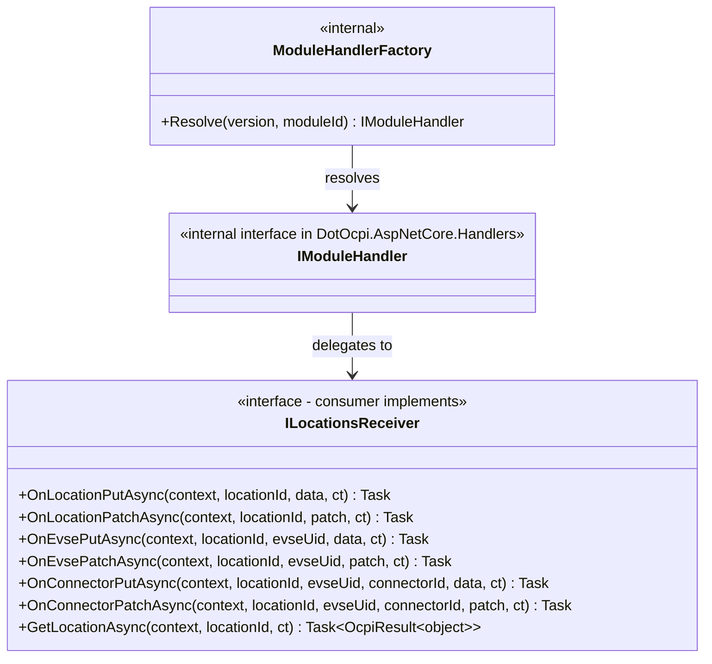

### Version-Dispatched Consumer Models

The consumer interface receives version-specific models as `object`. The version-specific handler (selected by the strategy pattern) deserializes the request into the correct model type and passes it to the consumer. The consumer uses `OcpiRequestContext.NegotiatedVersion` and pattern matching to handle version differences.

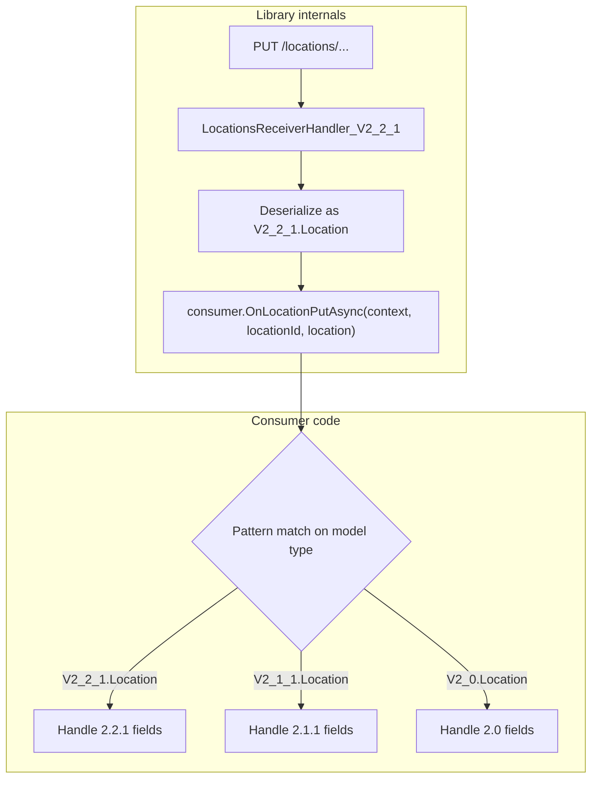

**Consumer implementation:**

```csharp
public class MyLocationsHandler : ILocationsReceiver
{
    public Task<OcpiResult> OnLocationPutAsync(
        OcpiRequestContext context, string locationId, object location, CancellationToken ct)
    {
        // Option 1: Pattern match per version
        return location switch
        {
            V2_2_1.Location loc => SaveLocation(locationId, loc.Name, loc.Address,
                loc.Coordinates, loc.CountryCode, loc.PartyId, ct),
            V2_1_1.Location loc => SaveLocation(locationId, loc.Name, loc.Address,
                loc.Coordinates, countryCode: null, partyId: null, ct),
            V2_0.Location loc => SaveLocation(locationId, loc.Name, loc.Address,
                loc.Coordinates, countryCode: null, partyId: null, ct),
            _ => Task.FromResult(OcpiResult.Failure(OcpiStatusCode.GenericServerError,
                "Unsupported version"))
        };
    }
}
```

**Why `object` instead of generics or a common interface?**

| Approach | Pros | Cons |
|---|---|---|
| `object` + pattern match | Single handler, works with DI, explicit about version differences | Casting required |
| Generic `ILocationsReceiver<T>` | Type-safe | Must register N handlers for N versions, DI complexity |
| Common `ILocation` interface | Uniform access | Lowest common denominator, loses version-specific fields |

The `object` approach was chosen because:
1. Most consumers support 1-2 versions, not all 4. Pattern matching makes unsupported versions explicit.
2. DI registration is simple: one `ILocationsReceiver` per consumer, not one per version.
3. No field-level compromises — consumers see the exact model for each version.

### Module Handler Factory

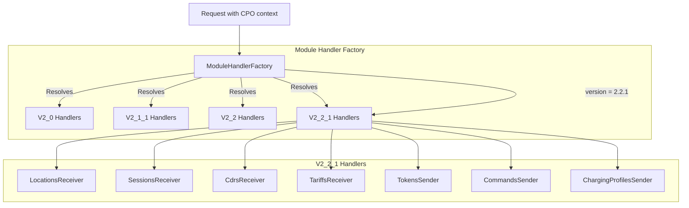

### Receiver vs Sender Module Patterns

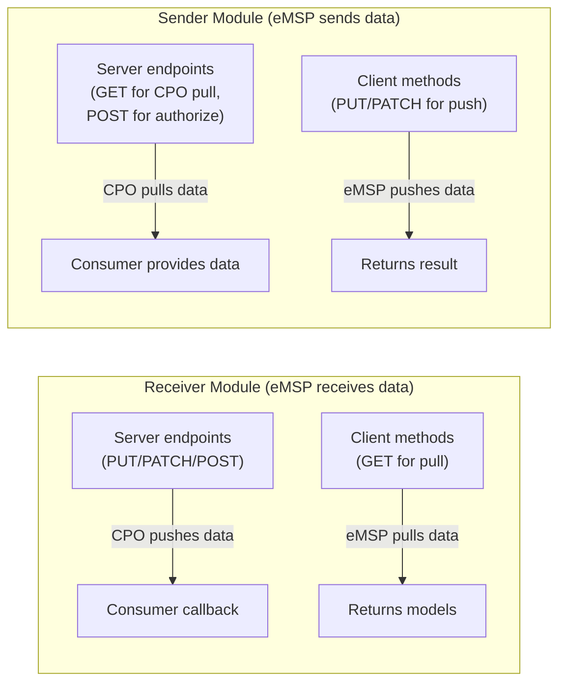

---

## 8. Multi-Party Support

The eMSP can present different identities (`country_code`/`party_id`) to different CPOs. This enables a single deployment to act as multiple eMSP entities.

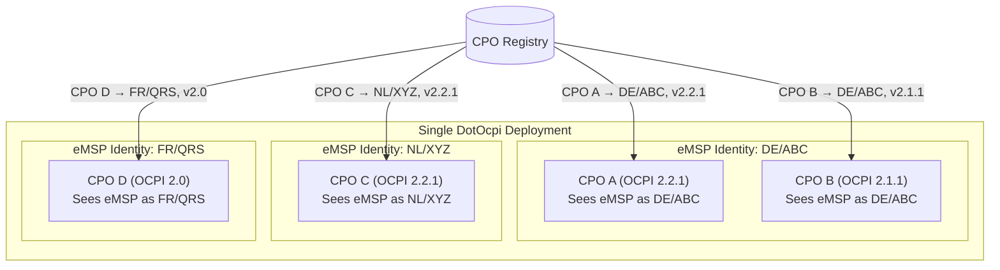

### Version Endpoints per Identity

The versions endpoint must return version information scoped to the eMSP identity. In 2.2+, the credentials `roles` array declares the identity:

```mermaid
graph TD
    subgraph "Version Endpoints"
        V["/ocpi/versions"]
        VD["/ocpi/versions/2.2.1/"]
    end

    subgraph "Credentials Registration"
        POST["POST /ocpi/2.2.1/credentials"]
        POST -->|"Body includes roles:<br/>[{role: EMSP, party_id: ABC, country_code: DE}]"| Register
        Register[Store CPO with eMSP identity DE/ABC]
    end

    subgraph "Subsequent Requests"
        Auth["Authorization: Token {TOKEN_B}"]
        Auth --> Lookup["Token hash → CPO entry → eMSP identity"]
        Lookup --> Route["Route to correct handlers<br/>with identity context"]
    end
```

---

## 9. Token Management

### Token Store Architecture

```mermaid
classDiagram
    class ITokenStore {
        <<interface>>
        +StoreAsync(tokenHash, purpose, partyId, ct) ValueTask
        +FindAsync(tokenHash, ct) ValueTask~TokenEntry?~
        +RemoveAsync(tokenHash, ct) ValueTask~bool~
        +RotateTokenAsync(oldTokenHash, newTokenHash, purpose, partyId, ct) ValueTask
    }

    class TokenEntry {
        <<record>>
        +TokenHash: string
        +Purpose: TokenPurpose
        +PartyId: string
    }

    class TokenPurpose {
        <<enumeration>>
        TokenA
        TokenB
        TokenC
    }

    class OcpiTokenValidator {
        +ValidateAsync(authHeader, ct) ValueTask~TokenValidationResult~
    }

    class InMemoryTokenStore {
        -ConcurrentDictionary _tokens
        +StoreAsync(...)
        +FindAsync(...)
        +RemoveAsync(...)
        +RotateTokenAsync(...)
    }

    class ITokenStore_Consumer {
        <<consumer implements>>
        KeyVaultTokenStore
        DatabaseTokenStore
        etc.
    }

    ITokenStore <|.. InMemoryTokenStore : built-in
    ITokenStore <|.. ITokenStore_Consumer : consumer provides
    ITokenStore --> TokenPurpose
    ITokenStore --> TokenEntry

    class TokenValidationResult {
        +IsValid: bool
        +Entry: TokenEntry?
        +Error: string?
    }

    OcpiTokenValidator --> TokenValidationResult
    OcpiTokenValidator --> ITokenStore : uses
```

### Token Security Requirements

```mermaid
graph TD
    subgraph "Token Generation"
        Gen[RandomNumberGenerator.GetBytes(64)]
        Gen --> Encode[Base64Url encode]
        Encode --> Raw[Raw token value]
    end

    subgraph "Token Storage"
        Raw --> Hash[SHA-256 hash]
        Hash --> Store[Store hash only]
        Raw --> Transport[Use in Authorization header only]
        Transport --> Discard[Never persist raw value]
    end

    subgraph "Token Validation"
        Incoming[Incoming Authorization header] --> Extract[Extract raw token]
        Extract --> HashIncoming[SHA-256 hash incoming]
        HashIncoming --> Compare["CryptographicOperations.FixedTimeEquals()<br/>(constant-time comparison)"]
        Store --> Compare
        Compare --> Result{Match?}
    end
```

---

## 10. CPO Connection Registry

### Registry Data Model

```mermaid
classDiagram
    class ICpoRegistry {
        <<interface>>
        +FindByConnectionKey(connectionKey) CpoConnection?
        +FindByTokenHash(tokenBHash) CpoConnection?
        +FindByEmspIdentity(emspCountryCode, emspPartyId) IReadOnlyList~CpoConnection~
        +GetAll() IReadOnlyList~CpoConnection~
        +AddOrUpdate(connection) bool
        +Remove(connectionKey) bool
    }

    class CpoConnection {
        +ConnectionKey: string (computed: CpoCountryCode:CpoPartyId)
        +CpoCountryCode: string
        +CpoPartyId: string
        +EmspCountryCode: string
        +EmspPartyId: string
        +Version: OcpiVersion
        +ModuleEndpoints: IReadOnlyDictionary~string, string~
        +TokenBHash: string
        +Status: ConnectionStatus
        +CreatedAt: DateTimeOffset
        +UpdatedAt: DateTimeOffset
        +CpoVersionsUrl: string?
        +EmspVersionsUrl: string?
        +LastHealthCheckAt: DateTimeOffset?
        +ConcurrencyVersion: long
    }

    class ConnectionStatus {
        <<enumeration>>
        Pending
        Connected
        Offline
        Unregistered
        Suspended
    }

    class ICpoRegistryStore {
        <<interface - consumer implements for persistence>>
        +LoadAllAsync(ct) Task~IReadOnlyList~CpoConnection~~
        +SaveAsync(connection, ct) Task
        +RemoveAsync(connectionKey, ct) Task
    }

    ICpoRegistry --> CpoConnection
    CpoConnection --> ConnectionStatus
    ICpoRegistry ..> ICpoRegistryStore : backed by
```

### Registry Lookup Flow

```mermaid
graph TD
    subgraph "Inbound Request (CPO → eMSP)"
        IR[Request arrives] --> ExtractToken[Extract token from<br/>Authorization header]
        ExtractToken --> HashToken[Hash token]
        HashToken --> LookupToken["Registry.FindByTokenHash()"]
        LookupToken --> Found{Found?}
        Found -->|No| Reject[401 Unauthorized]
        Found -->|Yes| Context[Build OcpiRequestContext<br/>with CpoConnection]
    end

    subgraph "Outbound Request (eMSP → CPO)"
        OR[Consumer calls client] --> LookupCpo["Registry.FindByConnectionKey(connectionKey)"]
        LookupCpo --> GetEndpoint[Get module endpoint URL<br/>for negotiated version]
        GetEndpoint --> GetToken[Get outbound token hash<br/>→ retrieve raw from ITokenStore]
        GetToken --> BuildReq[Build HTTP request]
    end
```

---

## 11. Error Handling

### OcpiResult Design

```mermaid
classDiagram
    class OcpiResult {
        +StatusCode: OcpiStatusCode
        +StatusMessage: string?
        +IsSuccess: bool
        +Success() OcpiResult
        +Failure(code, message) OcpiResult
    }

    class OcpiResult_T {
        +Data: T?
        +StatusCode: OcpiStatusCode
        +StatusMessage: string?
        +IsSuccess: bool
        +Success(data) OcpiResult~T~
        +Failure(code, message) OcpiResult~T~
    }

    class OcpiResponse_T {
        <<wire envelope>>
        +Data: T?
        +StatusCode: int
        +StatusMessage: string?
        +Timestamp: DateTimeOffset
    }

    class OcpiStatusCode {
        <<readonly record struct>>
        +Value: int
        +IsSuccess: bool
        +IsClientError: bool
        +IsServerError: bool
        +Success: OcpiStatusCode = 1000
        +GenericClientError: OcpiStatusCode = 2000
        +InvalidParameters: OcpiStatusCode = 2001
        +NotEnoughInformation: OcpiStatusCode = 2002
        +UnknownLocation: OcpiStatusCode = 2003
        +UnknownToken: OcpiStatusCode = 2004
        +GenericServerError: OcpiStatusCode = 3000
        +UnableToUseClientApi: OcpiStatusCode = 3001
        +UnsupportedVersion: OcpiStatusCode = 3002
        +NoMatchingEndpoints: OcpiStatusCode = 3003
    }

    note for OcpiResult "OcpiResult is the internal result type.\nOcpiResponse is the wire envelope with Timestamp.\nBoth are sealed classes — no inheritance between them."
```

### Error Flow

```mermaid
graph TD
    subgraph "Client-side (calling CPO)"
        Call[Call CPO endpoint] --> HTTP{HTTP Status}
        HTTP -->|2xx| Parse[Parse OCPI envelope]
        Parse --> Check{status_code == 1000?}
        Check -->|Yes| Success["OcpiResult&lt;T&gt;.Success(data)"]
        Check -->|No| OcpiError["OcpiResult&lt;T&gt;.Failure(code, message)"]
        HTTP -->|4xx/5xx| HttpError["OcpiResult&lt;T&gt;.Failure(mapped_code, message)"]
        HTTP -->|Network error| Exception[Throw OcpiTransportException]
    end

    subgraph "Server-side (receiving from CPO)"
        Receive[Receive request] --> Validate{Valid?}
        Validate -->|No| Return4xx["Return {status_code: 2001, ...}"]
        Validate -->|Yes| Process[Invoke consumer handler]
        Process --> ConsumerResult{Handler result}
        ConsumerResult -->|Success| Return200["Return {status_code: 1000, data: ...}"]
        ConsumerResult -->|Business error| ReturnBiz["Return {status_code: 2xxx, ...}"]
        Process -->|Exception| Return500["Return {status_code: 3000, ...}"]
    end
```

### Exception Hierarchy

Exceptions are for infrastructure failures, not OCPI protocol errors. See [strategies.md — Exception Strategy](strategies.md#16-exception-strategy) for the full hierarchy and when each exception is thrown.

```mermaid
classDiagram
    class OcpiException
    class OcpiTransportException
    class OcpiRegistrationException
    class OcpiConfigurationException
    class OcpiSerializationException

    Exception <|-- OcpiException
    OcpiException <|-- OcpiTransportException
    OcpiException <|-- OcpiRegistrationException
    OcpiException <|-- OcpiConfigurationException
    OcpiException <|-- OcpiSerializationException
```

---

## 12. Serialization

### Version-Specific JSON Contexts

Each OCPI version has its own `JsonSerializerContext` for source-generated, AOT-compatible serialization.

```mermaid
graph TD
    subgraph "Serialization Strategy"
        Req[Request/Response] --> Version{OCPI Version?}
        Version -->|2.0| Ctx20["OcpiJsonContext_V2_0<br/><i>Source-generated</i>"]
        Version -->|2.1.1| Ctx211["OcpiJsonContext_V2_1_1<br/><i>Source-generated</i>"]
        Version -->|2.2| Ctx22["OcpiJsonContext_V2_2<br/><i>Source-generated</i>"]
        Version -->|2.2.1| Ctx221["OcpiJsonContext_V2_2_1<br/><i>Source-generated</i>"]
    end

    subgraph "Shared Custom Converters"
        Conv1["OcpiDateTimeConverter<br/><i>RFC 3339 format</i>"]
        Conv3["CiStringConverter<br/><i>Case-insensitive string type</i>"]
        Conv5["GeoLocationConverter<br/><i>GeoLocation serialization</i>"]
    end

    Ctx20 & Ctx211 & Ctx22 & Ctx221 --> Conv1 & Conv3 & Conv5
```

### OCPI Response Envelope

Every response is wrapped in a standard envelope. The library handles this transparently:

```json
{
    "data": "...(version-specific model)...",
    "status_code": 1000,
    "status_message": "Success",
    "timestamp": "2026-03-13T10:30:00Z"
}
```

```mermaid
classDiagram
    class OcpiResponse_T {
        +Data: T?
        +StatusCode: int
        +StatusMessage: string?
        +Timestamp: DateTimeOffset
    }

    note for OcpiResponse_T "Serialized/deserialized by the pipeline.\nConsumers never interact with this directly —\nthey work with OcpiResult&lt;T&gt; instead."
```

---

## 13. Pagination

### Client-Side Pagination (Pull)

```mermaid
sequenceDiagram
    participant Consumer as Consumer Code
    participant Client as DotOcpi.Client
    participant CPO as CPO

    Consumer->>Client: GetAllLocationsAsync(cpoId, dateFrom)

    loop Until no Link header
        Client->>CPO: GET /locations?date_from=...&offset=N&limit=M
        CPO-->>Client: 200 OK<br/>Headers: X-Total-Count, X-Limit, Link<br/>Body: {data: [...], status_code: 1000}
        Client->>Consumer: yield each item via IAsyncEnumerable
        Note over Client: Check Link header for next page URL
    end
```

### Server-Side Pagination (Serve)

```mermaid
graph TD
    subgraph "Server handles pagination for Sender modules"
        Req[GET request with offset/limit] --> Parse[Parse query params]
        Parse --> Query["Consumer.GetTokensAsync(<br/>dateFrom, dateTo, offset, limit)"]
        Query --> Headers["Set X-Total-Count from PaginatedResult.TotalCount,<br/>set X-Limit"]
        Headers --> HasMore{offset + count < total?}
        HasMore -->|Yes| Link["Set Link header with next URL"]
        HasMore -->|No| NoLink[Omit Link header]
        Link --> Respond[Return OCPI response envelope]
        NoLink --> Respond
    end
```

### IAsyncEnumerable Support

For large datasets, the client exposes streaming pagination:

```csharp
// Consumer can iterate page by page without loading all into memory
await foreach (var location in client.Locations.GetAllAsAsyncEnumerable(cpoId, ct))
{
    // Process each location as it arrives
}
```

---

## 14. Observability

### Distributed Tracing with ActivitySource

```mermaid
graph TD
    subgraph "DotOcpi Instrumentation"
        Source["static ActivitySource<br/>name: 'DotOcpi'"]

        subgraph "Client Activities"
            CA1["DotOcpi.Client.GetLocations"]
            CA2["DotOcpi.Client.PushToken"]
            CA3["DotOcpi.Client.SendCommand"]
            CA4["DotOcpi.Client.Register"]
        end

        subgraph "Server Activities"
            SA1["DotOcpi.Server.HandleLocationPut"]
            SA2["DotOcpi.Server.HandleSessionPut"]
            SA3["DotOcpi.Server.HandleCdrPost"]
            SA4["DotOcpi.Server.HandleAuthorize"]
        end

        subgraph "Tags"
            T1["ocpi.version"]
            T2["ocpi.module"]
            T3["ocpi.cpo.country_code"]
            T4["ocpi.cpo.party_id"]
            T5["ocpi.status_code"]
            T6["ocpi.request_id"]
            T7["ocpi.correlation_id"]
        end

        Source --> CA1 & CA2 & CA3 & CA4
        Source --> SA1 & SA2 & SA3 & SA4
        CA1 & SA1 --> T1 & T2 & T3 & T4 & T5 & T6 & T7
    end

    subgraph "Consumer Opt-In"
        OTel["builder.Services.AddOpenTelemetry()<br/>.WithTracing(t => t.AddSource('DotOcpi'))"]
    end

    Source -.-> OTel
```

---

## 15. Project Structure

```
DotOcpi/
├── src/
│   ├── DotOcpi/
│   │   ├── DotOcpi.csproj
│   │   ├── DotOcpiBuilder.cs
│   │   ├── DotOcpiOptions.cs
│   │   ├── DotOcpiServiceCollectionExtensions.cs
│   │   ├── OcpiVersion.cs
│   │   ├── OcpiVersionExtensions.cs
│   │   ├── OcpiResult.cs
│   │   ├── OcpiResponse.cs
│   │   ├── OcpiStatusCode.cs
│   │   ├── OcpiRequestContext.cs
│   │   ├── OcpiDateTime.cs
│   │   ├── OcpiSentinel.cs
│   │   ├── CiString.cs
│   │   ├── GeoLocation.cs
│   │   ├── PartyIdentity.cs
│   │   ├── PaginatedResult.cs
│   │   ├── Exceptions/
│   │   │   ├── OcpiException.cs
│   │   │   ├── OcpiTransportException.cs
│   │   │   ├── OcpiRegistrationException.cs
│   │   │   ├── OcpiConfigurationException.cs
│   │   │   └── OcpiSerializationException.cs
│   │   ├── Logging/
│   │   │   ├── LogCategories.cs
│   │   │   ├── OcpiLogEvents.cs
│   │   │   ├── AuthLogMessages.cs
│   │   │   ├── RegistrationLogMessages.cs
│   │   │   ├── ClientLogMessages.cs
│   │   │   ├── ServerLogMessages.cs
│   │   │   └── DotOcpiLoggingOptions.cs
│   │   ├── Observability/
│   │   │   ├── OcpiActivitySource.cs
│   │   │   └── OcpiMetrics.cs
│   │   ├── Registration/
│   │   │   ├── IRegistrationClient.cs
│   │   │   ├── ICredentialsClient.cs
│   │   │   ├── CredentialsClient.cs
│   │   │   ├── CredentialsResponse.cs
│   │   │   ├── IVersionDiscovery.cs
│   │   │   ├── VersionDiscovery.cs
│   │   │   ├── VersionInfo.cs
│   │   │   ├── VersionNegotiator.cs
│   │   │   └── RegistrationOrchestrator.cs
│   │   ├── Security/
│   │   │   ├── ITokenStore.cs
│   │   │   ├── InMemoryTokenStore.cs
│   │   │   ├── TokenGenerator.cs
│   │   │   ├── TokenHasher.cs
│   │   │   ├── OcpiTokenValidator.cs
│   │   │   ├── AuthorizationHeaderParser.cs
│   │   │   ├── TokenPurpose.cs
│   │   │   └── TokenValidationResult.cs
│   │   ├── Registry/
│   │   │   ├── ICpoRegistry.cs
│   │   │   ├── ICpoRegistryStore.cs
│   │   │   ├── ICacheInvalidationNotifier.cs
│   │   │   ├── IDistributedLockProvider.cs
│   │   │   ├── ConnectionStatus.cs
│   │   │   ├── CpoConnection.cs
│   │   │   ├── CpoHealthMonitor.cs
│   │   │   └── InMemoryCpoRegistry.cs
│   │   ├── Modules/
│   │   │   ├── ICredentialsHandler.cs
│   │   │   ├── ILocationsReceiver.cs
│   │   │   ├── ISessionsReceiver.cs
│   │   │   ├── ICdrsReceiver.cs
│   │   │   ├── ITariffsReceiver.cs
│   │   │   ├── ITokensSender.cs
│   │   │   ├── ITokensAuthorizer.cs
│   │   │   ├── ICommandsCallback.cs
│   │   │   └── IChargingProfilesCallback.cs
│   │   ├── Models/
│   │   │   ├── V2_0/
│   │   │   │   ├── Location.cs
│   │   │   │   ├── Session.cs
│   │   │   │   ├── Cdr.cs
│   │   │   │   ├── Token.cs
│   │   │   │   ├── Tariff.cs
│   │   │   │   └── Credentials.cs
│   │   │   ├── V2_1_1/
│   │   │   │   ├── Location.cs
│   │   │   │   ├── Session.cs
│   │   │   │   ├── Cdr.cs
│   │   │   │   ├── Token.cs
│   │   │   │   ├── Tariff.cs
│   │   │   │   ├── Command.cs
│   │   │   │   └── Credentials.cs
│   │   │   ├── V2_2/
│   │   │   │   └── ... (mirrors V2_2_1 with minor differences)
│   │   │   └── V2_2_1/
│   │   │       ├── Location.cs
│   │   │       ├── Evse.cs
│   │   │       ├── Connector.cs
│   │   │       ├── Session.cs
│   │   │       ├── Cdr.cs
│   │   │       ├── CdrToken.cs
│   │   │       ├── CdrLocation.cs
│   │   │       ├── Token.cs
│   │   │       ├── Tariff.cs
│   │   │       ├── Command.cs
│   │   │       ├── ChargingProfile.cs
│   │   │       ├── Credentials.cs
│   │   │       ├── CredentialsRole.cs
│   │   │       └── AuthorizationInfo.cs
│   │   ├── Serialization/
│   │   │   ├── OcpiDateTimeConverter.cs
│   │   │   ├── CiStringConverter.cs
│   │   │   ├── GeoLocationConverter.cs
│   │   │   ├── OcpiJsonContext_V2_0.cs
│   │   │   ├── OcpiJsonContext_V2_1_1.cs
│   │   │   ├── OcpiJsonContext_V2_2.cs
│   │   │   ├── OcpiJsonContext_V2_2_1.cs
│   │   │   ├── OcpiRegistrationJsonContext.cs
│   │   │   └── OcpiJsonOptions.cs
│   │   └── Validation/
│   │       ├── IOcpiValidator.cs
│   │       ├── OcpiValidationResult.cs
│   │       ├── OcpiValidationError.cs
│   │       ├── ValidationHelpers.cs
│   │       ├── LocationValidator.cs
│   │       ├── SessionValidator.cs
│   │       ├── CdrValidator.cs
│   │       ├── TariffValidator.cs
│   │       ├── TokenValidator.cs
│   │       ├── CommandValidator.cs
│   │       ├── ChargingProfileValidator.cs
│   │       ├── CredentialsValidator.cs
│   │       └── PatchValidator.cs
│   │
│   ├── DotOcpi.Client/
│   │   ├── DotOcpi.Client.csproj
│   │   ├── IOcpiClient.cs
│   │   ├── OcpiClient.cs
│   │   ├── ILocationsClient.cs
│   │   ├── LocationsClient.cs
│   │   ├── ISessionsClient.cs
│   │   ├── SessionsClient.cs
│   │   ├── ICdrsClient.cs
│   │   ├── CdrsClient.cs
│   │   ├── ITariffsClient.cs
│   │   ├── TariffsClient.cs
│   │   ├── ITokensClient.cs
│   │   ├── TokensClient.cs
│   │   ├── ICommandsClient.cs
│   │   ├── CommandsClient.cs
│   │   ├── IChargingProfilesClient.cs
│   │   ├── ChargingProfilesClient.cs
│   │   ├── IOutboundTokenProvider.cs
│   │   ├── DotOcpiClientExtensions.cs
│   │   ├── Internal/
│   │   │   ├── OcpiHttpRequestBuilder.cs
│   │   │   ├── OcpiResponseParser.cs
│   │   │   ├── PaginationHandler.cs
│   │   │   ├── PullClientHelper.cs
│   │   │   ├── CpoConnectionContext.cs
│   │   │   ├── CpoConnectionContextProvider.cs
│   │   │   ├── ICpoConnectionContextProvider.cs
│   │   │   ├── SsrfGuard.cs
│   │   │   ├── InvalidatingRegistrationClient.cs
│   │   │   ├── OcpiModelTypeMap.cs
│   │   │   ├── OcpiHttpClientConfiguration.cs
│   │   │   ├── QueryStringBuilder.cs
│   │   │   ├── ICallbackStore.cs
│   │   │   └── InMemoryCallbackStore.cs
│   │   └── Sync/
│   │       ├── IOcpiSyncService.cs
│   │       ├── OcpiSyncService.cs
│   │       ├── IOcpiSyncHandler.cs
│   │       ├── OcpiPullSyncBackgroundService.cs
│   │       ├── PullSyncOptions.cs
│   │       ├── PullSyncOptionsResolver.cs
│   │       ├── PullSyncOptionsValidator.cs
│   │       ├── CpoSyncOptions.cs
│   │       ├── ModuleSyncOptions.cs
│   │       ├── SyncContext.cs
│   │       ├── SyncResult.cs
│   │       ├── ISyncStateStore.cs
│   │       └── InMemorySyncStateStore.cs
│   │
│   ├── DotOcpi.AspNetCore/
│   │   ├── DotOcpi.AspNetCore.csproj
│   │   ├── DotOcpiAspNetCoreExtensions.cs
│   │   ├── DotOcpiStartupValidator.cs
│   │   ├── OcpiResponseWriter.cs
│   │   ├── OcpiHttpContextExtensions.cs
│   │   ├── Filters/
│   │   │   ├── OcpiAuthFilter.cs
│   │   │   ├── OcpiTokenAAuthFilter.cs
│   │   │   ├── OcpiValidationFilter.cs
│   │   │   ├── OcpiContextFilter.cs
│   │   │   ├── OcpiRegistrationContextFilter.cs
│   │   │   ├── OcpiBodySizeLimitFilter.cs
│   │   │   ├── OcpiMetricsFilter.cs
│   │   │   └── OcpiRateLimitFilter.cs
│   │   ├── Middleware/
│   │   │   ├── OcpiExceptionMiddleware.cs
│   │   │   ├── OcpiRequestIdMiddleware.cs
│   │   │   └── OcpiSecurityHeadersMiddleware.cs
│   │   ├── Handlers/
│   │   │   ├── IModuleHandler.cs
│   │   │   ├── ModuleHandler.cs
│   │   │   ├── ModuleHandlerFactory.cs
│   │   │   ├── EndpointHelper.cs
│   │   │   ├── Locations/
│   │   │   │   └── LocationsEndpoints.cs
│   │   │   ├── Sessions/
│   │   │   │   └── SessionsEndpoints.cs
│   │   │   ├── Cdrs/
│   │   │   │   └── CdrsEndpoints.cs
│   │   │   ├── Tariffs/
│   │   │   │   └── TariffsEndpoints.cs
│   │   │   ├── Tokens/
│   │   │   │   └── TokensEndpoints.cs
│   │   │   ├── Commands/
│   │   │   │   └── CommandsEndpoints.cs
│   │   │   ├── Credentials/
│   │   │   │   └── CredentialsEndpoints.cs
│   │   │   └── ChargingProfiles/
│   │   │       └── ChargingProfilesEndpoints.cs
│   │   ├── HealthChecks/
│   │   │   ├── OcpiCpoHealthCheck.cs
│   │   │   ├── OcpiHealthCheckExtensions.cs
│   │   │   ├── OcpiRegistryHealthCheck.cs
│   │   │   └── OcpiTokenStoreHealthCheck.cs
│   │   └── Routing/
│   │       └── OcpiEndpointRouteBuilderExtensions.cs
│   │
│   └── DotOcpi.Simulator/
│       ├── DotOcpi.Simulator.csproj
│       ├── OcpiCpoSimulator.cs
│       ├── CpoSimulatorConfiguration.cs
│       ├── SimulatorExtensions.cs
│       ├── Endpoints/
│       │   ├── AuthHelper.cs
│       │   ├── VersionsHandler.cs
│       │   ├── CredentialsHandler.cs
│       │   ├── LocationsHandler.cs
│       │   ├── SessionsHandler.cs
│       │   ├── CdrsHandler.cs
│       │   ├── TariffsHandler.cs
│       │   ├── TokensHandler.cs
│       │   ├── CommandsHandler.cs
│       │   ├── ChargingProfilesHandler.cs
│       │   ├── FailureInjectionHelper.cs
│       │   └── RequestRecordingMiddleware.cs
│       ├── Charging/
│       │   ├── ChargingProfileSpec.cs
│       │   ├── ChargingSimulation.cs
│       │   └── EvseStateMachine.cs
│       ├── Infrastructure/
│       │   ├── EndpointFailureConfig.cs
│       │   ├── OcpiResponseWriter.cs
│       │   ├── RecordedRequest.cs
│       │   └── SsrfGuard.cs
│       ├── Models/
│       │   ├── ConnectorProfile.cs
│       │   ├── LocationSpec.cs
│       │   ├── TariffSpec.cs
│       │   └── VersionModelBuilder.cs
│       ├── Push/
│       │   └── PushEngine.cs
│       └── State/
│           ├── ConnectionState.cs
│           ├── EvseState.cs
│           ├── ReservationState.cs
│           ├── SessionState.cs
│           └── SimulatorState.cs
│
├── tests/
│   ├── DotOcpi.Tests/                    # Unit tests for core library
│   ├── DotOcpi.Client.Tests/             # Unit tests for client
│   ├── DotOcpi.AspNetCore.Tests/         # Unit + integration for server
│   ├── DotOcpi.Integration.Tests/        # Full pipeline integration tests
│   └── DotOcpi.Simulator.Tests/          # Tests for the testing package
│
├── samples/
│   └── DotOcpi.Sample/
│
├── Directory.Build.props
├── Directory.Build.targets
├── Directory.Packages.props
├── global.json
├── .editorconfig
├── nuget.config
├── DotOcpi.slnx
├── CHANGELOG.md
├── README.md
└── LICENSE
```

### Consumer Usage (Minimal Example)

```csharp
// Program.cs — eMSP application
var builder = WebApplication.CreateBuilder(args);

// Register DotOcpi services
builder.Services.AddDotOcpi(options =>
{
    options.SupportedVersions = [OcpiVersion.V2_1_1, OcpiVersion.V2_2_1];
})
.AddAspNetCoreServer()
.AddClient()
.AddInMemoryTokenStore()      // or .AddTokenStore<MyKeyVaultTokenStore>()
.AddInMemoryCpoRegistry();    // or .AddCpoRegistryStore<MyDbRegistryStore>()

// Register consumer module handlers
builder.Services.AddScoped<ILocationsReceiver, MyLocationsHandler>();
builder.Services.AddScoped<ISessionsReceiver, MySessionsHandler>();
builder.Services.AddScoped<ICdrsReceiver, MyCdrsHandler>();
builder.Services.AddScoped<ITokensAuthorizer, MyTokensAuthorizer>();

var app = builder.Build();

// Map OCPI endpoints
app.MapOcpiEndpoints();

app.Run();
```

---

## 16. Testing Architecture

The `DotOcpi.Simulator` package provides an in-memory OCPI-compliant CPO server for consumer integration tests. See [strategies.md — Testing Strategy](strategies.md#17-testing-strategy-dotocpisimulator) for the full API and usage examples.

```mermaid
graph TD
    subgraph "Consumer Test"
        Test["xUnit Test"]
        Factory["WebApplicationFactory<br/>(in-memory eMSP)"]
        TestCpo["OcpiCpoSimulator<br/>(in-memory CPO)"]
    end

    Factory -->|"Register with Token A"| TestCpo
    TestCpo -->|"Returns Token C"| Factory
    Factory -->|"Pull locations"| TestCpo
    TestCpo -->|"Returns test data"| Factory
    Factory -->|"Push session"| Test
    Test -->|"Assert results"| Test
```

### Test CPO Capabilities

| Capability | Description |
|---|---|
| Version negotiation | Full version discovery + detail endpoint |
| Credentials handshake | Token A/B/C exchange with configurable behavior |
| Module responses | Pre-configured data returned by GET endpoints |
| Push acceptance | Accepts PUT/PATCH/POST with configurable validation |
| Command simulation | Configurable sync response + async callback |
| Failure injection | HTTP errors, OCPI errors, timeouts, partial failures |
| Multi-version | Advertise multiple OCPI versions simultaneously |
