# CPO Connection Registry

The CPO Registry is the central component that tracks all connected CPOs, their negotiated versions, endpoints, credentials, and the eMSP identity used for each connection.

## Table of Contents

- [1. Data Model](#1-data-model)
- [2. CPO Identification Strategy](#2-cpo-identification-strategy)
- [3. Lookup Paths](#3-lookup-paths)
- [4. Single-Instance Architecture](#4-single-instance-architecture)
- [5. Multi-Instance Architecture](#5-multi-instance-architecture)
- [6. Connection Lifecycle](#6-connection-lifecycle)
- [7. Concurrency Control](#7-concurrency-control)
- [8. Re-Registration & Idempotency](#8-re-registration--idempotency)
- [9. Health Monitoring](#9-health-monitoring)

---

## 1. Data Model

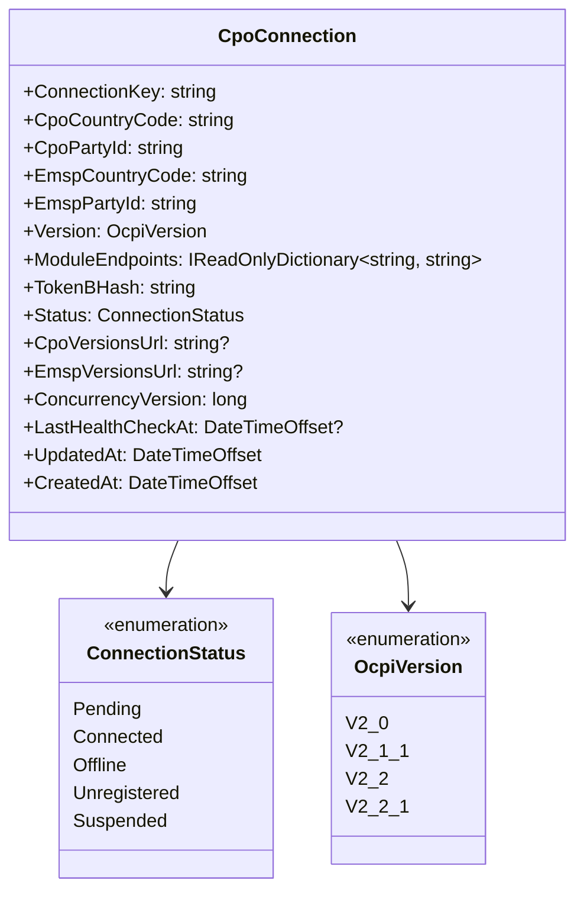

### Field Descriptions

| Field | Type | Description |
|---|---|---|
| `ConnectionKey` | string | Primary key. Deterministic composite: `"{CpoCountryCode}:{CpoPartyId}"` |
| `CpoCountryCode` | string | The CPO's `country_code` |
| `CpoPartyId` | string | The CPO's `party_id` |
| `EmspCountryCode` | string | The eMSP `country_code` presented to this CPO (multi-party support) |
| `EmspPartyId` | string | The eMSP `party_id` presented to this CPO (multi-party support) |
| `Version` | OcpiVersion | OCPI version negotiated during registration |
| `ModuleEndpoints` | Dictionary | CPO's module endpoint URLs (keyed by ModuleID) |
| `TokenBHash` | string | SHA-256 hash of Token B (authenticates CPO requests) |
| `Status` | ConnectionStatus | Current connection state |
| `CpoVersionsUrl` | string? | The CPO's OCPI versions endpoint URL |
| `EmspVersionsUrl` | string? | The eMSP's OCPI versions endpoint URL presented to this CPO |
| `ConcurrencyVersion` | long | Optimistic concurrency version stamp |
| `LastHealthCheckAt` | DateTimeOffset? | Last successful health probe |
| `UpdatedAt` | DateTimeOffset | Last registry entry modification |
| `CreatedAt` | DateTimeOffset | Initial registration timestamp |

---

## 2. CPO Identification Strategy

### Primary Key: Deterministic Composite ID

CPOs are identified by the OCPI-standard `(country_code, party_id)` tuple. The registry uses a deterministic composite as the primary key:

```
ConnectionKey = "{CpoCountryCode}:{CpoPartyId}"
// Example: "DE:ABC", "NL:XYZ"
```

**Rationale:** Using the OCPI identity as the key (not a GUID) makes re-registration naturally idempotent — if CPO "DE:ABC" re-registers, the existing entry is updated, not duplicated.

### Secondary Indexes

The registry supports three lookup paths, each optimized for a different access pattern:

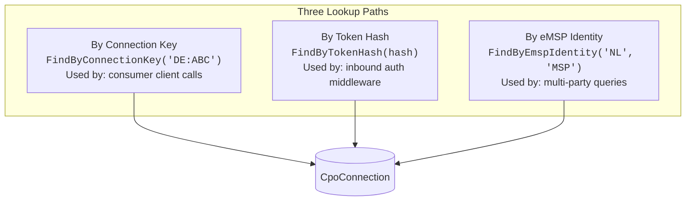

| Lookup | Use Case | Key Pattern | Hot Path? |
|---|---|---|---|
| By `ConnectionKey` | Consumer calls `client.Locations.GetAllAsync(cpoId)` | `cpo:{cc}:{pid}` | Medium |
| By token hash | Auth middleware on every inbound request | `cpo:by-token:{sha256}` | **Yes** |
| By eMSP identity | Multi-party queries, find all CPOs for an eMSP | `cpo:by-emsp:{cc}:{pid}` | Low |

### Why Not GUID?

| Approach | Pros | Cons |
|---|---|---|
| GUID | Always unique | Re-registration creates duplicates; not human-readable; requires extra lookup |
| Composite `CC_PID` | Idempotent; human-readable; matches OCPI identity | Must handle party detail changes |

---

## 3. Lookup Paths

### Inbound Request (CPO → eMSP)

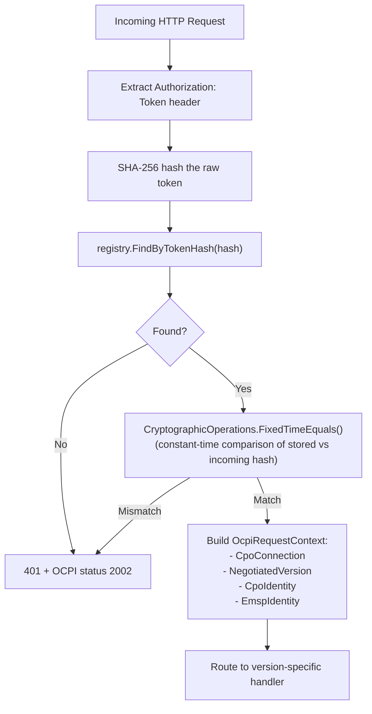

### Outbound Request (eMSP → CPO)

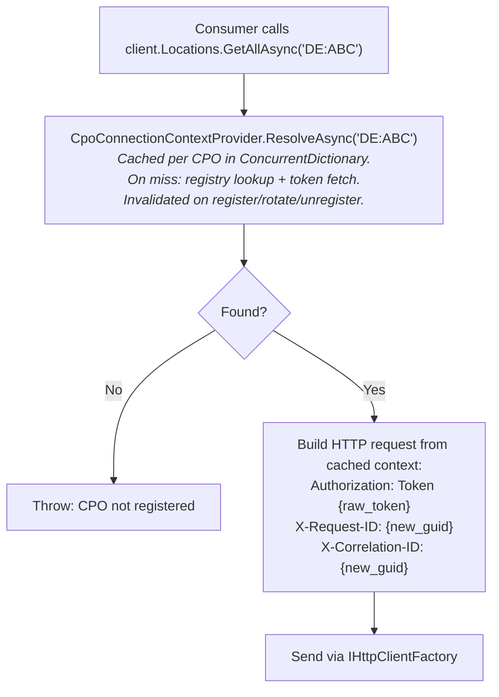

---

## 4. Single-Instance Architecture

For single-instance deployments (development, small-scale production):

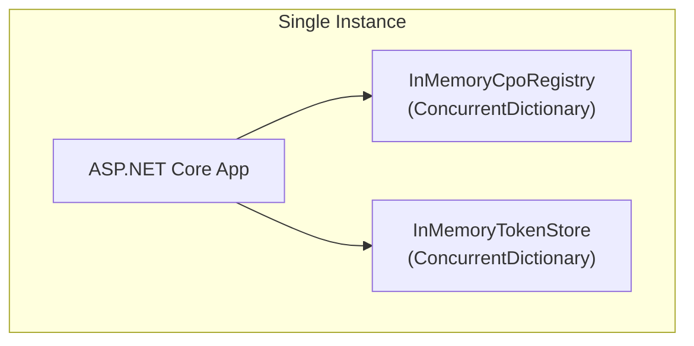

### Interface

```csharp
public interface ICpoRegistry
{
    CpoConnection? FindByConnectionKey(string connectionKey);
    CpoConnection? FindByTokenHash(string tokenBHash);
    IReadOnlyList<CpoConnection> FindByEmspIdentity(string emspCountryCode, string emspPartyId);
    IReadOnlyList<CpoConnection> GetAll();
    bool AddOrUpdate(CpoConnection connection);
    bool Remove(string connectionKey);
}
```

### Persistence

The `InMemoryCpoRegistry` is standalone — it does **not** load from or write to `ICpoRegistryStore`. It is a pure in-memory implementation backed by `ConcurrentDictionary`. All data is lost on restart.

The `ICpoRegistryStore` interface exists for consumers who need persistence across restarts. Consumers implement this interface to bridge their backing store (database, Redis, etc.) with a registry implementation of their choosing:

```csharp
public interface ICpoRegistryStore
{
    Task<IReadOnlyList<CpoConnection>> LoadAllAsync(CancellationToken ct);
    Task SaveAsync(CpoConnection connection, CancellationToken ct);
    Task RemoveAsync(string connectionKey, CancellationToken ct);
}
```

---

## 5. Multi-Instance Architecture

When multiple app instances run behind a load balancer, the in-memory registry diverges across instances. The library provides interfaces and patterns; consumers choose the backing infrastructure.

### Problem

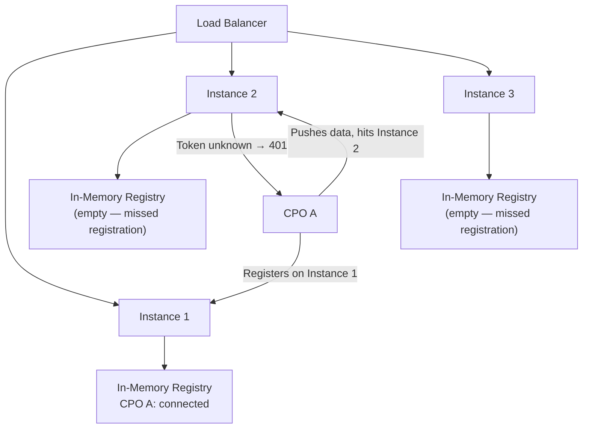

### Solution: Distributed Backing Store + Local Cache

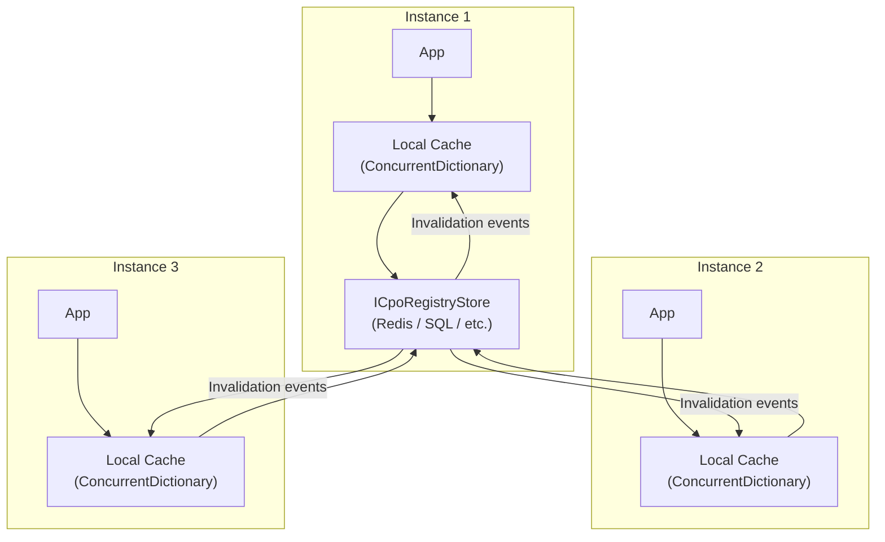

### Cache Invalidation Strategy

When one instance modifies the registry, other instances must be notified:

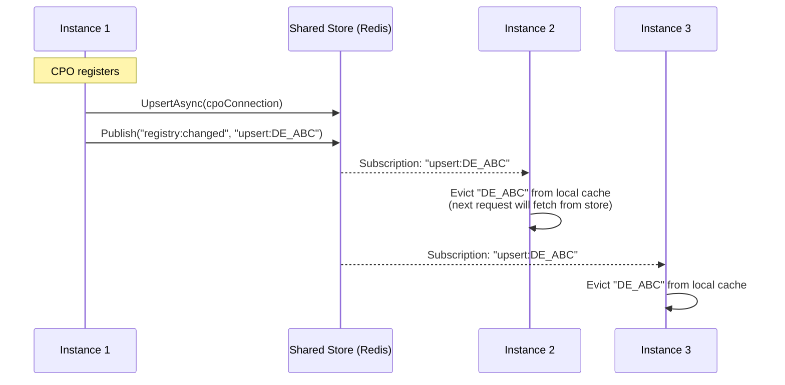

**Local cache TTL**: Even without invalidation events, local cache entries should expire after 60 seconds as a safety net against missed pub/sub messages.

**On reconnect**: Flush the entire local cache to prevent stale data.

### Distributed Locking for Registration

The credentials handshake must happen exactly once. In multi-instance deployments, use distributed locking:

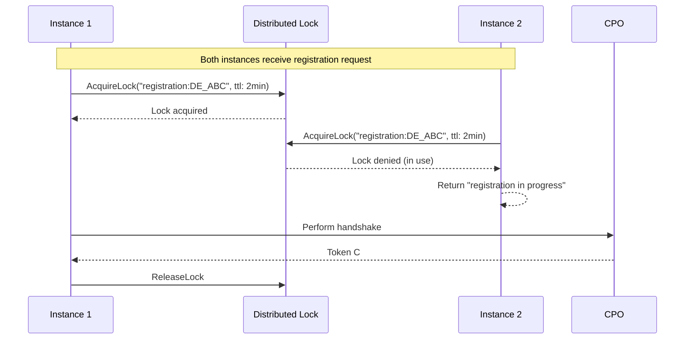

### Consistency Requirements

| Operation | Consistency | Approach |
|---|---|---|
| Token hash lookup (auth) | Eventual (seconds) | Local cache + TTL + pub/sub invalidation |
| Outbound context resolve | Eventual | CpoConnectionContextProvider cache + invalidation |
| Credentials handshake | **Strong** | Distributed lock |
| Token rotation | **Strong** | Distributed lock + atomic swap |
| Status updates | Eventual | Local cache + TTL |
| Health check tracking | Eventual | Write-through to store, fire-and-forget |

> **Note:** Multi-instance cache invalidation and distributed locking are not yet provided by the library. Consumers running multiple instances should implement their own coordination layer (e.g., Redis pub/sub for cache invalidation, distributed locks for registration).

---

## 6. Connection Lifecycle

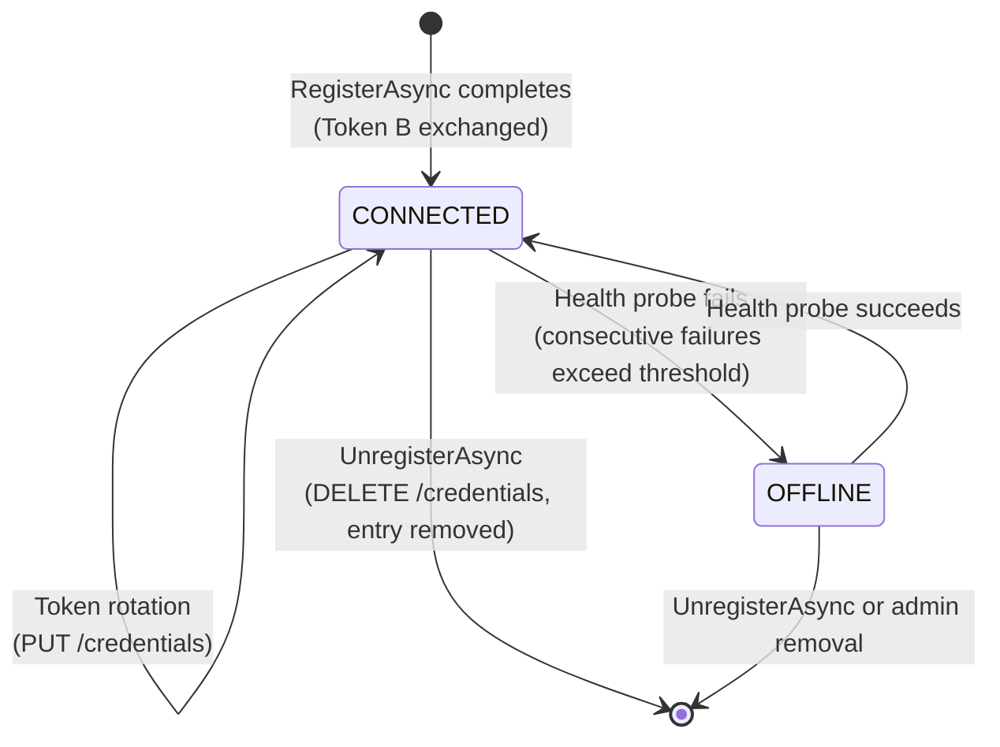

### Status Transitions

| From | To | Trigger |
|---|---|---|
| - | CONNECTED | `RegistrationOrchestrator.RegisterAsync()` completes successfully |
| CONNECTED | CONNECTED | Token rotation via PUT /credentials |
| CONNECTED | OFFLINE | Health probe consecutive failures exceed threshold (default 3) |
| OFFLINE | CONNECTED | Health probe succeeds |
| Any | (removed) | `UnregisterAsync` (DELETE /credentials) removes the entry from the registry |

> **Enum values with no built-in assignment path:**
>
> - **Pending**: The enum value exists, but `RegistrationOrchestrator.RegisterAsync` creates connections with `Status = Connected` directly. There is no intermediate Pending state persisted in the registry during the handshake. Consumers may use this value in custom registration flows.
> - **Unregistered**: The enum value exists, but `UnregisterAsync` removes entries from the registry entirely rather than marking them as Unregistered. Consumers may use this value if they prefer soft-delete semantics.
> - **Suspended**: The enum value exists as an extension point for consumer-driven admin suspension. No built-in component transitions connections to this state.

---

## 7. Concurrency Control

### Optimistic Concurrency

Each `CpoConnection` has a `ConcurrencyVersion` field (monotonically increasing long). On update:

1. Read the connection (get current `Version`)
2. Modify fields
3. Write back with expected `Version`
4. If `Version` has changed since read, the write fails — retry

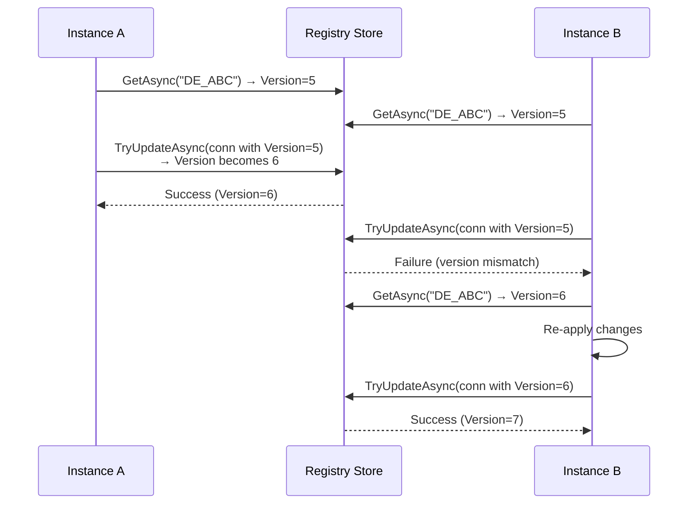

### Operations Requiring Locks

| Operation | Lock Key | TTL | Reason |
|---|---|---|---|
| Credentials POST (register) | `registration:{cpoId}` | 2 min | Prevent duplicate handshakes |
| Credentials PUT (rotate) | `token-rotation:{cpoId}` | 1 min | Atomic token swap |
| Credentials DELETE | `unregister:{cpoId}` | 30 sec | Clean teardown |

---

## 8. Re-Registration & Idempotency

### Same CPO Re-Registers

When a CPO with the same `(country_code, party_id)` sends a new POST /credentials:

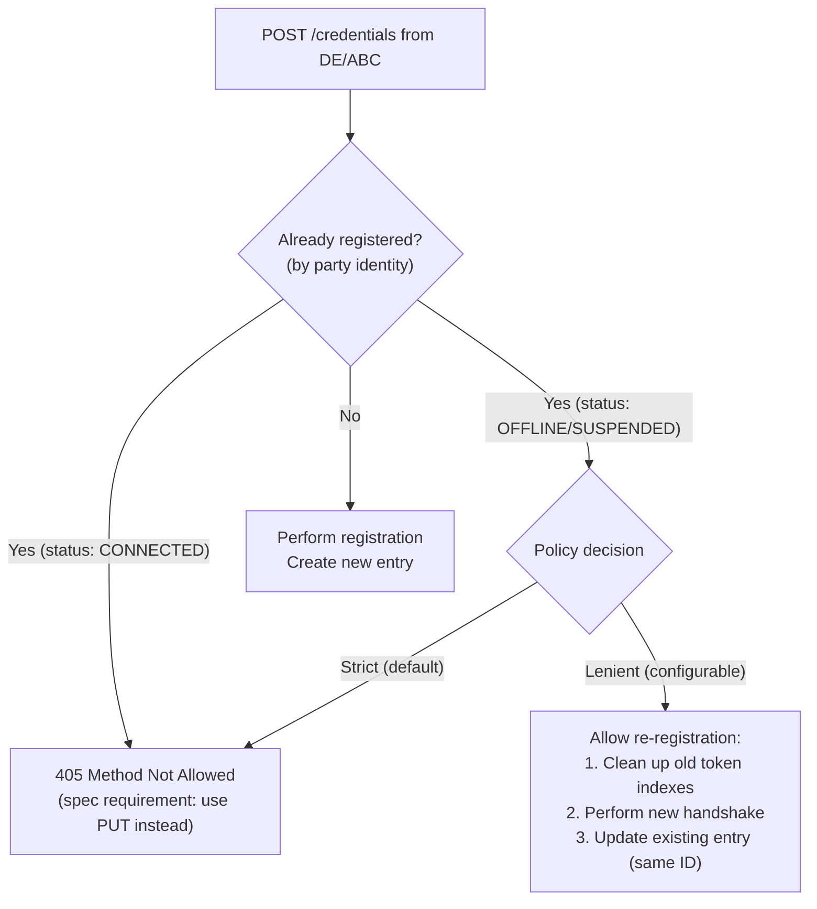

### CPO Changes Party Details

If a CPO updates their credentials via PUT and their `party_id` or `country_code` changes (rare — M&A scenarios):

1. Clean up old secondary indexes (by-party, by-token)
2. Update the connection with new identity
3. The `ConnectionKey` changes since it's derived from party identity
4. Create new entry, remove old entry (atomic if possible)
5. Log the change for audit

---

## 9. Health Monitoring

### Activity Tracking

`LastHealthCheckAt` is updated by `CpoHealthMonitor` on each successful health probe. Inbound auth and outbound client calls do not currently update this field.

### Health Probing

A background service (`CpoHealthMonitor`) periodically checks all eligible connections:

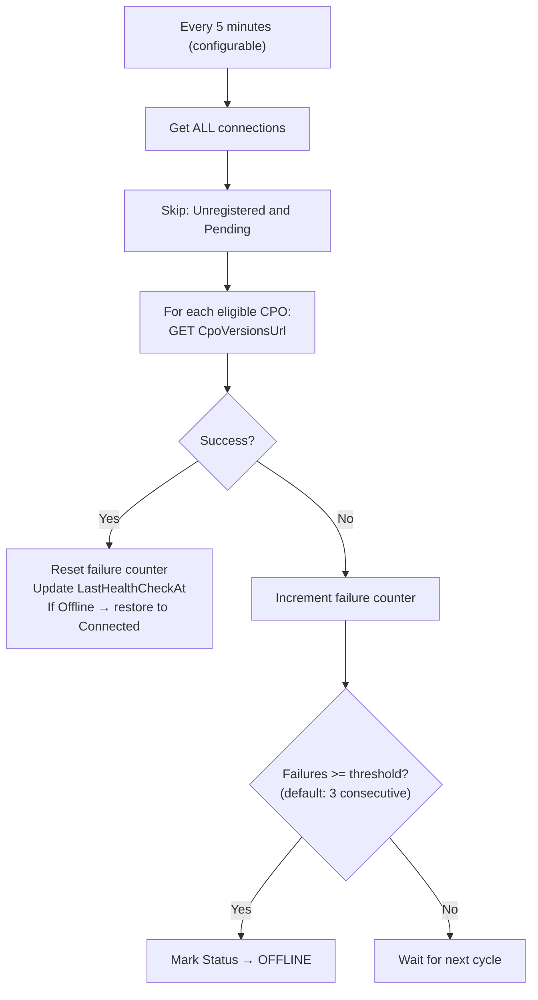

There is no staleness filter — all connections that are not Unregistered or Pending are checked on every cycle. `DotOcpiOptions.StaleConnectionThreshold` is defined but not yet consumed by the health monitor; it is available for consumers who want to implement their own staleness logic. The failure threshold (default 3 consecutive failures) is configurable. Each cycle logs a summary with total checked, healthy, failed, restored, and marked-offline counts.

> **Note:** The health monitor does not use distributed locking or leader election. Each instance runs its health checks independently. In multi-instance deployments, this means multiple instances may probe the same CPO concurrently, which is safe but redundant.

### Consumer Health Check

The library provides a health check for ASP.NET Core:

```csharp
builder.Services.AddHealthChecks()
    .AddOcpiRegistryHealthCheck(name: "ocpi-registry", tags: ["ready"]);
```

Reports:
- **Healthy**: All CPOs in CONNECTED status
- **Degraded**: Some CPOs OFFLINE or SUSPENDED
- **Unhealthy**: All CPOs OFFLINE or registry unavailable

The health check response includes per-CPO data (status, version, last health check timestamp) in the `data` dictionary, enabling operators to identify exactly which CPOs are healthy and which are degraded.
