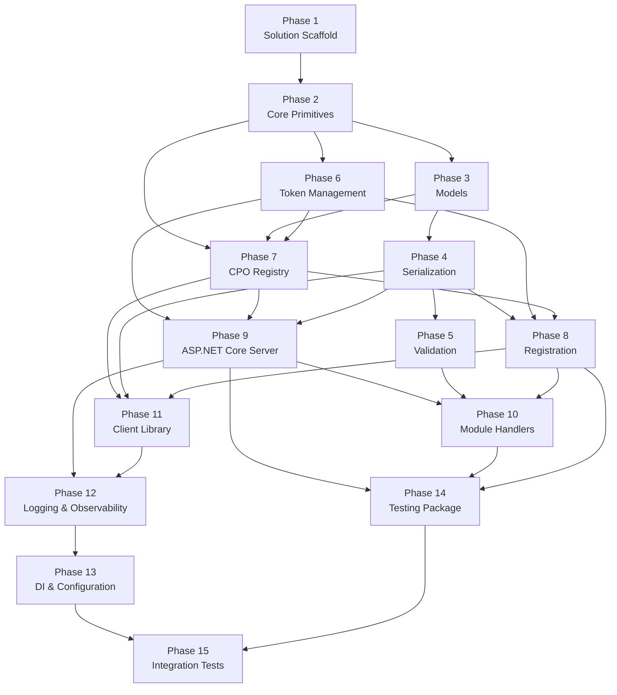

# DotOcpi Implementation Guide

Step-by-step build order for the library. Each phase produces working, testable code. Later phases depend on earlier ones — do not skip ahead.

## Table of Contents

- [Phase 1: Solution Scaffold](#phase-1-solution-scaffold)
- [Phase 2: Core Primitives](#phase-2-core-primitives)
- [Phase 3: Version-Specific Models](#phase-3-version-specific-models)
- [Phase 4: Serialization](#phase-4-serialization)
- [Phase 5: Validation](#phase-5-validation)
- [Phase 6: Token Management](#phase-6-token-management)
- [Phase 7: CPO Registry](#phase-7-cpo-registry)
- [Phase 8: Version Negotiation & Registration](#phase-8-version-negotiation--registration)
- [Phase 9: ASP.NET Core Server Foundation](#phase-9-aspnet-core-server-foundation)
- [Phase 10: Module Handlers (Server-Side)](#phase-10-module-handlers-server-side)
- [Phase 11: Client Library](#phase-11-client-library)
- [Phase 12: Logging & Observability](#phase-12-logging--observability)
- [Phase 13: DI Registration & Configuration](#phase-13-di-registration--configuration)
- [Phase 14: Testing Package](#phase-14-testing-package)
- [Phase 15: Integration Tests & Hardening](#phase-15-integration-tests--hardening)

---

## Phase 1: Solution Scaffold

**Goal:** Empty solution that builds, multi-targets, and has all tooling configured.

### Steps

1. **Create the solution file**

   ```
   DotOcpi.sln
   ```

2. **Create all project files with multi-targeting and dependencies**

   ```
   src/
   ├── DotOcpi/DotOcpi.csproj                         # net8.0;net10.0
   ├── DotOcpi.AspNetCore/DotOcpi.AspNetCore.csproj    # net8.0;net10.0
   ├── DotOcpi.Client/DotOcpi.Client.csproj            # net8.0;net10.0
   └── DotOcpi.Testing/DotOcpi.Testing.csproj          # net8.0;net10.0

   tests/
   ├── DotOcpi.Tests/DotOcpi.Tests.csproj
   ├── DotOcpi.Client.Tests/DotOcpi.Client.Tests.csproj
   ├── DotOcpi.AspNetCore.Tests/DotOcpi.AspNetCore.Tests.csproj
   ├── DotOcpi.Integration.Tests/DotOcpi.Integration.Tests.csproj
   └── DotOcpi.Testing.Tests/DotOcpi.Testing.Tests.csproj

   benchmarks/
   └── DotOcpi.Benchmarks/DotOcpi.Benchmarks.csproj
   ```

3. **Create `Directory.Build.props`** (root)

   ```xml
   <Project>
     <PropertyGroup>
       <TargetFrameworks>net8.0;net10.0</TargetFrameworks>
       <Nullable>enable</Nullable>
       <ImplicitUsings>enable</ImplicitUsings>
       <TreatWarningsAsErrors>true</TreatWarningsAsErrors>
       <AnalysisLevel>latest-recommended</AnalysisLevel>
       <!-- Source Link -->
       <PublishRepositoryUrl>true</PublishRepositoryUrl>
       <EmbedUntrackedSources>true</EmbedUntrackedSources>
       <IncludeSymbols>true</IncludeSymbols>
       <SymbolPackageFormat>snupkg</SymbolPackageFormat>
       <!-- Deterministic builds -->
       <Deterministic>true</Deterministic>
       <ContinuousIntegrationBuild Condition="'$(CI)' == 'true'">true</ContinuousIntegrationBuild>
     </PropertyGroup>
   </Project>
   ```

4. **Create `Directory.Packages.props`** (Central Package Management)

   ```xml
   <Project>
     <PropertyGroup>
       <ManagePackageVersionsCentrally>true</ManagePackageVersionsCentrally>
     </PropertyGroup>
     <ItemGroup>
       <!-- Core -->
       <PackageVersion Include="Microsoft.Extensions.DependencyInjection.Abstractions" Version="8.0.2" />
       <PackageVersion Include="Microsoft.Extensions.Logging.Abstractions" Version="8.0.2" />
       <PackageVersion Include="Microsoft.Extensions.Options" Version="8.0.2" />
       <PackageVersion Include="Microsoft.Extensions.Http" Version="8.0.1" />
       <!-- ASP.NET Core: framework reference, no package needed -->
       <!-- Client -->
       <PackageVersion Include="Microsoft.Extensions.Http.Resilience" Version="8.0.0" />
       <!-- Versioning -->
       <PackageVersion Include="MinVer" Version="6.0.0" />
       <!-- Analyzers -->
       <PackageVersion Include="Microsoft.CodeAnalysis.PublicApiAnalyzers" Version="3.3.4" />
       <!-- Testing -->
       <PackageVersion Include="xunit" Version="2.9.2" />
       <PackageVersion Include="xunit.runner.visualstudio" Version="2.8.2" />
       <PackageVersion Include="FluentAssertions" Version="7.0.0" />
       <PackageVersion Include="NSubstitute" Version="5.3.0" />
       <PackageVersion Include="Microsoft.AspNetCore.Mvc.Testing" Version="8.0.11" />
       <PackageVersion Include="Microsoft.NET.Test.Sdk" Version="17.12.0" />
       <PackageVersion Include="coverlet.collector" Version="6.0.2" />
       <!-- Benchmarks -->
       <PackageVersion Include="BenchmarkDotNet" Version="0.14.0" />
     </ItemGroup>
   </Project>
   ```

5. **Configure CSharpier** (`.csharpierrc.json`)

   ```json
   {
     "printWidth": 120,
     "useTabs": false,
     "tabWidth": 4
   }
   ```

6. **Configure `.editorconfig`** with security analyzer rules at `error` severity

7. **Add `.gitignore`** (standard .NET + IDE files)

8. **Create additional root files**

   - `Directory.Build.targets` — conditional build targets (e.g., public API analyzers for src/ only)
   - `global.json` — pin SDK version for reproducible builds
   - `nuget.config` — NuGet feed configuration
   - `LICENSE` — project license file
   - `README.md` — basic project description and getting started
   - `CHANGELOG.md` — version history (initially empty)

### Project Dependencies

```
DotOcpi                  → (no project refs — standalone)
DotOcpi.AspNetCore       → DotOcpi
DotOcpi.Client           → DotOcpi
DotOcpi.Testing          → DotOcpi, DotOcpi.AspNetCore
```

### Acceptance Criteria

- [ ] `dotnet build` succeeds on both net8.0 and net10.0
- [ ] `dotnet test` runs (0 tests, 0 failures)
- [ ] CSharpier formats without changes
- [ ] No analyzer warnings

---

## Phase 2: Core Primitives

**Goal:** Foundational types that every other component depends on. All in the `DotOcpi` package.

### Dependency: Phase 1

### Types to Implement

#### 2.1 — OcpiVersion Enum

```csharp
// src/DotOcpi/OcpiVersion.cs
public enum OcpiVersion
{
    V2_0,
    V2_1_1,
    V2_2,
    V2_2_1
}
```

Add helper extensions: `ToVersionString()` ("2.0", "2.1.1", etc.), `TryParse(string)`.

#### 2.2 — CiString

```csharp
// src/DotOcpi/CiString.cs
public readonly record struct CiString : IEquatable<CiString>
```

Per [strategies.md #15](strategies.md#15-type-convention-strategy):
- Case-insensitive equality (`OrdinalIgnoreCase`)
- `GetHashCode()` uses `OrdinalIgnoreCase`
- Implicit conversion from `string`
- `Value` property preserves original case
- `ToString()` returns original value
- `MaxLength` validation support

#### 2.3 — PartyIdentity

```csharp
// src/DotOcpi/PartyIdentity.cs
public readonly record struct PartyIdentity(string CountryCode, string PartyId)
{
    public string ToCompositeId() => $"{CountryCode}_{PartyId}".ToUpperInvariant();
    public override string ToString() => ToCompositeId();
}
```

#### 2.4 — OcpiStatusCode

```csharp
// src/DotOcpi/OcpiStatusCode.cs
public readonly record struct OcpiStatusCode(int Value)
{
    public static readonly OcpiStatusCode Success = new(1000);
    public static readonly OcpiStatusCode GenericClientError = new(2000);
    public static readonly OcpiStatusCode InvalidParameters = new(2001);
    public static readonly OcpiStatusCode NotEnoughInformation = new(2002);
    public static readonly OcpiStatusCode UnknownLocation = new(2003);
    public static readonly OcpiStatusCode UnknownToken = new(2004);
    public static readonly OcpiStatusCode GenericServerError = new(3000);
    public static readonly OcpiStatusCode UnableToUseClientApi = new(3001);
    public static readonly OcpiStatusCode UnsupportedVersion = new(3002);
    public static readonly OcpiStatusCode NoMatchingEndpoints = new(3003);

    public bool IsSuccess => Value is >= 1000 and < 2000;
    public bool IsClientError => Value is >= 2000 and < 3000;
    public bool IsServerError => Value is >= 3000 and < 4000;
}
```

#### 2.5 — OcpiResult\<T\>

```csharp
// src/DotOcpi/OcpiResult.cs
public sealed class OcpiResult<T>
{
    public bool IsSuccess { get; }
    public T? Data { get; }
    public OcpiStatusCode StatusCode { get; }
    public string? StatusMessage { get; }

    // Factory methods
    public static OcpiResult<T> Success(T data, string? message = null);
    public static OcpiResult<T> Failure(OcpiStatusCode code, string message);
}

public sealed class OcpiResult  // non-generic, for void operations
{
    public static OcpiResult Success(string? message = null);
    public static OcpiResult Failure(OcpiStatusCode code, string message);
}
```

#### 2.6 — OcpiResponse (wire envelope)

```csharp
// src/DotOcpi/OcpiResponse.cs
public sealed class OcpiResponse<T>
{
    public T? Data { get; init; }
    public int StatusCode { get; init; }
    public string? StatusMessage { get; init; }
    public DateTimeOffset Timestamp { get; init; }
}
```

#### 2.7 — OcpiSentinel

```csharp
// src/DotOcpi/OcpiSentinel.cs
public static class OcpiSentinel
{
    public const string NotAvailable = "#NA";
    public static bool IsNotAvailable(string? value)
        => string.Equals(value, NotAvailable, StringComparison.Ordinal);
}
```

#### 2.8 — Exception Hierarchy

```csharp
// src/DotOcpi/Exceptions/
public abstract class OcpiException : Exception { ... }
public class OcpiTransportException : OcpiException { ... }
public class OcpiRegistrationException : OcpiException { ... }
public class OcpiConfigurationException : OcpiException { ... }
public class OcpiSerializationException : OcpiException { ... }
```

#### 2.9 — GeoLocation

```csharp
// src/DotOcpi/GeoLocation.cs
public readonly record struct GeoLocation(string Latitude, string Longitude);
```

#### 2.10 — OcpiRequestContext

Lives in the **core `DotOcpi` package** (not `DotOcpi.AspNetCore`) because consumer interfaces like `ILocationsReceiver` accept it as a parameter.

```csharp
// src/DotOcpi/OcpiRequestContext.cs
public sealed class OcpiRequestContext
{
    public string RequestId { get; init; }
    public string CorrelationId { get; init; }
    public string CpoId { get; init; }
    public PartyIdentity CpoIdentity { get; init; }
    public PartyIdentity EmspIdentity { get; init; }
    public OcpiVersion NegotiatedVersion { get; init; }
    public CpoConnection Connection { get; init; }
    public string ModuleId { get; init; }
    public HttpContext HttpContext { get; init; }

    public bool IsFieldNotAvailable(string? value) => OcpiSentinel.IsNotAvailable(value);
}
```

> Note: `OcpiRequestContext` depends on `CpoConnection` (Phase 7). Create the class shell in Phase 2 with just the primitive properties; add `Connection` and `HttpContext` once Phases 7 and 9 are complete.

#### 2.11 — PaginatedResult\<T\>

```csharp
// src/DotOcpi/PaginatedResult.cs
public sealed class PaginatedResult<T>
{
    public IReadOnlyList<T> Items { get; init; }
    public int TotalCount { get; init; }
    public int Offset { get; init; }
    public int Limit { get; init; }
}
```

#### 2.12 — Consumer Interfaces (Declarations Only)

Declare all consumer interfaces in the **core `DotOcpi` package** so they have no ASP.NET Core dependency. They are interface-only — no implementation until Phase 10.

```csharp
// src/DotOcpi/Modules/
├── ILocationsReceiver.cs
├── ISessionsReceiver.cs
├── ICdrsReceiver.cs
├── ITariffsReceiver.cs
├── ITokensSender.cs
├── ITokensAuthorizer.cs
├── ICommandsCallback.cs
└── IChargingProfilesCallback.cs
```

These interfaces reference `OcpiRequestContext`, `OcpiResult<T>`, `JsonElement`, and `CancellationToken` — all available in the core package.

### Tests

```
tests/DotOcpi.Tests/
├── CiStringTests.cs
├── PartyIdentityTests.cs
├── OcpiResultTests.cs
├── OcpiStatusCodeTests.cs
├── OcpiVersionTests.cs
├── OcpiSentinelTests.cs
└── GeoLocationTests.cs
```

### Acceptance Criteria

- [ ] All types compile, are `public`, and have XML doc comments
- [ ] CiString equality is case-insensitive with tests
- [ ] OcpiResult forces explicit success/failure handling
- [ ] All unit tests pass
- [ ] `#if NET10_0_OR_GREATER` guards compile correctly on both targets

---

## Phase 3: Version-Specific Models

**Goal:** Complete OCPI model types for all 4 versions, in separate namespaces.

### Dependency: Phase 2

### Namespaces

```
DotOcpi.Models.V2_0
DotOcpi.Models.V2_1_1
DotOcpi.Models.V2_2
DotOcpi.Models.V2_2_1
```

### Implementation Order (per version)

Build models for **one version at a time**, starting with 2.2.1 (most complete), then work backward:

1. **V2_2_1** (reference version — has all fields)
2. **V2_2** (remove 2.2.1-only fields: `home_charging_compensation`, `discharge_allowed`, CdrToken without `country_code`/`party_id`, etc.)
3. **V2_1_1** (remove 2.2 additions: `country_code`/`party_id`, `publish`, `CiString` → `string`, `Price` → `number`, etc.)
4. **V2_0** (remove 2.1.1 additions: `last_updated`, `energy_mix`, `facilities`, `whitelist` → `allow_whitelist`, etc.)

### Models Per Version

For each version, create these model classes:

| Module | Types |
|---|---|
| **Common** | DisplayText, AdditionalGeoLocation, BusinessDetails, Image, Hours, RegularHours, ExceptionalPeriod, StatusSchedule (all versions), Price (2.2+), EnergyMix (2.1.1+), EnergySource (2.1.1+), EnvironmentalImpact (2.1.1+), PublishTokenType (2.2+) |
| **Locations** | Location, Evse, Connector |
| **Sessions** | Session, ChargingPeriod, CdrDimension |
| **CDRs** | Cdr, CdrLocation (2.2+), SignedData (2.2+), SignedValue (2.2+) |
| **Tariffs** | Tariff, TariffElement, PriceComponent, TariffRestrictions |
| **Tokens** | Token, AuthorizationInfo, LocationReferences, EnergyContract (2.2+) |
| **Commands** | StartSession, StopSession, ReserveNow, UnlockConnector, CancelReservation (2.2+), CommandResponse, CommandResult (2.2+) |
| **ChargingProfiles** (2.2+ only) | ChargingProfile, ChargingProfilePeriod, SetChargingProfile, ActiveChargingProfile, ChargingProfileResponse, ChargingProfileResult, ActiveChargingProfileResult |
| **Credentials** | Credentials, CredentialsRole (2.2+), VersionDetail, Endpoint |
| **Sessions** (2.2+ only) | CdrToken, ChargingPreferences |

### Enums Per Version

Each version gets its own enum definitions where values differ:

| Enum | Module | Version-Specific Notes |
|---|---|---|
| ConnectorType | Locations | CHAOJI, GBT_*, NEMA_* (2.2.1), PANTOGRAPH_* (2.2+) |
| ConnectorFormat | Locations | SOCKET, CABLE (all versions) |
| PowerType | Locations | AC_2_PHASE, AC_2_PHASE_SPLIT (2.2.1 only) |
| Status | Locations | PLANNED, REMOVED (2.1.1+) |
| Capability | Locations | Version-specific additions per version table |
| ParkingRestriction | Locations | EMPLOYEES, TAXIS, TENANTS (2.2.1 only) |
| LocationType | Locations | 2.0/2.1.1 only (replaced by ParkingType) |
| ParkingType | Locations | 2.2+ only |
| Facility | Locations | 2.1.1+, additional values in 2.2+ |
| ImageCategory | Locations | All versions |
| TokenType | Tokens | AD_HOC_USER, APP_USER (2.2+), EMAID (2.2.1) |
| WhitelistType | Tokens | 2.1.1+ (replaces allow_whitelist boolean) |
| AllowedType | Tokens | 2.1.1+ |
| ProfileType | Tokens | 2.2+ only (CHEAP, FAST, GREEN, REGULAR) |
| SessionStatus | Sessions | RESERVATION (2.2+) |
| AuthMethod | CDRs/Sessions | COMMAND (2.2+) |
| CdrDimensionType | CDRs | FLAT (2.0/2.1.1 only), many new in 2.2+ |
| TariffDimensionType | Tariffs | ENERGY, FLAT, PARKING_TIME, TIME (all versions) |
| TariffType | Tariffs | 2.2+ only |
| DayOfWeek | Tariffs | All versions |
| ReservationRestrictionType | Tariffs | 2.2+ only |
| CommandResponseType | Commands | TIMEOUT removed in 2.2 |
| CommandResultType | Commands | 2.2+ only (split from CommandResponseType) |
| ChargingRateUnit | ChargingProfiles | 2.2+ only (W, A) |
| ChargingProfileResponseType | ChargingProfiles | 2.2+ only |
| ChargingProfileResultType | ChargingProfiles | 2.2+ only |
| ChargingPreferencesResponse | Sessions | 2.2+ only (ACCEPTED, DEPARTURE_REQUIRED, etc.) |
| ConnectionStatus | Registry | PENDING, CONNECTED, SUSPENDED, OFFLINE |
| InterfaceRole | Credentials | 2.2+ only (SENDER, RECEIVER) |
| Role | Credentials | 2.2+ only (CPO, EMSP, HUB, etc.) |
| ModuleID | Credentials | Version-dependent module availability |
| VersionNumber | Credentials | Wire format enum: "2.0", "2.1" (deprecated), "2.1.1", "2.2" (deprecated), "2.2.1". Parser must accept deprecated values during version discovery but never select them for negotiation. |

### Model Rules

- Use `DataAnnotations` attributes: `[Required]`, `[StringLength]`, `[Range]`
- Use `[JsonPropertyName("snake_case")]` only if the source-gen naming policy doesn't cover it
- 2.2+ string IDs use `CiString`; 2.0/2.1.1 use `string`
- 2.2+ cost fields use `Price`; 2.0/2.1.1 use `decimal`/`number`
- No inheritance between version models — each version is fully standalone
- `record` types for immutable models, `class` only if mutability is needed for PATCH scenarios
- `GeoLocation` is shared (defined in Phase 2) — do not re-define per version

### Tests

```
tests/DotOcpi.Tests/Models/
├── V2_0/LocationTests.cs
├── V2_1_1/LocationTests.cs
├── V2_2/LocationTests.cs
└── V2_2_1/LocationTests.cs
```

Test that:
- Required fields are annotated correctly
- Version-specific fields exist/don't exist in the right versions
- CiString is used where expected (2.2+)
- `#NA` sentinel is accepted on required string fields

### Acceptance Criteria

- [ ] All 4 version namespaces have complete model sets
- [ ] No shared base classes between versions (no inheritance across namespaces)
- [ ] DataAnnotation attributes on all fields
- [ ] XML doc comments on all public types and properties
- [ ] Model-level unit tests pass

---

## Phase 4: Serialization

**Goal:** Source-generated JSON serialization/deserialization for all OCPI versions with correct wire format.

### Dependency: Phase 3

### Steps

#### 4.1 — Custom JsonConverters

```csharp
// src/DotOcpi/Serialization/
├── OcpiDateTimeConverter.cs        // ISO 8601 / RFC 3339, UTC required
├── CiStringJsonConverter.cs        // Preserves case on write, case-insensitive on read
├── OcpiStatusEnumConverter.cs      // e.g., OUTOFORDER (no underscore)
├── GeoLocationConverter.cs         // String lat/lon (not numbers)
└── PriceConverter.cs               // 2.2+ Price object (excl_vat, incl_vat)
```

Rules:
- DateTime always serialized as UTC RFC 3339 (`2026-03-13T12:00:00Z`)
- Enums serialize as uppercase OCPI strings
- For enums where C# name differs from OCPI wire value, use per-enum custom converters
- Where C# name matches OCPI value, use `JsonStringEnumConverter<TEnum>`

#### 4.2 — Per-Version JsonSerializerContext

```csharp
// src/DotOcpi/Serialization/
├── OcpiJsonContext_V2_0.cs
├── OcpiJsonContext_V2_1_1.cs
├── OcpiJsonContext_V2_2.cs
└── OcpiJsonContext_V2_2_1.cs
```

Each context:
- `[JsonSourceGenerationOptions(PropertyNamingPolicy = JsonKnownNamingPolicy.SnakeCaseLower, DefaultIgnoreCondition = JsonIgnoreCondition.WhenWritingNull, GenerationMode = JsonSourceGenerationMode.Default)]`
- `[JsonSerializable]` for every model type in that version
- `[JsonSerializable]` for `OcpiResponse<T>` wrapping each model
- `[JsonSerializable(typeof(JsonElement))]` for PATCH operations

#### 4.3 — OcpiJsonOptions (Cached Lookup)

```csharp
// src/DotOcpi/Serialization/OcpiJsonOptions.cs
internal static class OcpiJsonOptions
{
    public static JsonSerializerOptions GetForVersion(OcpiVersion version);
    public static JsonTypeInfo<T> GetTypeInfo<T>(OcpiVersion version);
}
```

One frozen `JsonSerializerOptions` instance per version, created at startup.

#### 4.4 — OcpiPatchHelper

```csharp
// src/DotOcpi/Serialization/OcpiPatchHelper.cs
public static class OcpiPatchHelper
{
    public static T ApplyPatch<T>(T existing, JsonElement patch, JsonTypeInfo<T> typeInfo);
}
```

Optional utility for consumers who want RFC 7396 merge semantics. Not used internally.

### Tests

```
tests/DotOcpi.Tests/Serialization/
├── SerializationRoundTripTests.cs    // Every model, every version
├── SnakeCaseTests.cs                 // Property names are snake_case
├── EnumSerializationTests.cs         // OCPI string values
├── DateTimeSerializationTests.cs     // RFC 3339 UTC
├── CiStringSerializationTests.cs     // Case preservation
├── NullHandlingTests.cs              // Optional fields omitted when null
├── PatchHelperTests.cs               // Merge semantics
└── Fixtures/
    ├── ocpi-spec-location-2.0.json
    ├── ocpi-spec-location-2.1.1.json
    ├── ocpi-spec-location-2.2.json
    └── ocpi-spec-location-2.2.1.json
```

Fixture-based tests: deserialize known-good JSON from the OCPI spec examples.

### Acceptance Criteria

- [ ] Every model type round-trips through JSON without data loss
- [ ] All property names are snake_case on the wire
- [ ] Enums serialize to correct OCPI string values
- [ ] DateTimes serialize as UTC RFC 3339
- [ ] Optional fields with null values are omitted from JSON output
- [ ] Fixture-based deserialization passes for all versions
- [ ] `OcpiPatchHelper.ApplyPatch` correctly merges JSON patches
- [ ] Source-gen contexts compile on both net8.0 and net10.0

---

## Phase 5: Validation

**Goal:** Three-layer validation: transport → OCPI protocol → consumer business rules.

### Dependency: Phase 4

### Steps

#### 5.1 — IOcpiValidator Interface

```csharp
// src/DotOcpi/Validation/IOcpiValidator.cs
public interface IOcpiValidator<T>
{
    OcpiValidationResult Validate(T model, OcpiVersion version);
}

public sealed class OcpiValidationResult
{
    public bool IsValid { get; }
    public IReadOnlyList<OcpiValidationError> Errors { get; }
}

public sealed class OcpiValidationError
{
    public string Field { get; init; }
    public string Message { get; init; }
    public OcpiStatusCode StatusCode { get; init; }
}
```

#### 5.2 — Validators Per Module

```csharp
// src/DotOcpi/Validation/
├── LocationValidator.cs       // Coordinates range, country codes, time zone (2.2+)
├── SessionValidator.cs        // DateTime ordering, kwh >= 0
├── CdrValidator.cs            // Charging periods non-empty, cost >= 0
├── TariffValidator.cs         // step_size > 0, price >= 0, element count >= 1
├── TokenValidator.cs          // uid non-empty, version-specific type validation
├── CommandValidator.cs        // response_url HTTPS, expiry in future
├── CredentialsValidator.cs    // HTTPS url, party_id length, token non-empty
├── ChargingProfileValidator.cs // rate_unit, period count, limit >= 0, HTTPS response_url
└── PatchValidator.cs          // Non-empty, no identifier-only, URL/body consistency
```

Each validator handles version-specific rules (e.g., `time_zone` required only in 2.2+).

#### 5.3 — DataAnnotations on Models

Already added in Phase 3. Verify:
- `[Required]` on required fields
- `[StringLength(max)]` on string fields
- `[Range(min, max)]` on numeric fields

### Tests

```
tests/DotOcpi.Tests/Validation/
├── LocationValidatorTests.cs
├── SessionValidatorTests.cs
├── CdrValidatorTests.cs
├── TariffValidatorTests.cs
├── TokenValidatorTests.cs
├── CommandValidatorTests.cs
├── CredentialsValidatorTests.cs
├── ChargingProfileValidatorTests.cs
└── PatchValidatorTests.cs
```

Each test file: valid model passes, each invalid condition produces the correct error.

### Acceptance Criteria

- [ ] All validators implemented with version-aware logic
- [ ] Valid models pass validation for all versions
- [ ] Each validation rule in the module docs has a corresponding test
- [ ] PATCH validation: rejects empty body, identifier-only, URL/body mismatch
- [ ] `#NA` sentinel accepted on required string fields

---

## Phase 6: Token Management

**Goal:** Secure token generation, hashing, storage, and validation.

### Dependency: Phase 2

### Steps

#### 6.1 — TokenGenerator

```csharp
// src/DotOcpi/TokenManagement/TokenGenerator.cs
public static class TokenGenerator
{
    public static string Generate(int byteLength = 64);  // CSPRNG, base64url
}
```

#### 6.2 — TokenHasher

```csharp
// src/DotOcpi/TokenManagement/TokenHasher.cs
internal static class TokenHasher
{
    public static string ComputeHash(ReadOnlySpan<char> rawToken);  // SHA-256, stackalloc
}
```

Per [performance.md #5](performance.md#5-token-validation-hot-path): use `stackalloc` for small buffers, `ArrayPool` for large.

#### 6.3 — ITokenStore

```csharp
// src/DotOcpi/TokenManagement/ITokenStore.cs
public interface ITokenStore
{
    Task StoreTokenAsync(string cpoId, string tokenHash, TokenPurpose purpose, CancellationToken ct);
    Task<string?> GetTokenAsync(string cpoId, TokenPurpose purpose, CancellationToken ct);
    Task RemoveTokenAsync(string cpoId, TokenPurpose purpose, CancellationToken ct);
}

public enum TokenPurpose { TokenA, InboundTokenB, OutboundTokenC }
```

#### 6.4 — InMemoryTokenStore

```csharp
// src/DotOcpi/TokenManagement/InMemoryTokenStore.cs
public sealed class InMemoryTokenStore : ITokenStore { ... }  // ConcurrentDictionary
```

#### 6.5 — TokenValidator

```csharp
// src/DotOcpi/TokenManagement/TokenValidator.cs
internal sealed class TokenValidator
{
    public ValueTask<TokenValidationResult> ValidateAsync(
        StringValues authHeader, CancellationToken ct);
}
```

Per [performance.md #5](performance.md#5-token-validation-hot-path):
- Span-based header parsing (zero allocation)
- SHA-256 hash with stackalloc
- Local cache lookup first (ValueTask, sync path)
- `CryptographicOperations.FixedTimeEquals` for constant-time comparison

#### 6.6 — AuthorizationHeaderParser

```csharp
// src/DotOcpi/TokenManagement/AuthorizationHeaderParser.cs
internal static class AuthorizationHeaderParser
{
    public static bool TryExtractToken(StringValues authHeader, out ReadOnlySpan<char> token);
}
```

### Tests

```
tests/DotOcpi.Tests/TokenManagement/
├── TokenGeneratorTests.cs         // Length, format, uniqueness, CSPRNG
├── TokenHasherTests.cs            // Consistency, different inputs
├── TokenValidatorTests.cs         // Valid/missing/invalid token paths
├── InMemoryTokenStoreTests.cs     // CRUD lifecycle
└── AuthorizationHeaderParserTests.cs  // Edge cases
```

Security tests (`[Trait("Category", "Security")]`):
- Constant-time comparison used
- Raw tokens never stored
- Token A consumed after registration

### Acceptance Criteria

- [ ] TokenGenerator produces 64+ byte, base64url tokens
- [ ] TokenHasher uses SHA-256
- [ ] TokenValidator uses `FixedTimeEquals` — never `==` or `.Equals()`
- [ ] InMemoryTokenStore is thread-safe
- [ ] All security tests pass
- [ ] Zero allocation on cache-hit path (token validation)

---

## Phase 7: CPO Registry

**Goal:** In-memory registry with persistence interface and all lookup paths.

### Dependency: Phase 2, Phase 3, Phase 6

### Steps

#### 7.1 — CpoConnection Model

```csharp
// src/DotOcpi/Registry/CpoConnection.cs
public sealed class CpoConnection
{
    public string Id { get; init; }
    public PartyIdentity CpoIdentity { get; init; }
    public PartyIdentity EmspIdentity { get; init; }
    public OcpiVersion NegotiatedVersion { get; init; }
    public IReadOnlyDictionary<string, Uri> ModuleEndpoints { get; init; }
    public string InboundTokenHash { get; init; }
    public string OutboundTokenHash { get; init; }
    public ConnectionStatus Status { get; set; }
    public BusinessDetails? BusinessDetails { get; init; }
    public long Version { get; set; }
    public DateTimeOffset LastActivity { get; set; }
    public DateTimeOffset LastUpdated { get; set; }
    public DateTimeOffset CreatedAt { get; init; }
}
```

#### 7.2 — ICpoRegistry Interface

Per [cpo-registry.md #4](cpo-registry.md#4-single-instance-architecture).

#### 7.3 — InMemoryCpoRegistry

```csharp
// src/DotOcpi/Registry/InMemoryCpoRegistry.cs
```

Three `ConcurrentDictionary` indexes: by-id, by-token-hash, by-party-identity. Atomic upsert with optimistic concurrency on `Version` field.

#### 7.4 — ICpoRegistryStore Interface

```csharp
// src/DotOcpi/Registry/ICpoRegistryStore.cs
public interface ICpoRegistryStore
{
    Task<IReadOnlyList<CpoConnection>> LoadAllAsync(CancellationToken ct);
    Task SaveAsync(CpoConnection connection, CancellationToken ct);
    Task DeleteAsync(string cpoId, CancellationToken ct);
}
```

#### 7.5 — Startup Loading

On app startup, if an `ICpoRegistryStore` is registered, call `LoadAllAsync()` and populate the in-memory registry + secondary indexes.

#### 7.6 — Multi-Instance Support Interfaces

Per [cpo-registry.md #5-7](cpo-registry.md#5-multi-instance-architecture), provide interfaces consumers implement for distributed deployments:

```csharp
// src/DotOcpi/Registry/ICacheInvalidationNotifier.cs
public interface ICacheInvalidationNotifier
{
    Task PublishAsync(string eventType, string cpoId, CancellationToken ct);
    IAsyncEnumerable<CacheInvalidationEvent> SubscribeAsync(CancellationToken ct);
}

// src/DotOcpi/Registry/IDistributedLockProvider.cs
public interface IDistributedLockProvider
{
    Task<IAsyncDisposable?> TryAcquireAsync(string key, TimeSpan ttl, CancellationToken ct);
}
```

The `InMemoryCpoRegistry` works without these (single-instance). When registered, the registry uses them for:
- Cache invalidation on upsert/delete (pub/sub notification to other instances)
- Distributed locking during registration and token rotation
- Local cache TTL (60s safety net)

#### 7.7 — Health Monitoring Background Service

Per [cpo-registry.md #9](cpo-registry.md#9-health-monitoring):

```csharp
// src/DotOcpi/Registry/CpoHealthMonitor.cs
internal sealed class CpoHealthMonitor : BackgroundService
```

- Periodically probes stale CPOs (`LastActivity > threshold`)
- Uses `IDistributedLockProvider` for leader election in multi-instance
- Marks unreachable CPOs as `OFFLINE`
- Configurable via `DotOcpiOptions.EnableHealthMonitoring` and `HealthMonitoringInterval`

### Tests

```
tests/DotOcpi.Tests/CpoRegistry/
├── InMemoryCpoRegistryTests.cs    // CRUD, 3 lookup paths, concurrent access
├── PartyIdentityTests.cs          // Composite ID generation
├── CpoConnectionTests.cs          // Version stamping, status transitions
└── CpoHealthMonitorTests.cs       // Stale detection, status transitions to OFFLINE
```

### Acceptance Criteria

- [ ] Three lookup paths work correctly
- [ ] Optimistic concurrency rejects stale writes
- [ ] Thread-safe under concurrent access
- [ ] Startup loading from `ICpoRegistryStore` works
- [ ] Deterministic composite ID: `"{CC}_{PID}".ToUpperInvariant()`

---

## Phase 8: Version Negotiation & Registration

**Goal:** Automated handshake flow: discover versions → negotiate → exchange credentials.

### Dependency: Phase 6, Phase 7, Phase 4

### Steps

#### 8.1 — Version Discovery Client

```csharp
// src/DotOcpi/Registration/IVersionDiscovery.cs
public interface IVersionDiscovery
{
    Task<IReadOnlyList<VersionInfo>> GetVersionsAsync(Uri versionsUrl, string token, CancellationToken ct);
    Task<VersionDetail> GetVersionDetailAsync(Uri versionUrl, string token, CancellationToken ct);
}
```

#### 8.2 — Version Negotiator

```csharp
// src/DotOcpi/Registration/VersionNegotiator.cs
internal static class VersionNegotiator
{
    public static OcpiVersion? Negotiate(
        IReadOnlyList<OcpiVersion> ours,
        IReadOnlyList<OcpiVersion> theirs,
        OcpiVersion? preferred = null);
}
```

Picks highest mutually supported version, or `preferred` if both support it.

#### 8.3 — Credentials Client

```csharp
// src/DotOcpi/Registration/ICredentialsClient.cs
public interface ICredentialsClient
{
    Task<CredentialsResponse> PostCredentialsAsync(Uri credentialsUrl, object credentials, string token, CancellationToken ct);
    Task<CredentialsResponse> PutCredentialsAsync(Uri credentialsUrl, object credentials, string token, CancellationToken ct);
    Task DeleteCredentialsAsync(Uri credentialsUrl, string token, CancellationToken ct);
}
```

#### 8.4 — Registration Orchestrator

```csharp
// src/DotOcpi/Registration/RegistrationOrchestrator.cs
```

Implements `IRegistrationClient`:

```csharp
public interface IRegistrationClient
{
    Task<OcpiResult<CpoConnection>> RegisterAsync(
        Uri cpoVersionsUrl, string tokenA,
        PartyIdentity? emspIdentity = null,
        OcpiVersion? preferredVersion = null,
        CancellationToken ct = default);

    Task<OcpiResult<CpoConnection>> RotateCredentialsAsync(
        string cpoId, CancellationToken ct = default);

    Task<OcpiResult> UnregisterAsync(
        string cpoId, CancellationToken ct = default);
}
```

The `RegisterAsync` flow:
1. Validate `cpoVersionsUrl` is HTTPS (else throw `OcpiConfigurationException`)
2. `GET /versions` with Token A → discover CPO's supported versions
3. Negotiate version (highest mutual, or `preferredVersion`)
4. `GET /versions/{id}/` → get module endpoint URLs
5. Generate Token B (for CPO→eMSP auth — the CPO will use this to authenticate incoming requests)
6. Build Credentials object (version-specific: flat for 2.0/2.1.1, roles for 2.2+)
7. `POST /credentials` with Token A in header, Token B in body
8. Receive response with Token C (for eMSP→CPO auth — the eMSP uses this for outbound calls)
9. Validate CPO's versions URL from response
10. Store `CpoConnection` in registry (with token hashes, endpoints, version)
11. Store Token B hash (inbound — authenticates CPO→eMSP) and Token C hash (outbound — authenticates eMSP→CPO)
12. Delete Token A from store
13. Return `OcpiResult<CpoConnection>`

### Tests

```
tests/DotOcpi.Tests/Registration/
├── VersionNegotiatorTests.cs          // Negotiation logic
├── VersionDiscoveryTests.cs           // Version list/detail parsing
├── RegistrationOrchestratorTests.cs   // Happy path + all failure modes
└── CredentialsClientTests.cs          // HTTP request/response
```

Mock `IVersionDiscovery`, `ICredentialsClient`, `ITokenStore`, `ICpoRegistry`.

Test failure modes:
- CPO unreachable → `OcpiTransportException`
- No common version → `OcpiRegistrationException`
- CPO rejects credentials → `OcpiRegistrationException`
- HTTP URL → `OcpiConfigurationException`
- Token A already consumed → error

### Acceptance Criteria

- [ ] Happy path produces a valid `CpoConnection`
- [ ] Token A is consumed and cannot be reused
- [ ] HTTPS enforcement on all URLs
- [ ] Version negotiation picks highest mutual
- [ ] All failure modes produce correct exceptions/results
- [ ] Works for both flat (2.0/2.1.1) and roles (2.2+) credential structures

---

## Phase 9: ASP.NET Core Server Foundation

**Goal:** HTTP pipeline that authenticates, routes, and contextualizes incoming CPO requests.

### Dependency: Phase 6, Phase 7, Phase 4

### Package: `DotOcpi.AspNetCore`

### Steps

#### 9.1 — OcpiRequestContext ASP.NET Core Integration

`OcpiRequestContext` is declared in Phase 2 (core `DotOcpi` package). In this phase, add the ASP.NET Core integration:

```csharp
// src/DotOcpi.AspNetCore/OcpiHttpContextExtensions.cs
public static class OcpiHttpContextExtensions
{
    public static OcpiRequestContext GetOcpiContext(this HttpContext httpContext);
    internal static void SetOcpiContext(this HttpContext httpContext, OcpiRequestContext context);
}
```

Cached in `HttpContext.Items` — built once by the auth filter, available to all downstream handlers.

#### 9.2 — OcpiAuthFilter

Endpoint filter that runs on every OCPI endpoint:
1. Extract `Authorization: Token <base64>` header
2. Validate via `TokenValidator`
3. On success: build `OcpiRequestContext`, store in `HttpContext.Items`
4. On failure: return `401` with OCPI status 2002

#### 9.3 — OcpiRequestIdFilter

Endpoint filter:
1. Read `X-Request-ID` and `X-Correlation-ID` from request (or generate if missing)
2. Set on `OcpiRequestContext`
3. Echo both in response headers

#### 9.4 — OcpiValidationFilter

Per [strategies.md #3](strategies.md#3-minimal-api-integration):

```csharp
// src/DotOcpi.AspNetCore/Filters/OcpiValidationFilter.cs
```

Endpoint filter that invokes `IOcpiValidator<T>` on deserialized request bodies before they reach the handler. Returns OCPI 2001 (Invalid parameters) on validation failure. This connects Phase 5's validators to the endpoint pipeline.

#### 9.5 — Rate Limiting Middleware

Per [strategies.md #5](strategies.md#5-rate-limiting-strategy):

```csharp
// src/DotOcpi.AspNetCore/Middleware/OcpiRateLimitingMiddleware.cs
```

Optional middleware (enabled via `AddRateLimiting()` in Phase 13). Uses ASP.NET Core's built-in rate limiting with per-CPO partitioning:
- Partition key: CPO ID from `OcpiRequestContext`
- Returns HTTP 429 with `Retry-After` header and OCPI status 2000
- Default: sliding window, 100 requests/minute per CPO

```csharp
// src/DotOcpi.AspNetCore/RateLimiting/OcpiRateLimitOptions.cs
public sealed class OcpiRateLimitOptions
{
    public int DefaultPermitLimit { get; set; } = 100;
    public TimeSpan DefaultWindow { get; set; } = TimeSpan.FromMinutes(1);
}
```

#### 9.6 — OcpiExceptionMiddleware

Middleware that catches unhandled exceptions and converts to OCPI response envelope:
- `OcpiSerializationException` → 400 + OCPI 2001
- `OcpiTransportException` → 502 + OCPI 3001
- Unhandled → 500 + OCPI 3000 (no stack trace in response)

#### 9.7 — Endpoint Routing

```csharp
// src/DotOcpi.AspNetCore/Routing/OcpiEndpointRouteBuilder.cs
public static class OcpiEndpointRouteBuilderExtensions
{
    public static IEndpointRouteBuilder MapOcpiEndpoints(this IEndpointRouteBuilder endpoints);
}
```

Registers:
- `GET /ocpi/versions`
- `GET /ocpi/versions/{versionId}`
- `POST /ocpi/{version}/credentials`
- `PUT /ocpi/{version}/credentials`
- `DELETE /ocpi/{version}/credentials`
- Per-module receiver endpoints (Phase 10)

Version-specific URL patterns:
- 2.0/2.1.1: `/ocpi/emsp/{version}/locations/{locationId}`
- 2.2+: `/ocpi/emsp/{version}/locations/{countryCode}/{partyId}/{locationId}`

Both patterns registered; the auth filter determines which version applies based on the authenticated CPO's negotiated version.

Per [performance.md #7](performance.md#7-iparsable-for-route-parameters): Use `IParsable<T>` for strongly-typed route parameter parsing (e.g., `CountryCode`, `PartyId` as readonly record structs) to avoid string allocations on hot paths (available on net8.0+, the minimum target).

#### 9.8 — OCPI Response Writer

Helper that wraps any result in the standard OCPI response envelope:

```csharp
internal static class OcpiResponseWriter
{
    public static IResult ToOcpiResult<T>(OcpiResult<T> result, OcpiVersion version);
}
```

### Tests

```
tests/DotOcpi.AspNetCore.Tests/
├── Filters/
│   ├── OcpiAuthFilterTests.cs
│   ├── OcpiRequestIdFilterTests.cs
│   └── OcpiValidationFilterTests.cs
├── Middleware/
│   ├── OcpiExceptionMiddlewareTests.cs
│   └── OcpiRateLimitingMiddlewareTests.cs
├── Routing/
│   ├── OcpiEndpointRoutingTests.cs
│   └── OcpiVersionRouterTests.cs
├── OcpiRequestContextTests.cs
└── OcpiResponseWriterTests.cs
```

### Acceptance Criteria

- [ ] Auth filter rejects missing/invalid tokens with 401 + OCPI 2002
- [ ] Request IDs echoed in every response
- [ ] Exception middleware never leaks stack traces
- [ ] Both URL patterns (2.0/2.1.1 and 2.2+) route correctly
- [ ] `OcpiRequestContext` is available to all downstream handlers

---

## Phase 10: Module Handlers (Server-Side)

**Goal:** Consumer interfaces and version-dispatched handlers for all eMSP receiver/sender modules.

### Dependency: Phase 5, Phase 8, Phase 9

> Phase 8 is needed because the credentials server handler uses `RegistrationOrchestrator` to handle inbound `POST /credentials` from CPOs.

### Steps

#### 10.1 — Consumer Interface Implementations

Consumer interfaces were declared in Phase 2 (core package). In this phase, implement the **server-side handlers** that deserialize, validate, and invoke them.

#### 10.2 — Version-Dispatched Handlers

For each receiver module, create an internal handler per version:

```
src/DotOcpi.AspNetCore/Handlers/
├── Locations/
│   ├── LocationsHandler_V2_0.cs
│   ├── LocationsHandler_V2_1_1.cs
│   ├── LocationsHandler_V2_2.cs
│   └── LocationsHandler_V2_2_1.cs
├── Sessions/
│   └── ...
├── Cdrs/
│   └── ...
├── Tariffs/
│   └── ...
├── Tokens/
│   └── ...
├── Commands/
│   └── ...
├── ChargingProfiles/
│   └── ...
└── Credentials/
    └── CredentialsHandler.cs       # Uses RegistrationOrchestrator from Phase 8
```

Each handler:
1. Deserializes request body using version-specific `JsonSerializerContext`
2. Validates using version-specific `IOcpiValidator<T>`
3. Invokes consumer interface method (passing `object` for version-dispatched models)
4. Returns OCPI response envelope

#### 10.3 — Module Handler Factory

```csharp
// src/DotOcpi.AspNetCore/Handlers/ModuleHandlerFactory.cs
internal sealed class ModuleHandlerFactory
{
    public IModuleHandler GetHandler(string moduleId, OcpiVersion version);
}
```

Uses strategy pattern to select correct handler based on negotiated version from `OcpiRequestContext`.

Per [strategies.md #3](strategies.md#3-minimal-api-integration): Add OpenAPI metadata (`Accepts<T>`, `Produces<T>`, `WithTags`, `WithName`) to all registered endpoints for API documentation.

#### 10.4 — PATCH Handling

Per [strategies.md #14](strategies.md#14-patch-handling-strategy):
- Validate: non-empty, not identifier-only, type checking
- For 2.2+ tariffs: reject with 405
- Pass `JsonElement` to consumer (passthrough, not merge)

#### 10.5 — CDR Idempotency

Per [strategies.md #6](strategies.md#6-idempotency-strategy):
- CDR `POST` handler checks for duplicate CDR IDs before invoking consumer
- If a CDR with the same ID exists, return the existing CDR with HTTP 200 (not 201)
- Consumer's `ICdrsReceiver.OnCdrPostAsync` should indicate whether the CDR was newly created or already existed
- Command callbacks use correlation ID from `ICallbackStore` for deduplication

#### 10.6 — Endpoint Registration

Wire all module endpoints into `MapOcpiEndpoints()`:

```csharp
// Locations receiver (2.0/2.1.1 pattern)
group.MapGet("/locations/{locationId}", LocationsEndpoints.HandleGet);
group.MapPut("/locations/{locationId}", LocationsEndpoints.HandlePut);
group.MapPatch("/locations/{locationId}", LocationsEndpoints.HandlePatch);
// ... + EVSE and Connector sub-resources (GET/PUT/PATCH)

// Locations receiver (2.2+ pattern)
group.MapGet("/locations/{countryCode}/{partyId}/{locationId}", LocationsEndpoints.HandleGet);
group.MapPut("/locations/{countryCode}/{partyId}/{locationId}", LocationsEndpoints.HandlePut);
group.MapPatch("/locations/{countryCode}/{partyId}/{locationId}", LocationsEndpoints.HandlePatch);
// ... + EVSE and Connector sub-resources (GET/PUT/PATCH)

// Sessions receiver (both URL patterns)
group.MapGet("/sessions/{sessionId}", SessionsEndpoints.HandleGet);
group.MapPut("/sessions/{sessionId}", SessionsEndpoints.HandlePut);
group.MapPatch("/sessions/{sessionId}", SessionsEndpoints.HandlePatch);
// ... + 2.2+ pattern with countryCode/partyId

// CDRs receiver
group.MapPost("/cdrs", CdrsEndpoints.HandlePost);          // Returns Location header
group.MapGet("/cdrs/{cdrId}", CdrsEndpoints.HandleGet);    // CPO retrieves posted CDR

// Tariffs receiver (both URL patterns)
group.MapGet("/tariffs/{tariffId}", TariffsEndpoints.HandleGet);
group.MapPut("/tariffs/{tariffId}", TariffsEndpoints.HandlePut);
group.MapPatch("/tariffs/{tariffId}", TariffsEndpoints.HandlePatch);   // 2.0/2.1.1 only; handler rejects 2.2+ with 405
group.MapDelete("/tariffs/{tariffId}", TariffsEndpoints.HandleDelete);
// ... + 2.2+ pattern with countryCode/partyId (no PATCH)

// Tokens sender (server-side pagination: call ITokensSender.GetTokensAsync + GetTokenCountAsync,
// set X-Total-Count, X-Limit, and Link headers for next page)
group.MapGet("/tokens", TokensEndpoints.HandleGetAll);
group.MapPost("/tokens/{tokenUid}/authorize", TokensEndpoints.HandleAuthorize);

// Command callback
group.MapPost("/commands/{correlationId}", CommandsEndpoints.HandleCallback);

// Charging profile callback + active profile
group.MapPost("/chargingprofiles/{correlationId}", ChargingProfilesEndpoints.HandleCallback);
group.MapPut("/chargingprofiles/{sessionId}", ChargingProfilesEndpoints.HandleActiveProfileUpdate);
```

### Tests

```
tests/DotOcpi.AspNetCore.Tests/Endpoints/
├── LocationsEndpointsTests.cs
├── SessionsEndpointsTests.cs
├── CdrsEndpointsTests.cs
├── TariffsEndpointsTests.cs
├── TokensEndpointsTests.cs
├── CommandsEndpointsTests.cs
├── ChargingProfilesEndpointsTests.cs
└── CredentialsEndpointsTests.cs
```

### Acceptance Criteria

- [ ] Every consumer interface method is invoked correctly for each version
- [ ] Version dispatch selects correct handler based on negotiated version
- [ ] Deserialization uses correct source-gen context per version
- [ ] PATCH passes validated `JsonElement` to consumer
- [ ] Tariff PATCH rejected with 405 for 2.2+
- [ ] Consumer receives version-specific model via `object` parameter

---

## Phase 11: Client Library

**Goal:** HttpClient-based OCPI client for calling CPO endpoints.

### Dependency: Phase 7, Phase 4, Phase 8

### Package: `DotOcpi.Client`

### Steps

#### 11.1 — IOcpiClient Interface

```csharp
// src/DotOcpi.Client/IOcpiClient.cs
public interface IOcpiClient
{
    IRegistrationClient Registration { get; }
    IVersionsClient Versions { get; }            // Manual version discovery / detail queries
    ILocationsClient Locations { get; }
    ISessionsClient Sessions { get; }
    ICdrsClient Cdrs { get; }
    ITariffsClient Tariffs { get; }
    ITokensClient Tokens { get; }
    ICommandsClient Commands { get; }
    IChargingProfilesClient ChargingProfiles { get; }
}

// src/DotOcpi.Client/IVersionsClient.cs
public interface IVersionsClient
{
    Task<OcpiResult<IReadOnlyList<VersionInfo>>> GetVersionsAsync(Uri versionsUrl, string token, CancellationToken ct);
    Task<OcpiResult<VersionDetail>> GetVersionDetailAsync(Uri versionUrl, string token, CancellationToken ct);
}
```

#### 11.2 — Per-Module Client Interfaces

```csharp
public interface ILocationsClient
{
    Task<OcpiResult<object>> GetLocationAsync(string cpoId, string locationId, CancellationToken ct);
    IAsyncEnumerable<object> GetAllLocationsAsync(string cpoId, DateTimeOffset? dateFrom = null, [EnumeratorCancellation] CancellationToken ct = default);
}
```

Similar for Sessions, CDRs, Tariffs (pull).

```csharp
public interface ITokensClient
{
    Task<OcpiResult> PushTokenAsync(string cpoId, object token, CancellationToken ct);
    Task<OcpiResult> PatchTokenAsync(string cpoId, string tokenUid, JsonElement patch, CancellationToken ct);
}
```

```csharp
public interface ICommandsClient
{
    Task<OcpiResult<CommandResponse>> SendStartSessionAsync(string cpoId, StartSession command, CancellationToken ct);
    Task<OcpiResult<CommandResponse>> SendStopSessionAsync(string cpoId, StopSession command, CancellationToken ct);
    Task<OcpiResult<CommandResponse>> SendReserveNowAsync(string cpoId, ReserveNow command, CancellationToken ct);
    Task<OcpiResult<CommandResponse>> SendUnlockConnectorAsync(string cpoId, UnlockConnector command, CancellationToken ct);
    Task<OcpiResult<CommandResponse>> SendCancelReservationAsync(string cpoId, CancelReservation command, CancellationToken ct);
}
```

```csharp
public interface IChargingProfilesClient
{
    Task<OcpiResult<ChargingProfileResponse>> SetChargingProfileAsync(string cpoId, string sessionId, SetChargingProfile profile, CancellationToken ct);
    Task<OcpiResult<ChargingProfileResponse>> DeleteChargingProfileAsync(string cpoId, string sessionId, CancellationToken ct);
    Task<OcpiResult<ChargingProfileResponse>> GetActiveChargingProfileAsync(string cpoId, string sessionId, CancellationToken ct);
}
```

```csharp
public interface ISessionsClient
{
    IAsyncEnumerable<object> GetAllSessionsAsync(string cpoId, DateTimeOffset? dateFrom = null, [EnumeratorCancellation] CancellationToken ct = default);
    Task<OcpiResult<object>> PutChargingPreferencesAsync(string cpoId, string sessionId, ChargingPreferences preferences, CancellationToken ct);
}
```

#### 11.3 — HTTP Request Builder

```csharp
// src/DotOcpi.Client/Internal/OcpiHttpRequestBuilder.cs
```

Builds outbound requests:
1. Look up `CpoConnection` from registry → get module endpoint URL + negotiated version
2. Retrieve outbound token from `ITokenStore`
3. Set `Authorization: Token <base64>` header
4. Set `X-Request-ID` (new GUID) and `X-Correlation-ID` (new GUID)
5. Serialize body using version-specific `JsonSerializerContext`

#### 11.4 — OCPI Response Parser

```csharp
// src/DotOcpi.Client/Internal/OcpiResponseParser.cs
```

Parses responses:
1. Stream-based deserialization (never buffer to string)
2. Extract `OcpiResponse<T>` envelope
3. Map OCPI status codes to `OcpiResult<T>`
4. Parse pagination headers (`Link`, `X-Total-Count`, `X-Limit`)

#### 11.5 — Pagination Handler

```csharp
// src/DotOcpi.Client/Internal/PaginationHandler.cs
```

Follows `Link` headers for paginated GET endpoints. Used by `IAsyncEnumerable<T>` methods.

Per [performance.md #3](performance.md#3-async-patterns): streams results via `IAsyncEnumerable<T>` with `[EnumeratorCancellation]`.

#### 11.6 — Callback Routing & Correlation Store

Per [strategies.md #11](strategies.md#11-callback-routing-strategy), commands and charging profiles use async callbacks. The client must:

```csharp
// src/DotOcpi.Client/Internal/ICallbackStore.cs
public interface ICallbackStore
{
    Task StoreAsync(string correlationId, PendingCallback callback, TimeSpan ttl, CancellationToken ct);
    Task<PendingCallback?> GetAndRemoveAsync(string correlationId, CancellationToken ct);
    Task<IReadOnlyList<PendingCallback>> GetExpiredAsync(CancellationToken ct);
}
```

- Generate correlation ID when sending a command
- Build `response_url` using the eMSP's base URL + `/commands/{correlationId}`
- Store pending callback with TTL
- When the server receives the async POST, match by correlation ID and invoke consumer's `ICommandsCallback`
- Background service scans for expired callbacks via `GetExpiredAsync()` and notifies consumer with TIMEOUT
- In-memory implementation for single-instance; consumers provide distributed store for multi-instance

#### 11.7 — Pull Synchronization Service

Per [strategies.md #12](strategies.md#12-pull-synchronization-strategy):

```csharp
// src/DotOcpi.Client/Sync/IOcpiSyncService.cs
public interface IOcpiSyncService
{
    Task SyncFromCpoAsync(string cpoId, DateTimeOffset? since, CancellationToken ct);
    Task SyncModuleFromCpoAsync(string cpoId, string moduleId, DateTimeOffset? since, CancellationToken ct);
}

// src/DotOcpi.Client/Sync/PullSyncOptions.cs
public sealed class PullSyncOptions
{
    public TimeSpan DefaultInterval { get; set; } = TimeSpan.FromHours(1);
    public IReadOnlyList<string> Modules { get; set; } = ["locations", "tariffs"];
    public TimeSpan RandomJitter { get; set; } = TimeSpan.FromMinutes(5);
}
```

Background service that periodically pulls data from CPOs. Uses `IDistributedLockProvider` for leader election in multi-instance deployments.

```csharp
// src/DotOcpi.Client/Sync/ISyncStateStore.cs
public interface ISyncStateStore
{
    Task<DateTimeOffset?> GetLastSyncAsync(string cpoId, string moduleId, CancellationToken ct);
    Task SetLastSyncAsync(string cpoId, string moduleId, DateTimeOffset timestamp, CancellationToken ct);
}
```

Consumer-provided implementation tracks last-sync timestamps per CPO per module. In-memory implementation provided for single-instance/dev use.

#### 11.8 — HTTP Client Configuration

Per [strategies.md #7](strategies.md#7-resilience-strategy) and [strategies.md #4](strategies.md#4-retry--resynchronization-strategy):

```csharp
services.AddHttpClient("OcpiClient")
    .ConfigurePrimaryHttpMessageHandler(() => new SocketsHttpHandler { ... })
    .AddStandardResilienceHandler();  // Polly v8 retry/circuit breaker
```

Per [performance.md #4](performance.md#4-http-client-performance).

### Tests

```
tests/DotOcpi.Client.Tests/
├── LocationsClientTests.cs
├── SessionsClientTests.cs
├── CdrsClientTests.cs
├── TariffsClientTests.cs
├── TokensClientTests.cs
├── CommandsClientTests.cs
├── ChargingProfilesClientTests.cs
├── PaginationHandlerTests.cs
├── OcpiResponseParserTests.cs
├── HttpRequestBuilderTests.cs
├── CallbackCorrelationStoreTests.cs
└── PullSyncServiceTests.cs
```

Use `MockHttpMessageHandler` to test without real HTTP calls.

### Acceptance Criteria

- [ ] All outbound requests include auth header, request IDs
- [ ] Serialization uses correct source-gen context per CPO's negotiated version
- [ ] `IAsyncEnumerable` pagination follows `Link` headers
- [ ] Response parser handles all OCPI status codes
- [ ] Resilience handler configured (retry, circuit breaker, timeout)
- [ ] Stream-based deserialization (no string buffering)
- [ ] `ConfigureAwait(false)` on every await

---

## Phase 12: Logging & Observability

**Goal:** Structured logging with source-gen, distributed tracing, health checks.

### Dependency: Phase 9, Phase 11

### Steps

#### 12.1 — Log Categories and Source-Gen Methods

```csharp
// src/DotOcpi/Logging/
├── LogCategories.cs              // Category name constants
├── OcpiLogEvents.cs              // Event ID constants (1000-8099)
├── AuthLogMessages.cs            // [LoggerMessage] for DotOcpi.Auth
├── RegistrationLogMessages.cs    // [LoggerMessage] for DotOcpi.Registration
├── ClientLogMessages.cs          // [LoggerMessage] for DotOcpi.Client.*
└── ServerLogMessages.cs          // [LoggerMessage] for DotOcpi.Server.*
```

Per [strategies.md #13](strategies.md#13-logging-strategy):
- Event ID ranges: 1xxx Auth, 2xxx Registration, 3xxx Server, 4xxx Client, etc.
- All methods `static partial` with `[LoggerMessage]` attribute
- Raw tokens NEVER logged — use `TokenHasher.ComputeHash()` or mask

#### 12.2 — DotOcpiLoggingOptions

```csharp
// src/DotOcpi/Logging/DotOcpiLoggingOptions.cs
public sealed class DotOcpiLoggingOptions
{
    public bool EnableRequestBodyLogging { get; set; }
    public bool EnableResponseBodyLogging { get; set; }
    public int MaxBodyLogLength { get; set; } = 4096;
    public bool SanitizeTokensInLogs { get; set; } = true;
}
```

#### 12.3 — Distributed Tracing

```csharp
// src/DotOcpi/Observability/OcpiActivitySource.cs
internal static class OcpiActivitySource
{
    public static readonly ActivitySource Source = new("DotOcpi");
}
```

Create activities for: registration, inbound request handling, outbound client calls.

#### 12.4 — Metrics Instrumentation

Per [strategies.md #8](strategies.md#8-observability-strategy):

```csharp
// src/DotOcpi/Observability/OcpiMetrics.cs
internal sealed class OcpiMetrics
{
    private readonly Counter<long> _requestsTotal;
    private readonly Histogram<double> _requestDuration;
    private readonly UpDownCounter<long> _connectionsActive;
    private readonly Counter<long> _authFailures;

    public OcpiMetrics(IMeterFactory meterFactory) { ... }
}
```

Metrics:
- `dotocpi.requests.total` — tagged by module, version, status code
- `dotocpi.request.duration` — histogram of request processing time
- `dotocpi.connections.active` — gauge of connected CPOs
- `dotocpi.auth.failures` — counter of failed auth attempts

#### 12.5 — Health Checks

Per [strategies.md #9](strategies.md#9-health-check-strategy) and [cpo-registry.md #9](cpo-registry.md#9-health-monitoring):

```csharp
// src/DotOcpi.AspNetCore/HealthChecks/OcpiRegistryHealthCheck.cs
public sealed class OcpiRegistryHealthCheck : IHealthCheck { ... }

// src/DotOcpi.AspNetCore/HealthChecks/OcpiCpoHealthCheck.cs
public sealed class OcpiCpoHealthCheck : IHealthCheck { ... }  // Per-CPO health

// src/DotOcpi.AspNetCore/HealthChecks/OcpiTokenStoreHealthCheck.cs
public sealed class OcpiTokenStoreHealthCheck : IHealthCheck { ... }
```

Registration:
```csharp
builder.Services.AddHealthChecks()
    .AddOcpiRegistryHealthCheck(name: "ocpi-registry", tags: ["ready"])
    .AddOcpiCpoHealthCheck("DE_ABC", name: "cpo-de-abc", tags: ["ready"])
    .AddOcpiTokenStoreHealthCheck(name: "ocpi-tokens", tags: ["ready"]);
```

### Tests

```
tests/DotOcpi.Tests/Observability/
├── OcpiMetricsTests.cs              // Counter/histogram registration, tag correctness

tests/DotOcpi.AspNetCore.Tests/HealthChecks/
├── OcpiRegistryHealthCheckTests.cs
├── OcpiCpoHealthCheckTests.cs
└── OcpiTokenStoreHealthCheckTests.cs
```

### Acceptance Criteria

- [ ] All `[LoggerMessage]` methods compile (source-gen)
- [ ] Zero allocation when logging is disabled for a category
- [ ] Raw tokens never appear in any log output
- [ ] Consumers can override log levels per category via `appsettings.json`
- [ ] `ActivitySource` creates spans for key operations
- [ ] Health check reports healthy/degraded/unhealthy based on CPO statuses

---

## Phase 13: DI Registration & Configuration

**Goal:** Clean `services.AddDotOcpi()` API that wires everything together.

### Dependency: All previous phases

### Steps

#### 13.1 — DotOcpiOptions

Per [strategies.md #10](strategies.md#10-configuration-strategy):

```csharp
// src/DotOcpi/DotOcpiOptions.cs
public sealed class DotOcpiOptions
{
    public IReadOnlyList<OcpiVersion> SupportedVersions { get; set; } = [OcpiVersion.V2_2_1];
    public PartyIdentity? DefaultEmspIdentity { get; set; }
    public Uri? BaseUrl { get; set; }                                   // eMSP's base URL
    public DotOcpiLoggingOptions Logging { get; set; } = new();
    public bool EnableHealthMonitoring { get; set; } = true;
    public TimeSpan HealthMonitoringInterval { get; set; } = TimeSpan.FromMinutes(5);
    public TimeSpan StaleConnectionThreshold { get; set; } = TimeSpan.FromHours(24);
}
```

The library uses `IOptionsMonitor<DotOcpiOptions>` internally for dynamic configuration reloads.

#### 13.2 — Extension Methods

```csharp
// src/DotOcpi/DotOcpiServiceCollectionExtensions.cs
public static class DotOcpiServiceCollectionExtensions
{
    public static DotOcpiBuilder AddDotOcpi(this IServiceCollection services, Action<DotOcpiOptions> configure);
    public static DotOcpiBuilder AddDotOcpi(this IServiceCollection services, IConfiguration configuration);  // Binds from config section
}

// Builder pattern for chaining
public sealed class DotOcpiBuilder
{
    public DotOcpiBuilder AddInMemoryTokenStore();
    public DotOcpiBuilder AddTokenStore<TStore>() where TStore : class, ITokenStore;
    public DotOcpiBuilder AddInMemoryCpoRegistry();
    public DotOcpiBuilder AddCpoRegistryStore<TStore>() where TStore : class, ICpoRegistryStore;
    public DotOcpiBuilder AddRateLimiting(Action<OcpiRateLimitOptions>? configure = null);  // Strategy #5
    public DotOcpiBuilder AddPullSync(Action<PullSyncOptions>? configure = null);           // Strategy #12
}
```

```csharp
// src/DotOcpi.AspNetCore/DotOcpiAspNetCoreExtensions.cs
public static class DotOcpiAspNetCoreExtensions
{
    public static DotOcpiBuilder AddAspNetCoreServer(this DotOcpiBuilder builder);
}
```

```csharp
// src/DotOcpi.Client/DotOcpiClientExtensions.cs
public static class DotOcpiClientExtensions
{
    public static DotOcpiBuilder AddClient(this DotOcpiBuilder builder);
}
```

#### 13.3 — Consumer Registration Example (for docs)

```csharp
var builder = WebApplication.CreateBuilder(args);

builder.Services.AddDotOcpi(options =>
{
    options.SupportedVersions = [OcpiVersion.V2_1_1, OcpiVersion.V2_2_1];
    options.DefaultEmspIdentity = new PartyIdentity("DE", "MSP");
    options.BaseUrl = new Uri("https://my-emsp.com/ocpi");
})
.AddAspNetCoreServer()
.AddClient()
.AddInMemoryTokenStore()
.AddInMemoryCpoRegistry();

// Consumer implements these
builder.Services.AddScoped<ILocationsReceiver, MyLocationsReceiver>();
builder.Services.AddScoped<ISessionsReceiver, MySessionsReceiver>();
builder.Services.AddScoped<ICdrsReceiver, MyCdrsReceiver>();

var app = builder.Build();
app.MapOcpiEndpoints();
app.Run();
```

### Tests

```
tests/DotOcpi.Tests/Configuration/
├── DotOcpiOptionsTests.cs           // Validates required fields, default values
└── DotOcpiBuilderTests.cs           // Builder pattern chaining, service registration
```

### Acceptance Criteria

- [ ] `AddDotOcpi()` + `AddAspNetCoreServer()` + `AddClient()` compiles and resolves all dependencies
- [ ] Missing consumer interface registration throws clear error on startup (not at request time)
- [ ] `DotOcpiOptions` validates: at least one version, valid identity, HTTPS URL
- [ ] Builder pattern allows combining packages (server-only, client-only, both)

---

## Phase 14: Testing Package

**Goal:** `DotOcpi.Testing` package that consumers use to integration-test their applications.

### Dependency: Phase 8, Phase 9, Phase 10

### Package: `DotOcpi.Testing`

### Steps

#### 14.1 — OcpiTestCpoServer

```csharp
// src/DotOcpi.Testing/OcpiTestCpoServer.cs
public sealed class OcpiTestCpoServer : IAsyncDisposable
{
    public static OcpiTestCpoServer Create(Action<TestCpoConfiguration>? configure = null);

    public Uri BaseUrl { get; }
    public string TokenA { get; }
    public string GetIssuedTokenB();
}
```

An in-memory OCPI-compliant CPO that:
- Serves `GET /versions` and `GET /versions/{id}/`
- Handles `POST /credentials` (issues Token B, accepts Token C)
- Handles `PUT /credentials` (token rotation)
- Handles `DELETE /credentials`
- Serves configurable module data (locations, tariffs, etc.) via GET
- Accepts `POST` callbacks for commands and charging profiles

#### 14.2 — TestCpoConfiguration

```csharp
// src/DotOcpi.Testing/TestCpoConfiguration.cs
public sealed class TestCpoConfiguration
{
    public IReadOnlyList<OcpiVersion> SupportedVersions { get; set; }
    public PartyIdentity CpoIdentity { get; set; }
    // Per-module test data
    public List<object> Locations { get; set; } = [];
    public List<object> Tariffs { get; set; } = [];
    // Failure injection
    public bool RejectRegistration { get; set; }
    public OcpiStatusCode? ForceStatusCode { get; set; }
    public TimeSpan? ResponseDelay { get; set; }
    public bool SimulateTimeout { get; set; }
}
```

#### 14.3 — DI Integration

```csharp
// src/DotOcpi.Testing/TestingExtensions.cs
public static DotOcpiBuilder AddTestCpoServer(this DotOcpiBuilder builder, OcpiTestCpoServer server);
```

### Tests (testing the testing package)

```
tests/DotOcpi.Testing.Tests/
├── OcpiTestCpoServerTests.cs
└── FailureInjectionTests.cs
```

### Acceptance Criteria

- [ ] Test CPO responds to version discovery
- [ ] Handshake simulation produces valid Token B/C
- [ ] Configurable locations/tariffs returned via GET
- [ ] Failure injection produces expected errors
- [ ] Consumer can use `WebApplicationFactory` + `OcpiTestCpoServer` together

---

## Phase 15: Integration Tests & Hardening

**Goal:** Full pipeline tests, security tests, multi-version tests, CI pipeline.

### Dependency: All previous phases

### Steps

#### 15.1 — Integration Test Base

```csharp
// tests/DotOcpi.Integration.Tests/Fixtures/IntegrationTestBase.cs
```

Per [testing.md #4](testing.md#4-integration-testing-strategy).

#### 15.2 — Integration Test Scenarios

```
tests/DotOcpi.Integration.Tests/
├── RegistrationFlowTests.cs       // Full handshake, token exchange
├── LocationPushFlowTests.cs       // PUT/PATCH/GET location
├── SessionPushFlowTests.cs        // PUT/PATCH session
├── CdrPushFlowTests.cs            // POST CDR + Location header
├── TariffPushFlowTests.cs         // PUT/DELETE tariff, PATCH rejection in 2.2+
├── TokenPullFlowTests.cs          // GET /tokens pagination
├── AuthorizeFlowTests.cs          // POST /tokens/{uid}/authorize
├── CommandFlowTests.cs            // Send command + async callback
├── ChargingProfileFlowTests.cs    // Set profile + async callback
├── PaginationFlowTests.cs         // Link header following
├── MultiVersionFlowTests.cs       // Two CPOs, different versions
├── MultiPartyFlowTests.cs         // Two CPOs, different eMSP identities
├── CredentialRotationFlowTests.cs // PUT /credentials, token swap
└── UnregistrationFlowTests.cs     // DELETE /credentials
```

#### 15.3 — Security Tests

Per [testing.md #7](testing.md#7-security-testing): all tagged `[Trait("Category", "Security")]`.

#### 15.4 — CI Pipeline

Per [testing.md #10](testing.md#10-cicd-pipeline):
- Matrix: net8.0 × net10.0 × ubuntu × windows
- Coverage threshold: 80% on core packages
- Test traits for filtering

#### 15.5 — Benchmarks

```
benchmarks/DotOcpi.Benchmarks/
├── SerializationBenchmarks.cs
├── TokenValidationBenchmarks.cs
├── RegistryLookupBenchmarks.cs
└── PaginationBenchmarks.cs
```

Per [performance.md #8](performance.md#8-benchmarking).

### Acceptance Criteria

- [ ] Full registration handshake (version discovery → negotiate → POST credentials) passes for each supported version
- [ ] Token rotation (PUT /credentials) swaps tokens atomically
- [ ] Unregistration (DELETE /credentials) removes connection and rejects subsequent requests
- [ ] Location/Session/CDR/Tariff push flows (PUT/PATCH/GET) pass for both URL patterns (2.0/2.1.1 and 2.2+)
- [ ] CDR POST returns Location header; duplicate POST returns existing CDR
- [ ] Token pull (GET /tokens with pagination) follows Link headers correctly
- [ ] Command async callback flow (send command → receive async POST callback) works end-to-end
- [ ] Multi-version test: two CPOs at different versions, both function correctly
- [ ] Security tests pass with correct `[Trait("Category", "Security")]`
- [ ] CI matrix runs on both frameworks (net8.0, net10.0) and both OSes (ubuntu, windows)
- [ ] Coverage ≥ 80% on DotOcpi, DotOcpi.Client, DotOcpi.AspNetCore
- [ ] Benchmarks compile and run (not in CI gate)

---

## Phase Dependency Graph



## Implementation Rules

1. **Write tests alongside code, not after.** Each phase includes its own test files. Do not proceed to the next phase until tests pass.
2. **One logical commit per step** (e.g., "add CiString with tests", "add Location models for V2_2_1"). Not one commit per phase.
3. **Run `dotnet build` and `dotnet test` after every commit.** The build must be green before moving on.
4. **CSharpier format before every commit.** No formatting noise in diffs.
5. **Security-sensitive code gets security tests immediately.** Do not defer security tests to Phase 15 — write them in Phase 6 when you implement token management.
6. **XML doc comments on every public member.** Do not defer documentation.
7. **No `// TODO` without a tracking issue.** If something is incomplete, file an issue and reference it.
8. **Review the relevant architecture doc before starting each phase.** The phase descriptions here are summaries — the full design is in architecture.md, strategies.md, performance.md, cpo-registry.md, and the module docs.
