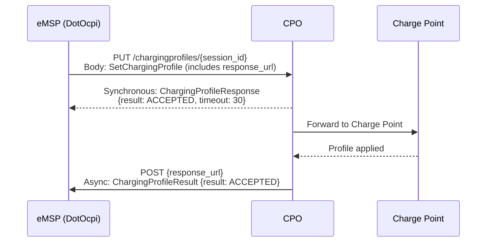

# Charging Profiles Module

The Charging Profiles module enables smart charging by allowing eMSPs to set charging power limits on active sessions. Available from OCPI 2.2+ only (not in 2.0 or 2.1.1). As an eMSP, DotOcpi acts as a **Sender**.

## eMSP Role Summary

| Operation | Direction | Description |
|---|---|---|
| **Client PUT** | eMSP → CPO | Set a charging profile on a session |
| **Client GET** | eMSP → CPO | Request active charging profile |
| **Client DELETE** | eMSP → CPO | Clear a charging profile |
| **Receive POST (callback)** | CPO → eMSP | Receive async result at response_url |
| **Receive PUT (active profile)** | CPO → eMSP | Receive active charging profile updates |

## Async Flow

Similar to Commands — charging profile operations are async:



## Endpoint URL Patterns

### CPO Receiver Endpoints (client-side)

| Method | URL Pattern | Description |
|---|---|---|
| GET | `{cpo_chargingprofiles_url}/{session_id}?duration={d}&response_url={url}` | Request active profile |
| PUT | `{cpo_chargingprofiles_url}/{session_id}` | Set charging profile |
| DELETE | `{cpo_chargingprofiles_url}/{session_id}?response_url={url}` | Clear profile |

### eMSP Sender Endpoints (server-side)

| Method | URL Pattern | Description |
|---|---|---|
| POST | `{base}/chargingprofiles/{correlation_id}` | Receive async result |
| PUT | `{base}/chargingprofiles/{session_id}` | Receive active profile updates |

---

## Objects

### ChargingProfile

| Field | Type | Required | Description |
|---|---|---|---|
| start_date_time | DateTime | No | When profile takes effect |
| duration | int | No | Duration in seconds |
| charging_rate_unit | ChargingRateUnit | Yes | W (Watts) or A (Amperes) |
| min_charging_rate | number | No | Minimum charging rate |
| charging_profile_period | ChargingProfilePeriod[] | Yes (1+) | Profile periods |

### ChargingProfilePeriod

| Field | Type | Required | Description |
|---|---|---|---|
| start_period | int | Yes | Offset in seconds from profile start |
| limit | number | Yes | Power limit (W or A depending on charging_rate_unit) |
| number_phases | int | No | Number of phases to use for charging (default: max available) |

### SetChargingProfile (request body for PUT)

| Field | Type | Required | Description |
|---|---|---|---|
| charging_profile | ChargingProfile | Yes | Profile to set |
| response_url | URL | Yes | Callback URL for async result |

### ActiveChargingProfile

| Field | Type | Required | Description |
|---|---|---|---|
| start_date_time | DateTime | Yes | When profile is/was active |
| charging_profile | ChargingProfile | Yes | The current profile |

### ChargingProfileResponse (synchronous)

| Field | Type | Required | Description |
|---|---|---|---|
| result | ChargingProfileResponseType | Yes | Sync acknowledgement |
| timeout | int | Yes | Seconds to wait for async result |

### ActiveChargingProfileResult (async for GET)

| Field | Type | Required | Description |
|---|---|---|---|
| result | ChargingProfileResultType | Yes | Result |
| profile | ActiveChargingProfile | No | Active profile (if result is ACCEPTED) |

### ChargingProfileResult (async for PUT/DELETE)

| Field | Type | Required | Description |
|---|---|---|---|
| result | ChargingProfileResultType | Yes | Result |

---

## Enums

### ChargingRateUnit

| Value | Description |
|---|---|
| W | Watts — total allowed charging power |
| A | Amperes — per phase (not sum of all phases) |

### ChargingProfileResponseType

| Value | Description |
|---|---|
| ACCEPTED | Request accepted |
| NOT_SUPPORTED | Not supported |
| REJECTED | Rejected |
| TOO_OFTEN | Rate-limited |
| UNKNOWN_SESSION | Session not found |

### ChargingProfileResultType

| Value | Description |
|---|---|
| ACCEPTED | Profile applied / retrieved |
| REJECTED | Rejected by charge point |
| UNKNOWN | Unknown error |

---

## Consumer Interface

```csharp
public interface IChargingProfilesCallback
{
    Task OnChargingProfileResultAsync(
        OcpiRequestContext context,
        string correlationId,
        ChargingProfileResultType result,
        CancellationToken ct);

    Task OnActiveChargingProfileResultAsync(
        OcpiRequestContext context,
        string correlationId,
        ChargingProfileResultType result,
        ActiveChargingProfile? profile,
        CancellationToken ct);

    Task OnActiveChargingProfileUpdateAsync(
        OcpiRequestContext context,
        string sessionId,
        ActiveChargingProfile profile,
        CancellationToken ct);
}
```

## Validation Rules

- `charging_rate_unit` must be W or A
- `charging_profile_period` must have at least 1 entry
- `start_period` must be >= 0
- `limit` must be >= 0
- `response_url` must be a valid HTTPS URL
- `session_id` must correspond to an active session
- `duration` (GET request) must be > 0
