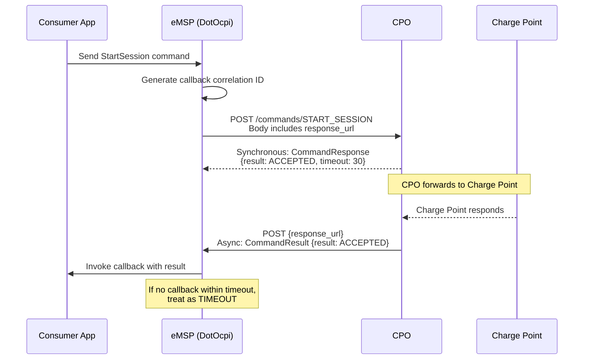

# Commands Module

The Commands module allows eMSPs to send commands to CPOs (start/stop charging, reserve, unlock). Available from OCPI 2.0+. As an eMSP, DotOcpi acts as a **Sender** — it sends commands and receives async results.

## eMSP Role Summary

| Operation | Direction | Description |
|---|---|---|
| **Client POST** | eMSP → CPO | Send a command (StartSession, StopSession, etc.) |
| **Receive POST (callback)** | CPO → eMSP | Receive async command result at `response_url` |

## Async Flow

Commands follow a two-phase pattern:



## Endpoint URL Patterns

### CPO Receiver Endpoints (client-side)

| Version | Method | URL Pattern |
|---|---|---|
| 2.0+ | POST | `{cpo_commands_url}/{command_type}` |

`{command_type}` is one of: `START_SESSION`, `STOP_SESSION`, `RESERVE_NOW`, `UNLOCK_CONNECTOR`, `CANCEL_RESERVATION` (2.2+)

### eMSP Callback Endpoint (server-side)

| Version | Method | URL Pattern |
|---|---|---|
| 2.0+ | POST | `{base}/commands/{correlation_id}` (eMSP-defined, included in response_url) |

---

## Command Objects

### StartSession

| Field | Type | 2.0 | 2.1.1 | 2.2/2.2.1 | Description |
|---|---|:---:|:---:|:---:|---|
| response_url | URL | Yes | Yes | Yes | Callback URL for async result |
| token | Token | Yes | Yes | Yes | Token to authorize |
| location_id | string(36) / CiString(36) | Yes | Yes | Yes | Target location |
| evse_uid | string(36) / CiString(36) | No | No | No | Target EVSE (optional) |
| connector_id | CiString(36) | - | - | No (2.2.1) | **Added in 2.2.1** |
| authorization_reference | CiString(36) | - | - | No | **Added in 2.2** |

### StopSession

| Field | Type | 2.0 | 2.1.1 | 2.2/2.2.1 | Description |
|---|---|:---:|:---:|:---:|---|
| response_url | URL | Yes | Yes | Yes | Callback URL |
| session_id | string(36) / CiString(36) | Yes | Yes | Yes | Session to stop |

### ReserveNow

| Field | Type | 2.0 | 2.1.1 | 2.2/2.2.1 | Description |
|---|---|:---:|:---:|:---:|---|
| response_url | URL | Yes | Yes | Yes | Callback URL |
| token | Token | Yes | Yes | Yes | Token for reservation |
| expiry_date | DateTime | Yes | Yes | Yes | Reservation expiry |
| reservation_id | **int** (2.0/2.1.1) / **CiString(36)** (2.2+) | Yes | Yes | Yes | **Type changed in 2.2** |
| location_id | string(36) / CiString(36) | Yes | Yes | Yes | Target location |
| evse_uid | string(36) / CiString(36) | No | No | No | Target EVSE |
| authorization_reference | CiString(36) | - | - | No | **Added in 2.2** |

> `reservation_id` is `int` in 2.0 and 2.1.1, changed to `CiString(36)` in 2.2+.

### UnlockConnector (all versions)

| Field | Type | Required | Description |
|---|---|---|---|
| response_url | URL | Yes | Callback URL |
| location_id | string(36) / CiString(36) | Yes | Target location |
| evse_uid | string(36) / CiString(36) | Yes | Target EVSE |
| connector_id | string(36) / CiString(36) | Yes | Target connector |

### CancelReservation (2.2+ only)

| Field | Type | Required | Description |
|---|---|---|---|
| response_url | URL | Yes | Callback URL |
| reservation_id | CiString(36) | Yes | Reservation to cancel |

---

## Response Types

### CommandResponse (synchronous)

| Field | Type | 2.0 | 2.1.1 | 2.2/2.2.1 | Description |
|---|---|:---:|:---:|:---:|---|
| result | CommandResponseType | Yes | Yes | Yes | Sync acknowledgement |
| timeout | int | Yes | - | Yes | Seconds to wait for async result (present in 2.0 and 2.2+) |
| message | DisplayText[] | - | - | No | **Added in 2.2: Human-readable message** |

### CommandResult (async callback — 2.2+ only)

| Field | Type | Required | Description |
|---|---|---|---|
| result | CommandResultType | Yes | Final result from charge point |
| message | DisplayText[] | No | Human-readable message |

> In 2.1.1, there was no separate CommandResult — the CommandResponse was reused for both sync and async responses.

### CommandResponseType

| Value | 2.0 | 2.1.1 | 2.2/2.2.1 | Description |
|---|:---:|:---:|:---:|---|
| NOT_SUPPORTED | Y | Y | Y | Command not supported |
| REJECTED | Y | Y | Y | Command rejected |
| ACCEPTED | Y | Y | Y | Command accepted, awaiting async result |
| TIMEOUT | Y | Y | - | **Removed in 2.2** (moved to CommandResultType) |
| UNKNOWN_SESSION | Y | Y | Y | Session ID not found |

### CommandResultType (2.2+ only)

| Value | Description |
|---|---|
| ACCEPTED | Command executed successfully |
| CANCELED_RESERVATION | Reservation successfully cancelled |
| EVSE_OCCUPIED | EVSE already in use |
| EVSE_INOPERATIVE | EVSE not operational |
| FAILED | Command failed |
| NOT_SUPPORTED | Not supported by charge point |
| REJECTED | Rejected by charge point |
| TIMEOUT | No response from charge point |
| UNKNOWN_RESERVATION | Reservation ID not found |

---

## Consumer Interface

```csharp
public interface ICommandsCallback
{
    /// <summary>
    /// Called when a CPO sends the async command result
    /// to the response_url.
    /// </summary>
    Task<OcpiResult> OnCommandResultAsync(
        OcpiRequestContext context,
        string correlationId,
        object result,
        CancellationToken ct);
}
```

## Validation Rules

- `response_url` must be a valid HTTPS URL
- `token` must be a complete, valid Token object
- `location_id` must not be empty
- `expiry_date` (ReserveNow) must be in the future
- `session_id` (StopSession) must not be empty
- `connector_id` (UnlockConnector) must not be empty
- `reservation_id` type must match version (int for 2.0/2.1.1, string for 2.2+)
