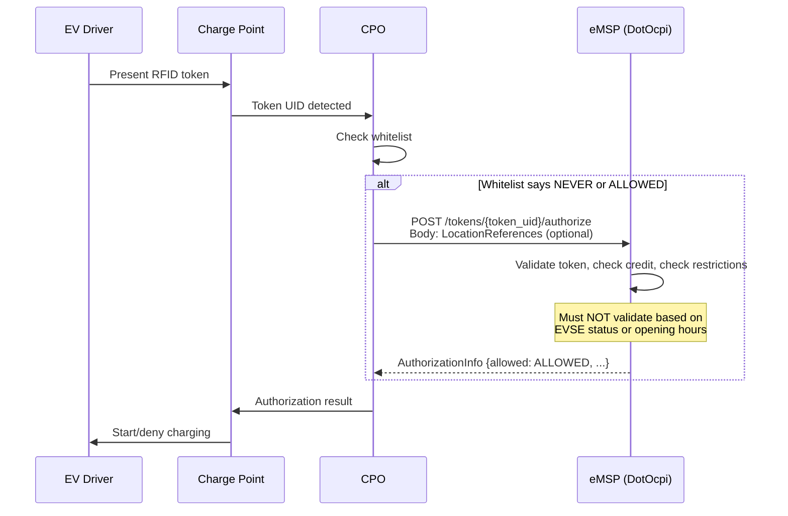

# Tokens Module

The Tokens module manages EV driver authorization tokens. As an eMSP, DotOcpi acts as a **Sender** — it pushes tokens to CPOs and serves a pull endpoint for CPOs. This module also includes the real-time authorization flow (`POST /authorize`).

## eMSP Role Summary

| Operation | Direction | Description |
|---|---|---|
| **Serve GET (list)** | CPO → eMSP | CPO pulls token list (paginated) |
| **Handle POST authorize** | CPO → eMSP | CPO requests real-time authorization for a token |
| **Client PUT** | eMSP → CPO | eMSP pushes a new/updated token to CPO |
| **Client PATCH** | eMSP → CPO | eMSP sends a partial token update to CPO |

## Endpoint URL Patterns

### eMSP Sender Endpoints (server-side)

| Version | Method | URL Pattern |
|---|---|---|
| All | GET | `{base}/tokens?[date_from=][&date_to=][&offset=][&limit=]` |
| 2.1.1 | POST | `{base}/tokens/{token_uid}/authorize` |
| 2.2+ | POST | `{base}/tokens/{token_uid}/authorize[?type={type}]` |

### CPO Receiver Endpoints (client-side push)

| Version | Method | URL Pattern |
|---|---|---|
| 2.0 / 2.1.1 | GET | `{cpo_tokens_url}/{token_uid}` |
| 2.0 / 2.1.1 | PUT | `{cpo_tokens_url}/{token_uid}` |
| 2.0 / 2.1.1 | PATCH | `{cpo_tokens_url}/{token_uid}` |
| 2.2 / 2.2.1 | GET | `{cpo_tokens_url}/{country_code}/{party_id}/{token_uid}[?type={type}]` |
| 2.2 / 2.2.1 | PUT | `{cpo_tokens_url}/{country_code}/{party_id}/{token_uid}[?type={type}]` |
| 2.2 / 2.2.1 | PATCH | `{cpo_tokens_url}/{country_code}/{party_id}/{token_uid}[?type={type}]` |

> The `?type=` query parameter was added in 2.2+ to disambiguate tokens with the same UID but different types.

---

## Token Object

### Version 2.0

| Field | Type | Required | Description |
|---|---|---|---|
| uid | string(15) | Yes | Unique token ID (e.g., RFID UID) |
| type | TokenType | Yes | RFID or OTHER |
| auth_id | string(32) | Yes | Authorization ID (contract reference) |
| visual_number | string(64) | Yes | Number printed on the token |
| issuer | string(64) | Yes | Token issuer name |
| valid | boolean | Yes | Whether the token is currently valid |
| allow_whitelist | boolean | No | Whether CPO may whitelist this token |

### Version 2.1.1

| Field | Type | Required | Description |
|---|---|---|---|
| uid | string(36) | Yes | Unique token ID |
| type | TokenType | Yes | RFID or OTHER |
| auth_id | string(36) | Yes | Authorization ID |
| visual_number | string(64) | **No** | **Changed to optional** |
| issuer | string(64) | Yes | Token issuer |
| valid | boolean | Yes | Whether valid |
| **whitelist** | WhitelistType | Yes | **Replaces `allow_whitelist` boolean** |
| **language** | string(2) | No | **Added: Preferred language (ISO 639-1)** |
| **last_updated** | DateTime | Yes | **Added** |

### Version 2.2 / 2.2.1

| Field | Type | Required | Description |
|---|---|---|---|
| **country_code** | CiString(2) | Yes | **Added: Token owner's country code** |
| **party_id** | CiString(3) | Yes | **Added: Token owner's party ID** |
| uid | CiString(36) | Yes | Unique token ID |
| type | TokenType | Yes | RFID, APP_USER, AD_HOC_USER, OTHER (+ EMAID in 2.2.1) |
| **contract_id** | CiString(36) | Yes | **Renamed from `auth_id`** |
| visual_number | string(64) | No | Number on token |
| issuer | string(64) | Yes | Token issuer |
| **group_id** | CiString(36) | No | **Added: Token group for fleet management** |
| valid | boolean | Yes | Whether valid |
| whitelist | WhitelistType | Yes | Whitelist behavior |
| language | string(2) | No | Preferred language |
| **default_profile_type** | ProfileType | No | **Added: Default charging profile** |
| **energy_contract** | EnergyContract | No | **Added: Driver's energy contract** |
| last_updated | DateTime | Yes | Last modification |

---

## Real-Time Authorization

### Flow



### AuthorizationInfo (2.1.1+)

#### Version 2.1.1

| Field | Type | Required | Description |
|---|---|---|---|
| allowed | AllowedType | Yes | Authorization result |
| location | LocationReferences | No | Authorized location/EVSEs |
| info | DisplayText | No | Display message for driver |

#### Version 2.2 / 2.2.1

| Field | Type | Required | Description |
|---|---|---|---|
| allowed | AllowedType | Yes | Authorization result |
| **token** | Token | Yes | **Added: The token that was authorized** |
| location | LocationReferences | No | Authorized location/EVSEs |
| **authorization_reference** | CiString(36) | No | **Added: Reference ID for linking to Session/CDR** |
| info | DisplayText | No | Display message for driver |

### LocationReferences

#### Version 2.1.1

| Field | Type | Required | Description |
|---|---|---|---|
| location_id | string(39) | Yes | Location where token was presented |
| evse_uids | string(39)[] | No | Specific EVSEs to authorize |
| connector_ids | string(36)[] | No | Specific connectors |

#### Version 2.2 / 2.2.1

| Field | Type | Required | Description |
|---|---|---|---|
| location_id | CiString(36) | Yes | Location where token was presented |
| evse_uids | CiString(36)[] | No | Specific EVSEs |

> `connector_ids` was removed in 2.2.

### Enums

#### TokenType

| Value | 2.0 | 2.1.1 | 2.2 | 2.2.1 |
|---|:---:|:---:|:---:|:---:|
| AD_HOC_USER | - | - | Y | Y |
| APP_USER | - | - | Y | Y |
| EMAID | - | - | - | Y |
| OTHER | Y | Y | Y | Y |
| RFID | Y | Y | Y | Y |

#### WhitelistType (2.1.1+)

| Value | Description |
|---|---|
| ALWAYS | Token must always be accepted from whitelist |
| ALLOWED | Token may be used from whitelist or real-time auth |
| ALLOWED_OFFLINE | Real-time auth normally; whitelist when offline |
| NEVER | Real-time auth mandatory; never whitelist |

#### AllowedType (2.1.1+)

`ALLOWED`, `BLOCKED`, `EXPIRED`, `NO_CREDIT`, `NOT_ALLOWED`

#### ProfileType (2.2+ only)

`CHEAP`, `FAST`, `GREEN`, `REGULAR`

### EnergyContract (2.2+ only)

| Field | Type | Required | Description |
|---|---|---|---|
| supplier_name | string(64) | Yes | Energy supplier name |
| contract_id | string(64) | No | Contract identifier |

---

## Consumer Interfaces

```csharp
/// <summary>
/// Implement to serve tokens for CPO pull and handle real-time authorization.
/// </summary>
public interface ITokensSender
{
    /// <summary>
    /// Return a paginated list of tokens for CPO pull.
    /// </summary>
    Task<OcpiResult<PaginatedResult<object>>> GetTokensAsync(
        OcpiRequestContext context,
        DateTime? dateFrom,
        DateTime? dateTo,
        int offset,
        int limit,
        CancellationToken ct);

    /// <summary>
    /// Return the total count of matching tokens (for X-Total-Count header).
    /// </summary>
    Task<int> GetTokenCountAsync(
        OcpiRequestContext context,
        DateTime? dateFrom,
        DateTime? dateTo,
        CancellationToken ct);
}

/// <summary>
/// Implement to handle real-time authorization requests from CPOs.
/// </summary>
public interface ITokensAuthorizer
{
    /// <summary>
    /// Called when a CPO requests authorization for a token.
    /// Must NOT validate based on EVSE status or opening hours per OCPI spec.
    /// </summary>
    Task<OcpiResult<AuthorizationInfo>> OnAuthorizeAsync(
        OcpiRequestContext context,
        string tokenUid,
        TokenType? tokenType,
        LocationReferences? locationReferences,
        CancellationToken ct);
}
```

## Validation Rules

- `uid` must not be empty or exceed max length
- `type` must be a valid TokenType for the negotiated version
- `contract_id` / `auth_id` must not be empty
- `issuer` must not be empty
- `whitelist` (2.1.1+) must be a valid WhitelistType
- `country_code` (2.2+) must be valid ISO 3166-1 alpha-2
- `party_id` (2.2+) must be 3 characters
- Authorize request: `token_uid` must not be empty
- Authorize response: `allowed` must be a valid AllowedType
- Authorize response: `authorization_reference` (2.2+) if present, must be stored and included in Session/CDR
