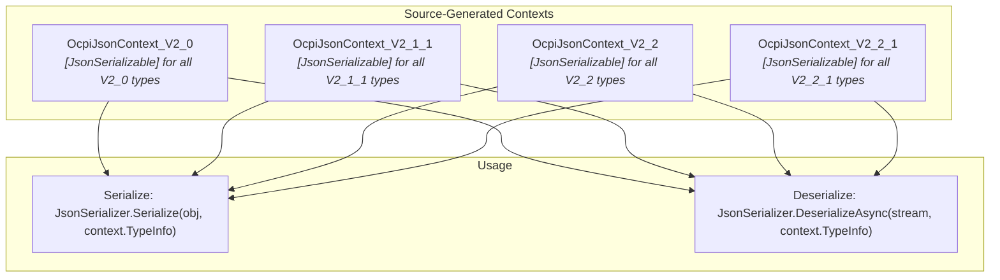
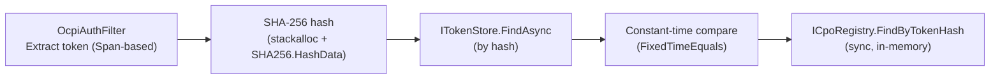
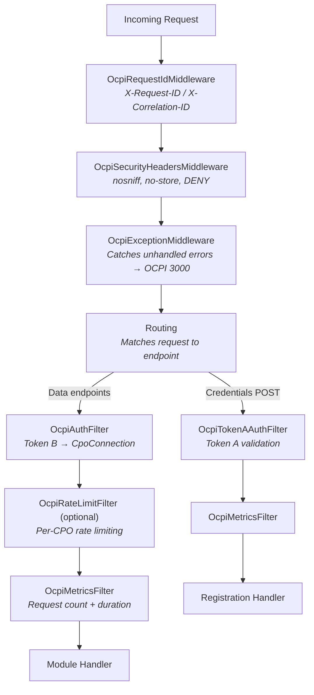

# DotOcpi Performance Strategy

Performance is a first-class concern for a protocol library. Every OCPI request passes through DotOcpi — serialization, validation, token lookup, routing — so inefficiencies compound across all connected CPOs.

## Table of Contents

- [1. JSON Serialization (Source Generation)](#1-json-serialization-source-generation)
- [2. Memory & Allocation Strategy](#2-memory--allocation-strategy)
- [3. Async Patterns](#3-async-patterns)
- [4. HTTP Client Performance](#4-http-client-performance)
- [5. Token Validation (Hot Path)](#5-token-validation-hot-path)
- [6. Lookup Table Optimization](#6-lookup-table-optimization)
- [7. ASP.NET Core Endpoint Performance](#7-aspnet-core-endpoint-performance)
- [8. Benchmarking](#8-benchmarking)
- [9. Request & Response Size Limits](#9-request--response-size-limits)
- [10. Middleware Pipeline Ordering](#10-middleware-pipeline-ordering)
- [11. Response Compression](#11-response-compression)
- [12. GC & Runtime Configuration](#12-gc--runtime-configuration)
- [13. Observability Overhead](#13-observability-overhead)

---

## 1. JSON Serialization (Source Generation)

### Design: Per-Version Source-Generated JsonSerializerContext

Every OCPI version has its own `JsonSerializerContext` with `[JsonSerializable]` attributes for all types in that version. This provides:

- **AOT compatibility** — no reflection-based serialization
- **~1.6x faster serialization**, **~2.2x faster startup**
- **~50% less memory** for serialization operations
- **Zero-allocation** collection serialization on hot paths



### Context Structure

```csharp
[JsonSourceGenerationOptions(
    PropertyNamingPolicy = JsonKnownNamingPolicy.SnakeCaseLower,
    DefaultIgnoreCondition = JsonIgnoreCondition.WhenWritingNull,
    WriteIndented = false,
    UseStringEnumConverter = true)]
// Model types (deserialized individually from PUT/PATCH bodies)
[JsonSerializable(typeof(Location))]
[JsonSerializable(typeof(Evse))]
[JsonSerializable(typeof(Connector))]
[JsonSerializable(typeof(Session))]
[JsonSerializable(typeof(Cdr))]
[JsonSerializable(typeof(Tariff))]
[JsonSerializable(typeof(Token))]
[JsonSerializable(typeof(AuthorizationInfo))]
[JsonSerializable(typeof(Credentials))]
[JsonSerializable(typeof(VersionDetail))]
// OcpiResponse wrappers (single-object responses)
[JsonSerializable(typeof(OcpiResponse<Location>))]
[JsonSerializable(typeof(OcpiResponse<Session>))]
[JsonSerializable(typeof(OcpiResponse<Cdr>))]
[JsonSerializable(typeof(OcpiResponse<Tariff>))]
[JsonSerializable(typeof(OcpiResponse<Token>))]
[JsonSerializable(typeof(OcpiResponse<AuthorizationInfo>))]
[JsonSerializable(typeof(OcpiResponse<Credentials>))]
[JsonSerializable(typeof(OcpiResponse<CommandResponse>))]
[JsonSerializable(typeof(OcpiResponse<ChargingProfileResponse>))]
// Collection types (paginated GET responses)
[JsonSerializable(typeof(IReadOnlyList<Location>))]
[JsonSerializable(typeof(IReadOnlyList<Session>))]
[JsonSerializable(typeof(IReadOnlyList<Cdr>))]
[JsonSerializable(typeof(IReadOnlyList<Tariff>))]
[JsonSerializable(typeof(IReadOnlyList<Token>))]
// Commands (request bodies)
[JsonSerializable(typeof(StartSession))]
[JsonSerializable(typeof(StopSession))]
[JsonSerializable(typeof(ReserveNow))]
[JsonSerializable(typeof(UnlockConnector))]
// PATCH operations use JsonElement
[JsonSerializable(typeof(JsonElement))]
public sealed partial class OcpiJsonContext_V2_2_1 : JsonSerializerContext;
```

> **Note:** Version-agnostic registration types (`VersionInfo`, `VersionDetailInfo`) are handled by a separate `OcpiRegistrationJsonContext`, which is used during version discovery before a per-version context is selected.

### Enum Serialization

Standard OCPI enums use `UseStringEnumConverter = true` on the context-level `[JsonSourceGenerationOptions]` attribute (shown above). No per-enum `[JsonConverter]` attributes are needed — the context-level setting applies to all enums in the context.

For enums with custom OCPI string values (e.g., names that differ from C# identifiers), use custom `JsonConverter<T>` implementations — not `JsonStringEnumConverter`:

```csharp
public sealed class OcpiStatusConverter : JsonConverter<Status>
{
    public override Status Read(ref Utf8JsonReader reader, Type typeToConvert,
        JsonSerializerOptions options)
    {
        var value = reader.GetString();
        return value switch
        {
            "AVAILABLE" => Status.Available,
            "OUTOFORDER" => Status.OutOfOrder,  // No underscore in OCPI spec
            _ => throw new JsonException($"Unknown status: {value}")
        };
    }

    public override void Write(Utf8JsonWriter writer, Status value,
        JsonSerializerOptions options)
    {
        writer.WriteStringValue(value switch
        {
            Status.Available => "AVAILABLE",
            Status.OutOfOrder => "OUTOFORDER",
            _ => value.ToString().ToUpperInvariant()
        });
    }
}
```

### Options Caching

A single `JsonSerializerOptions` instance per version, created at startup and reused:

```csharp
public static class OcpiJsonOptions
{
    // Lazy-initialized, thread-safe via null-coalescing assignment
    private static JsonSerializerOptions? _v2_2_1;
    private static JsonSerializerOptions? _v2_2;
    private static JsonSerializerOptions? _v2_1_1;
    private static JsonSerializerOptions? _v2_0;

    public static JsonSerializerOptions GetOptions(OcpiVersion version) => version switch
    {
        OcpiVersion.V2_2_1 => V2_2_1,
        OcpiVersion.V2_2 => V2_2,
        OcpiVersion.V2_1_1 => V2_1_1,
        OcpiVersion.V2_0 => V2_0,
        _ => throw new ArgumentOutOfRangeException(nameof(version))
    };

    public static JsonSerializerOptions V2_2_1 => _v2_2_1 ??= CreateOptions(OcpiJsonContext_V2_2_1.Default);
    public static JsonSerializerOptions V2_2 => _v2_2 ??= CreateOptions(OcpiJsonContext_V2_2.Default);
    public static JsonSerializerOptions V2_1_1 => _v2_1_1 ??= CreateOptions(OcpiJsonContext_V2_1_1.Default);
    public static JsonSerializerOptions V2_0 => _v2_0 ??= CreateOptions(OcpiJsonContext_V2_0.Default);

    private static JsonSerializerOptions CreateOptions(JsonSerializerContext context)
    {
        var options = new JsonSerializerOptions
        {
            PropertyNamingPolicy = JsonNamingPolicy.SnakeCaseLower,
            DefaultIgnoreCondition = JsonIgnoreCondition.WhenWritingNull,
            MaxDepth = 32 // Prevent stack overflow from pathological input (Security Rule 14)
        };
        options.TypeInfoResolverChain.Add(context);
        options.Converters.Add(new OcpiDateTimeConverter());
        options.Converters.Add(new CiStringConverter());
        options.Converters.Add(new GeoLocationConverter());
        options.MakeReadOnly();
        return options;
    }
}
```

### Consumer Context Chaining

Consumers can add their own types to the resolver chain:

```csharp
// Consumer extends with their own context
builder.Services.ConfigureHttpJsonOptions(options =>
{
    options.SerializerOptions.TypeInfoResolverChain.Add(
        OcpiJsonContext_V2_2_1.Default);
    options.SerializerOptions.TypeInfoResolverChain.Add(
        MyAppJsonContext.Default);  // Consumer's own types
});
```

### Stream-Based Deserialization (Never Read to String)

Deserialization is handled through two paths — neither uses standalone helper methods:

- **Server-side**: `IModuleHandler.DeserializeAsync` reads the request body stream via `JsonSerializer.DeserializeAsync` using the version-specific `JsonSerializerOptions`. Called from `EndpointHelper.DeserializeOrRejectAsync`.
- **Client-side**: `OcpiResponseParser` deserializes response streams into `OcpiResponse<T>` using the version-appropriate options. Called from module client methods.

---

## 2. Memory & Allocation Strategy

### Value Types for Small Protocol Types

Use `readonly record struct` for types that are small, immutable, and frequently created:

```csharp
// Stack-allocated, no GC pressure, value semantics
public readonly record struct PartyIdentity
{
    public string CountryCode { get; }
    public string PartyId { get; }

    public PartyIdentity(string CountryCode, string PartyId)
    {
        ArgumentNullException.ThrowIfNull(CountryCode);
        ArgumentNullException.ThrowIfNull(PartyId);
        this.CountryCode = CountryCode;
        this.PartyId = PartyId;
    }

    public string ToCompositeId() =>
        string.Create(
            CountryCode.Length + 1 + PartyId.Length,
            (CountryCode, PartyId),
            static (span, state) =>
            {
                state.CountryCode.AsSpan().ToUpperInvariant(span);
                span[state.CountryCode.Length] = '_';
                state.PartyId.AsSpan().ToUpperInvariant(span[(state.CountryCode.Length + 1)..]);
            });

    public override string ToString() => ToCompositeId();
}

public readonly record struct GeoLocation(string Latitude, string Longitude);

public readonly record struct OcpiStatusCode(int Value)
{
    public static readonly OcpiStatusCode Success = new(1000);
    public static readonly OcpiStatusCode GenericClientError = new(2000);
    public static readonly OcpiStatusCode InvalidParameters = new(2001);
    // ...

    public bool IsSuccess => Value is >= 1000 and < 2000;
}
```

### Span-Based Header Parsing

Token extraction from the Authorization header using Span-based parsing. The prefix check and trimming are zero-allocation via `ReadOnlySpan<char>`, but the extracted token is materialized as a `string` (via `.ToString()`) because downstream hashing and store lookup require it:

```csharp
public static class AuthorizationHeaderParser
{
    private const string TokenPrefix = "Token ";

    public static bool TryParse(
        ReadOnlySpan<char> headerValue,
        out string token)
    {
        token = string.Empty;

        var trimmed = headerValue.Trim();
        if (trimmed.Length <= TokenPrefix.Length)
            return false;

        if (!trimmed[..TokenPrefix.Length].Equals(
            TokenPrefix.AsSpan(), StringComparison.OrdinalIgnoreCase))
            return false;

        var tokenSpan = trimmed[TokenPrefix.Length..].Trim();
        if (tokenSpan.IsEmpty)
            return false;

        token = tokenSpan.ToString(); // One allocation: token string for hashing
        return true;
    }
}
```

### Token Hashing

Token hashing uses `stackalloc` for small tokens and falls back to a `new byte[]` allocation for larger ones. `ArrayPool` is not used — the allocation is bounded by token size and infrequent enough (once per request) that pool overhead is not justified:

```csharp
public static class TokenHasher
{
    public static string Hash(string token)
    {
        var byteCount = Encoding.UTF8.GetByteCount(token);
        Span<byte> tokenBytes = byteCount <= 256 ? stackalloc byte[byteCount] : new byte[byteCount];
        Encoding.UTF8.GetBytes(token, tokenBytes);

        Span<byte> hash = stackalloc byte[32]; // SHA-256 = 256 bits = 32 bytes
        SHA256.HashData(tokenBytes, hash);

#if NET9_0_OR_GREATER
        return Convert.ToHexStringLower(hash);
#else
        return Convert.ToHexString(hash).ToLowerInvariant();
#endif
    }
}
```

The output is lowercase hex (64 characters for SHA-256). On net9.0+, `Convert.ToHexStringLower` avoids the `ToLowerInvariant()` allocation.

### Avoid Closure Allocations

```csharp
// BAD: Closure captures 'cpoId' — allocates closure + delegate per call
endpoints.MapGet("/locations", async (string cpoId) =>
{
    var conn = await registry.GetAsync(cpoId);
    // ...
});

// GOOD: Parameters come from route binding — no closure
endpoints.MapGet("/locations/{cpoId}",
    static async (string cpoId, ICpoRegistry registry, CancellationToken ct) =>
{
    var conn = await registry.GetAsync(cpoId, ct);
    // ...
});
```

---

## 3. Async Patterns

### ConfigureAwait(false) Everywhere in Library Code

Every `await` in the library uses `ConfigureAwait(false)` to avoid unnecessary `SynchronizationContext` capture:

```csharp
public async Task<OcpiResult<Location>> GetLocationAsync(
    string cpoId, string locationId, CancellationToken ct)
{
    // CpoConnectionContextProvider caches CpoConnection + raw token per CPO.
    // ResolveAsync returns synchronously on cache hit (ValueTask, no allocation).
    var context = await _contextProvider.ResolveAsync(cpoId, ct).ConfigureAwait(false);

    var request = OcpiHttpRequestBuilder.Build(context, HttpMethod.Get, "locations", locationId);

    var response = await _httpClient
        .SendAsync(request, ct)
        .ConfigureAwait(false);

    var body = await JsonSerializer
        .DeserializeAsync(response.Content.ReadAsStream(), typeInfo, ct)
        .ConfigureAwait(false);

    return OcpiResult<Location>.Success(body.Data);
}
```

### ValueTask for Hot Paths

Methods that frequently complete synchronously (e.g., cache hits in token validation) use `ValueTask`:

```csharp
public ValueTask<CpoConnection?> GetByTokenHashAsync(
    string tokenHash, CancellationToken ct)
{
    // Local cache hit — synchronous, no Task allocation
    if (_localCache.TryGetValue(tokenHash, out var cached))
        return new ValueTask<CpoConnection?>(cached);

    // Cache miss — async fallback
    return new ValueTask<CpoConnection?>(GetFromStoreAsync(tokenHash, ct));
}
```

### IAsyncEnumerable for Paginated Results

Streams paginated OCPI data without buffering entire result sets:

```csharp
public async IAsyncEnumerable<Location> GetAllLocationsAsyncEnumerable(
    string cpoId,
    DateTimeOffset? dateFrom = null,
    [EnumeratorCancellation] CancellationToken ct = default)
{
    string? nextUrl = BuildInitialUrl(cpoId, "locations", dateFrom);

    while (nextUrl is not null)
    {
        ct.ThrowIfCancellationRequested();

        var page = await FetchPageAsync<Location>(nextUrl, ct).ConfigureAwait(false);

        foreach (var item in page.Data)
            yield return item;

        nextUrl = page.NextPageUrl;
    }
}
```

### Cancellation Token Linking & Graceful Shutdown

Background services (pull sync, health monitoring) must link the host shutdown token with per-operation timeouts. Without linking, a running sync continues after shutdown is requested.

```csharp
public class OcpiPullSyncBackgroundService(
    IOcpiClient client,
    IHostApplicationLifetime lifetime) : BackgroundService
{
    protected override async Task ExecuteAsync(CancellationToken stoppingToken)
    {
        while (!stoppingToken.IsCancellationRequested)
        {
            using var cts = CancellationTokenSource.CreateLinkedTokenSource(stoppingToken);
            cts.CancelAfter(TimeSpan.FromMinutes(5)); // per-sync timeout

            try
            {
                await SyncLocationsAsync(cts.Token).ConfigureAwait(false);
            }
            catch (OperationCanceledException) when (stoppingToken.IsCancellationRequested)
            {
                return; // host shutdown — exit gracefully
            }
            catch (OperationCanceledException)
            {
                // per-operation timeout — log and continue to next cycle
            }

            await Task.Delay(TimeSpan.FromMinutes(15), stoppingToken).ConfigureAwait(false);
        }
    }
}
```

---

## 4. HTTP Client Performance

### Connection Pooling Configuration

```csharp
services.AddHttpClient("OcpiClient", static client =>
    {
        client.DefaultRequestHeaders.Add("Accept", "application/json");
    })
    .ConfigurePrimaryHttpMessageHandler(static () => new SocketsHttpHandler
    {
        PooledConnectionLifetime = TimeSpan.FromMinutes(5),  // Force DNS refresh
        MaxConnectionsPerServer = 20,                         // Per CPO host
        ConnectCallback = ValidateAndConnectAsync,            // SSRF prevention (see Security)
    })
    .SetHandlerLifetime(Timeout.InfiniteTimeSpan);            // Disable factory rotation
```

Key configuration choices:

- **`PooledConnectionLifetime`** handles DNS rotation at the socket level. Factory-level handler rotation (`SetHandlerLifetime`) is disabled (`Timeout.InfiniteTimeSpan`) so the singleton `HttpClient` retains its resilience handler state.
- **`ConnectCallback`** (`ValidateAndConnectAsync`) resolves DNS, validates resolved IPs against private/loopback/link-local ranges (SSRF prevention), then connects. See [strategies.md — Security Strategy](strategies.md#18-security-strategy).
- **Standard resilience handler** (`AddStandardResilienceHandler()` from `Microsoft.Extensions.Http.Resilience`) provides retry, circuit breaker, and timeout policies.

### Connection Context Caching

Module clients resolve CPO connection metadata and auth tokens through `CpoConnectionContextProvider`, which caches the result per CPO in a `ConcurrentDictionary`. This eliminates 2 registry lookups + 1 token fetch on every outbound call. The cache is invalidated automatically after registration, credential rotation, and unregistration operations. Consumers who modify the registry or rotate tokens outside the library call `IOcpiClient.InvalidateConnection(cpoId)` or `InvalidateAllConnections()`.

### Stream-Based Request/Response

Response deserialization goes through `OcpiResponseParser`, which reads from the response content stream using `JsonSerializer.DeserializeAsync` with version-specific `JsonSerializerOptions`. There are no standalone `CreateJsonContent<T>` or `ReadResponseAsync<T>` helper methods — serialization and deserialization are handled within the module client and response parser classes.

---

## 5. Token Validation (Hot Path)

Token validation runs on every inbound request. It must be as fast as possible.

The flow is split across two components: `OcpiAuthFilter` parses the Authorization header and extracts the raw token, then delegates to `OcpiTokenValidator` for hashing and store lookup. The validator does not parse headers itself.



### Optimized Implementation

```csharp
public sealed class OcpiTokenValidator
{
    private readonly ITokenStore _tokenStore;

    public async ValueTask<TokenValidationResult> ValidateAsync(
        string rawToken, CancellationToken cancellationToken = default)
    {
        if (string.IsNullOrEmpty(rawToken))
            return TokenValidationResult.Failed("Token is empty.");

        // 1. Hash with stackalloc (zero allocation for small tokens)
        var incomingHash = TokenHasher.Hash(rawToken);

        // 2. Token store lookup (async — may hit database for persistent stores)
        var entry = await _tokenStore
            .FindAsync(incomingHash, cancellationToken)
            .ConfigureAwait(false);

        if (entry is null)
            return TokenValidationResult.Failed("Token not recognized.");

        // 3. Constant-time comparison (timing-attack resistant)
        if (!CryptographicOperations.FixedTimeEquals(
            MemoryMarshal.AsBytes(incomingHash.AsSpan()),
            MemoryMarshal.AsBytes(entry.TokenHash.AsSpan())))
            return TokenValidationResult.Failed("Token validation failed.");

        return TokenValidationResult.Valid(entry); // Holds TokenEntry, not CpoConnection
    }
}
```

---

## 6. Lookup Table Optimization

### FrozenDictionary for Static Lookups

Version strings and validator type maps are immutable after startup. With net8.0 as the minimum target, `FrozenDictionary` is always available. There is no centralized `OcpiConstants` class — frozen collections are used where needed:

**`VersionNegotiator.VersionMap`** — maps version strings to `OcpiVersion` values for negotiation:

```csharp
// In VersionNegotiator
private static readonly FrozenDictionary<string, OcpiVersion> VersionMap =
    new Dictionary<string, OcpiVersion>(StringComparer.OrdinalIgnoreCase)
    {
        ["2.2.1"] = OcpiVersion.V2_2_1,
        ["2.2"] = OcpiVersion.V2_2,
        ["2.1.1"] = OcpiVersion.V2_1_1,
        ["2.1"] = OcpiVersion.V2_1_1,  // Deprecated — steers to 2.1.1
        ["2.0"] = OcpiVersion.V2_0,
    }.ToFrozenDictionary(StringComparer.OrdinalIgnoreCase);
```

**`EndpointHelper.ValidatorServiceTypes`** — maps model types to their `IOcpiValidator<T>` service types for protocol-level validation (AOT-safe, no `MakeGenericType`):

```csharp
// In EndpointHelper
private static readonly FrozenDictionary<Type, Type> ValidatorServiceTypes =
    new Dictionary<Type, Type>
    {
        [typeof(Models.V2_0.Location)] = typeof(IOcpiValidator<Models.V2_0.Location>),
        [typeof(Models.V2_0.Session)] = typeof(IOcpiValidator<Models.V2_0.Session>),
        // ... all model types across all versions
        [typeof(Models.V2_2_1.Credentials)] = typeof(IOcpiValidator<Models.V2_2_1.Credentials>),
    }.ToFrozenDictionary();
```

`FrozenDictionary` provides **2.5-3.5x faster reads** than `Dictionary` for these static lookup tables. `FrozenSet` is not currently used.

---

## 7. ASP.NET Core Endpoint Performance

### Handler Style

Handlers accept `HttpContext` and resolve services from `RequestServices`. There is no `OcpiTypeInfoResolver` — deserialization goes through `EndpointHelper.DeserializeOrRejectAsync`, which delegates to `IModuleHandler.DeserializeAsync` for version-specific deserialization:

```csharp
public static class LocationsEndpoints
{
    internal static async Task HandleLocationPut(string locationId, HttpContext httpContext)
    {
        var ctx = httpContext.GetOcpiContext()!;

        var data = await EndpointHelper
            .DeserializeOrRejectAsync(httpContext, ModuleHandlerFactory.Location(ctx.NegotiatedVersion))
            .ConfigureAwait(false);
        if (data is null)
            return;

        var receiver = httpContext.RequestServices.GetRequiredService<ILocationsReceiver>();
        var result = await receiver
            .OnLocationPutAsync(ctx, locationId, data, httpContext.RequestAborted)
            .ConfigureAwait(false);

        // ...
    }
}
```

Country codes are plain `string` route parameters, not `IParsable<T>` types — validation is the consumer's responsibility in receiver implementations.

---

## 8. Benchmarking

### Project Setup

```
benchmarks/
└── DotOcpi.Benchmarks/
    ├── DotOcpi.Benchmarks.csproj
    ├── Program.cs
    ├── SerializationBenchmarks.cs
    ├── TokenBenchmarks.cs
    └── RegistryBenchmarks.cs
```

### Benchmark Classes

All benchmark classes use `[MemoryDiagnoser]` only — no `[SimpleJob]`, `[ThreadingDiagnoser]`, or reflection comparison benchmarks:

```csharp
[MemoryDiagnoser]
public class SerializationBenchmarks
{
    private byte[] _locationJson = null!;
    private Location _location = null!;

    [GlobalSetup]
    public void Setup()
    {
        _location = new Location { /* ... */ };
        _locationJson = JsonSerializer.SerializeToUtf8Bytes(
            _location, OcpiJsonOptions.GetOptions(OcpiVersion.V2_2_1));
    }

    [Benchmark]
    public byte[] Serialize() =>
        JsonSerializer.SerializeToUtf8Bytes(
            _location, OcpiJsonOptions.GetOptions(OcpiVersion.V2_2_1));

    [Benchmark]
    public Location? Deserialize() =>
        JsonSerializer.Deserialize<Location>(
            _locationJson, OcpiJsonOptions.GetOptions(OcpiVersion.V2_2_1));
}
```

`TokenBenchmarks` covers token generation, hashing, and store lookup. `RegistryBenchmarks` covers `FindByConnectionKey`, `FindByTokenHash`, and `GetAll` on `InMemoryCpoRegistry`.

### Key Metrics to Track

| Benchmark | Target | Metric |
|---|---|---|
| Token validation | < 1 us (cache hit) | Mean time, zero allocations |
| Location serialization | < 200 ns | Mean time |
| Registry lookup (by token hash) | < 100 ns (local cache) | Mean time, zero allocations |
| OCPI response envelope creation | Zero allocations | Allocated bytes |

### Statistical Rigor

- Use `[WarmupCount(3)]` and `[IterationCount(15)]` minimum for stable results
- Reject benchmark results with relative standard deviation > 5% — re-run with fewer background processes
- Use `--statisticalTest 5%` in CI to detect regressions: `dotnet run -c Release -- --statisticalTest 5% --artifacts ./benchmark-results`
- Preserve `--artifacts` output for cross-run regression comparison
- Pin benchmarks to a single CPU core on CI runners to reduce context-switch noise (`taskset` on Linux, `start /affinity` on Windows)

### Performance Rules

1. **No per-request allocations** for auth middleware, token extraction, hash computation (on cache hit path)
2. **Source-gen JSON** for all serialization — never fall back to reflection in production
3. **ConfigureAwait(false)** on every await in library code
4. **ValueTask** for methods with frequent synchronous completion
5. **FrozenDictionary** for all static lookup tables
6. **Stream-based** JSON read/write — never buffer to string
7. **stackalloc** for SHA-256 output and small temporary buffers
8. **readonly record struct** for small value types (PartyIdentity, GeoLocation, OcpiStatusCode)
9. **Static lambdas** in endpoint handlers — no closures on hot paths
10. **Reuse JsonSerializerOptions** — one cached instance per OCPI version

---

## 9. Request & Response Size Limits

Unbounded request bodies are a DoS vector. A CPO could send a multi-gigabyte payload to exhaust memory. Enforce limits at both Kestrel and endpoint levels.

### Kestrel Global Limit

```csharp
builder.WebHost.ConfigureKestrel(options =>
{
    options.Limits.MaxRequestBodySize = 1 * 1024 * 1024; // 1 MB global ceiling
});
```

### Per-Endpoint Limits

OCPI endpoints have predictable payload sizes. Apply tighter limits per category:

| Endpoint Category | Max Body Size | Rationale |
|---|---|---|
| PUT Location/Session/Token/Tariff | 256 KB | Single object; largest is Location with many EVSEs. PATCH inherits this module-level limit. |
| POST CDR | 1 MB | CDR with detailed charging periods and signed data |
| POST /credentials | 16 KB | Credentials object is small |
| POST /authorize | 8 KB | Token UID + LocationReferences |
| POST command callback | 16 KB | CommandResult is small |

The filter is applied at the module group level (not per-endpoint for PATCH), so all routes in a module share the same limit:

```csharp
public sealed class OcpiBodySizeLimitFilter : IEndpointFilter
{
    private readonly long _maxBodySize;

    public OcpiBodySizeLimitFilter(long maxBodySizeBytes = 10 * 1024 * 1024)
    {
        _maxBodySize = maxBodySizeBytes;
    }

    public async ValueTask<object?> InvokeAsync(
        EndpointFilterInvocationContext context,
        EndpointFilterDelegate next)
    {
        var contentLength = context.HttpContext.Request.ContentLength;
        if (contentLength > _maxBodySize)
        {
            return OcpiResponseWriter.ErrorResult(
                StatusCodes.Status413PayloadTooLarge,
                2000,
                $"Request body exceeds maximum size of {_maxBodySize} bytes.");
        }

        // Enforce at the Kestrel level for chunked requests without Content-Length
        var bodySizeFeature = context.HttpContext.Features.Get<IHttpMaxRequestBodySizeFeature>();
        if (bodySizeFeature is { IsReadOnly: false })
            bodySizeFeature.MaxRequestBodySize = _maxBodySize;

        return await next(context).ConfigureAwait(false);
    }
}

// Registration — applied per module group
module.AddEndpointFilter(new OcpiBodySizeLimitFilter(256 * 1024));
```

---

## 10. Middleware Pipeline Ordering

Middleware order determines when expensive operations run — and whether they run at all on rejected requests. The pipeline splits into two layers: **middleware** (runs on all requests) and **endpoint filters** (runs only on matched OCPI endpoints).



### Pipeline Registration

`MapOcpiEndpoints()` registers the middleware and endpoint filters. `MapAllOcpiEndpoints()` additionally creates a separate registration route group for credentials POST (Token A auth):

```csharp
var app = builder.Build();

// MapOcpiEndpoints registers middleware internally:
//   app.UseMiddleware<OcpiRequestIdMiddleware>();
//   app.UseMiddleware<OcpiSecurityHeadersMiddleware>();
//   app.UseMiddleware<OcpiExceptionMiddleware>();
//
// And applies endpoint filters to the auth-filtered route group:
//   group.AddEndpointFilter<OcpiAuthFilter>();           // Token B → CpoConnection
//   group.AddEndpointFilter(new OcpiRateLimitFilter(...));  // if rateLimitOptions provided
//   group.AddEndpointFilter<OcpiMetricsFilter>();
//
// MapAllOcpiEndpoints also creates a registration group for POST /credentials:
//   registrationGroup.AddEndpointFilter<OcpiMetricsFilter>();
//   registrationGroup.MapCredentialsRegistrationEndpoints();  // OcpiTokenAAuthFilter inside

app.MapAllOcpiEndpoints();
```

Key insights:
- Middleware runs on **all** requests (including 404s). Request IDs and security headers are applied even to unmatched routes.
- OCPI auth runs as an **endpoint filter**, not middleware — it executes after routing selects the endpoint but before the handler. This means unmatched routes never trigger token validation.
- Credentials POST uses a **separate route group** with `OcpiTokenAAuthFilter` (Token A) instead of `OcpiAuthFilter` (Token B), because no `CpoConnection` exists during initial registration.
- Health check mapping (`MapHealthChecks`) is the consumer's responsibility — it is not called inside `MapOcpiEndpoints`.

---

## 11. Response Compression

> **Not yet implemented.** Response compression is not currently configured by the library. Consumers who need compression for large paginated responses can add ASP.NET Core response compression middleware (`AddResponseCompression`/`UseResponseCompression`) in their own pipeline. The library's middleware pipeline does not include compression.

---

## 12. GC & Runtime Configuration

Production guidance for consumers deploying eMSP services with DotOcpi. The library itself does not configure GC — these are host-level settings.

### Server GC

Concurrent CPO connections benefit from Server GC, which allocates a separate managed heap per logical processor and collects on dedicated GC threads, reducing pause times on request-processing threads:

```xml
<!-- Consumer's .csproj or runtimeconfig.template.json -->
<PropertyGroup>
    <ServerGarbageCollection>true</ServerGarbageCollection>
    <ConcurrentGarbageCollection>true</ConcurrentGarbageCollection>
</PropertyGroup>
```

### Large Object Heap (LOH) Avoidance

Objects >= 85 KB are allocated on the LOH, which is only collected during Gen2 (expensive). OCPI payloads for large location lists with many EVSEs can exceed this threshold if buffered.

Mitigations already in the library:
- **Stream-based serialization** (Section 1) — never materializes entire response as a single byte[]
- **IAsyncEnumerable pagination** (Section 3) — yields items without buffering the full collection
- **stackalloc** for small temporary buffers (e.g., token hashing) — avoids heap allocation entirely for typical token sizes

If consumers buffer responses (e.g., for caching), they should use `RecyclableMemoryStream` from `Microsoft.IO.RecyclableMemoryStream` to avoid LOH allocations.

### Latency-Sensitive Endpoints

The real-time authorize endpoint (`POST /tokens/{token_uid}/authorize`) is latency-critical — CPOs expect a response within seconds. Consider:

```csharp
// Set once at startup — LatencyMode is process-global and not thread-safe.
// Do NOT set/restore per-request; concurrent requests will race on the value.
GCSettings.LatencyMode = GCLatencyMode.SustainedLowLatency;
```

Use sparingly — this suppresses Gen2 collections and increases memory usage. Only appropriate when the entire service is latency-sensitive (e.g., a dedicated authorize microservice). For general-purpose eMSP services handling mixed workloads, the default `Interactive` mode is preferred.

---

## 13. Observability Overhead

DotOcpi uses `System.Diagnostics.ActivitySource` for distributed tracing and `System.Diagnostics.Metrics` for counters/histograms. Both are designed for zero-cost-when-disabled.

### Tracing Cost

| Scenario | Cost per request | Allocation |
|---|---|---|
| No listener attached | ~0 ns | 0 bytes (`StartActivity` returns `null`) |
| Listener attached, sampled out | ~20 ns | 0 bytes |
| Listener attached, sampled in | ~100 ns | ~50 bytes per span |

The library calls `ActivitySource.StartActivity()`, which returns `null` when no listener is attached. Tag values are only set when the activity is non-null (`if (activity is not null) { activity.SetTag(...); }`), avoiding string formatting when tracing is disabled.

### Metrics Cost

`Counter<T>.Add()` and `Histogram<T>.Record()` cost ~10 ns regardless of whether a listener is attached. This is negligible per-request.

### Sampling Guidance

The library does not impose sampling — consumers configure via their OpenTelemetry pipeline:

```csharp
builder.Services.AddOpenTelemetry()
    .WithTracing(tracing => tracing
        .AddSource("DotOcpi")
        .SetSampler(new TraceIdRatioBasedSampler(0.1))); // 10% in production
```

For development: use 100% sampling. For production: 1-10% head-based sampling keeps overhead negligible while providing sufficient data for debugging.

See [strategies.md — Observability Strategy](strategies.md#8-observability-strategy) for the full instrumentation design.
