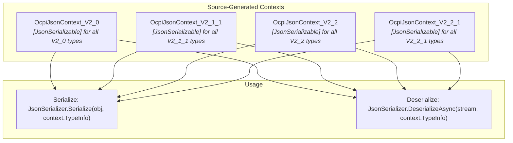
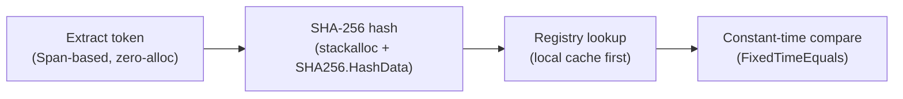
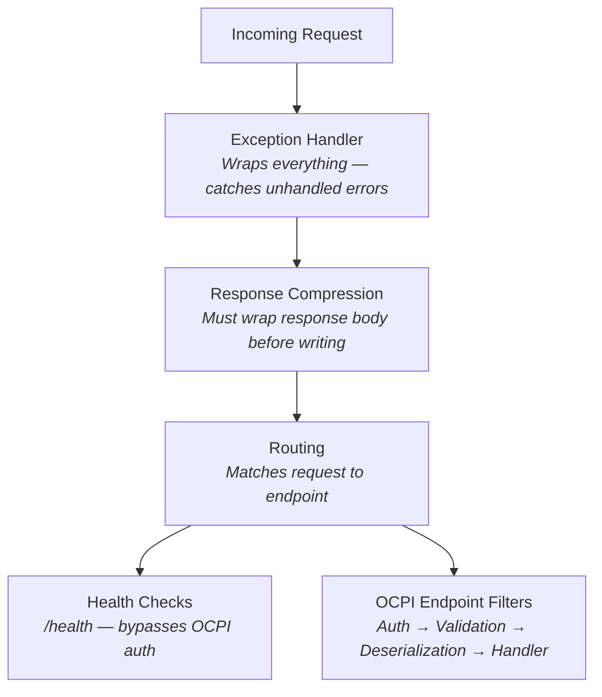

# DotOcpi Performance Strategy

Performance is a first-class concern for a protocol library. Every OCPI request passes through DotOcpi — serialization, validation, token lookup, routing — so inefficiencies compound across all connected CPOs.

## Table of Contents

- [1. JSON Serialization (Source Generation)](#1-json-serialization-source-generation)
- [2. Memory & Allocation Strategy](#2-memory--allocation-strategy)
- [3. Async Patterns](#3-async-patterns)
- [4. HTTP Client Performance](#4-http-client-performance)
- [5. Token Validation (Hot Path)](#5-token-validation-hot-path)
- [6. Lookup Table Optimization](#6-lookup-table-optimization)
- [7. ASP.NET Core Endpoint Performance](#7-aspnet-core-endpoint-performance)
- [8. Benchmarking](#8-benchmarking)
- [9. Request & Response Size Limits](#9-request--response-size-limits)
- [10. Middleware Pipeline Ordering](#10-middleware-pipeline-ordering)
- [11. Response Compression](#11-response-compression)
- [12. GC & Runtime Configuration](#12-gc--runtime-configuration)
- [13. Observability Overhead](#13-observability-overhead)

---

## 1. JSON Serialization (Source Generation)

### Design: Per-Version Source-Generated JsonSerializerContext

Every OCPI version has its own `JsonSerializerContext` with `[JsonSerializable]` attributes for all types in that version. This provides:

- **AOT compatibility** — no reflection-based serialization
- **~1.6x faster serialization**, **~2.2x faster startup**
- **~50% less memory** for serialization operations
- **Zero-allocation** collection serialization on hot paths



### Context Structure

```csharp
[JsonSourceGenerationOptions(
    PropertyNamingPolicy = JsonKnownNamingPolicy.SnakeCaseLower,
    DefaultIgnoreCondition = JsonIgnoreCondition.WhenWritingNull,
    GenerationMode = JsonSourceGenerationMode.Default)]  // Both metadata + fast-path
[JsonSerializable(typeof(OcpiResponse<Location>))]
[JsonSerializable(typeof(OcpiResponse<List<Location>>))]
[JsonSerializable(typeof(OcpiResponse<Evse>))]
[JsonSerializable(typeof(OcpiResponse<Connector>))]
[JsonSerializable(typeof(OcpiResponse<Session>))]
[JsonSerializable(typeof(OcpiResponse<List<Session>>))]
[JsonSerializable(typeof(OcpiResponse<Cdr>))]
[JsonSerializable(typeof(OcpiResponse<List<Cdr>>))]
[JsonSerializable(typeof(OcpiResponse<Token>))]
[JsonSerializable(typeof(OcpiResponse<List<Token>>))]
[JsonSerializable(typeof(OcpiResponse<Tariff>))]
[JsonSerializable(typeof(OcpiResponse<List<Tariff>>))]
[JsonSerializable(typeof(OcpiResponse<AuthorizationInfo>))]
[JsonSerializable(typeof(OcpiResponse<CommandResponse>))]
[JsonSerializable(typeof(Credentials))]
[JsonSerializable(typeof(OcpiResponse<Credentials>))]
[JsonSerializable(typeof(VersionDetail))]
[JsonSerializable(typeof(OcpiResponse<VersionDetail>))]
[JsonSerializable(typeof(List<Version>))]
[JsonSerializable(typeof(OcpiResponse<List<Version>>))]
// Commands (request bodies)
[JsonSerializable(typeof(StartSession))]
[JsonSerializable(typeof(StopSession))]
[JsonSerializable(typeof(ReserveNow))]
[JsonSerializable(typeof(UnlockConnector))]
// PATCH operations use JsonElement
[JsonSerializable(typeof(JsonElement))]
public partial class OcpiJsonContext_V2_2_1 : JsonSerializerContext { }
```

### Enum Serialization

Use the generic, AOT-safe `JsonStringEnumConverter<TEnum>`:

```csharp
[JsonConverter(typeof(JsonStringEnumConverter<ConnectorType>))]
public enum ConnectorType
{
    CHADEMO,
    IEC_62196_T1,
    IEC_62196_T1_COMBO,
    IEC_62196_T2,
    IEC_62196_T2_COMBO,
    // ...
}
```

For enums with custom OCPI string values (e.g., names that differ from C# identifiers), use custom `JsonConverter<T>` implementations — not `JsonStringEnumConverter`:

```csharp
public sealed class OcpiStatusConverter : JsonConverter<Status>
{
    public override Status Read(ref Utf8JsonReader reader, Type typeToConvert,
        JsonSerializerOptions options)
    {
        var value = reader.GetString();
        return value switch
        {
            "AVAILABLE" => Status.Available,
            "OUTOFORDER" => Status.OutOfOrder,  // No underscore in OCPI spec
            _ => throw new JsonException($"Unknown status: {value}")
        };
    }

    public override void Write(Utf8JsonWriter writer, Status value,
        JsonSerializerOptions options)
    {
        writer.WriteStringValue(value switch
        {
            Status.Available => "AVAILABLE",
            Status.OutOfOrder => "OUTOFORDER",
            _ => value.ToString().ToUpperInvariant()
        });
    }
}
```

### Options Caching

A single `JsonSerializerOptions` instance per version, created at startup and reused:

```csharp
public static class OcpiJsonOptions
{
    // Lazy-initialized, thread-safe via null-coalescing assignment
    private static JsonSerializerOptions? _v2_2_1;
    private static JsonSerializerOptions? _v2_2;
    private static JsonSerializerOptions? _v2_1_1;
    private static JsonSerializerOptions? _v2_0;

    public static JsonSerializerOptions GetOptions(OcpiVersion version) => version switch
    {
        OcpiVersion.V2_2_1 => V2_2_1,
        OcpiVersion.V2_2 => V2_2,
        OcpiVersion.V2_1_1 => V2_1_1,
        OcpiVersion.V2_0 => V2_0,
        _ => throw new ArgumentOutOfRangeException(nameof(version))
    };

    public static JsonSerializerOptions V2_2_1 => _v2_2_1 ??= CreateOptions(OcpiJsonContext_V2_2_1.Default);
    public static JsonSerializerOptions V2_2 => _v2_2 ??= CreateOptions(OcpiJsonContext_V2_2.Default);
    public static JsonSerializerOptions V2_1_1 => _v2_1_1 ??= CreateOptions(OcpiJsonContext_V2_1_1.Default);
    public static JsonSerializerOptions V2_0 => _v2_0 ??= CreateOptions(OcpiJsonContext_V2_0.Default);

    private static JsonSerializerOptions CreateOptions(JsonSerializerContext context)
    {
        var options = new JsonSerializerOptions
        {
            PropertyNamingPolicy = JsonNamingPolicy.SnakeCaseLower,
            DefaultIgnoreCondition = JsonIgnoreCondition.WhenWritingNull,
            MaxDepth = 32 // Prevent stack overflow from pathological input (Security Rule 14)
        };
        options.TypeInfoResolverChain.Add(context);
        options.Converters.Add(new OcpiDateTimeConverter());
        options.Converters.Add(new CiStringConverter());
        options.Converters.Add(new GeoLocationConverter());
        options.MakeReadOnly();
        return options;
    }
}
```

### Consumer Context Chaining

Consumers can add their own types to the resolver chain:

```csharp
// Consumer extends with their own context
builder.Services.ConfigureHttpJsonOptions(options =>
{
    options.SerializerOptions.TypeInfoResolverChain.Add(
        OcpiJsonContext_V2_2_1.Default);
    options.SerializerOptions.TypeInfoResolverChain.Add(
        MyAppJsonContext.Default);  // Consumer's own types
});
```

### Stream-Based Deserialization (Never Read to String)

```csharp
// Server-side: deserialize from request body stream (no ConfigureAwait — ASP.NET Core context)
public static async ValueTask<T?> ReadOcpiBodyAsync<T>(
    HttpRequest request,
    JsonTypeInfo<T> typeInfo,
    CancellationToken ct)
{
    return await JsonSerializer.DeserializeAsync(request.Body, typeInfo, ct);
}

// Client-side: deserialize from response stream
public static async ValueTask<OcpiResponse<T>?> ReadOcpiResponseAsync<T>(
    HttpResponseMessage response,
    JsonTypeInfo<OcpiResponse<T>> typeInfo,
    CancellationToken ct)
{
    var stream = await response.Content.ReadAsStreamAsync(ct).ConfigureAwait(false);
    return await JsonSerializer.DeserializeAsync(
        stream, typeInfo, ct).ConfigureAwait(false);
}
```

---

## 2. Memory & Allocation Strategy

### Value Types for Small Protocol Types

Use `readonly record struct` for types that are small, immutable, and frequently created:

```csharp
// Stack-allocated, no GC pressure, value semantics
public readonly record struct PartyIdentity(string CountryCode, string PartyId)
{
    public override string ToString() => $"{CountryCode}_{PartyId}";
}

public readonly record struct GeoLocation(string Latitude, string Longitude);

public readonly record struct OcpiStatusCode(int Value)
{
    public static readonly OcpiStatusCode Success = new(1000);
    public static readonly OcpiStatusCode GenericClientError = new(2000);
    public static readonly OcpiStatusCode InvalidParameters = new(2001);
    // ...

    public bool IsSuccess => Value is >= 1000 and < 2000;
}
```

### Span-Based Header Parsing

Token extraction from the Authorization header using Span-based parsing:

```csharp
public static class AuthorizationHeaderParser
{
    private const string TokenPrefix = "Token ";

    public static bool TryParse(
        ReadOnlySpan<char> headerValue,
        out string token)
    {
        token = string.Empty;

        var trimmed = headerValue.Trim();
        if (trimmed.Length <= TokenPrefix.Length)
            return false;

        if (!trimmed[..TokenPrefix.Length].Equals(
            TokenPrefix.AsSpan(), StringComparison.OrdinalIgnoreCase))
            return false;

        var tokenSpan = trimmed[TokenPrefix.Length..].Trim();
        if (tokenSpan.IsEmpty)
            return false;

        token = tokenSpan.ToString();
        return true;
    }
}
```

### ArrayPool for Temporary Buffers

```csharp
// Token hashing with rented buffers
internal static class TokenHasher
{
    public static string ComputeHash(ReadOnlySpan<char> rawToken)
    {
        int maxByteCount = Encoding.UTF8.GetMaxByteCount(rawToken.Length);
        byte[]? rented = null;
        Span<byte> utf8Bytes = maxByteCount <= 256
            ? stackalloc byte[maxByteCount]
            : (rented = ArrayPool<byte>.Shared.Rent(maxByteCount));

        try
        {
            int bytesWritten = Encoding.UTF8.GetBytes(rawToken, utf8Bytes);
            Span<byte> hash = stackalloc byte[32]; // SHA-256 output
            SHA256.HashData(utf8Bytes[..bytesWritten], hash);
            return Convert.ToHexString(hash);
        }
        finally
        {
            if (rented is not null)
                ArrayPool<byte>.Shared.Return(rented);
        }
    }
}
```

### Avoid Closure Allocations

```csharp
// BAD: Closure captures 'cpoId' — allocates closure + delegate per call
endpoints.MapGet("/locations", async (string cpoId) =>
{
    var conn = await registry.GetAsync(cpoId);
    // ...
});

// GOOD: Parameters come from route binding — no closure
endpoints.MapGet("/locations/{cpoId}",
    static async (string cpoId, ICpoRegistry registry, CancellationToken ct) =>
{
    var conn = await registry.GetAsync(cpoId, ct);
    // ...
});
```

---

## 3. Async Patterns

### ConfigureAwait(false) Everywhere in Library Code

Every `await` in the library uses `ConfigureAwait(false)` to avoid unnecessary `SynchronizationContext` capture:

```csharp
public async Task<OcpiResult<Location>> GetLocationAsync(
    string cpoId, string locationId, CancellationToken ct)
{
    // CpoConnectionContextProvider caches CpoConnection + raw token per CPO.
    // ResolveAsync returns synchronously on cache hit (ValueTask, no allocation).
    var context = await _contextProvider.ResolveAsync(cpoId, ct).ConfigureAwait(false);

    var request = OcpiHttpRequestBuilder.Build(context, HttpMethod.Get, "locations", locationId);

    var response = await _httpClient
        .SendAsync(request, ct)
        .ConfigureAwait(false);

    var body = await JsonSerializer
        .DeserializeAsync(response.Content.ReadAsStream(), typeInfo, ct)
        .ConfigureAwait(false);

    return OcpiResult<Location>.Success(body.Data);
}
```

### ValueTask for Hot Paths

Methods that frequently complete synchronously (e.g., cache hits in token validation) use `ValueTask`:

```csharp
public ValueTask<CpoConnection?> GetByTokenHashAsync(
    string tokenHash, CancellationToken ct)
{
    // Local cache hit — synchronous, no Task allocation
    if (_localCache.TryGetValue(tokenHash, out var cached))
        return new ValueTask<CpoConnection?>(cached);

    // Cache miss — async fallback
    return new ValueTask<CpoConnection?>(GetFromStoreAsync(tokenHash, ct));
}
```

### IAsyncEnumerable for Paginated Results

Streams paginated OCPI data without buffering entire result sets:

```csharp
public async IAsyncEnumerable<Location> GetAllLocationsAsyncEnumerable(
    string cpoId,
    DateTimeOffset? dateFrom = null,
    [EnumeratorCancellation] CancellationToken ct = default)
{
    string? nextUrl = BuildInitialUrl(cpoId, "locations", dateFrom);

    while (nextUrl is not null)
    {
        ct.ThrowIfCancellationRequested();

        var page = await FetchPageAsync<Location>(nextUrl, ct).ConfigureAwait(false);

        foreach (var item in page.Data)
            yield return item;

        nextUrl = page.NextPageUrl;
    }
}
```

### Cancellation Token Linking & Graceful Shutdown

Background services (pull sync, health monitoring) must link the host shutdown token with per-operation timeouts. Without linking, a running sync continues after shutdown is requested.

```csharp
public class PullSyncService(
    IOcpiClient client,
    IHostApplicationLifetime lifetime) : BackgroundService
{
    protected override async Task ExecuteAsync(CancellationToken stoppingToken)
    {
        while (!stoppingToken.IsCancellationRequested)
        {
            using var cts = CancellationTokenSource.CreateLinkedTokenSource(stoppingToken);
            cts.CancelAfter(TimeSpan.FromMinutes(5)); // per-sync timeout

            try
            {
                await SyncLocationsAsync(cts.Token).ConfigureAwait(false);
            }
            catch (OperationCanceledException) when (stoppingToken.IsCancellationRequested)
            {
                return; // host shutdown — exit gracefully
            }
            catch (OperationCanceledException)
            {
                // per-operation timeout — log and continue to next cycle
            }

            await Task.Delay(TimeSpan.FromMinutes(15), stoppingToken).ConfigureAwait(false);
        }
    }
}
```

---

## 4. HTTP Client Performance

### Connection Pooling Configuration

```csharp
services.AddHttpClient("OcpiClient")
    .ConfigurePrimaryHttpMessageHandler(() => new SocketsHttpHandler
    {
        PooledConnectionLifetime = TimeSpan.FromMinutes(5),    // Force DNS refresh
        PooledConnectionIdleTimeout = TimeSpan.FromMinutes(2), // Clean up idle connections
        MaxConnectionsPerServer = 20,                           // Per CPO host
        EnableMultipleHttp2Connections = true                   // Scale beyond stream limit
    });
```

### Connection Context Caching

Module clients resolve CPO connection metadata and auth tokens through `CpoConnectionContextProvider`, which caches the result per CPO in a `ConcurrentDictionary`. This eliminates 2 registry lookups + 1 token fetch on every outbound call. The cache is invalidated automatically after registration, credential rotation, and unregistration operations. Consumers who modify the registry or rotate tokens outside the library call `IOcpiClient.InvalidateConnection(cpoId)` or `InvalidateAllConnections()`.

### HTTP/2 for Multiplexing

```csharp
services.AddHttpClient("OcpiClient", client =>
{
    client.DefaultRequestVersion = HttpVersion.Version20;
    client.DefaultVersionPolicy = HttpVersionPolicy.RequestVersionOrLower;
});
```

### Stream-Based Request/Response

```csharp
// Send: serialize directly to request content stream
public static HttpContent CreateJsonContent<T>(T value, JsonTypeInfo<T> typeInfo)
{
    return JsonContent.Create(value, typeInfo);
    // JsonContent streams serialization — no intermediate string/byte[]
}

// Receive: deserialize directly from response stream
public static async ValueTask<T?> ReadResponseAsync<T>(
    HttpResponseMessage response,
    JsonTypeInfo<T> typeInfo,
    CancellationToken ct)
{
    // ReadAsStream — synchronous, no buffering
    // DeserializeAsync — reads from stream directly
    await using var stream = response.Content.ReadAsStream();
    return await JsonSerializer.DeserializeAsync(stream, typeInfo, ct)
        .ConfigureAwait(false);
}
```

### Streaming Large Responses

When pulling paginated data from CPOs, use `HttpCompletionOption.ResponseHeadersRead` to begin deserialization as soon as headers arrive. The default `ResponseContentRead` buffers the entire response body first, defeating stream-based deserialization:

```csharp
public async ValueTask<OcpiResponse<List<Location>>?> PullLocationsPageAsync(
    string url, CancellationToken ct)
{
    using var request = new HttpRequestMessage(HttpMethod.Get, url);
    // Start reading as soon as headers arrive — don't buffer body
    using var response = await _httpClient
        .SendAsync(request, HttpCompletionOption.ResponseHeadersRead, ct)
        .ConfigureAwait(false);

    response.EnsureSuccessStatusCode();

    await using var stream = await response.Content.ReadAsStreamAsync(ct)
        .ConfigureAwait(false);
    return await JsonSerializer.DeserializeAsync(
        stream, OcpiJsonContext_V2_2_1.Default.OcpiResponseListLocation, ct)
        .ConfigureAwait(false);
}
```

---

## 5. Token Validation (Hot Path)

Token validation runs on every inbound request. It must be as fast as possible.



### Optimized Implementation

```csharp
internal sealed class TokenValidator
{
    private readonly ICpoRegistry _registry;

    public async ValueTask<TokenValidationResult> ValidateAsync(
        StringValues authHeader, CancellationToken ct)
    {
        // 1. Span-based extraction (zero allocation)
        if (!AuthorizationHeaderParser.TryParse(authHeader[0].AsSpan(), out var rawToken))
            return TokenValidationResult.Missing;

        // 2. Hash with stackalloc (zero allocation for small tokens)
        var tokenHash = TokenHasher.ComputeHash(rawToken);

        // 3. Local cache lookup first (ValueTask, sync path)
        var connection = await _registry
            .GetByTokenHashAsync(tokenHash, ct)
            .ConfigureAwait(false);

        if (connection is null)
            return TokenValidationResult.Invalid;

        // 4. Constant-time comparison (timing-attack resistant)
        var storedHash = Convert.FromHexString(connection.TokenBHash);
        var incomingHash = Convert.FromHexString(tokenHash);

        if (!CryptographicOperations.FixedTimeEquals(storedHash, incomingHash))
            return TokenValidationResult.Invalid;

        return new TokenValidationResult(connection);
    }
}
```

---

## 6. Lookup Table Optimization

### FrozenDictionary for Static Lookups

Module maps, version strings, and status code descriptions are immutable after startup. With net8.0 as the minimum target, `FrozenDictionary` and `FrozenSet` are always available:

```csharp
using System.Collections.Frozen;

internal static class OcpiConstants
{
    public static readonly FrozenDictionary<string, ModuleId> ModuleIdMap =
        new Dictionary<string, ModuleId>(StringComparer.OrdinalIgnoreCase)
        {
            ["cdrs"] = ModuleId.Cdrs,
            ["chargingprofiles"] = ModuleId.ChargingProfiles,
            ["commands"] = ModuleId.Commands,
            ["credentials"] = ModuleId.Credentials,
            ["locations"] = ModuleId.Locations,
            ["sessions"] = ModuleId.Sessions,
            ["tariffs"] = ModuleId.Tariffs,
            ["tokens"] = ModuleId.Tokens,
        }.ToFrozenDictionary();

    public static readonly FrozenDictionary<OcpiVersion, string> VersionUrls =
        new Dictionary<OcpiVersion, string>
        {
            [OcpiVersion.V2_0] = "2.0",
            [OcpiVersion.V2_1_1] = "2.1.1",
            [OcpiVersion.V2_2] = "2.2",
            [OcpiVersion.V2_2_1] = "2.2.1",
        }.ToFrozenDictionary();

    public static readonly FrozenSet<string> SupportedVersionStrings =
        new[] { "2.0", "2.1.1", "2.2", "2.2.1" }
            .ToFrozenSet(StringComparer.Ordinal);
}
```

FrozenDictionary provides **2.5–3.5x faster reads** than Dictionary for these static lookup tables.

---

## 7. ASP.NET Core Endpoint Performance

### Direct TypeInfo Serialization

```csharp
internal static class LocationsEndpoints
{
    public static async Task<IResult> HandlePut(
        HttpContext httpContext,
        string countryCode,
        string partyId,
        string locationId,
        ILocationsReceiver receiver,
        ICpoRegistry registry,
        CancellationToken ct)
    {
        var context = httpContext.GetOcpiContext(); // Extension method, cached in HttpContext.Items
        var version = context.Connection.NegotiatedVersion;

        // Deserialize using version-specific TypeInfo (source-gen)
        var typeInfo = OcpiTypeInfoResolver.GetLocationTypeInfo(version);
        var location = await JsonSerializer.DeserializeAsync(
            httpContext.Request.Body, typeInfo, ct);

        // Process...
        var result = await receiver.OnLocationPutAsync(context, locationId, location, ct);

        // Serialize response using source-gen
        var responseTypeInfo = OcpiTypeInfoResolver.GetResponseTypeInfo(version);
        return Results.Json(result.ToResponse(), responseTypeInfo);
    }
}
```

### IParsable for Route Parameters

```csharp
public readonly record struct CountryCode : IParsable<CountryCode>
{
    public string Value { get; }

    private CountryCode(string value) => Value = value;

    public static CountryCode Parse(string s, IFormatProvider? provider) =>
        TryParse(s, provider, out var result)
            ? result
            : throw new FormatException($"Invalid country code: {s}");

    public static bool TryParse(string? s, IFormatProvider? provider, out CountryCode result)
    {
        if (s is { Length: 2 })
        {
            result = new CountryCode(s.ToUpperInvariant());
            return true;
        }
        result = default;
        return false;
    }
}

// Route binding with automatic validation
endpoints.MapPut("/locations/{country}/{partyId}/{locationId}",
    static async (CountryCode country, string partyId, string locationId, ...) =>
    {
        // 'country' is already validated and parsed
    });
```

---

## 8. Benchmarking

### Project Setup

```
benchmarks/
└── DotOcpi.Benchmarks/
    ├── DotOcpi.Benchmarks.csproj
    ├── Program.cs
    ├── SerializationBenchmarks.cs
    ├── TokenBenchmarks.cs
    └── RegistryBenchmarks.cs
```

### Multi-Framework Benchmarks

```csharp
[SimpleJob(RuntimeMoniker.Net80, baseline: true)]
[SimpleJob(RuntimeMoniker.Net100)]
[MemoryDiagnoser]
[ThreadingDiagnoser]
public class SerializationBenchmarks
{
    private Location_V2_2_1 _location = null!;
    private string _json = null!;
    private byte[] _jsonBytes = null!;

    [GlobalSetup]
    public void Setup()
    {
        _location = TestData.CreateLocation();
        _json = JsonSerializer.Serialize(_location, OcpiJsonContext_V2_2_1.Default.Location);
        _jsonBytes = Encoding.UTF8.GetBytes(_json);
    }

    [Benchmark(Baseline = true)]
    public string Serialize_SourceGen() =>
        JsonSerializer.Serialize(_location, OcpiJsonContext_V2_2_1.Default.Location);

    [Benchmark]
    public Location_V2_2_1? Deserialize_SourceGen() =>
        JsonSerializer.Deserialize(_jsonBytes, OcpiJsonContext_V2_2_1.Default.Location);

    [Benchmark]
    public string Serialize_Reflection() =>
        JsonSerializer.Serialize(_location, _reflectionOptions);

    [Benchmark]
    public Location_V2_2_1? Deserialize_Reflection() =>
        JsonSerializer.Deserialize<Location_V2_2_1>(_json, _reflectionOptions);
}
```

### Key Metrics to Track

| Benchmark | Target | Metric |
|---|---|---|
| Token validation | < 1 μs (cache hit) | Mean time, zero allocations |
| Location serialization | < 200 ns | Mean time vs reflection baseline |
| Registry lookup (by token hash) | < 100 ns (local cache) | Mean time, zero allocations |
| OCPI response envelope creation | Zero allocations | Allocated bytes |
| Pagination (100 items) | < 50 μs | Mean time, minimal allocations |

### Statistical Rigor

- Use `[WarmupCount(3)]` and `[IterationCount(15)]` minimum for stable results
- Add `[ThreadingDiagnoser]` alongside `[MemoryDiagnoser]` to detect lock contention in concurrent token validation
- Reject benchmark results with relative standard deviation > 5% — re-run with fewer background processes
- Use `--statisticalTest 5%` in CI to detect regressions: `dotnet run -c Release -- --statisticalTest 5% --artifacts ./benchmark-results`
- Preserve `--artifacts` output for cross-run regression comparison
- Pin benchmarks to a single CPU core on CI runners to reduce context-switch noise (`taskset` on Linux, `start /affinity` on Windows)

### Performance Rules

1. **No per-request allocations** for auth middleware, token extraction, hash computation (on cache hit path)
2. **Source-gen JSON** for all serialization — never fall back to reflection in production
3. **ConfigureAwait(false)** on every await in library code
4. **ValueTask** for methods with frequent synchronous completion
5. **FrozenDictionary** for all static lookup tables
6. **Stream-based** JSON read/write — never buffer to string
7. **stackalloc** for SHA-256 output and small temporary buffers
8. **readonly record struct** for small value types (PartyIdentity, GeoLocation, OcpiStatusCode)
9. **Static lambdas** in endpoint handlers — no closures on hot paths
10. **Reuse JsonSerializerOptions** — one cached instance per OCPI version

---

## 9. Request & Response Size Limits

Unbounded request bodies are a DoS vector. A CPO could send a multi-gigabyte payload to exhaust memory. Enforce limits at both Kestrel and endpoint levels.

### Kestrel Global Limit

```csharp
builder.WebHost.ConfigureKestrel(options =>
{
    options.Limits.MaxRequestBodySize = 1 * 1024 * 1024; // 1 MB global ceiling
});
```

### Per-Endpoint Limits

OCPI endpoints have predictable payload sizes. Apply tighter limits per category:

| Endpoint Category | Max Body Size | Rationale |
|---|---|---|
| PUT Location/Session/Token/Tariff | 256 KB | Single object; largest is Location with many EVSEs |
| POST CDR | 1 MB | CDR with detailed charging periods and signed data |
| PATCH (any) | 64 KB | Partial update — should be small |
| POST /credentials | 16 KB | Credentials object is small |
| POST /authorize | 8 KB | Token UID + LocationReferences |
| POST command callback | 16 KB | CommandResult is small |

```csharp
internal sealed class OcpiBodySizeLimitFilter(long maxBytes) : IEndpointFilter
{
    public async ValueTask<object?> InvokeAsync(
        EndpointFilterInvocationContext context,
        EndpointFilterDelegate next)
    {
        var feature = context.HttpContext.Features.Get<IHttpMaxRequestBodySizeFeature>();
        if (feature is { IsReadOnly: false })
            feature.MaxRequestBodySize = maxBytes;

        return await next(context);
    }
}

// Registration
group.MapPut("/locations/{countryCode}/{partyId}/{locationId}", HandlePut)
    .AddEndpointFilter(new OcpiBodySizeLimitFilter(256 * 1024));
```

---

## 10. Middleware Pipeline Ordering

Middleware order determines when expensive operations run — and whether they run at all on rejected requests.



### Consumer Pipeline Example

```csharp
var app = builder.Build();

app.UseExceptionHandler();           // Outermost — catches everything
app.UseOcpiExceptionHandler();       // OCPI-aware error envelope (3xxx responses)
app.UseResponseCompression();        // Before any body is written
app.UseRouting();

app.MapHealthChecks("/health");      // No OCPI auth — infra-only
app.MapOcpiEndpoints();              // OCPI auth applied via endpoint filters (fail fast)
```

Key insights:
- OCPI auth runs as **endpoint filters**, not middleware — it executes after routing selects the endpoint but before the handler. This means unmatched routes never trigger token validation.
- Health checks are mapped before OCPI endpoints and do not inherit OCPI auth filters.
- Response compression wraps the response stream before endpoint execution, so it compresses the OCPI JSON output transparently.

---

## 11. Response Compression

Paginated GET responses (locations, sessions, CDRs, tariffs) can be large. Compression reduces transfer size significantly for JSON payloads.

```csharp
builder.Services.AddResponseCompression(options =>
{
    options.EnableForHttps = true; // OCPI is HTTPS-only
    options.Providers.Add<BrotliCompressionProvider>();
    options.Providers.Add<GzipCompressionProvider>();
    // application/json is included in ResponseCompressionDefaults.MimeTypes by default
});

builder.Services.Configure<BrotliCompressionProviderOptions>(options =>
{
    options.Level = CompressionLevel.Fastest; // Latency over ratio for API responses
});
```

When to compress vs. skip:
- **Compress**: GET list endpoints returning paginated data (typically 1-100 KB+)
- **Skip**: Single-object response envelopes (PUT/POST responses, typically <1 KB) — compression overhead exceeds savings below ~860 bytes (a single TCP segment)
- The `Content-Length` header is unavailable when compression is active; OCPI `X-Total-Count` and `X-Limit` headers are unaffected since they describe item counts, not byte sizes

---

## 12. GC & Runtime Configuration

Production guidance for consumers deploying eMSP services with DotOcpi. The library itself does not configure GC — these are host-level settings.

### Server GC

Concurrent CPO connections benefit from Server GC, which allocates a separate managed heap per logical processor and collects on dedicated GC threads, reducing pause times on request-processing threads:

```xml
<!-- Consumer's .csproj or runtimeconfig.template.json -->
<PropertyGroup>
    <ServerGarbageCollection>true</ServerGarbageCollection>
    <ConcurrentGarbageCollection>true</ConcurrentGarbageCollection>
</PropertyGroup>
```

### Large Object Heap (LOH) Avoidance

Objects >= 85 KB are allocated on the LOH, which is only collected during Gen2 (expensive). OCPI payloads for large location lists with many EVSEs can exceed this threshold if buffered.

Mitigations already in the library:
- **Stream-based serialization** (Section 1) — never materializes entire response as a single byte[]
- **IAsyncEnumerable pagination** (Section 3) — yields items without buffering the full collection
- **ArrayPool** (Section 2) — rents and returns buffers instead of allocating

If consumers buffer responses (e.g., for caching), they should use `RecyclableMemoryStream` from `Microsoft.IO.RecyclableMemoryStream` to avoid LOH allocations.

### Latency-Sensitive Endpoints

The real-time authorize endpoint (`POST /tokens/{token_uid}/authorize`) is latency-critical — CPOs expect a response within seconds. Consider:

```csharp
// Set once at startup — LatencyMode is process-global and not thread-safe.
// Do NOT set/restore per-request; concurrent requests will race on the value.
GCSettings.LatencyMode = GCLatencyMode.SustainedLowLatency;
```

Use sparingly — this suppresses Gen2 collections and increases memory usage. Only appropriate when the entire service is latency-sensitive (e.g., a dedicated authorize microservice). For general-purpose eMSP services handling mixed workloads, the default `Interactive` mode is preferred.

---

## 13. Observability Overhead

DotOcpi uses `System.Diagnostics.ActivitySource` for distributed tracing and `System.Diagnostics.Metrics` for counters/histograms. Both are designed for zero-cost-when-disabled.

### Tracing Cost

| Scenario | Cost per request | Allocation |
|---|---|---|
| No listener attached | ~0 ns | 0 bytes (`StartActivity` returns `null`) |
| Listener attached, sampled out | ~20 ns | 0 bytes |
| Listener attached, sampled in | ~100 ns | ~50 bytes per span |

The library checks `ActivitySource.HasListeners()` before constructing tag values, avoiding string formatting when tracing is disabled.

### Metrics Cost

`Counter<T>.Add()` and `Histogram<T>.Record()` cost ~10 ns regardless of whether a listener is attached. This is negligible per-request.

### Sampling Guidance

The library does not impose sampling — consumers configure via their OpenTelemetry pipeline:

```csharp
builder.Services.AddOpenTelemetry()
    .WithTracing(tracing => tracing
        .AddSource("DotOcpi")
        .SetSampler(new TraceIdRatioBasedSampler(0.1))); // 10% in production
```

For development: use 100% sampling. For production: 1-10% head-based sampling keeps overhead negligible while providing sufficient data for debugging.

See [strategies.md — Observability Strategy](strategies.md#8-observability-strategy) for the full instrumentation design.
