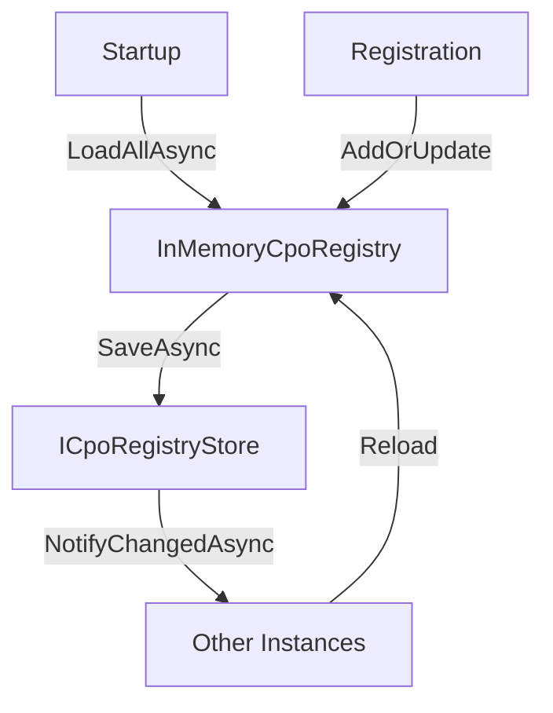

# Custom Registry Store
{: .no_toc }

## Table of contents
{: .no_toc .text-delta }

1. TOC
{:toc}

---

## Why Custom?

The built-in `InMemoryCpoRegistry` loses all CPO connections on restart. For production, implement `ICpoRegistryStore` to persist connections across deployments.

## ICpoRegistryStore Interface

```csharp
public interface ICpoRegistryStore
{
    Task<IReadOnlyList<CpoConnection>> LoadAllAsync(CancellationToken ct);
    Task SaveAsync(CpoConnection connection, CancellationToken ct);
    Task RemoveAsync(string connectionKey, CancellationToken ct);
}
```

At startup, DotOcpi calls `LoadAllAsync()` to populate the in-memory registry from your persistent store.

## Example: Entity Framework Core

```csharp
public class EfCpoRegistryStore : ICpoRegistryStore
{
    private readonly IDbContextFactory<OcpiDbContext> _dbFactory;

    public EfCpoRegistryStore(IDbContextFactory<OcpiDbContext> dbFactory)
        => _dbFactory = dbFactory;

    public async Task<IReadOnlyList<CpoConnection>> LoadAllAsync(CancellationToken ct)
    {
        await using var db = await _dbFactory.CreateDbContextAsync(ct);
        return await db.CpoConnections
            .AsNoTracking()
            .Select(e => MapToConnection(e))
            .ToListAsync(ct);
    }

    public async Task SaveAsync(CpoConnection connection, CancellationToken ct)
    {
        await using var db = await _dbFactory.CreateDbContextAsync(ct);

        var entity = await db.CpoConnections
            .FindAsync([connection.ConnectionKey], ct);

        if (entity is null)
        {
            entity = MapToEntity(connection);
            db.CpoConnections.Add(entity);
        }
        else
        {
            UpdateEntity(entity, connection);
        }

        await db.SaveChangesAsync(ct);
    }

    public async Task RemoveAsync(string connectionKey, CancellationToken ct)
    {
        await using var db = await _dbFactory.CreateDbContextAsync(ct);
        var entity = await db.CpoConnections.FindAsync([connectionKey], ct);
        if (entity is not null)
        {
            db.CpoConnections.Remove(entity);
            await db.SaveChangesAsync(ct);
        }
    }
}
```

### Entity Model

```csharp
public class CpoConnectionEntity
{
    public string ConnectionKey { get; set; } = "";
    public string CpoCountryCode { get; set; } = "";
    public string CpoPartyId { get; set; } = "";
    public string EmspCountryCode { get; set; } = "";
    public string EmspPartyId { get; set; } = "";
    public string Version { get; set; } = "";
    public string ModuleEndpointsJson { get; set; } = "{}";
    public string TokenBHash { get; set; } = "";
    public string Status { get; set; } = "";
    public DateTimeOffset CreatedAt { get; set; }
    public DateTimeOffset UpdatedAt { get; set; }
    public long ConcurrencyVersion { get; set; }
}
```

## Registration

```csharp
builder.Services.AddDotOcpi(options => { /* ... */ })
    .AddCpoRegistryStore<EfCpoRegistryStore>();
```

## Multi-Instance Deployments

When running multiple application instances, you need cache invalidation to keep in-memory registries in sync.

### Implement ICacheInvalidationNotifier

```csharp
public class RedisCacheNotifier : ICacheInvalidationNotifier
{
    private readonly IConnectionMultiplexer _redis;

    public RedisCacheNotifier(IConnectionMultiplexer redis) => _redis = redis;

    public async Task NotifyChangedAsync(string connectionKey, CancellationToken ct)
    {
        var sub = _redis.GetSubscriber();
        await sub.PublishAsync("ocpi:registry:changed", connectionKey);
    }

    public async Task NotifyRemovedAsync(string connectionKey, CancellationToken ct)
    {
        var sub = _redis.GetSubscriber();
        await sub.PublishAsync("ocpi:registry:removed", connectionKey);
    }
}

// Register
builder.Services.AddSingleton<ICacheInvalidationNotifier, RedisCacheNotifier>();
```

### Implement IDistributedLockProvider

Prevent concurrent registration handshakes across instances:

```csharp
public class RedisLockProvider : IDistributedLockProvider
{
    private readonly IConnectionMultiplexer _redis;

    public RedisLockProvider(IConnectionMultiplexer redis) => _redis = redis;

    public async Task<IAsyncDisposable> AcquireAsync(
        string resourceKey, TimeSpan timeout, CancellationToken ct)
    {
        var db = _redis.GetDatabase();
        var lockKey = $"ocpi:lock:{resourceKey}";
        var lockValue = Guid.NewGuid().ToString();

        var acquired = await db.StringSetAsync(lockKey, lockValue, timeout, When.NotExists);
        if (!acquired)
            throw new InvalidOperationException($"Could not acquire lock for {resourceKey}");

        return new RedisLock(db, lockKey, lockValue);
    }
}
```

## Data Flow



1. On startup, `LoadAllAsync()` populates the in-memory cache
2. Registration adds/updates the in-memory registry
3. Changes are written through to `ICpoRegistryStore`
4. `ICacheInvalidationNotifier` tells other instances to reload
5. Other instances refresh their in-memory cache
