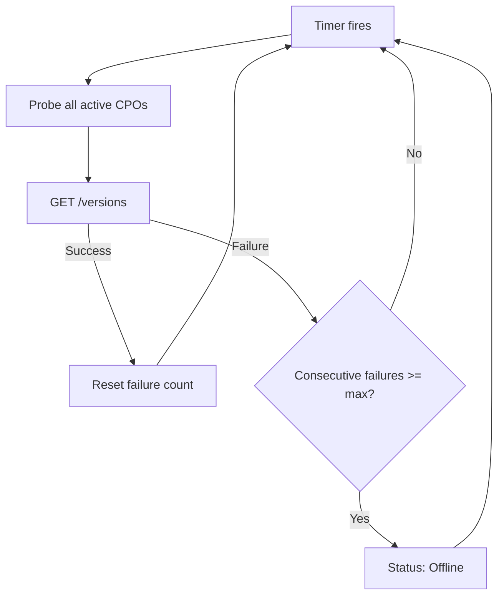

# Health Checks
{: .no_toc }

## Table of contents
{: .no_toc .text-delta }

1. TOC
{:toc}

---

## Overview

DotOcpi provides ASP.NET Core health checks to monitor your OCPI infrastructure.

## Available Health Checks

### OcpiRegistryHealthCheck

Monitors the overall state of the CPO registry and reports per-CPO status details:

```csharp
builder.Services.AddHealthChecks()
    .AddOcpiRegistryHealthCheck();
```

| Status | Condition |
|:-------|:----------|
| Healthy | All active CPOs are `Connected` |
| Degraded | Some CPOs are `Offline` |
| Unhealthy | All CPOs are `Offline` or no CPOs registered |

The response includes per-CPO data with status, version, and last health check time:

```json
{
  "status": "Degraded",
  "description": "2/3 CPO connections are active.",
  "data": {
    "DE:ALL": { "status": "Connected", "version": "2.2.1", "lastHealthCheck": "2026-03-24T10:00:00Z" },
    "NL:CPO": { "status": "Offline", "version": "2.1.1", "lastHealthCheck": "2026-03-24T09:55:00Z" },
    "FR:EDF": { "status": "Connected", "version": "2.2.1", "lastHealthCheck": "2026-03-24T10:00:00Z" }
  }
}
```

### OcpiTokenStoreHealthCheck

Verifies the token store is operational:

```csharp
builder.Services.AddHealthChecks()
    .AddOcpiTokenStoreHealthCheck();
```

### OcpiCpoHealthCheck

Checks a specific CPO connection with detailed status data (connection key, version, party identity, last health check time, versions URL):

```csharp
builder.Services.AddHealthChecks()
    .AddOcpiCpoHealthCheck("DE:CPO");
```

## Full Setup

```csharp
builder.Services.AddHealthChecks()
    .AddOcpiRegistryHealthCheck(
        tags: ["ocpi", "ready"])
    .AddOcpiTokenStoreHealthCheck(
        tags: ["ocpi", "ready"]);

var app = builder.Build();

app.MapHealthChecks("/health/live", new HealthCheckOptions
{
    Predicate = _ => false // Just checks the app is running
});

app.MapHealthChecks("/health/ready", new HealthCheckOptions
{
    Predicate = check => check.Tags.Contains("ready")
});
```

## Background Health Monitoring

`CpoHealthMonitor` is registered automatically by `AddAspNetCoreServer()` and respects `EnableHealthMonitoring` (default: `true`). Set to `false` to disable background probing.

```csharp
builder.Services.AddDotOcpi(options =>
{
    options.EnableHealthMonitoring = true;
    options.HealthMonitoringInterval = TimeSpan.FromMinutes(5);
    options.StaleConnectionThreshold = TimeSpan.FromHours(24);
});
```

The `CpoHealthMonitor` background service:

1. Every `HealthMonitoringInterval`, probes all non-pending/non-unregistered CPO connections
2. Sends a `GET /versions` probe to the CPO's versions endpoint
3. After `maxConsecutiveFailures` (default: 3) consecutive failures, marks the connection as `Offline`
4. If a previously offline CPO responds, marks it as `Connected`
5. Logs a cycle summary: total checked, healthy, failed, restored, marked offline


