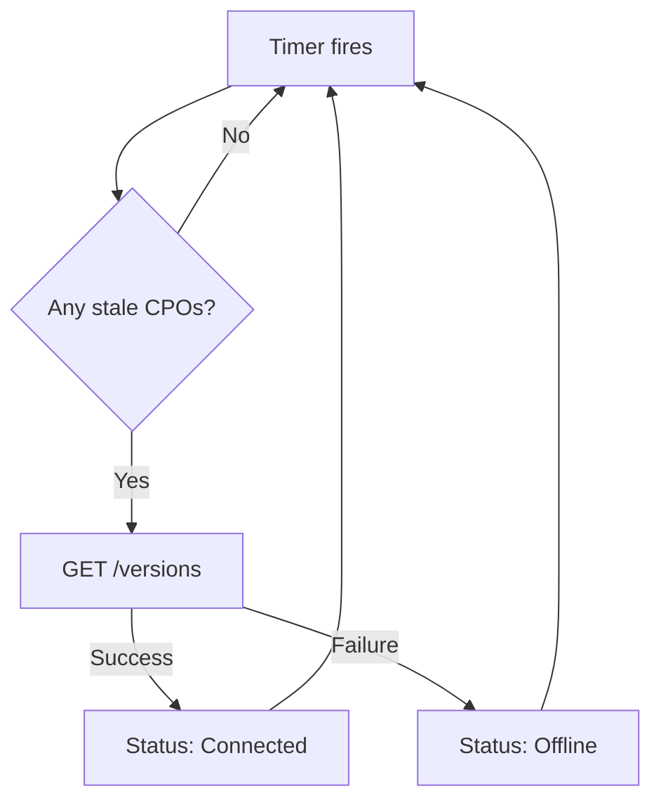

# Health Checks
{: .no_toc }

## Table of contents
{: .no_toc .text-delta }

1. TOC
{:toc}

---

## Overview

DotOcpi provides ASP.NET Core health checks to monitor your OCPI infrastructure.

## Available Health Checks

### OcpiRegistryHealthCheck

Monitors the overall state of the CPO registry:

```csharp
builder.Services.AddHealthChecks()
    .AddCheck<OcpiRegistryHealthCheck>("ocpi-registry");
```

| Status | Condition |
|:-------|:----------|
| Healthy | At least one CPO is `Connected` |
| Degraded | Some CPOs are `Offline` |
| Unhealthy | All CPOs are `Offline` or no CPOs registered |

### OcpiTokenStoreHealthCheck

Verifies the token store is operational:

```csharp
builder.Services.AddHealthChecks()
    .AddCheck<OcpiTokenStoreHealthCheck>("ocpi-token-store");
```

### OcpiCpoHealthCheck

Checks a specific CPO connection:

```csharp
builder.Services.AddHealthChecks()
    .AddCheck<OcpiCpoHealthCheck>("ocpi-cpo-DE:CPO");
```

## Full Setup

```csharp
builder.Services.AddHealthChecks()
    .AddCheck<OcpiRegistryHealthCheck>("ocpi-registry",
        tags: ["ocpi", "ready"])
    .AddCheck<OcpiTokenStoreHealthCheck>("ocpi-token-store",
        tags: ["ocpi", "ready"]);

var app = builder.Build();

app.MapHealthChecks("/health/live", new HealthCheckOptions
{
    Predicate = _ => false // Just checks the app is running
});

app.MapHealthChecks("/health/ready", new HealthCheckOptions
{
    Predicate = check => check.Tags.Contains("ready")
});
```

## Background Health Monitoring

DotOcpi can automatically probe stale CPO connections:

```csharp
builder.Services.AddDotOcpi(options =>
{
    options.EnableHealthMonitoring = true;
    options.HealthMonitoringInterval = TimeSpan.FromMinutes(5);
    options.StaleConnectionThreshold = TimeSpan.FromHours(24);
});
```

The `CpoHealthMonitor` background service:

1. Every `HealthMonitoringInterval`, checks for CPOs with no activity for `StaleConnectionThreshold`
2. Sends a `GET /versions` probe to the CPO
3. If the probe fails, marks the connection as `Offline`
4. If a previously offline CPO responds, marks it as `Connected`


