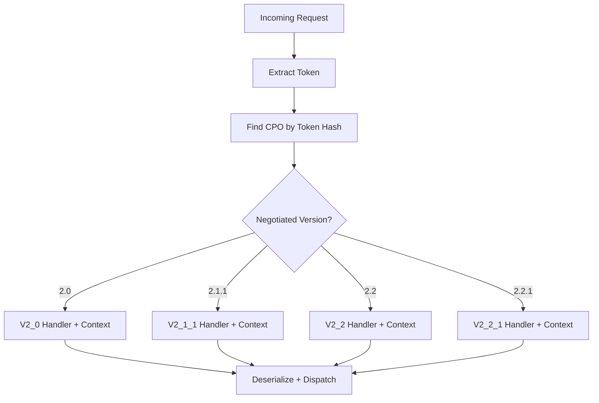

# Version Strategy
{: .no_toc }

## Table of contents
{: .no_toc .text-delta }

1. TOC
{:toc}

---

## Separate Models, Shared Infrastructure

DotOcpi's version strategy has two layers:

1. **Version-specific:** Models, serialization contexts, enum values
2. **Shared:** HTTP pipeline, auth, token management, registry, result types

```
┌──────────────────────────────────────────────────┐
│                 Shared Infrastructure             │
│  Auth │ Registry │ Token Mgmt │ Results │ HTTP   │
├──────────┬──────────┬──────────┬─────────────────┤
│  V2.0    │  V2.1.1  │  V2.2    │  V2.2.1         │
│  Models  │  Models  │  Models  │  Models          │
│  Context │  Context │  Context │  Context         │
│  Enums   │  Enums   │  Enums   │  Enums           │
└──────────┴──────────┴──────────┴─────────────────┘
```

## Version Namespaces

```
DotOcpi.Models.V2_0/
    Location.cs, Evse.cs, Connector.cs
    Session.cs, Cdr.cs, Tariff.cs
    Token.cs, Credentials.cs
    Enums/

DotOcpi.Models.V2_1_1/
    Location.cs, Evse.cs, Connector.cs, EnergyMix.cs
    Session.cs, Cdr.cs, Tariff.cs
    Token.cs, Credentials.cs
    Enums/

DotOcpi.Models.V2_2/
    Location.cs, Evse.cs, Connector.cs, EnergyMix.cs
    Session.cs, Cdr.cs, CdrLocation.cs, Tariff.cs
    Token.cs, Credentials.cs, CredentialsRole.cs
    ChargingProfile.cs
    Enums/

DotOcpi.Models.V2_2_1/
    Location.cs, Evse.cs, Connector.cs, EnergyMix.cs
    Session.cs, Cdr.cs, CdrLocation.cs, SignedData.cs, Tariff.cs
    Token.cs, Credentials.cs, CredentialsRole.cs
    ChargingProfile.cs
    Enums/
```

## Key Differences Between Versions

### URL Patterns

| Version | Pattern | Example |
|:--------|:--------|:--------|
| 2.0 | `/{module}/{id}` | `/locations/LOC001` |
| 2.1.1 | `/{module}/{id}` | `/locations/LOC001` |
| 2.2 | `/{module}/{cc}/{pid}/{id}` | `/locations/DE/CPO/LOC001` |
| 2.2.1 | `/{module}/{cc}/{pid}/{id}` | `/locations/DE/CPO/LOC001` |

### Credentials Structure

**2.0 / 2.1.1 (flat):**
```json
{
  "token": "abc...",
  "url": "https://emsp.com/ocpi/versions",
  "business_details": { "name": "eMSP" },
  "party_id": "MSP",
  "country_code": "NL"
}
```

**2.2 / 2.2.1 (roles array):**
```json
{
  "token": "abc...",
  "url": "https://emsp.com/ocpi/versions",
  "roles": [{
    "role": "EMSP",
    "business_details": { "name": "eMSP" },
    "party_id": "MSP",
    "country_code": "NL"
  }]
}
```

### Module Availability

| Module | 2.0 | 2.1.1 | 2.2 | 2.2.1 |
|:-------|:----|:------|:----|:------|
| Locations | Yes | Yes | Yes | Yes |
| Sessions | Yes | Yes | Yes | Yes |
| CDRs | Yes | Yes | Yes | Yes |
| Tariffs | Yes | Yes | Yes | Yes |
| Tokens | Yes | Yes | Yes | Yes |
| Commands | - | Yes | Yes | Yes |
| ChargingProfiles | - | - | Yes | Yes |

### Field Differences

| Field | 2.0 | 2.1.1 | 2.2 | 2.2.1 |
|:------|:----|:------|:----|:------|
| `last_updated` | - | Yes | Yes | Yes |
| `publish` (Location) | - | - | Yes | Yes |
| `energy_mix` (Location) | - | Yes | Yes | Yes |
| `time_zone` (Location) | - | - | Yes | Yes |
| Token ID | `auth_id` | `auth_id` | `contract_id` | `contract_id` |
| CDR end time | `stop_date_time` | `stop_date_time` | `end_date_time` | `end_date_time` |
| Session location | Embedded | Embedded | `location_id` | `location_id` |
| Tariff PATCH | Yes | Yes | No (405) | No (405) |
| `CancelReservation` | - | - | - | Yes |

## Version Selection at Runtime



## Serialization Contexts

Each version has a dedicated `JsonSerializerContext`:

```csharp
// Source-generated at compile time
[JsonSerializable(typeof(Location))]
[JsonSerializable(typeof(Evse))]
// ... all types for this version
internal partial class OcpiJsonContext_V2_2_1 : JsonSerializerContext { }

// Cached options lookup
var options = OcpiJsonOptions.GetOptions(OcpiVersion.V2_2_1);
```

Properties:
- Snake_case naming policy
- UTC RFC 3339 DateTime format
- OCPI enum string values
- `null` values ignored in serialization
- Max depth: 32

## Version Negotiation Algorithm

```
1. eMSP: GET /versions → CPO responds with supported versions
2. Find intersection of eMSP and CPO versions
3. Remove deprecated versions (2.1, 2.2) if non-deprecated alternatives exist:
   - If both 2.1 and 2.1.1 → remove 2.1
   - If both 2.2 and 2.2.1 → remove 2.2
4. Select highest remaining version
5. If no intersection → OcpiRegistrationException
```

Example:
- eMSP supports: 2.2.1, 2.1.1
- CPO supports: 2.2.1, 2.2, 2.0
- Intersection: 2.2.1
- Result: **2.2.1**

Example 2:
- eMSP supports: 2.2.1, 2.1.1
- CPO supports: 2.1.1, 2.0
- Intersection: 2.1.1
- Result: **2.1.1**
