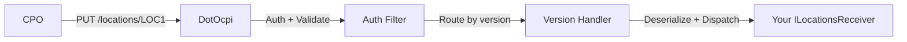

# Receiving Data from CPOs
{: .no_toc }

## Table of contents
{: .no_toc .text-delta }

1. TOC
{:toc}

---

## Overview

In the OCPI protocol, CPOs **push** data to your eMSP. When a CPO creates or updates a location, starts a session, or generates a CDR, it sends the data to your endpoints. DotOcpi routes these pushes to your module handler implementations.

## How It Works



1. CPO sends a PUT/PATCH/POST request to your OCPI endpoint
2. DotOcpi authenticates the request (Token B verification)
3. The version handler deserializes the body using the correct version-specific model
4. Your handler implementation is called with the deserialized data

## Implementing Receivers

### Locations

```csharp
public class MyLocationsReceiver : ILocationsReceiver
{
    private readonly MyLocationDb _db;

    public MyLocationsReceiver(MyLocationDb db) => _db = db;

    public async Task<OcpiResult> OnLocationPutAsync(
        OcpiRequestContext context, string locationId, object data, CancellationToken ct)
    {
        // 'data' is the version-specific Location model
        // Use context.NegotiatedVersion to determine the exact type
        await _db.UpsertLocationAsync(context.CpoId, locationId, data, ct);
        return OcpiResult.Success();
    }

    public async Task<OcpiResult> OnLocationPatchAsync(
        OcpiRequestContext context, string locationId, JsonElement patch, CancellationToken ct)
    {
        // PATCH delivers raw JSON — apply it to your stored object
        var existing = await _db.GetLocationAsync(context.CpoId, locationId, ct);
        if (existing is null)
            return OcpiResult.Failure(new OcpiStatusCode(2003), "Location not found");

        // Apply JSON Merge Patch (RFC 7396) to the existing object.
        // Consumers handle merge in their own domain layer.
        var merged = ApplyJsonMergePatch(existing, patch);

        await _db.UpsertLocationAsync(context.CpoId, locationId, merged, ct);
        return OcpiResult.Success();
    }

    public async Task<OcpiResult> OnEvsePutAsync(
        OcpiRequestContext context, string locationId, string evseUid,
        object data, CancellationToken ct)
    {
        await _db.UpsertEvseAsync(context.CpoId, locationId, evseUid, data, ct);
        return OcpiResult.Success();
    }

    public async Task<OcpiResult> OnEvsePatchAsync(
        OcpiRequestContext context, string locationId, string evseUid,
        JsonElement patch, CancellationToken ct)
    {
        // Apply PATCH to stored EVSE
        return OcpiResult.Success();
    }

    public async Task<OcpiResult> OnConnectorPutAsync(
        OcpiRequestContext context, string locationId, string evseUid,
        string connectorId, object data, CancellationToken ct)
    {
        await _db.UpsertConnectorAsync(context.CpoId, locationId, evseUid, connectorId, data, ct);
        return OcpiResult.Success();
    }

    public async Task<OcpiResult> OnConnectorPatchAsync(
        OcpiRequestContext context, string locationId, string evseUid,
        string connectorId, JsonElement patch, CancellationToken ct)
    {
        return OcpiResult.Success();
    }

    public async Task<OcpiResult<object>> GetLocationAsync(
        OcpiRequestContext context, string locationId, CancellationToken ct)
    {
        var location = await _db.GetLocationAsync(context.CpoId, locationId, ct);
        if (location is null)
            return OcpiResult<object>.Failure(new OcpiStatusCode(2003), "Location not found");

        return OcpiResult<object>.Success(location);
    }
}
```

### Sessions

```csharp
public class MySessionsReceiver : ISessionsReceiver
{
    public async Task<OcpiResult> OnSessionPutAsync(
        OcpiRequestContext context, string sessionId, object data, CancellationToken ct)
    {
        // Store or update the session
        return OcpiResult.Success();
    }

    public async Task<OcpiResult> OnSessionPatchAsync(
        OcpiRequestContext context, string sessionId, JsonElement patch, CancellationToken ct)
    {
        // Apply partial update to stored session
        return OcpiResult.Success();
    }

    public async Task<OcpiResult<object>> GetSessionAsync(
        OcpiRequestContext context, string sessionId, CancellationToken ct)
    {
        return OcpiResult<object>.Failure(new OcpiStatusCode(2003), "Session not found");
    }
}
```

### CDRs

CDRs use POST (not PUT) because they're immutable charge detail records:

```csharp
public class MyCdrsReceiver : ICdrsReceiver
{
    public async Task<OcpiResult<CdrPostResult>> OnCdrPostAsync(
        OcpiRequestContext context, object data, CancellationToken ct)
    {
        // Extract CDR ID from the data and store it
        // Return whether this is a new CDR or a duplicate
        var cdrId = "CDR001"; // Extract from data
        var isNew = true;     // Check your database

        return OcpiResult<CdrPostResult>.Success(
            new CdrPostResult(CdrId: cdrId, IsNew: isNew));
    }

    public async Task<OcpiResult<object>> GetCdrAsync(
        OcpiRequestContext context, string cdrId, CancellationToken ct)
    {
        return OcpiResult<object>.Failure(new OcpiStatusCode(2003), "CDR not found");
    }
}
```

{: .note }
> CDRs support idempotent POST. If a CPO retries a POST with the same CDR ID, return `IsNew: false` to indicate it was already received.

### Tariffs

```csharp
public class MyTariffsReceiver : ITariffsReceiver
{
    public async Task<OcpiResult> OnTariffPutAsync(
        OcpiRequestContext context, string tariffId, object data, CancellationToken ct)
    {
        return OcpiResult.Success();
    }

    public async Task<OcpiResult> OnTariffPatchAsync(
        OcpiRequestContext context, string tariffId, JsonElement patch, CancellationToken ct)
    {
        // Only called for OCPI 2.0 and 2.1.1
        // OCPI 2.2+ does not support tariff PATCH (returns 405 automatically)
        return OcpiResult.Success();
    }

    public async Task<OcpiResult> OnTariffDeleteAsync(
        OcpiRequestContext context, string tariffId, CancellationToken ct)
    {
        return OcpiResult.Success();
    }

    public async Task<OcpiResult<object>> GetTariffAsync(
        OcpiRequestContext context, string tariffId, CancellationToken ct)
    {
        return OcpiResult<object>.Failure(new OcpiStatusCode(2003), "Tariff not found");
    }
}
```

## Using OcpiRequestContext

Every handler receives an `OcpiRequestContext` with details about the request:

```csharp
public async Task<OcpiResult> OnLocationPutAsync(
    OcpiRequestContext context, string locationId, object data, CancellationToken ct)
{
    // Who sent this?
    var cpoId = context.CpoId;                     // "DE:CPO"
    var cpoIdentity = context.CpoIdentity;          // PartyIdentity("DE", "CPO")

    // Which eMSP identity is this for?
    var emspIdentity = context.EmspIdentity;         // PartyIdentity("NL", "MSP")

    // What version was negotiated?
    var version = context.NegotiatedVersion;          // OcpiVersion.V2_2_1

    // Request tracking
    var requestId = context.RequestId;               // X-Request-ID header value
    var correlationId = context.CorrelationId;       // X-Correlation-ID header value

    // The full CPO connection
    var connection = context.Connection;

    return OcpiResult.Success();
}
```

## Handling PATCH

OCPI uses JSON Merge Patch (RFC 7396). DotOcpi delivers PATCH requests as raw `JsonElement` — consumers apply the merge in their own domain layer using `System.Text.Json` or a library of their choice.

Merge patch rules:
- New field in patch &rarr; added to object
- Existing field with new value &rarr; updated
- Field set to `null` in patch &rarr; set to null (not removed from object)
- Nested objects &rarr; recursively merged

## Return Values

Your handlers return `OcpiResult` or `OcpiResult<T>`:

```csharp
// Success (OCPI status 1000)
return OcpiResult.Success();
return OcpiResult.Success("Optional message");

// Success with data
return OcpiResult<object>.Success(myData);

// Failure with OCPI status code
return OcpiResult.Failure(new OcpiStatusCode(2001), "Invalid parameters");
return OcpiResult<object>.Failure(new OcpiStatusCode(2003), "Not found");
```

DotOcpi maps these to HTTP responses:
- `OcpiStatusCode` 1xxx &rarr; HTTP 200
- `OcpiStatusCode` 2xxx &rarr; HTTP 400
- `OcpiStatusCode` 3xxx &rarr; HTTP 500

## Version-Specific Behavior

DotOcpi automatically handles version differences:

| Behavior | 2.0 / 2.1.1 | 2.2 / 2.2.1 |
|:---------|:-------------|:-------------|
| URL pattern | `/{object_id}` | `/{country_code}/{party_id}/{object_id}` |
| Tariff PATCH | Supported | 405 Method Not Allowed |
| Model types | Version-specific namespace | Version-specific namespace |

You don't need to handle URL routing differences — DotOcpi maps both patterns to the same handler.
