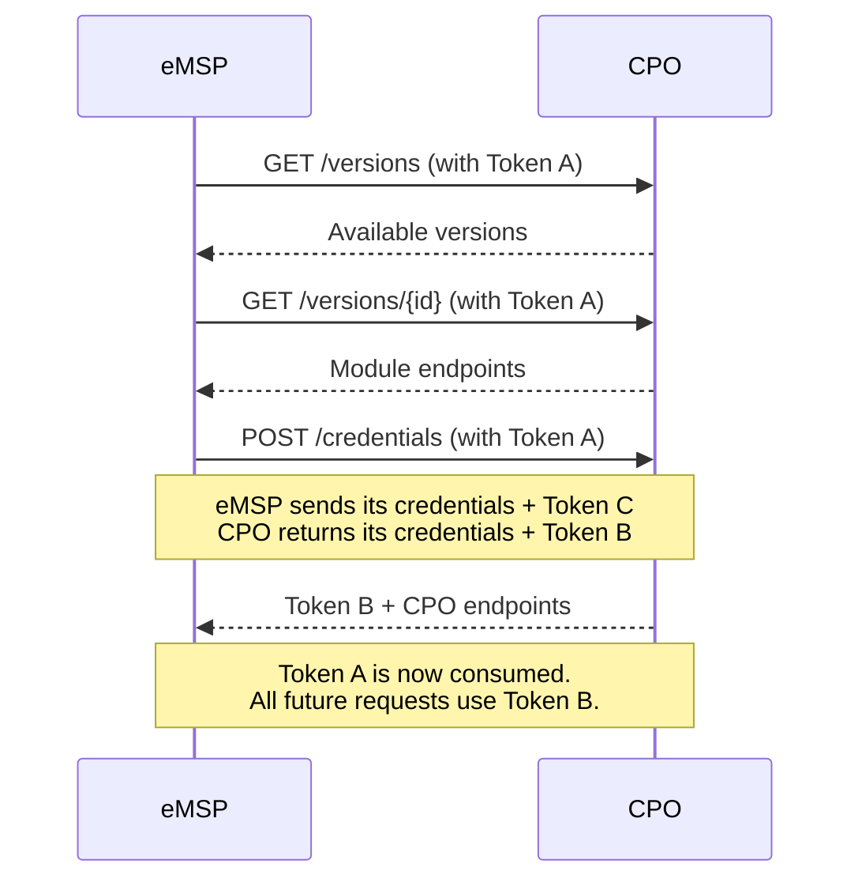

# CPO Registration
{: .no_toc }

## Table of contents
{: .no_toc .text-delta }

1. TOC
{:toc}

---

## Overview

Before your eMSP can exchange data with a CPO, both parties must complete the **OCPI credentials handshake**. This is a multi-step process that establishes trust and negotiates which OCPI version to use.



## Automated Registration

DotOcpi handles the entire handshake automatically:

```csharp
// Inject IRegistrationClient via DI
var result = await registrationClient.RegisterAsync(new RegistrationRequest(
    VersionsUrl: "https://cpo.example.com/ocpi/versions",
    TokenA: "pre-shared-token-a",
    EmspCountryCode: "NL",
    EmspPartyId: "MSP",
    EmspVersionsUrl: "https://my-emsp.com/ocpi/versions",
    EmspBusinessName: "My eMSP"
));
```

The orchestrator performs these steps:

1. **Version Discovery** — `GET /versions` to discover the CPO's supported versions
2. **Version Negotiation** — Select the highest mutually supported version (skipping deprecated 2.1 and 2.2)
3. **Endpoint Discovery** — `GET /versions/{id}` to get the CPO's module endpoints
4. **Credentials Exchange** — `POST /credentials` with Token A to register
5. **Connection Storage** — Store the `CpoConnection` in the registry

### RegistrationRequest Properties

| Property | Required | Description |
|:---------|:---------|:------------|
| `VersionsUrl` | Yes | CPO's versions endpoint URL (HTTPS) |
| `TokenA` | Yes | Pre-shared Token A from the CPO |
| `EmspCountryCode` | Yes | Your eMSP country code (ISO 3166-1 alpha-2) |
| `EmspPartyId` | Yes | Your eMSP party ID (max 3 chars) |
| `EmspVersionsUrl` | Yes | Your eMSP's versions endpoint URL |
| `EmspBusinessName` | Yes | Your eMSP's business name |
| `SupportedVersions` | No | Override which versions to offer (defaults to `DotOcpiOptions.SupportedVersions`) |

### RegistrationResult

```csharp
var result = await registrationClient.RegisterAsync(request);

// The stored connection with all negotiated details
CpoConnection connection = result.Connection;
Console.WriteLine($"CPO: {connection.ConnectionKey}");
Console.WriteLine($"Version: {connection.Version}");
Console.WriteLine($"Status: {connection.Status}");
Console.WriteLine($"Endpoints: {string.Join(", ", connection.ModuleEndpoints.Keys)}");

// The raw Token B — store this securely for outbound requests
string cpoToken = result.CpoToken;
```

## Version Negotiation Rules

The negotiator selects the **highest mutually supported version**, with these rules:

1. OCPI 2.1 and 2.2 are deprecated — the negotiator prefers 2.1.1 and 2.2.1 respectively
2. If only a deprecated version is available, it will still be used
3. If no mutual version exists, registration fails with `OcpiRegistrationException`

```csharp
// Restrict negotiation to specific versions
var result = await registrationClient.RegisterAsync(new RegistrationRequest(
    VersionsUrl: "https://cpo.example.com/ocpi/versions",
    TokenA: "token-a",
    EmspCountryCode: "NL",
    EmspPartyId: "MSP",
    EmspVersionsUrl: "https://my-emsp.com/ocpi/versions",
    EmspBusinessName: "My eMSP",
    SupportedVersions: new HashSet<OcpiVersion> { OcpiVersion.V2_2_1 } // Only negotiate 2.2.1
));
```

## Credential Rotation

Rotate credentials for an existing connection without re-registering:

```csharp
var result = await registrationClient.RotateCredentialsAsync(new CredentialRotationRequest(
    ConnectionKey: "DE:CPO",
    CurrentCpoToken: currentTokenB,
    EmspBusinessName: "My eMSP (Updated)"
));

// result.Connection has the updated connection
// result.CpoToken is the new Token B (old one is invalidated)
```

Rotation performs a `PUT /credentials` exchange — the CPO issues a new Token B and the old one is invalidated.

## Unregistration

To disconnect from a CPO:

```csharp
await registrationClient.UnregisterAsync(new UnregisterRequest(
    ConnectionKey: "DE:CPO",
    CurrentCpoToken: currentTokenB
));
```

This sends `DELETE /credentials` to the CPO and removes the connection from the registry.

## Manual Registration

If you need more control over the handshake, use the building blocks directly:

```csharp
// 1. Discover versions
var versionDiscovery = serviceProvider.GetRequiredService<IVersionDiscovery>();
var versions = await versionDiscovery.GetVersionsAsync(
    "https://cpo.example.com/ocpi/versions",
    tokenA,
    cancellationToken);

// 2. Pick a version
var selectedVersion = versions
    .Where(v => OcpiVersionExtensions.TryParse(v.Version, out _))
    .OrderByDescending(v => v.Version)
    .First();

// 3. Get endpoints
var detail = await versionDiscovery.GetVersionDetailAsync(
    selectedVersion.Url,
    tokenA,
    cancellationToken);

// 4. Exchange credentials
var credentialsClient = serviceProvider.GetRequiredService<ICredentialsClient>();
var credentialsUrl = detail.Endpoints
    .First(e => e.Identifier == "credentials")
    .Url;

var response = await credentialsClient.PostCredentialsAsync(
    credentialsUrl,
    tokenA,
    OcpiVersion.V2_2_1,
    new
    {
        token = TokenGenerator.Generate(),
        url = "https://my-emsp.com/ocpi/versions",
        roles = new[]
        {
            new
            {
                role = "EMSP",
                business_details = new { name = "My eMSP" },
                party_id = "MSP",
                country_code = "NL",
            },
        },
    },
    cancellationToken);

// response.Token is Token B from the CPO
```

## Security Notes

{: .important }
> - All OCPI endpoint URLs **must use HTTPS**. The library rejects HTTP URLs during registration.
> - Token A is consumed once and should never be reused.
> - Token B is stored as a hash — the raw value only appears in transport headers.
> - If registration fails mid-handshake, Token A may be consumed. You'll need a new Token A from the CPO.

## Error Handling

Registration uses exceptions for truly exceptional conditions:

| Exception | Cause |
|:----------|:------|
| `OcpiRegistrationException` | No mutual version, CPO rejection, Token A consumed |
| `OcpiTransportException` | Network failure, DNS error, timeout |
| `OcpiConfigurationException` | HTTP URL (not HTTPS), invalid options |

```csharp
try
{
    var result = await registrationClient.RegisterAsync(request);
}
catch (OcpiRegistrationException ex)
{
    logger.LogError(ex, "Registration failed: {Message}", ex.Message);
    // Get a new Token A from the CPO and retry
}
catch (OcpiTransportException ex)
{
    logger.LogError(ex, "Network error during registration");
    // Retry with the same Token A (it wasn't consumed)
}
```
