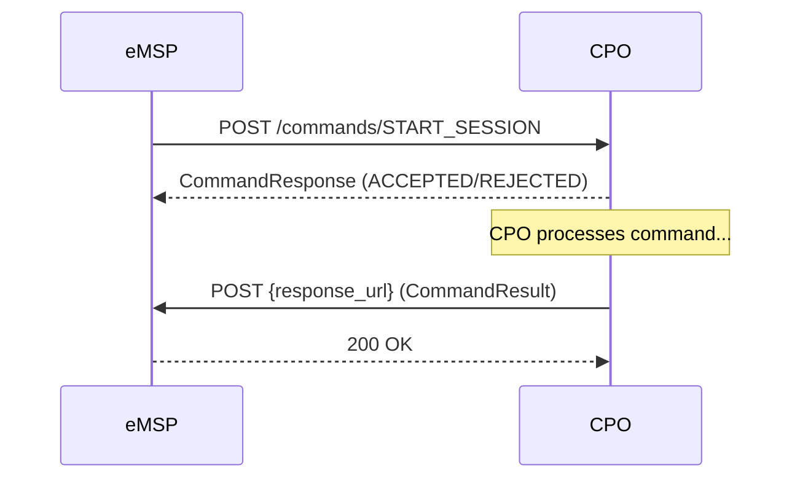

# Sending Commands to CPOs
{: .no_toc }

## Table of contents
{: .no_toc .text-delta }

1. TOC
{:toc}

---

## Overview

The OCPI Commands module lets your eMSP send commands to CPOs:

| Command | Description | OCPI Version |
|:--------|:------------|:-------------|
| `StartSession` | Start a charging session | 2.1.1+ |
| `StopSession` | Stop an active session | 2.1.1+ |
| `ReserveNow` | Reserve a connector | 2.1.1+ |
| `UnlockConnector` | Unlock a connector | 2.1.1+ |
| `CancelReservation` | Cancel a reservation | 2.2.1 only |

{: .note }
> Commands are not supported in OCPI 2.0.

## Command Flow

Commands use an **asynchronous callback pattern**:



1. Your eMSP sends the command to the CPO
2. The CPO responds synchronously with a `CommandResponse` (accepted, rejected, etc.)
3. Later, the CPO sends the final `CommandResult` to your `response_url` callback

## Sending Commands

### Start Session

```csharp
var result = await ocpiClient.Commands.SendStartSessionAsync("DE:CPO", new
{
    response_url = "https://my-emsp.com/ocpi/commands/START_SESSION/callback",
    token = new
    {
        uid = "TOKEN001",
        type = "RFID",
        contract_id = "NL-MSP-C001",
    },
    location_id = "LOC001",
    evse_uid = "EVSE001",       // Optional: specific EVSE
    connector_id = "CONN001",   // Optional: specific connector
});

if (result.IsSuccess)
{
    Console.WriteLine("Command accepted by CPO");
}
```

### Stop Session

```csharp
var result = await ocpiClient.Commands.SendStopSessionAsync("DE:CPO", new
{
    response_url = "https://my-emsp.com/ocpi/commands/STOP_SESSION/callback",
    session_id = "SESSION001",
});
```

### Reserve Now

```csharp
var result = await ocpiClient.Commands.SendReserveNowAsync("DE:CPO", new
{
    response_url = "https://my-emsp.com/ocpi/commands/RESERVE_NOW/callback",
    token = new
    {
        uid = "TOKEN001",
        type = "RFID",
        contract_id = "NL-MSP-C001",
    },
    expiry_date = DateTimeOffset.UtcNow.AddMinutes(15),
    reservation_id = "RES001",
    location_id = "LOC001",
    evse_uid = "EVSE001",
});
```

### Unlock Connector

```csharp
var result = await ocpiClient.Commands.SendUnlockConnectorAsync("DE:CPO", new
{
    response_url = "https://my-emsp.com/ocpi/commands/UNLOCK_CONNECTOR/callback",
    location_id = "LOC001",
    evse_uid = "EVSE001",
    connector_id = "CONN001",
});
```

### Cancel Reservation (2.2.1 only)

```csharp
var result = await ocpiClient.Commands.SendCancelReservationAsync("DE:CPO", new
{
    response_url = "https://my-emsp.com/ocpi/commands/CANCEL_RESERVATION/callback",
    reservation_id = "RES001",
});
```

## Handling Callbacks

When the CPO completes a command, it calls back to your `response_url`. Implement `ICommandsCallback`:

```csharp
public class MyCommandsCallback : ICommandsCallback
{
    private readonly ILogger<MyCommandsCallback> _logger;

    public MyCommandsCallback(ILogger<MyCommandsCallback> logger) => _logger = logger;

    public async Task<OcpiResult> OnCommandResultAsync(
        OcpiRequestContext context, string correlationId, object result, CancellationToken ct)
    {
        _logger.LogInformation(
            "Command {CorrelationId} completed from {CpoId}",
            correlationId,
            context.CpoId);

        // Process the CommandResult
        // The result type matches the OCPI version negotiated with this CPO
        return OcpiResult.Success();
    }
}

// Register in DI
builder.Services.AddSingleton<ICommandsCallback, MyCommandsCallback>();
```

## Callback Store

DotOcpi tracks pending command callbacks using `ICallbackStore`:

```csharp
// The built-in InMemoryCallbackStore is registered automatically
// For production with multiple instances, implement ICallbackStore:
public class RedisCallbackStore : ICallbackStore
{
    public async Task StoreAsync(
        string correlationId, PendingCallback callback, TimeSpan ttl, CancellationToken ct)
    {
        // Store in Redis with TTL
    }

    public async Task<PendingCallback?> GetAndRemoveAsync(
        string correlationId, CancellationToken ct)
    {
        // Atomically get and remove from Redis
    }

    public async Task<IReadOnlyList<PendingCallback>> GetExpiredAsync(CancellationToken ct)
    {
        // Return expired callbacks for cleanup
    }
}
```

## Error Handling

```csharp
var result = await ocpiClient.Commands.SendStartSessionAsync("DE:CPO", command);

if (result.IsSuccess)
{
    // Command accepted — wait for callback
    var response = result.Data;
    Console.WriteLine($"Status: {response}");
}
else
{
    // Command rejected by CPO
    Console.WriteLine($"Rejected: {result.StatusMessage}");
}
```
