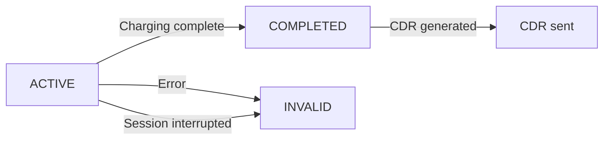

# Sessions Module
{: .no_toc }

## Table of contents
{: .no_toc .text-delta }

1. TOC
{:toc}

---

## Overview

The Sessions module tracks active and completed charging sessions. CPOs push session data to your eMSP as sessions progress.

## Receiving Session Pushes

```csharp
public class MySessionsReceiver : ISessionsReceiver
{
    public async Task<OcpiResult> OnSessionPutAsync(
        OcpiRequestContext context, string sessionId, object data, CancellationToken ct)
    {
        // Full session create/replace
        // Track session state transitions (ACTIVE → COMPLETED → INVALID)
        await _db.UpsertSessionAsync(context.CpoId, sessionId, data, ct);
        return OcpiResult.Success();
    }

    public async Task<OcpiResult> OnSessionPatchAsync(
        OcpiRequestContext context, string sessionId, JsonElement patch, CancellationToken ct)
    {
        // Partial update — e.g., kWh meter update during active session
        var existing = await _db.GetSessionJsonAsync(context.CpoId, sessionId, ct);
        if (existing is null)
            return OcpiResult.Failure(new OcpiStatusCode(2003), "Session not found");

        // Apply JSON Merge Patch (RFC 7396) — consumers handle merge
        var merged = ApplyJsonMergePatch(existing.Value, patch);
        await _db.SaveSessionJsonAsync(context.CpoId, sessionId, merged, ct);

        return OcpiResult.Success();
    }

    public async Task<OcpiResult<object>> GetSessionAsync(
        OcpiRequestContext context, string sessionId, CancellationToken ct)
    {
        var session = await _db.GetSessionAsync(context.CpoId, sessionId, ct);
        if (session is null)
            return OcpiResult<object>.Failure(new OcpiStatusCode(2003), "Session not found");

        return OcpiResult<object>.Success(session);
    }
}
```

## Pulling Sessions

```csharp
// All sessions
await foreach (var session in ocpiClient.Sessions.GetAllSessionsAsync("DE:CPO"))
{
    Console.WriteLine($"Session: {session}");
}

// Sessions updated in the last hour
await foreach (var session in ocpiClient.Sessions.GetAllSessionsAsync(
    "DE:CPO",
    dateFrom: DateTimeOffset.UtcNow.AddHours(-1)))
{
    await ProcessSessionAsync(session);
}
```

## Charging Preferences (2.2+ only)

In OCPI 2.2+, you can send charging preferences to the CPO:

```csharp
var result = await ocpiClient.Sessions.PutChargingPreferencesAsync("DE:CPO", "SESSION001", new
{
    profile_type = "FAST",                                    // CHEAP, FAST, GREEN, REGULAR
    departure_time = DateTimeOffset.UtcNow.AddHours(2),
    energy_need = 50.0,                                       // kWh needed
});
```

## Session Status Flow



| Status | Description |
|:-------|:------------|
| `ACTIVE` | Session is in progress |
| `COMPLETED` | Charging complete, CDR pending |
| `INVALID` | Session terminated abnormally |
| `PENDING` | Session requested but not yet started |
| `RESERVATION` | Reserved but not yet charging |

## Version Differences

| Feature | 2.0 | 2.1.1 | 2.2 | 2.2.1 |
|:--------|:----|:------|:----|:------|
| `last_updated` | - | Yes | Yes | Yes |
| `charging_periods` | Yes | Yes | Yes | Yes |
| Charging preferences | - | - | Yes | Yes |
| Location reference | Embedded | Embedded | `location_id` | `location_id` |

## Error Handling

| Scenario | Return |
|:---------|:-------|
| Session stored successfully | `OcpiResult.Success()` |
| Unknown session (GET) | `OcpiResult<object>.Failure(new OcpiStatusCode(2003), "Session not found")` |
| Charging preferences not supported (2.0/2.1.1) | The endpoint is not mapped for pre-2.2 versions |

{: .tip }
> Session data is updated frequently. If you reject a PUT with an error, the CPO may stop sending updates for that session. Accept and store even if the data seems stale — use `last_updated` to resolve conflicts.
