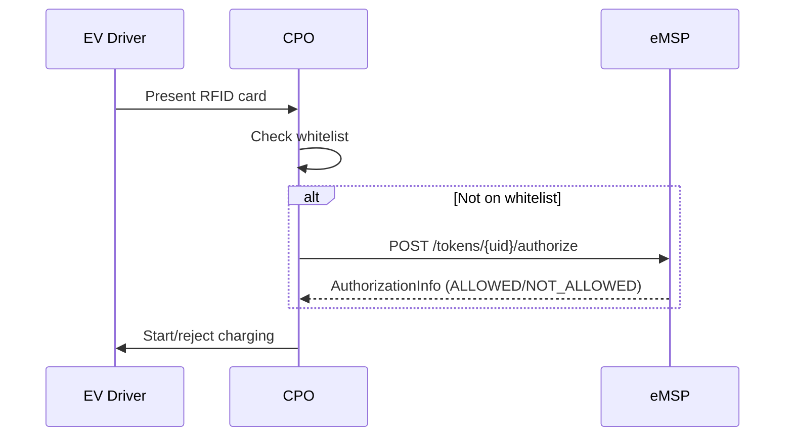

# Tokens Module
{: .no_toc }

## Table of contents
{: .no_toc .text-delta }

1. TOC
{:toc}

---

## Overview

The Tokens module has two roles for the eMSP:

1. **Sender** — Push EV driver tokens to CPOs so they can authorize offline
2. **Receiver** — Handle real-time authorization requests from CPOs (`POST /tokens/{uid}/authorize`)

{: .note }
> The "Tokens" OCPI module manages **EV driver tokens** (RFID cards, app tokens). Don't confuse with **auth tokens** (Token A/B/C) used for OCPI party authentication.

## Pushing Tokens to CPOs

### PUT (Create or Replace)

```csharp
await ocpiClient.Tokens.PushTokenAsync("DE:CPO", "TOKEN001", new
{
    uid = "TOKEN001",
    type = "RFID",
    contract_id = "NL-MSP-C001",
    issuer = "My eMSP",
    valid = true,
    whitelist = "ALLOWED",
    language = "nl",
    last_updated = DateTimeOffset.UtcNow,
});
```

### PATCH (Partial Update)

```csharp
// Invalidate a token
await ocpiClient.Tokens.PatchTokenAsync("DE:CPO", "TOKEN001",
    JsonSerializer.SerializeToElement(new
    {
        valid = false,
        last_updated = DateTimeOffset.UtcNow,
    }));
```

## Providing Tokens via GET (Paginated)

CPOs can pull your tokens via `GET /tokens`. Implement `ITokensSender`:

```csharp
public class MyTokensSender : ITokensSender
{
    private readonly ITokenRepository _repo;

    public MyTokensSender(ITokenRepository repo) => _repo = repo;

    public async Task<PaginatedResult<object>> GetTokensAsync(
        OcpiRequestContext context,
        DateTimeOffset? dateFrom,
        DateTimeOffset? dateTo,
        int offset,
        int limit,
        CancellationToken ct)
    {
        var (items, total) = await _repo.QueryAsync(
            context.CpoId, dateFrom, dateTo, offset, limit, ct);

        return new PaginatedResult<object>(
            Items: items,
            TotalCount: total,
            Offset: offset,
            Limit: limit);
    }
}
```

DotOcpi automatically sets pagination response headers (`X-Total-Count`, `X-Limit`, `Link`).

## Real-Time Authorization

CPOs send `POST /tokens/{uid}/authorize` for real-time authorization. Implement `ITokensAuthorizer`:

```csharp
public class MyTokensAuthorizer : ITokensAuthorizer
{
    public async Task<OcpiResult<object>> AuthorizeAsync(
        OcpiRequestContext context, string tokenUid, object? locationReferences, CancellationToken ct)
    {
        // Look up the token
        var token = await _db.FindTokenAsync(tokenUid, ct);
        if (token is null)
        {
            return OcpiResult<object>.Success(new
            {
                allowed = "NOT_ALLOWED",
                token = new { uid = tokenUid, type = "OTHER" },
                authorization_reference = (string?)null,
            });
        }

        // Check if token is valid for the requested location
        var allowed = await CheckLocationAccessAsync(token, locationReferences, ct);

        return OcpiResult<object>.Success(new
        {
            allowed = allowed ? "ALLOWED" : "NOT_ALLOWED",
            token = new { uid = tokenUid, type = token.Type },
            authorization_reference = allowed ? Guid.NewGuid().ToString() : null,
        });
    }
}
```

### Authorization Flow



### Whitelist Types

| Value | Description |
|:------|:------------|
| `ALWAYS` | Always allow without real-time check |
| `ALLOWED` | On whitelist, but CPO may check in real-time |
| `ALLOWED_OFFLINE` | Allow when offline, check when online |
| `NEVER` | Always require real-time authorization |

## Version Differences

| Feature | 2.0 | 2.1.1 | 2.2 | 2.2.1 |
|:--------|:----|:------|:----|:------|
| Token ID field | `auth_id` | `auth_id` | `contract_id` | `contract_id` |
| Token types | `RFID`, `OTHER` | `RFID`, `OTHER` | `AD_HOC_USER`, `APP_USER`, `OTHER`, `RFID` | `AD_HOC_USER`, `APP_USER`, `OTHER`, `RFID` |
| `whitelist` | - | Yes | Yes | Yes |
| `language` | - | Yes | Yes | Yes |
