# DotOcpi Strategies

Cross-cutting strategies that apply across the library.

## Table of Contents

- [1. Data Validation Strategy](#1-data-validation-strategy)
- [2. .NET Version Compatibility](#2-net-version-compatibility)
- [3. Minimal API Integration](#3-minimal-api-integration)
- [4. Retry & Resynchronization Strategy](#4-retry--resynchronization-strategy)
- [5. Rate Limiting Strategy](#5-rate-limiting-strategy)
- [6. Idempotency Strategy](#6-idempotency-strategy)
- [7. Resilience Strategy](#7-resilience-strategy)
- [8. Observability Strategy](#8-observability-strategy)
- [9. Health Check Strategy](#9-health-check-strategy)
- [10. Configuration Strategy](#10-configuration-strategy)
- [11. Callback Routing Strategy](#11-callback-routing-strategy)
- [12. Pull Synchronization Strategy](#12-pull-synchronization-strategy)
- [13. Logging Strategy](#13-logging-strategy)
- [14. PATCH Handling Strategy](#14-patch-handling-strategy)
- [15. Type Convention Strategy](#15-type-convention-strategy)
- [16. Exception Strategy](#16-exception-strategy)
- [17. Testing Strategy (DotOcpi.Testing)](#17-testing-strategy-dotocpitesting)
- [18. Security Strategy](#18-security-strategy)

---

## 1. Data Validation Strategy

### Design Principles

- **No external validation dependency** — the library uses `System.ComponentModel.DataAnnotations` on OCPI models. No FluentValidation dependency imposed on consumers.
- **Validation is layered** — transport validation (HTTP/protocol), OCPI model validation, business rule validation.
- **Consumers extend** — the library validates OCPI protocol rules; consumers validate business rules.

### Three Validation Layers

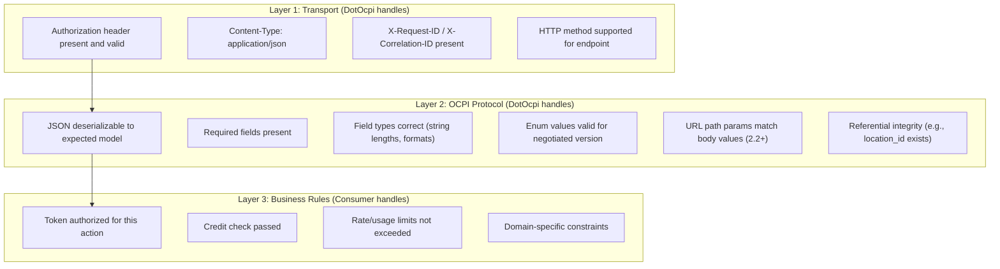

### Server-Side Validation Flow

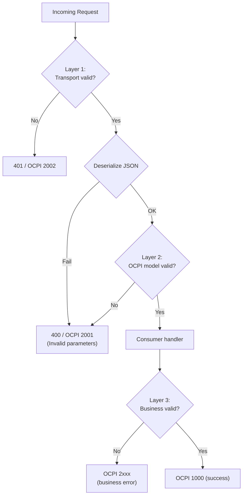

### Implementation on Models

OCPI models use DataAnnotations for protocol-level validation:

```csharp
// Example: V2_2_1/Location.cs
public sealed class Location
{
    [Required]
    [StringLength(2, MinimumLength = 2)]
    public required string CountryCode { get; init; }

    [Required]
    [StringLength(3, MinimumLength = 3)]
    public required string PartyId { get; init; }

    [Required]
    [StringLength(36)]
    public required string Id { get; init; }

    public required bool Publish { get; init; }

    [Required]
    [StringLength(45)]
    public required string Address { get; init; }

    [Required]
    public required GeoLocation Coordinates { get; init; }

    [Required]
    [StringLength(255)]
    public required string TimeZone { get; init; }

    public required DateTimeOffset LastUpdated { get; init; }
}
```

### Custom OCPI Validators

For protocol rules that DataAnnotations cannot express:

```csharp
public interface IOcpiValidator<T>
{
    OcpiValidationResult Validate(T model, OcpiVersion version);
}
```

Built-in validators handle:
- Enum values valid for the negotiated version (e.g., EMAID only in 2.2.1)
- URL path `country_code`/`party_id` matching body values
- Coordinate range checks (lat: -90 to 90, lon: -180 to 180)
- DateTime format (RFC 3339)
- CiString case-insensitive comparison semantics
- PATCH must contain at least one non-identifier field
- CDR `credit` requires `credit_reference_id`
- Connector `tariff_ids` vs `tariff_id` based on version

### Consumer Validation Extension Point

Consumers can register custom validators via an endpoint filter:

```csharp
services.AddDotOcpi()
    .AddValidation(v =>
    {
        v.AddValidator<ILocationValidator, MyLocationValidator>();
    });
```

### .NET 10 Compatibility

On .NET 10, the library's DataAnnotations validators integrate with the built-in `AddValidation()` source generator for Minimal APIs. On .NET 8/9, the library provides its own `OcpiValidationFilter` endpoint filter that invokes DataAnnotations manually.

---

## 2. .NET Version Compatibility

### Multi-Targeting Strategy

```xml
<TargetFrameworks>net8.0;net10.0</TargetFrameworks>
```

| Target | Purpose | C# Features Available |
|---|---|---|
| net8.0 | LTS minimum (supported until Nov 2026); keyed services, FrozenDictionary, TimeProvider | C# 12 (primary constructors, collection expressions) |
| net10.0 | Latest LTS (supported until Nov 2028); newest runtime/BCL improvements | C# 14 (field keyword, extension types) |

### Conditional Compilation

```csharp
#if NET10_0_OR_GREATER
    // Use net10.0-specific APIs when available
#else
    // net8.0 baseline implementation
#endif
```

### Feature Availability Matrix

| Feature | net8.0 | net10.0 |
|---|:---:|:---:|
| Records | Y | Y |
| File-scoped namespaces | Y | Y |
| Nullable reference types | Y | Y |
| Pattern matching (all forms) | Y | Y |
| Primary constructors | Y | Y |
| Keyed services | Y | Y |
| FrozenDictionary | Y | Y |
| Collection expressions | Y | Y |
| Source-gen JSON | Y | Y |
| TimeProvider (for testable time) | Y | Y |
| `field` keyword in properties | - | Y |
| Extension types | - | Y |

### Build Configuration

```xml
<!-- Directory.Build.props -->
<PropertyGroup>
    <TargetFrameworks>net8.0;net10.0</TargetFrameworks>
    <LangVersion>latest</LangVersion>
    <Nullable>enable</Nullable>
    <ImplicitUsings>enable</ImplicitUsings>
    <TreatWarningsAsErrors>true</TreatWarningsAsErrors>
    <EnableNETAnalyzers>true</EnableNETAnalyzers>
    <AnalysisLevel>latest-recommended</AnalysisLevel>
    <Deterministic>true</Deterministic>
    <ContinuousIntegrationBuild Condition="'$(CI)' == 'true'">true</ContinuousIntegrationBuild>
    <PublishRepositoryUrl>true</PublishRepositoryUrl>
    <EmbedUntrackedSources>true</EmbedUntrackedSources>
    <DebugType>embedded</DebugType>
    <GenerateDocumentationFile>true</GenerateDocumentationFile>
</PropertyGroup>

<ItemGroup>
    <PackageReference Include="Microsoft.SourceLink.GitHub" Version="8.*" PrivateAssets="All" />
</ItemGroup>
```

---

## 3. Minimal API Integration

### Endpoint Registration

The library uses `MapGroup()` and Minimal API route handlers. No MVC controllers.

```csharp
// Consumer usage
var app = builder.Build();
app.MapOcpiEndpoints();  // Registers all OCPI endpoints
app.Run();
```

### Internal Implementation

```csharp
public static class EndpointRouteBuilderExtensions
{
    public static IEndpointRouteBuilder MapOcpiEndpoints(
        this IEndpointRouteBuilder endpoints)
    {
        var ocpi = endpoints.MapGroup("/ocpi")
            .AddEndpointFilter<OcpiRequestIdFilter>();

        // Version endpoints (no auth required for discovery)
        ocpi.MapGet("/versions", VersionsEndpoints.GetVersions);
        ocpi.MapGet("/versions/{versionId}", VersionsEndpoints.GetVersionDetail);

        // Per-version endpoint groups
        foreach (var version in supportedVersions)
        {
            var versionGroup = ocpi.MapGroup($"/emsp/{version.ToUrlSegment()}")
                .AddEndpointFilter<OcpiAuthFilter>()
                .AddEndpointFilter<OcpiValidationFilter>();

            // Credentials (no version-specific routing needed)
            MapCredentialsEndpoints(versionGroup);

            // Module endpoints
            MapLocationsEndpoints(versionGroup, version);
            MapSessionsEndpoints(versionGroup, version);
            MapCdrsEndpoints(versionGroup, version);
            MapTariffsEndpoints(versionGroup, version);
            MapTokensEndpoints(versionGroup, version);
            MapCommandsEndpoints(versionGroup, version);

            if (version >= OcpiVersion.V2_2)
                MapChargingProfilesEndpoints(versionGroup, version);
        }

        return endpoints;
    }
}
```

### Endpoint Filters vs Middleware

| Concern | Implementation | Why |
|---|---|---|
| X-Request-ID / X-Correlation-ID | `OcpiRequestIdFilter` (endpoint filter) | Applies only to OCPI endpoints, not the entire app |
| Authentication | `OcpiAuthFilter` (endpoint filter) | Needs access to route parameters for version detection |
| Validation | `OcpiValidationFilter` (endpoint filter) | Version-aware, operates on deserialized models |
| Exception handling | `OcpiExceptionMiddleware` (middleware) | Global catch-all, wraps in OCPI response envelope |

### OpenAPI Integration

The library provides OpenAPI metadata for all endpoints:

```csharp
// Endpoints include Produces/Accepts metadata
versionGroup.MapPut("/locations/{country_code}/{party_id}/{location_id}",
    LocationsEndpoints.HandlePut)
    .Accepts<Location>("application/json")
    .Produces<OcpiResponse<object>>(200)
    .Produces<OcpiResponse<object>>(400)
    .WithTags("Locations")
    .WithName("PutLocation");
```

Compatible with .NET 9's built-in `Microsoft.AspNetCore.OpenApi` — consumers just add:

```csharp
builder.Services.AddOpenApi();
app.MapOpenApi();
```

---

## 4. Retry & Resynchronization Strategy

### OCPI's Rule: Do NOT Queue and Retry

The OCPI specification explicitly states:

> "OCPI messages SHOULD NOT be queued. When a client does a POST, PUT or PATCH request and that request fails or times out, the client should not queue the message and retry the same message again later."

Instead, use **Pull to resynchronize** after an outage.

### Pull Resync Flow

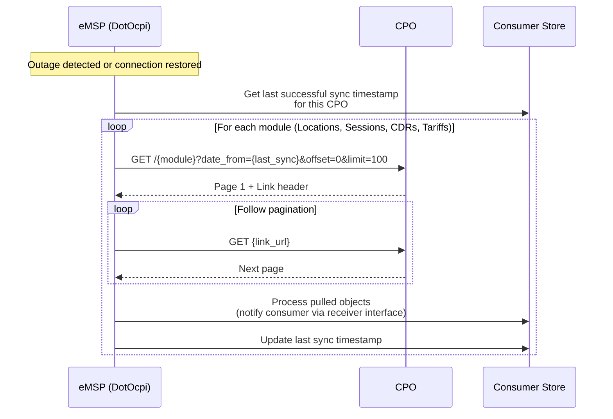

### Consumer API for Pull

```csharp
public interface IOcpiSyncService
{
    /// <summary>
    /// Pull all changes from a CPO since the given timestamp.
    /// The library handles pagination automatically.
    /// </summary>
    Task<OcpiResult> SyncFromCpoAsync(
        string cpoId,
        DateTimeOffset? since,
        CancellationToken ct);

    /// <summary>
    /// Pull changes for a specific module.
    /// </summary>
    Task<OcpiResult> SyncModuleFromCpoAsync(
        string cpoId,
        string moduleId,
        DateTimeOffset? since,
        CancellationToken ct);
}
```

---

## 5. Rate Limiting Strategy

### Inbound Rate Limiting (CPO → eMSP)

Per-CPO rate limits to prevent a single CPO from overwhelming the eMSP:

```csharp
services.AddDotOcpi()
    .AddRateLimiting(options =>
    {
        options.DefaultPolicy = new OcpiRateLimitPolicy
        {
            PermitLimit = 100,
            Window = TimeSpan.FromMinutes(1)
        };

        // Per-CPO override
        options.AddCpoPolicy("DE_ABC", new OcpiRateLimitPolicy
        {
            PermitLimit = 500,
            Window = TimeSpan.FromMinutes(1)
        });
    });
```

Implementation uses ASP.NET Core's built-in `AddRateLimiter()` with partitioning by CPO identity:

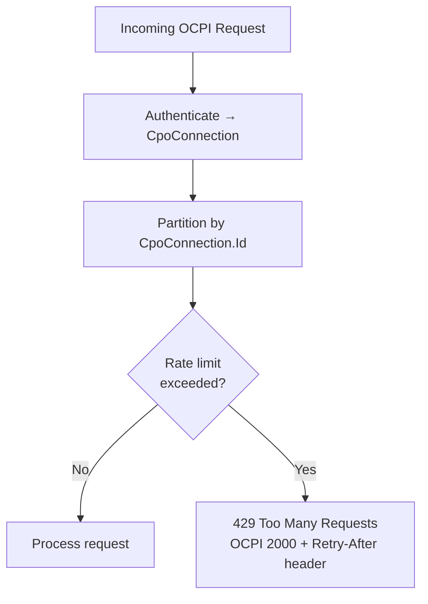

### Outbound Rate Limiting (eMSP → CPO)

Respect CPO-indicated rate limits. Some CPOs return `Retry-After` headers. The resilience pipeline handles this automatically via the standard resilience handler.

---

## 6. Idempotency Strategy

### PUT is Idempotent by Design

OCPI specifies that PUT creates or replaces an object. Receiving the same PUT twice with the same data has the same effect as receiving it once. The library relies on this:

- **Locations PUT**: Upsert by (country_code, party_id, location_id)
- **Sessions PUT**: Upsert by (country_code, party_id, session_id)
- **Tokens PUT**: Upsert by (country_code, party_id, token_uid)
- **Tariffs PUT**: Upsert by (country_code, party_id, tariff_id)

### CDR POST Idempotency

CDRs use POST (not idempotent). Handle duplicates via:

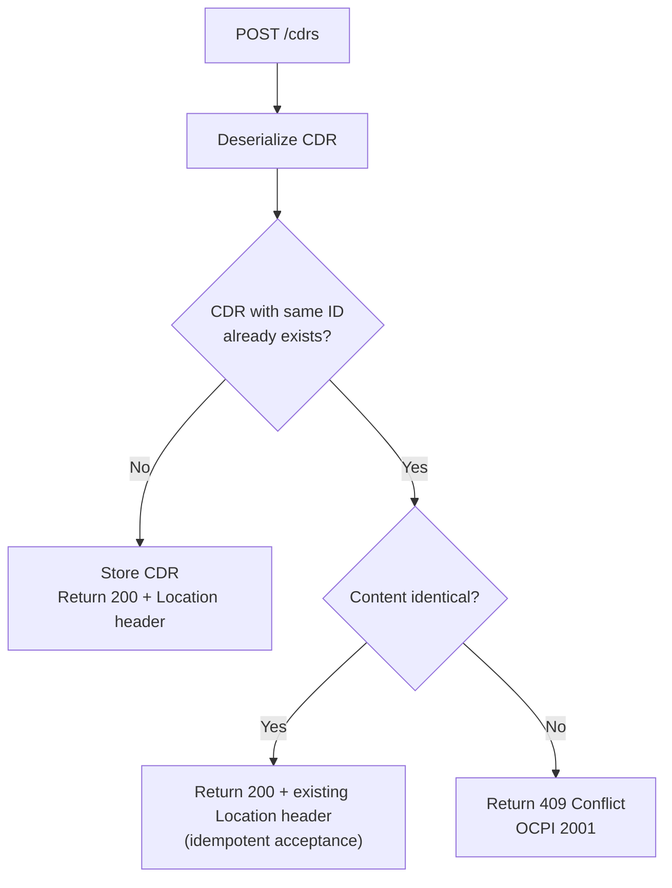

### Command Idempotency

Commands include a `response_url` with a unique correlation ID. If the same command arrives twice:
- The library checks for an existing pending command with the same correlation ID
- If found, returns the same synchronous response without re-sending to CPO

---

## 7. Resilience Strategy

### Outbound HTTP Resilience

Uses `Microsoft.Extensions.Http.Resilience` (Polly v8):

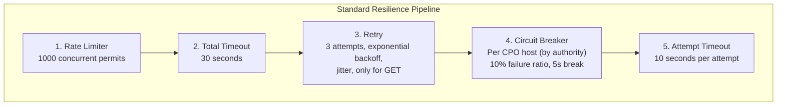

**Key configuration:**
- Retries disabled for unsafe methods (POST, PUT, DELETE, PATCH) per OCPI spec — do not retry mutations
- Circuit breaker partitioned by URL authority — each CPO gets its own breaker
- Consumers can customize via `AddClient(client => client.AddStandardResilienceHandler(...))`

### Per-CPO Circuit Breaker State

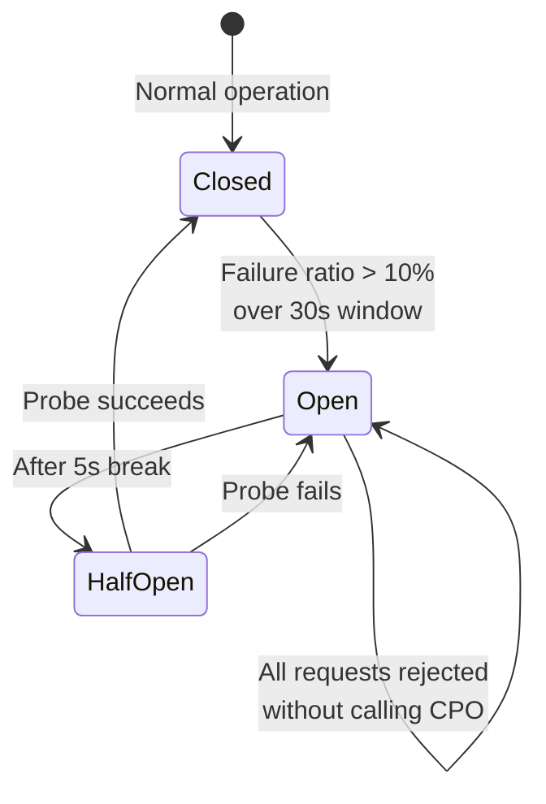

---

## 8. Observability Strategy

### Three Pillars

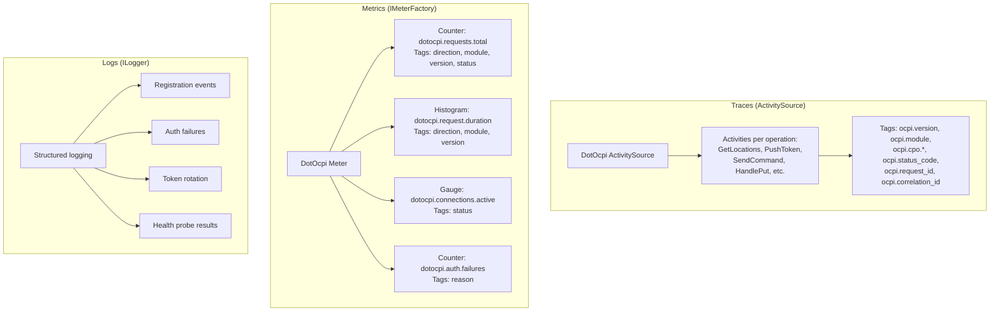

### Metrics Implementation

```csharp
internal sealed class OcpiMetrics
{
    private readonly Counter<long> _requestsTotal;
    private readonly Histogram<double> _requestDuration;
    private readonly UpDownCounter<long> _activeConnections;
    private readonly Counter<long> _authFailures;

    public OcpiMetrics(IMeterFactory meterFactory)
    {
        var meter = meterFactory.Create("DotOcpi");

        _requestsTotal = meter.CreateCounter<long>(
            "dotocpi.requests.total",
            description: "Total OCPI requests processed");

        _requestDuration = meter.CreateHistogram<double>(
            "dotocpi.request.duration",
            unit: "s",
            description: "OCPI request processing duration");

        _activeConnections = meter.CreateUpDownCounter<long>(
            "dotocpi.connections.active",
            description: "Number of active CPO connections");

        _authFailures = meter.CreateCounter<long>(
            "dotocpi.auth.failures",
            description: "OCPI authentication failures");
    }
}
```

### Consumer Opt-In

```csharp
builder.Services.AddOpenTelemetry()
    .WithTracing(t => t.AddSource("DotOcpi"))
    .WithMetrics(m => m.AddMeter("DotOcpi"));
```

---

## 9. Health Check Strategy

The library contributes health checks that consumers can register:

```csharp
builder.Services.AddHealthChecks()
    .AddOcpiRegistryHealthCheck(tags: ["ready"])
    .AddOcpiCpoHealthCheck("DE_ABC", tags: ["ready"]);
```

### Health Check Types

| Check | Tags | Reports |
|---|---|---|
| Registry Health | `ready` | Healthy if registry is accessible; Degraded if some CPOs offline |
| Per-CPO Health | `ready` | Healthy if specific CPO is CONNECTED; Degraded if OFFLINE |
| Token Store Health | `ready` | Healthy if token store is accessible |

### Health Status Mapping

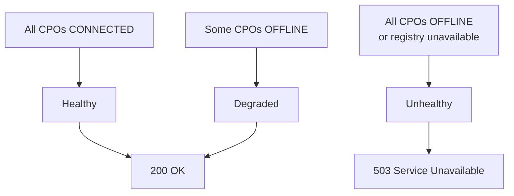

---

## 10. Configuration Strategy

### Options Pattern

```csharp
public sealed class DotOcpiOptions
{
    /// <summary>OCPI versions this eMSP supports.</summary>
    public IReadOnlyList<OcpiVersion> SupportedVersions { get; set; } = [OcpiVersion.V2_2_1];

    /// <summary>Base URL for OCPI endpoints (used in version discovery).</summary>
    public Uri? BaseUrl { get; set; }

    /// <summary>Default eMSP identity (can be overridden per CPO).</summary>
    public PartyIdentity? DefaultEmspIdentity { get; set; }

    /// <summary>Stale connection threshold for health monitoring.</summary>
    public TimeSpan StaleConnectionThreshold { get; set; } = TimeSpan.FromHours(24);

    /// <summary>Enable health monitoring background service.</summary>
    public bool EnableHealthMonitoring { get; set; } = true;

    /// <summary>Health monitoring interval.</summary>
    public TimeSpan HealthMonitoringInterval { get; set; } = TimeSpan.FromMinutes(5);

    /// <summary>Logging-specific options.</summary>
    public DotOcpiLoggingOptions Logging { get; set; } = new();
}
```

### Configuration Binding

```csharp
// appsettings.json
{
    "DotOcpi": {
        "SupportedVersions": ["V2_1_1", "V2_2_1"],
        "BaseUrl": "https://emsp.example.com",
        "DefaultEmspIdentity": {
            "CountryCode": "DE",
            "PartyId": "ABC"
        },
        "StaleConnectionThreshold": "1.00:00:00"
    }
}

// Registration
services.AddDotOcpi(options =>
{
    options.SupportedVersions = [OcpiVersion.V2_1_1, OcpiVersion.V2_2_1];
})
// Or bind from configuration:
services.AddDotOcpi(configuration.GetSection("DotOcpi"));
```

### Dynamic Configuration

Use `IOptionsMonitor<DotOcpiOptions>` for configuration that can change at runtime (e.g., adding a new supported version). The library internally uses `IOptionsMonitor`, not `IOptions`, so configuration reloads are picked up automatically.

---

## 11. Callback Routing Strategy

### The Problem

Commands and ChargingProfiles use async callbacks. The `response_url` is generated by the eMSP and must route back correctly — including in multi-instance deployments.

### Solution: Correlation ID in URL Path

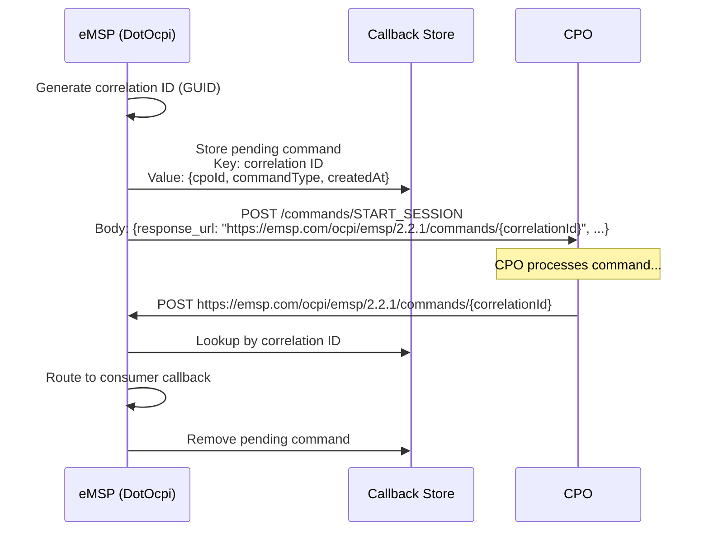

### Multi-Instance Compatibility

The callback store must be shared across instances. Options:
- **In-memory** (single instance): `ConcurrentDictionary` with TTL eviction
- **Distributed** (multi-instance): Redis hash with auto-expiry, or consumer-provided `ICallbackStore`

### Timeout Handling

If no callback arrives within the CPO-specified `timeout`:

```csharp
public interface ICallbackStore
{
    Task StoreAsync(string correlationId, PendingCallback callback, TimeSpan ttl, CancellationToken ct);
    Task<PendingCallback?> GetAndRemoveAsync(string correlationId, CancellationToken ct);
    Task<IReadOnlyList<PendingCallback>> GetExpiredAsync(CancellationToken ct);
}
```

A background service periodically scans for expired callbacks and notifies consumers:

```csharp
// Background service
var expired = await _callbackStore.GetExpiredAsync(ct);
foreach (var callback in expired)
{
    await _consumer.OnCommandResultAsync(
        context, callback.CorrelationId,
        CommandResultType.TIMEOUT, message: null, ct);
}
```

---

## 12. Pull Synchronization Strategy

### Scheduled Pull

For CPOs that do not push data (or as a safety net to catch missed pushes):

```csharp
services.AddDotOcpi()
    .AddPullSync(options =>
    {
        options.DefaultInterval = TimeSpan.FromHours(1);
        options.Modules = [ModuleId.Locations, ModuleId.Tariffs];
        options.RandomJitter = TimeSpan.FromMinutes(5); // Avoid thundering herd
    });
```

### Sync State Tracking

```csharp
public interface ISyncStateStore
{
    Task<DateTimeOffset?> GetLastSyncAsync(string cpoId, string moduleId, CancellationToken ct);
    Task SetLastSyncAsync(string cpoId, string moduleId, DateTimeOffset timestamp, CancellationToken ct);
}
```

### Concurrency Handling During Pagination

OCPI pagination can encounter concurrency issues if objects are updated mid-crawl. The spec recommends:

1. Track `X-Total-Count` across pages
2. If count decreases: objects were updated and may have moved in pagination order
3. Response: retry the previous page with `offset - 1` to avoid missing objects

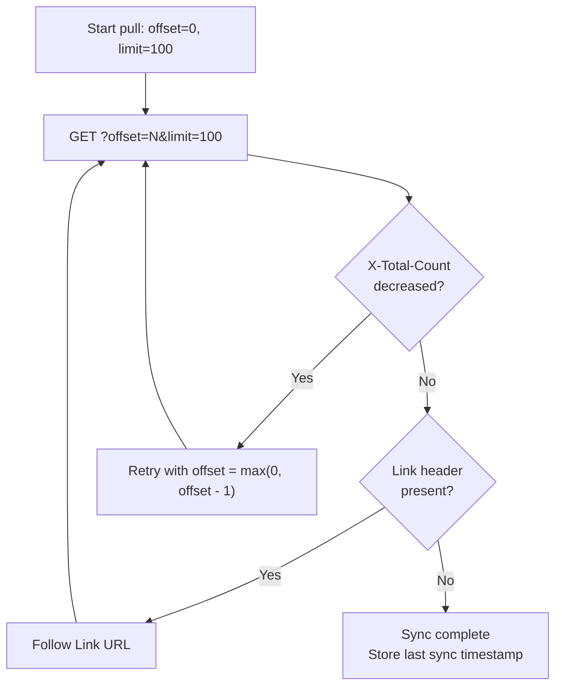

### Leader Election for Pull

In multi-instance deployments, only one instance should run scheduled pulls:

```csharp
// Distributed lock per CPO per module
var lockKey = $"dotocpi:sync:{cpoId}:{moduleId}";
await using var syncLock = await _lockFactory.CreateLockAsync(lockKey, ...);
if (!syncLock.IsAcquired) return; // Another instance is syncing
```

---

## 13. Logging Strategy

### Design Principles

- **`ILogger<T>` everywhere** — the library uses `Microsoft.Extensions.Logging` abstractions only. No concrete logger references.
- **High-performance** — all log calls use `[LoggerMessage]` source-generated methods (zero boxing, zero allocation when disabled).
- **Structured** — every log entry includes machine-readable properties, not just a formatted string.
- **Secure** — raw tokens and secrets are NEVER logged, even at Trace level. Sensitive fields are masked or omitted.
- **Consumer-controllable** — consumers override log levels per category via standard `ILogger` filtering or library-specific options.

### Log Categories

The library uses hierarchical logger categories matching its namespace structure. Consumers can filter at any level of the hierarchy.

```
DotOcpi                           — library root (catch-all)
DotOcpi.Registration              — handshake, version discovery, token exchange
DotOcpi.Auth                      — token validation, auth failures
DotOcpi.TokenStore                — token storage and retrieval
DotOcpi.CpoRegistry               — registry mutations, cache invalidation
DotOcpi.Client                    — outbound HTTP (catch-all for all modules)
DotOcpi.Client.Versions           — version discovery calls
DotOcpi.Client.Credentials        — credentials client calls
DotOcpi.Client.Locations          — locations client calls
DotOcpi.Client.Sessions           — sessions client calls
DotOcpi.Client.Cdrs               — CDRs client calls
DotOcpi.Client.Tariffs            — tariffs client calls
DotOcpi.Client.Tokens             — tokens push calls
DotOcpi.Client.Commands           — commands client calls
DotOcpi.Client.ChargingProfiles   — charging profiles client calls
DotOcpi.Server                    — inbound request handling (catch-all)
DotOcpi.Server.Locations          — locations receiver endpoint handling
DotOcpi.Server.Sessions           — sessions receiver endpoint handling
DotOcpi.Server.Cdrs               — CDRs receiver endpoint handling
DotOcpi.Server.Tariffs            — tariffs receiver endpoint handling
DotOcpi.Server.Tokens             — tokens sender endpoint + authorize handling
DotOcpi.Server.Commands           — commands callback handling
DotOcpi.Server.ChargingProfiles   — charging profiles callback handling
DotOcpi.Sync                      — pull synchronization
DotOcpi.Health                    — health monitoring probes
DotOcpi.Validation                — model validation
```

### Event ID Ranges

| Range | Category | Examples |
|---|---|---|
| 1000–1099 | Registration | 1001 HandshakeStarted, 1002 VersionNegotiated, 1003 RegistrationComplete, 1004 HandshakeFailed, 1005 TokenRotationComplete, 1006 Unregistered |
| 2000–2099 | Authentication | 2001 AuthSuccess, 2002 AuthMissingToken, 2003 AuthInvalidToken, 2004 AuthTokenExpired, 2005 AuthCpoNotFound |
| 3000–3099 | Client (outbound) | 3001 RequestSent, 3002 ResponseReceived, 3003 RequestFailed, 3004 PaginationPage, 3005 CircuitBreakerTripped |
| 4000–4099 | Server (inbound) | 4001 RequestReceived, 4002 RequestProcessed, 4003 RequestRejected, 4004 ConsumerHandlerFailed |
| 5000–5099 | Registry | 5001 CpoAdded, 5002 CpoUpdated, 5003 CpoRemoved, 5004 CacheHit, 5005 CacheMiss, 5006 CacheInvalidated |
| 6000–6099 | Sync | 6001 SyncStarted, 6002 SyncPageFetched, 6003 SyncComplete, 6004 SyncFailed |
| 7000–7099 | Health | 7001 ProbeSuccess, 7002 ProbeFailed, 7003 CpoMarkedOffline, 7004 CpoRecovered |
| 8000–8099 | Validation | 8001 ValidationFailed, 8002 VersionMismatch, 8003 BodyPathMismatch |

### Default Log Levels

| Level | What Gets Logged |
|---|---|
| **Trace** | Full OCPI request/response bodies (opt-in, sanitized), cache lookup details |
| **Debug** | Endpoint resolution, header values, pagination progress, handler selection, token hash lookups |
| **Information** | Registration complete, connection status change, sync complete, token rotation, startup/shutdown |
| **Warning** | Auth failure, CPO marked offline, validation failure, retry attempt, circuit breaker state change |
| **Error** | Handshake failure, transport exception, consumer handler unhandled exception, registry corruption |
| **Critical** | Token store unavailable, all CPOs offline, unrecoverable state |

### Consumer Log Level Override

**Standard `ILogger` filtering (recommended):**

```json
{
  "Logging": {
    "LogLevel": {
      "Default": "Information",
      "DotOcpi": "Warning",
      "DotOcpi.Auth": "Information",
      "DotOcpi.Registration": "Debug",
      "DotOcpi.Client.Locations": "Trace"
    }
  }
}
```

Consumers use the standard .NET logging configuration hierarchy. `DotOcpi: Warning` silences everything below Warning across the library, then more specific categories override downward.

**Library-specific options (for OCPI-specific logging behavior):**

```csharp
services.AddDotOcpi(options =>
{
    options.Logging.EnableRequestBodyLogging = false;   // default: false (security/perf)
    options.Logging.EnableResponseBodyLogging = false;  // default: false
    options.Logging.MaxBodyLogLength = 4096;            // truncate bodies beyond this
    options.Logging.SanitizeTokensInLogs = true;        // default: true, masks tokens in bodies
});
```

- `EnableRequestBodyLogging` / `EnableResponseBodyLogging` — when `true`, the library logs OCPI request/response bodies at **Trace** level. Disabled by default because bodies may contain tokens or PII.
- `SanitizeTokensInLogs` — when `true` (default), any field named `token` in logged bodies is replaced with `"[REDACTED]"`.
- These options are **independent** of log level filtering. Even if Trace is enabled, bodies are only logged if the corresponding option is `true`.

### High-Performance Logging Implementation

All log methods use `[LoggerMessage]` source-generated attribute (no boxing, no allocation when the log level is disabled):

```csharp
internal static partial class LogEvents
{
    [LoggerMessage(EventId = 1003, Level = LogLevel.Information,
        Message = "Registration complete for CPO {CpoId}, negotiated version {Version}")]
    public static partial void RegistrationComplete(
        this ILogger logger, string cpoId, string version);

    [LoggerMessage(EventId = 2003, Level = LogLevel.Warning,
        Message = "Authentication failed for request {RequestId}: {Reason}")]
    public static partial void AuthenticationFailed(
        this ILogger logger, string requestId, string reason);

    [LoggerMessage(EventId = 3001, Level = LogLevel.Debug,
        Message = "OCPI {Method} {Url} → CPO {CpoId} (version: {Version})")]
    public static partial void OutboundRequest(
        this ILogger logger, string method, string url, string cpoId, string version);

    [LoggerMessage(EventId = 3002, Level = LogLevel.Debug,
        Message = "OCPI response from CPO {CpoId}: HTTP {HttpStatus}, OCPI {OcpiStatus}")]
    public static partial void OutboundResponse(
        this ILogger logger, string cpoId, int httpStatus, int ocpiStatus);

    [LoggerMessage(EventId = 4001, Level = LogLevel.Debug,
        Message = "Inbound {Method} {Path} from CPO {CpoId} (request: {RequestId})")]
    public static partial void InboundRequest(
        this ILogger logger, string method, string path, string cpoId, string requestId);

    [LoggerMessage(EventId = 5006, Level = LogLevel.Debug,
        Message = "Registry cache invalidated for CPO {CpoId} (reason: {Reason})")]
    public static partial void CacheInvalidated(
        this ILogger logger, string cpoId, string reason);
}
```

### Log Scopes

Every OCPI request (inbound and outbound) wraps processing in a log scope so that all log entries within the request include context properties:

```csharp
using (logger.BeginScope(new Dictionary<string, object>
{
    ["OcpiRequestId"] = context.RequestId,
    ["OcpiCorrelationId"] = context.CorrelationId,
    ["OcpiCpoId"] = context.CpoId,
    ["OcpiVersion"] = context.NegotiatedVersion.ToString(),
    ["OcpiModule"] = context.ModuleId
}))
{
    // All logs within this scope include these properties
}
```

Consumers using structured logging sinks (Seq, Elasticsearch, Application Insights) can filter and correlate by these properties.

### Sensitive Data Rules

| Data | Logged? | How |
|---|---|---|
| Raw token value | **Never** | Not logged at any level |
| Token hash | Debug | Truncated: `"a3f2...b1c8"` |
| Party identity (CC/PID) | Information+ | Full: `"DE/ABC"` |
| Request/response URL | Debug | Full URL (no query string tokens) |
| Request/response body | Trace (opt-in) | Only when `EnableRequestBodyLogging = true`, `token` fields replaced with `[REDACTED]` |
| OCPI status codes | Debug+ | Numeric code + message |
| CPO business details | Information | Company name only |
| Endpoint URLs | Debug | Full URL |

---

## 14. PATCH Handling Strategy

### The Problem

OCPI uses PATCH for partial updates on Locations, EVSEs, Connectors, Sessions, and Tariffs (2.0/2.1.1 only for Tariffs). The spec does not reference RFC 7396 (JSON Merge Patch) explicitly, but the semantics align: send only the fields to update, null means remove (for optional fields).

### Library Approach: Passthrough with Validation

The library does **not** apply PATCH to a stored object — it passes the raw `JsonElement` to the consumer with validation guarantees:

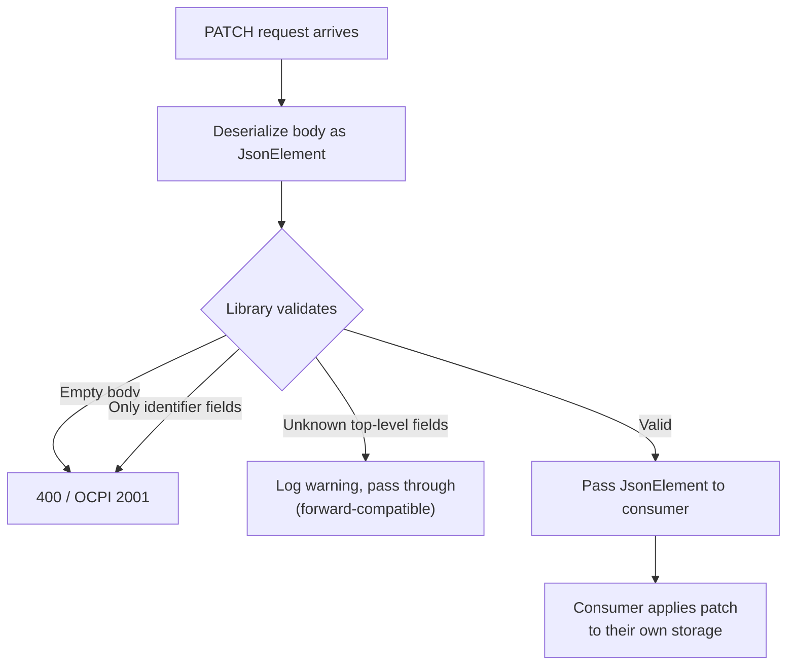

### Why Passthrough?

1. **Storage-agnostic** — the library does not own the data store, so it cannot apply patches directly.
2. **Consumer flexibility** — consumers may use SQL `UPDATE SET`, document DB partial update, or in-memory merge. Applying the patch is a storage concern.
3. **No data loss** — the library cannot guarantee it has the full current object to merge against (it may have been stored externally).

### Validation the Library Provides

Before passing to the consumer:

1. **Non-empty body** — PATCH with empty `{}` is rejected (OCPI 2001).
2. **At least one non-identifier field** — PATCH with only `country_code`, `party_id`, or `id` is rejected. The spec says "at least one field besides the identifier fields must be set."
3. **Field type checking** — if a field is present, its JSON type must be compatible (e.g., `kwh` must be a number, not a string).
4. **URL path/body consistency** (2.2+) — if `country_code` or `party_id` is in the body, it must match the URL path values.

### Consumer Interface

```csharp
// All PATCH handlers receive JsonElement — not a typed model
Task<OcpiResult> OnLocationPatchAsync(
    OcpiRequestContext context,
    string locationId,
    JsonElement patch,       // Raw JSON patch document
    CancellationToken ct);
```

### Consumer Helper (Optional)

The library provides a helper for consumers who want to apply JSON merge semantics:

```csharp
public static class OcpiPatchHelper
{
    /// <summary>
    /// Applies a JSON merge patch to an existing object.
    /// Uses RFC 7396 semantics: null removes, present overwrites, absent leaves unchanged.
    /// </summary>
    public static T ApplyPatch<T>(T existing, JsonElement patch, JsonTypeInfo<T> typeInfo);
}
```

---

## 15. Type Convention Strategy

### CiString (Case-Insensitive String)

OCPI defines `CiString` as a string type where comparisons must be case-insensitive, but the original casing is preserved in storage and serialization.

**Library approach:** `CiString` is represented as a `readonly record struct`:

```csharp
[JsonConverter(typeof(CiStringJsonConverter))]
public readonly record struct CiString : IEquatable<CiString>, IComparable<CiString>
{
    public string Value { get; }

    public CiString(string value) => Value = value;

    // Equality is case-insensitive
    public bool Equals(CiString other) =>
        string.Equals(Value, other.Value, StringComparison.OrdinalIgnoreCase);

    public override int GetHashCode() =>
        StringComparer.OrdinalIgnoreCase.GetHashCode(Value);

    // Serializes as the original string value (preserves case)
    public override string ToString() => Value;

    // Implicit conversion from string for convenience
    public static implicit operator CiString(string value) => new(value);
    public static implicit operator string(CiString ci) => ci.Value;
}
```

**Usage in models:**

```csharp
// V2_2_1/Location.cs
public sealed class Location
{
    public required CiString CountryCode { get; init; }  // CiString(2)
    public required CiString PartyId { get; init; }      // CiString(3)
    public required CiString Id { get; init; }           // CiString(36)
    // ...
}
```

**Length validation:** Max length is enforced via `[MaxLength]` on the model, not in the `CiString` type itself. `CiString` is a comparison/equality concern, not a validation concern.

**In 2.0/2.1.1 models:** Fields are plain `string`, not `CiString`, because CiString was introduced in OCPI 2.2.

### The `#NA` Sentinel

OCPI allows the literal string `"#NA"` in required string fields when the value genuinely cannot be populated (e.g., a Location with unknown postal code).

**Library approach:**

```csharp
public static class OcpiSentinel
{
    public const string NotAvailable = "#NA";

    public static bool IsNotAvailable(string? value) =>
        string.Equals(value, NotAvailable, StringComparison.Ordinal);
}
```

- **Validation:** The library accepts `"#NA"` on required string fields without rejecting for empty/missing.
- **Consumer awareness:** The `OcpiRequestContext` includes a helper `context.IsFieldNotAvailable(fieldValue)` so consumers can detect and handle `#NA` in their business logic.
- **Serialization:** `"#NA"` is serialized/deserialized as a normal string. No special JSON handling.

---

## 16. Exception Strategy

### Design: Exceptions Are for Infrastructure, Not Protocol

OCPI protocol errors (status codes 2xxx, 3xxx) are returned via `OcpiResult<T>`. Exceptions are reserved for failures outside the OCPI protocol:

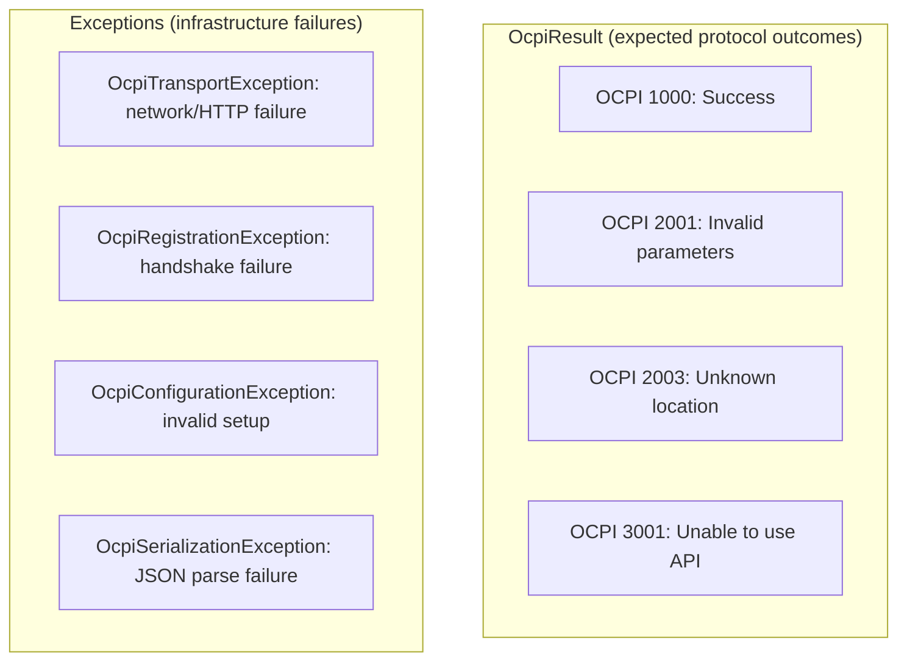

### Exception Hierarchy

```csharp
/// <summary>Base exception for all DotOcpi infrastructure failures.</summary>
public abstract class OcpiException : Exception
{
    public string? CpoId { get; init; }
    public OcpiVersion? Version { get; init; }
}

/// <summary>Network or HTTP-level failure when communicating with a CPO.</summary>
public class OcpiTransportException : OcpiException
{
    public HttpStatusCode? StatusCode { get; init; }
    public string? RequestId { get; init; }
}

/// <summary>Handshake or credential exchange failure.</summary>
public class OcpiRegistrationException : OcpiException
{
    public RegistrationFailureReason Reason { get; init; }
}

/// <summary>Invalid library configuration detected at startup or runtime.</summary>
public class OcpiConfigurationException : OcpiException { }

/// <summary>JSON serialization or deserialization failure for OCPI models.</summary>
public class OcpiSerializationException : OcpiException
{
    public string? ModuleId { get; init; }
}
```

### When Each Exception Is Thrown

| Exception | Thrown When | Consumer Action |
|---|---|---|
| `OcpiTransportException` | DNS failure, connection refused, timeout, non-OCPI HTTP response | Retry (if GET) or resync later |
| `OcpiRegistrationException` | Version discovery fails, CPO rejects credentials, Token A expired | Check CPO connectivity, re-provision Token A |
| `OcpiConfigurationException` | No `SupportedVersions` configured, `BaseUrl` missing, conflicting options | Fix configuration and restart |
| `OcpiSerializationException` | CPO sends malformed JSON, unknown enum value with strict parsing | Log and investigate CPO compatibility |

### Server-Side Exception Handling

Consumer handler exceptions are caught by the library and returned as OCPI 3000 (generic server error). The original exception is logged at Error level but never exposed to the CPO:

```csharp
try
{
    var result = await consumer.OnLocationPutAsync(context, locationId, location, ct);
    return result.ToResponse();
}
catch (Exception ex)
{
    logger.ConsumerHandlerFailed(ex, context.CpoId, context.ModuleId);
    return OcpiResponse.ServerError("Internal processing error");
}
```

---

## 17. Testing Strategy (DotOcpi.Testing)

### Purpose

`DotOcpi.Testing` ships an in-memory OCPI-compliant CPO that consumers use in their integration tests. It removes the need for a real CPO during testing while ensuring protocol compliance.

### OcpiTestCpoServer

```csharp
public sealed class OcpiTestCpoServer : IAsyncDisposable
{
    /// <summary>Create a test CPO with configurable behavior.</summary>
    public static OcpiTestCpoServer Create(Action<TestCpoConfiguration>? configure = null);

    /// <summary>The base URL of the test CPO (in-memory, no real HTTP).</summary>
    public Uri BaseUrl { get; }

    /// <summary>Token A for initiating registration.</summary>
    public string TokenA { get; }

    /// <summary>Configure module responses.</summary>
    public TestCpoConfiguration Configuration { get; }
}
```

### Configuration

```csharp
public sealed class TestCpoConfiguration
{
    /// <summary>OCPI versions this test CPO supports.</summary>
    public IReadOnlyList<OcpiVersion> SupportedVersions { get; set; } = [OcpiVersion.V2_2_1];

    /// <summary>CPO identity.</summary>
    public PartyIdentity CpoIdentity { get; set; } = new("DE", "CPO");

    /// <summary>Pre-configured locations returned by GET.</summary>
    public List<object> Locations { get; set; } = [];

    /// <summary>Pre-configured tariffs.</summary>
    public List<object> Tariffs { get; set; } = [];

    /// <summary>Behavior for POST /commands.</summary>
    public CommandBehavior CommandBehavior { get; set; } = CommandBehavior.AcceptAll;

    /// <summary>Simulate failures.</summary>
    public FailureInjection? FailureInjection { get; set; }
}
```

### Consumer Usage

```csharp
public class MyLocationsHandlerTests : IAsyncLifetime
{
    private OcpiTestCpoServer _testCpo = null!;
    private WebApplicationFactory<Program> _factory = null!;

    public async Task InitializeAsync()
    {
        _testCpo = OcpiTestCpoServer.Create(config =>
        {
            config.SupportedVersions = [OcpiVersion.V2_2_1];
            config.Locations.Add(TestData.CreateLocation());
        });

        _factory = new WebApplicationFactory<Program>()
            .WithWebHostBuilder(builder =>
            {
                builder.ConfigureServices(services =>
                {
                    services.AddDotOcpi(options =>
                    {
                        options.SupportedVersions = [OcpiVersion.V2_2_1];
                    })
                    .AddTestCpoServer(_testCpo);
                });
            });
    }

    [Fact]
    public async Task PullLocations_ReturnsConfiguredLocations()
    {
        var client = _factory.Services.GetRequiredService<IOcpiClient>();

        // Register with the test CPO
        await client.Registration.RegisterAsync(
            _testCpo.BaseUrl, _testCpo.TokenA);

        // Pull locations
        var result = await client.Locations.GetAllAsync("DE_CPO");

        result.IsSuccess.Should().BeTrue();
        result.Data.Should().HaveCount(1);
    }

    // ...
}
```

### Failure Injection

```csharp
_testCpo = OcpiTestCpoServer.Create(config =>
{
    // Simulate CPO returning errors
    config.FailureInjection = new FailureInjection
    {
        FailRegistration = false,
        LocationsGetStatusCode = 3000,      // OCPI server error
        CommandsResponseDelay = TimeSpan.FromSeconds(35), // Timeout
        HttpFailureRate = 0.1,              // 10% of requests return 503
    };
});
```

---

## 18. Security Strategy

Implementation details for the security rules defined in CLAUDE.md. Each subsection references the corresponding rule number.

### 18.1 URL Validation (SSRF Prevention)

**Rules 8, 11.** CPOs provide endpoint URLs during version discovery and `response_url` in Commands/ChargingProfiles. The library makes outbound HTTP requests to these URLs — without validation, a malicious CPO could target internal services.

```csharp
internal static class OcpiUrlValidator
{
    private static readonly IPNetwork[] s_blockedNetworks =
    [
        IPNetwork.Parse("127.0.0.0/8"),       // Loopback
        IPNetwork.Parse("10.0.0.0/8"),        // RFC 1918 private
        IPNetwork.Parse("172.16.0.0/12"),     // RFC 1918 private
        IPNetwork.Parse("192.168.0.0/16"),    // RFC 1918 private
        IPNetwork.Parse("169.254.0.0/16"),    // Link-local / cloud metadata
        IPNetwork.Parse("::1/128"),           // IPv6 loopback
        IPNetwork.Parse("fc00::/7"),          // IPv6 ULA (RFC 4193)
        IPNetwork.Parse("fe80::/10"),         // IPv6 link-local
    ];

    public static async ValueTask<UrlValidationResult> ValidateAsync(
        Uri url, DotOcpiSecurityOptions options, CancellationToken ct)
    {
        // Scheme: HTTPS only
        if (url.Scheme != Uri.UriSchemeHttps)
            return UrlValidationResult.Fail("URL must use HTTPS scheme");

        // Port: 443 unless explicitly allowed
        int port = url.IsDefaultPort ? 443 : url.Port;
        if (port != 443 && !options.AllowedPorts.Contains(port))
            return UrlValidationResult.Fail($"Port {port} is not allowed");

        // DNS resolution — validate all resolved IPs are non-private
        var addresses = await Dns.GetHostAddressesAsync(url.Host, ct);

        foreach (var address in addresses)
        {
            if (IPAddress.IsLoopback(address))
                return UrlValidationResult.Fail("Loopback addresses are blocked");

            foreach (var network in s_blockedNetworks)
            {
                if (network.Contains(address))
                    return UrlValidationResult.Fail(
                        $"Address {address} falls within blocked range {network}");
            }
        }

        return UrlValidationResult.Ok;
    }
}
```

Applied at: version discovery response parsing, credentials POST/PUT endpoint URLs, `response_url` in `StartSession`/`StopSession`/`ReserveNow`/`UnlockConnector`, `response_url` in `SetChargingProfile`.

### 18.2 Request Body Size Limits

**Rule 10.** Per-endpoint limits prevent OOM from oversized payloads. See [performance.md — Section 9](performance.md#9-request--response-size-limits) for the endpoint filter implementation.

| Endpoint Category | Max Body Size | Rationale |
|---|---|---|
| PUT Location/Session/Token/Tariff | 256 KB | Single object; largest is Location with many EVSEs |
| POST CDR | 1 MB | CDR with detailed charging periods and signed data |
| PATCH (any) | 64 KB | Partial update — should be small |
| POST /credentials | 16 KB | Credentials object is small |
| POST /authorize | 8 KB | Token UID + LocationReferences |
| POST command callback | 16 KB | CommandResult is small |

Limits are configurable via `DotOcpiOptions.BodySizeLimits` for consumers who need to adjust.

### 18.3 JSON Deserialization Safety

**Rule 14.** Set `MaxDepth` on all `JsonSerializerOptions` to prevent stack overflow from deeply nested payloads.

```csharp
private static JsonSerializerOptions CreateOptions(JsonSerializerContext context)
{
    var options = new JsonSerializerOptions
    {
        TypeInfoResolver = context,
        PropertyNamingPolicy = JsonNamingPolicy.SnakeCaseLower,
        DefaultIgnoreCondition = JsonIgnoreCondition.WhenWritingNull,
        MaxDepth = 32  // OCPI models nest ~5-6 levels; 32 blocks pathological input
    };
    options.MakeReadOnly();
    return options;
}
```

Additional safety properties enforced by `System.Text.Json` defaults:
- No polymorphic deserialization — `UnknownTypeHandling.JsonElement` (default) prevents type confusion
- No `$type` discriminator processing unless explicitly configured (never configured in DotOcpi)
- String length implicitly bounded by `MaxRequestBodySize` (Section 18.2)

### 18.4 Security Response Headers

**Rule 12.** Applied as an endpoint filter to all OCPI endpoint groups.

```csharp
internal sealed class OcpiSecurityHeadersFilter : IEndpointFilter
{
    public async ValueTask<object?> InvokeAsync(
        EndpointFilterInvocationContext context,
        EndpointFilterDelegate next)
    {
        var response = context.HttpContext.Response;
        response.Headers["X-Content-Type-Options"] = "nosniff";
        response.Headers["Cache-Control"] = "no-store";
        response.Headers["X-Frame-Options"] = "DENY";

        return await next(context);
    }
}
```

Headers rationale:
- **`X-Content-Type-Options: nosniff`** — prevents browsers from MIME-sniffing JSON responses as HTML (defense-in-depth; OCPI is server-to-server but responses may be proxied)
- **`Cache-Control: no-store`** — OCPI responses may contain authorization data, session tokens, or PII. Prevents intermediate proxies/CDNs from caching
- **`X-Frame-Options: DENY`** — prevents embedding OCPI API responses in iframes (defense-in-depth)
- **HSTS** (`Strict-Transport-Security`) is the consumer's responsibility since DotOcpi does not own TLS termination. Recommended: `Strict-Transport-Security: max-age=31536000; includeSubDomains`

### 18.5 Error Information Disclosure

**Rule 13.** OCPI error responses must never leak internal details. The library wraps unhandled exceptions in a generic OCPI 3000 response.

```csharp
internal sealed class OcpiExceptionMiddleware(
    RequestDelegate next,
    ILogger<OcpiExceptionMiddleware> logger,
    IHostEnvironment environment,
    IOptions<DotOcpiOptions> options)
{
    public async Task InvokeAsync(HttpContext httpContext)
    {
        try
        {
            await next(httpContext);
        }
        catch (Exception ex) when (httpContext.GetEndpoint()?.Metadata
            .GetMetadata<OcpiEndpointMetadata>() is not null)
        {
            // Log full details server-side (source-generated, zero-alloc when disabled)
            Log.UnhandledOcpiException(logger, ex);

            httpContext.Response.StatusCode = StatusCodes.Status200OK;
            httpContext.Response.ContentType = "application/json";

            var message = "Internal processing error";
            if (environment.IsDevelopment()
                && options.Value.IncludeExceptionTypeInDevelopment)
            {
                // Dev only: exception type name (never message or stack trace)
                message = $"Internal processing error ({ex.GetType().Name})";
            }

            await OcpiResponseWriter.WriteErrorAsync(
                httpContext.Response,
                new OcpiStatusCode(3000),
                message,
                httpContext.RequestAborted);
        }
    }

    private static partial class Log
    {
        [LoggerMessage(EventId = 4005, Level = LogLevel.Error,
            Message = "Unhandled exception in OCPI endpoint")]
        public static partial void UnhandledOcpiException(
            ILogger logger, Exception exception);
    }
}
```

What is never included in OCPI error responses:
- Exception messages (may contain SQL, file paths, connection strings)
- Stack traces
- Internal hostnames or IP addresses
- Assembly/namespace names (except exception type name in dev mode, opt-in)
- Database schema or query details

### 18.6 Token Rotation Atomicity

**Rule 15.** During credential update (PUT /credentials), Token C replaces Token B. The swap must not create a window where no valid token exists.

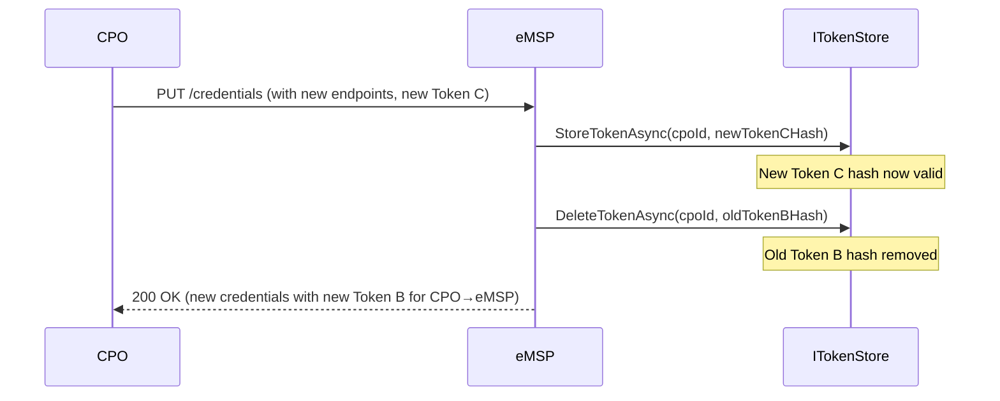

The `ITokenStore` contract:

```csharp
public interface ITokenStore
{
    /// <summary>
    /// Atomically rotates a token: stores the new hash, then removes the old.
    /// If the store supports transactions, both operations are in one transaction.
    /// If not, store-first-delete-second ensures no zero-validity window.
    /// </summary>
    Task RotateTokenAsync(
        string cpoId,
        string oldTokenHash,
        string newTokenHash,
        CancellationToken ct);
}
```

The brief dual-validity window (both old and new tokens accepted) is an acceptable trade-off. The alternative — delete-first-store-second — risks locking out the CPO if the store operation fails between steps.

### 18.7 Dependency Vulnerability Scanning

CI pipeline should include vulnerability scanning on every PR and on a weekly schedule for supply chain monitoring.

```yaml
# .github/workflows/ci.yml
- name: Check for vulnerable packages
  run: |
    output=$(dotnet list package --vulnerable --include-transitive --format json)
    if echo "$output" | jq -e '
      .projects[].frameworks[] |
      (.topLevelPackages[]?.vulnerabilities[]?, .transitivePackages[]?.vulnerabilities[]?) |
      select(.severity == "High" or .severity == "Critical")
    ' > /dev/null 2>&1; then
      echo "::error::High/Critical vulnerability detected in dependencies"
      echo "$output" | jq '
        .projects[].frameworks[] |
        (.topLevelPackages[]?.vulnerabilities[]?, .transitivePackages[]?.vulnerabilities[]?)
      '
      exit 1
    fi
```

```yaml
# .github/workflows/dependency-scan.yml
on:
  schedule:
    - cron: '0 8 * * 1'  # Weekly Monday 08:00 UTC
```

Update dependencies when vulnerabilities are found. Pin to fixed versions in `Directory.Packages.props`.

### 18.8 Configuration Security

**Rule 16.** Token A is a pre-shared secret — it must never appear in committed configuration files.

```csharp
internal sealed class DotOcpiOptionsValidator : IValidateOptions<DotOcpiOptions>
{
    private readonly IConfiguration _configuration;

    public DotOcpiOptionsValidator(IConfiguration configuration)
        => _configuration = configuration;

    public ValidateOptionsResult Validate(string? name, DotOcpiOptions options)
    {
        if (_configuration is not IConfigurationRoot root)
            return ValidateOptionsResult.Success;

        foreach (var cpo in options.CpoConnections)
        {
            if (string.IsNullOrEmpty(cpo.TokenA)) continue;

            var configPath = $"DotOcpi:CpoConnections:{cpo.CpoId}:TokenA";

            // Only flag committed config files (appsettings.json, etc.)
            // user-secrets, environment variables, and Key Vault are acceptable
            foreach (var provider in root.Providers)
            {
                if (provider is FileConfigurationProvider fileProvider
                    && fileProvider.TryGet(configPath, out _)
                    && fileProvider.Source is FileConfigurationSource source
                    && !source.Path.Contains("secrets.json", StringComparison.OrdinalIgnoreCase))
                {
                    return ValidateOptionsResult.Fail(
                        $"""
                        TokenA for CPO '{cpo.CpoId}' found in a file-based configuration source ({source.Path}).
                        Use a secrets provider instead (dotnet user-secrets, Azure Key Vault, environment variables).
                        """);
                }
            }
        }

        return ValidateOptionsResult.Success;
    }
}
```

Recommended consumer configuration pattern:

```csharp
// Program.cs
builder.Configuration.AddUserSecrets<Program>();          // Development
builder.Configuration.AddAzureKeyVault(vaultUri, credential);  // Production

builder.Services.AddDotOcpi(options =>
{
    // Token A comes from secrets provider, not appsettings.json
    options.CpoConnections.Add(new CpoConnectionOptions
    {
        CpoId = "CPO-001",
        TokenA = builder.Configuration["Ocpi:Cpo001:TokenA"]!,
        VersionsUrl = new Uri("https://cpo.example.com/ocpi/versions")
    });
});
```
