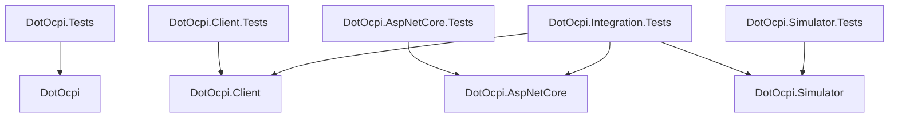
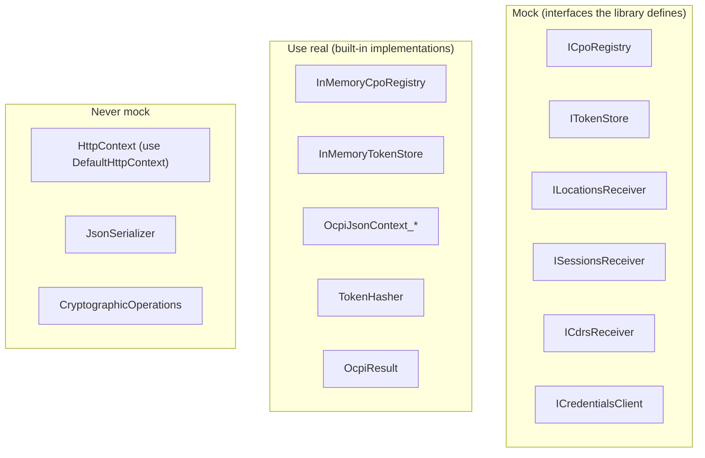
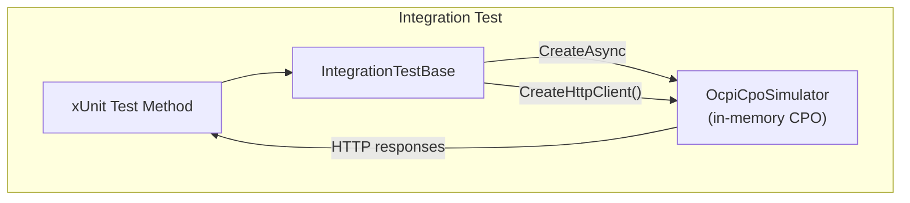
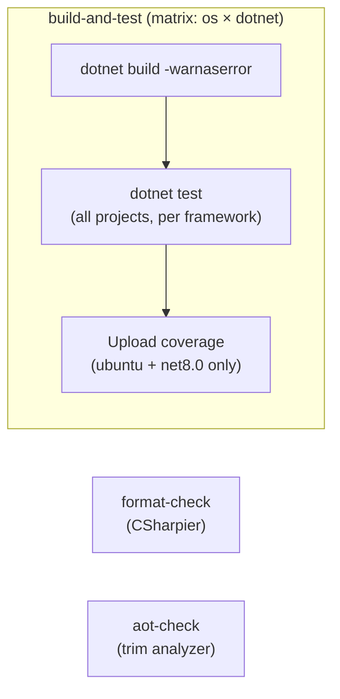

# DotOcpi Testing Strategy

How the library itself is tested, and how consumers test their integrations.

## Table of Contents

- [1. Testing Principles](#1-testing-principles)
- [2. Test Project Structure](#2-test-project-structure)
- [3. Unit Testing Strategy](#3-unit-testing-strategy)
- [4. Handler Endpoint Testing](#4-handler-endpoint-testing)
- [5. Integration Testing Strategy](#5-integration-testing-strategy)
- [6. Multi-Version Test Matrix](#6-multi-version-test-matrix)
- [7. Test Data Strategy](#7-test-data-strategy)
- [8. Security Testing](#8-security-testing)
- [9. Serialization Testing](#9-serialization-testing)
- [10. Consumer Testing (DotOcpi.Simulator)](#10-consumer-testing-dotocpisimulator)
- [11. Sync Testing](#11-sync-testing)
- [12. CI/CD Pipeline](#12-cicd-pipeline)

---

## 1. Testing Principles

- **Every public API surface is tested.** If it's public, it has tests. No exceptions.
- **Tests document behavior.** A developer should be able to read a test and understand the expected behavior without reading the implementation.
- **No test pollution.** Each test is independent. No shared mutable state. No ordering dependencies. No real delays.
- **Test at the right level.** Unit tests for logic, integration tests for pipeline behavior, no end-to-end tests against real CPOs in CI.
- **Version-aware.** Every module behavior that differs across OCPI versions must be tested per version.
- **Security tests are mandatory.** Every crypto, auth, and token code path has explicit security tests.

### Testing Stack

| Tool | Purpose |
|---|---|
| **xUnit** | Test framework |
| **FluentAssertions** | Assertion library |
| **NSubstitute** | Mocking (interfaces only) |
| **OcpiCpoSimulator** | In-memory CPO server for integration tests |
| **BenchmarkDotNet** | Performance benchmarks (separate project, not in CI) |

### Test Naming Convention

```
MethodName_Condition_ExpectedResult
```

Examples:
- `ValidateToken_ValidTokenHash_ReturnsSuccess`
- `HandlePut_MissingRequiredField_ReturnsOcpi2001`
- `RegisterAsync_CpoRejectsCredentials_ThrowsRegistrationException`
- `Serialize_LocationV221_ProducesSnakeCaseJson`

### Test Structure

```csharp
[Fact]
public async Task HandlePut_ValidLocation_InvokesConsumerAndReturns1000()
{
    // Arrange
    var receiver = Substitute.For<ILocationsReceiver>();
    receiver.OnLocationPutAsync(Arg.Any<OcpiRequestContext>(), Arg.Any<string>(),
        Arg.Any<object>(), Arg.Any<CancellationToken>())
        .Returns(OcpiResult.Success());
    var handler = new LocationsReceiverHandler_V2_2_1(receiver);

    // Act
    var result = await handler.HandlePutAsync(request);

    // Assert
    result.StatusCode.Should().Be(OcpiStatusCode.Success);
    await receiver.Received(1).OnLocationPutAsync(
        Arg.Any<OcpiRequestContext>(), "LOC001",
        Arg.Any<object>(), Arg.Any<CancellationToken>());
}
```

---

## 2. Test Project Structure

```
tests/
├── DotOcpi.Tests/                    # Unit tests for core library
│   ├── DotOcpi.Tests.csproj
│   ├── CiStringTests.cs
│   ├── GeoLocationTests.cs
│   ├── OcpiResultTests.cs
│   ├── OcpiSentinelTests.cs
│   ├── OcpiStatusCodeTests.cs
│   ├── OcpiVersionTests.cs
│   ├── PartyIdentityTests.cs
│   ├── Configuration/
│   │   ├── DotOcpiBuilderTests.cs
│   │   └── DotOcpiOptionsTests.cs
│   ├── Models/
│   │   └── V2_2_1/
│   │       └── LocationTests.cs
│   ├── Observability/
│   │   └── OcpiMetricsTests.cs
│   ├── Registration/
│   │   ├── CredentialRotationTests.cs
│   │   ├── CredentialsClientTests.cs
│   │   ├── RegistrationOrchestratorTests.cs
│   │   ├── TestCredentials.cs
│   │   ├── VersionDiscoveryTests.cs
│   │   └── VersionNegotiatorTests.cs
│   ├── Registry/
│   │   ├── CpoConnectionTests.cs
│   │   ├── CpoHealthMonitorTests.cs
│   │   └── InMemoryCpoRegistryTests.cs
│   ├── Security/
│   │   ├── AuthorizationHeaderParserTests.cs
│   │   ├── InMemoryTokenStoreTests.cs
│   │   ├── OcpiTokenValidatorTests.cs
│   │   ├── TokenGeneratorTests.cs
│   │   └── TokenHasherTests.cs
│   ├── Serialization/
│   │   ├── ConverterTests.cs
│   │   ├── EnumSerializationTests.cs
│   │   ├── FixtureDeserializationTests.cs
│   │   ├── NullHandlingTests.cs
│   │   ├── OcpiJsonOptionsTests.cs
│   │   ├── SerializationRoundTripTests.cs
│   │   └── SnakeCaseTests.cs
│   ├── Validation/
│   │   ├── CdrValidatorTests.cs
│   │   ├── ChargingProfileValidatorTests.cs
│   │   ├── CommandValidatorTests.cs
│   │   ├── CredentialsValidatorTests.cs
│   │   ├── LocationValidatorTests.cs
│   │   ├── PatchValidatorTests.cs
│   │   ├── SessionValidatorTests.cs
│   │   ├── TariffValidatorTests.cs
│   │   ├── TokenValidatorTests.cs
│   │   └── ValidationResultTests.cs
│   └── Fixtures/
│       ├── FakeHttpHandler.cs
│       ├── TestData.cs               # Shared test data factories
│       ├── TestMeterFactory.cs
│       └── Json/                     # JSON fixture files per version
│           ├── connector-v2_2_1.json
│           ├── location-v2_2_1.json
│           ├── session-v2_2_1.json
│           ├── tariff-v2_2_1.json
│           └── token-v2_2_1.json
│
├── DotOcpi.Client.Tests/             # Unit tests for client library
│   ├── DotOcpi.Client.Tests.csproj
│   ├── CdrsClientTests.cs
│   ├── ChargingProfilesClientTests.cs
│   ├── CommandsClientTests.cs
│   ├── LocationsClientTests.cs
│   ├── PullClientTestHelper.cs
│   ├── SessionsClientTests.cs
│   ├── TariffsClientTests.cs
│   ├── TestJsonData.cs
│   ├── TokensClientTests.cs
│   ├── Fixtures/
│   │   └── FakeTimeProvider.cs
│   ├── Internal/
│   │   ├── CpoConnectionContextProviderTests.cs
│   │   ├── InMemoryCallbackStoreTests.cs
│   │   ├── InvalidatingRegistrationClientTests.cs
│   │   ├── MockHttpMessageHandler.cs
│   │   ├── OcpiHttpRequestBuilderTests.cs
│   │   ├── OcpiResponseParserTests.cs
│   │   ├── PaginationHandlerTests.cs
│   │   └── SsrfGuardTests.cs
│   └── Sync/
│       ├── InMemorySyncStateStoreTests.cs
│       ├── OcpiPullSyncBackgroundServiceTests.cs
│       ├── OcpiSyncServiceTests.cs
│       ├── PullSyncOptionsResolverTests.cs
│       └── PullSyncOptionsValidatorTests.cs
│
├── DotOcpi.AspNetCore.Tests/         # Unit + integration for server
│   ├── DotOcpi.AspNetCore.Tests.csproj
│   ├── OcpiHttpContextExtensionsTests.cs
│   ├── Filters/
│   │   ├── OcpiAuthFilterTests.cs
│   │   ├── OcpiBodySizeLimitFilterTests.cs
│   │   ├── OcpiRequestIdFilterTests.cs
│   │   └── OcpiValidationFilterTests.cs
│   ├── Handlers/
│   │   ├── OcpiEndpointTestHelper.cs   # Shared test infrastructure
│   │   ├── Locations/LocationsEndpointsTests.cs
│   │   ├── Sessions/SessionsEndpointsTests.cs
│   │   ├── Cdrs/CdrsEndpointsTests.cs
│   │   ├── Tariffs/TariffsEndpointsTests.cs
│   │   ├── Tokens/TokensEndpointsTests.cs
│   │   ├── Commands/CommandsEndpointsTests.cs
│   │   ├── ChargingProfiles/ChargingProfilesEndpointsTests.cs
│   │   └── Credentials/CredentialsEndpointsTests.cs
│   ├── HealthChecks/
│   │   ├── OcpiCpoHealthCheckTests.cs
│   │   ├── OcpiRegistryHealthCheckTests.cs
│   │   └── OcpiTokenStoreHealthCheckTests.cs
│   ├── Middleware/
│   │   ├── OcpiExceptionMiddlewareTests.cs
│   │   └── OcpiRateLimitingMiddlewareTests.cs
│   └── Routing/
│       └── OcpiEndpointRouteBuilderExtensionsTests.cs
│
├── DotOcpi.Integration.Tests/        # Full pipeline integration tests
│   ├── DotOcpi.Integration.Tests.csproj
│   ├── ModuleDataFlowTests.cs
│   ├── OcpiStatusCodeTests.cs
│   ├── RegistrationFlowTests.cs
│   ├── SecurityFlowTests.cs
│   └── Fixtures/
│       ├── CapturingLocationsReceiver.cs
│       ├── IntegrationTestBase.cs
│       └── TestCredentialsHelper.cs
│
└── DotOcpi.Simulator.Tests/          # Tests for the simulator package
    ├── DotOcpi.Simulator.Tests.csproj
    ├── ChargingSimulationTests.cs
    ├── EvseStateMachineTests.cs
    ├── OcpiCpoSimulatorTests.cs
    └── TypedModeTests.cs
```

### Test Project Dependencies



---

## 3. Unit Testing Strategy

### What Gets Unit Tested

| Component | What To Test | What To Mock |
|---|---|---|
| **OcpiResult** | Success/failure construction, `IsSuccess`, status codes | Nothing |
| **CiString** | Equality (case-insensitive), hash code, conversion, serialization | Nothing |
| **OcpiSentinel** | `IsNotAvailable()` with `#NA`, empty, null, other values | Nothing |
| **PartyIdentity** | `ToString()`, equality, deterministic ID generation | Nothing |
| **TokenGenerator** | Output length, uniqueness, base64url format | Nothing |
| **TokenHasher** | Hash consistency, different inputs produce different hashes | Nothing |
| **TokenValidator** | Valid token → success, missing → missing, invalid → invalid, timing-safety | `ICpoRegistry` |
| **InMemoryTokenStore** | Store/get/remove/validate lifecycle | Nothing |
| **InMemoryCpoRegistry** | CRUD operations, lookup by ID/token/party, concurrent access | Nothing |
| **OcpiJsonContext per version** | Round-trip serialize/deserialize for every model type | Nothing |
| **Custom JsonConverters** | DateTime format, enum values, CiString serialization | Nothing |
| **IOcpiValidator<T>** | Valid models pass, invalid models fail with correct error | Nothing |
| **Registration orchestrator** | Happy path, version mismatch, CPO rejection, timeout | `ICredentialsClient`, `IVersionDiscovery`, `ITokenStore`, `ICpoRegistry` |
| **Module handlers** | Deserialize → invoke consumer → return correct HTTP + OCPI response | `ILocationsReceiver`, etc. (see [Handler Endpoint Testing](#4-handler-endpoint-testing)) |
| **PaginationHandler** | Follow Link headers, accumulate results, handle missing headers | `HttpMessageHandler` |
| **OcpiResponseParser** | Parse OCPI envelope, extract data, map status codes | Nothing |

### What Does NOT Get Unit Tested

- ASP.NET Core pipeline behavior (tested in integration tests)
- Real HTTP calls (tested via `OcpiCpoSimulator` in integration tests)
- Real cryptographic randomness quality (verified by security audits)

### Mocking Guidelines



- **Mock interfaces, not implementations.** Use `NSubstitute` for `ICpoRegistry`, `ITokenStore`, `ILocationsReceiver`, etc.
- **Use real implementations** for value types, serializers, and built-in stores in unit tests. They're deterministic and fast.
- **Use `DefaultHttpContext`** (not mocked) for middleware tests.
- **Use `MockHttpMessageHandler`** for HTTP client tests (inject via `IHttpClientFactory`).

---

## 4. Handler Endpoint Testing

Handler endpoint tests verify the server-side module handlers in isolation — no HTTP pipeline, no auth, no routing. They use `DefaultHttpContext` directly against the static handler methods, with `NSubstitute` mocks for consumer interfaces.

### Test Infrastructure

All handler endpoint tests share infrastructure via `OcpiEndpointTestHelper`:

```csharp
internal static class OcpiEndpointTestHelper
{
    // Shared CpoConnection used across all handler tests
    internal static readonly CpoConnection TestConnection = new() { ... };

    // Creates an OcpiRequestContext for a given version and module
    internal static OcpiRequestContext CreateContext(OcpiVersion version, string moduleId);

    // Creates a DefaultHttpContext with DI, OCPI context, and optional JSON body
    internal static DefaultHttpContext CreateHttpContext<TService>(
        TService service, OcpiVersion version, string moduleId, string? body = null);

    // Reads the response body as a string for assertion
    internal static string ReadResponseBody(DefaultHttpContext httpContext);
}
```

Each module test file creates a thin wrapper that fills in the module-specific parameters:

```csharp
private static DefaultHttpContext CreateHttpContext(
    ILocationsReceiver receiver, OcpiVersion version, string? body = null)
    => OcpiEndpointTestHelper.CreateHttpContext(receiver, version, "locations", body);
```

### What Each Handler Test Must Verify

Every handler endpoint test must check **both sides** of the handler — the delegation to the consumer interface **and** the HTTP response sent back to the CPO:

| Aspect | Assertion | Why |
|---|---|---|
| **HTTP status code** | `httpContext.Response.StatusCode.Should().Be(200)` | Proves the handler sets the correct HTTP status |
| **OCPI status code in body** | `body.Should().Contain("1000")` | Proves the OCPI envelope is correct |
| **Consumer invoked** | `receiver.Received(1).OnXxxAsync(...)` | Proves the handler delegates correctly |
| **Correct model type** | `Arg.Is<object>(o => o is Models.V2_2_1.Location)` | Proves version-specific deserialization works |
| **Route values passed** | `"LOC1"` in `Received()` matcher | Proves route parameter extraction works |

Tests that only check `.Received(1)` without response assertions are incomplete — they verify plumbing but not behavior.

### Required Test Categories Per Module

| Category | What It Tests | Example |
|---|---|---|
| **Happy path (per version)** | Version dispatch: correct model type deserialized | `HandleLocationPut_V221_DeserializesAndCallsReceiver` |
| **Empty body** | Missing request body returns HTTP 400 | `HandleLocationPut_EmptyBody_Returns400` |
| **Invalid JSON** | Malformed JSON returns HTTP 400 with "invalid JSON" message | `HandleLocationPut_InvalidJson_Returns400` |
| **Consumer client error** | 2xxx OCPI status → HTTP 400 | `HandleLocationPut_ReceiverClientError_Returns400` |
| **Consumer server error** | 3xxx OCPI status → HTTP 500 | `HandleLocationPut_ReceiverServerError_Returns500` |
| **GET with data** | Successful GET returns data in response body | `HandleLocationGet_ReturnsDataFromReceiver` |
| **GET not found** | Consumer returns failure → HTTP 400 with OCPI error | `HandleLocationGet_ReceiverFailure_Returns400` |
| **PATCH content** | `JsonElement` contains correct properties | `HandleLocationPatch_PassesJsonElementToReceiver` |
| **PATCH non-object body** | Array body returns HTTP 400 | `HandleSessionPatch_ArrayBody_Returns400` |

### Module-Specific Tests

Some modules have unique behaviors that require dedicated tests:

**CDRs** — POST idempotency: new CDR returns 201 + Location header, duplicate returns 200. Location header format differs by version (party-prefixed in 2.2+, flat in 2.0/2.1.1).

**Tariffs** — PATCH version restriction: 2.2+ returns 405 Method Not Allowed, 2.0/2.1.1 supports PATCH with JsonElement.

**Tokens** — Pagination: GET returns X-Total-Count, X-Limit, and Link headers. Link header preserves date_from/date_to query parameters. Negative offset is clamped to zero. Limit is clamped to the maximum (1000).

**Tokens (authorize)** — Optional body: POST authorize works with or without a LocationReferences body. Invalid JSON in body returns 400 without invoking the authorizer.

**ChargingProfiles** — Only available for 2.2+ versions (skipped for 2.0/2.1.1 in routing).

### Error Mapping

The response writer maps OCPI status codes to HTTP status codes:

| OCPI Status Range | HTTP Status | Example |
|---|---|---|
| 1xxx (success) | 200 OK | `OcpiResult.Success()` |
| 2xxx (client error) | 400 Bad Request | `OcpiStatusCode.GenericClientError` |
| 3xxx (server error) | 500 Internal Server Error | `OcpiStatusCode.GenericServerError` |

This mapping must be tested — it was a post-audit addition and is critical for correct CPO behavior.

---

## 5. Integration Testing Strategy

Integration tests verify end-to-end flows against an in-memory `OcpiCpoSimulator`. The `IntegrationTestBase` wraps the simulator and provides `CreateHttpClient()` helpers — it does **not** use `WebApplicationFactory`.

### Test Architecture



### What Gets Integration Tested

The four integration test files cover:

| Test File | Scenarios |
|---|---|
| **RegistrationFlowTests** | Version discovery, credential handshake, token exchange, registry entry creation |
| **SecurityFlowTests** | Auth rejection (missing/invalid tokens), HTTPS enforcement, SSRF prevention, credential rotation, token lifecycle security |
| **ModuleDataFlowTests** | Module data push/pull flows (locations, sessions, CDRs, tariffs, tokens), pagination, multi-version dispatch |
| **OcpiStatusCodeTests** | OCPI status code mapping, error response envelope correctness |

### Integration Test Base Class

`IntegrationTestBase` is a lightweight wrapper around `OcpiCpoSimulator`. It creates a fresh simulator per test class and provides `CreateHttpClient()` helpers for making HTTP requests against it.

```csharp
public abstract class IntegrationTestBase : IAsyncLifetime
{
    private OcpiCpoSimulator? _server;

    /// The test CPO server instance. Available after InitializeAsync.
    protected OcpiCpoSimulator Server => _server!;

    /// Override to customize the test CPO server configuration.
    protected virtual void ConfigureServer(CpoSimulatorConfiguration config) { }

    /// Creates an HttpClient configured with the server's base address.
    protected HttpClient CreateHttpClient() =>
        new HttpClient { BaseAddress = Server.BaseUrl };

    /// Creates an HttpClient with the given token in the Authorization header.
    protected HttpClient CreateHttpClient(string token)
    {
        var client = CreateHttpClient();
        client.DefaultRequestHeaders.Authorization =
            new AuthenticationHeaderValue("Token", token);
        return client;
    }

    public async Task InitializeAsync()
    {
        _server = await OcpiCpoSimulator.CreateAsync(ConfigureServer);
    }

    public async Task DisposeAsync()
    {
        if (_server is not null)
            await _server.DisposeAsync();
    }
}
```

### Example Integration Test

```csharp
public class RegistrationFlowTests : IntegrationTestBase
{
    [Fact]
    public async Task VersionDiscovery_ReturnsVersionEndpoints()
    {
        // Arrange
        using var client = CreateHttpClient(Server.TokenA);

        // Act — discover versions from the test CPO
        var response = await client.GetAsync("/ocpi/versions");

        // Assert
        response.StatusCode.Should().Be(HttpStatusCode.OK);
    }
}
```

---

## 6. Multi-Version Test Matrix

Every version-dependent behavior must be tested across all supported versions. Tests use `[Theory]` with `[InlineData]` per version, or separate `[Fact]` methods when test logic differs significantly between versions. `OcpiEndpointTestHelper.AllVersions` is defined in the handler test infrastructure but is not currently used with `[MemberData]` — handler tests use explicit `[InlineData]` or per-version `[Fact]` methods instead.

### Version-Parameterized Tests

```csharp
public class OcpiVersionTests
{
    [Theory]
    [InlineData(OcpiVersion.V2_0, "2.0")]
    [InlineData(OcpiVersion.V2_1_1, "2.1.1")]
    [InlineData(OcpiVersion.V2_2, "2.2")]
    [InlineData(OcpiVersion.V2_2_1, "2.2.1")]
    public void ToVersionString_ReturnsCorrectValue(OcpiVersion version, string expected)
    {
        version.ToVersionString().Should().Be(expected);
    }
}
```

### Key Version-Dependent Behaviors to Test

| Behavior | Versions Affected | Test Category |
|---|---|---|
| URL pattern: `/{id}` vs `/{cc}/{pid}/{id}` | 2.0/2.1.1 vs 2.2+ | Routing |
| Credentials: flat vs roles array | 2.0/2.1.1 vs 2.2+ | Registration |
| Session: embedded Location vs location_id reference | 2.0/2.1.1 vs 2.2+ | Serialization |
| Token: `auth_id` vs `contract_id` | 2.0/2.1.1 vs 2.2+ | Serialization |
| CDR: `stop_date_time` vs `end_date_time` | 2.0/2.1.1 vs 2.2+ | Serialization |
| Connector: `voltage` vs `max_voltage` | 2.0/2.1.1 vs 2.2+ | Serialization |
| Connector: `tariff_id` (string) vs `tariff_ids` (array) | 2.0/2.1.1 vs 2.2+ | Serialization |
| PATCH on tariffs: allowed vs rejected | 2.0/2.1.1 vs 2.2+ | Endpoints |
| Commands: not available in 2.0 | 2.0 vs 2.1.1+ | Routing |
| ChargingProfiles: only in 2.2+ | 2.0/2.1.1 vs 2.2+ | Routing |
| TokenType: RFID/OTHER vs expanded set | 2.0/2.1.1 vs 2.2+ | Validation |
| CdrToken: without cc/pid (2.2) vs with (2.2.1) | 2.2 vs 2.2.1 | Serialization |
| ReserveNow: `reservation_id` int vs string | 2.1.1 vs 2.2+ | Serialization |
| CommandResponse vs CommandResult split | 2.1.1 vs 2.2+ | Commands |
| Enum values per version (ConnectorType, etc.) | All | Validation |

### Multi-Version Coverage

Multi-version behaviors are currently tested within `ModuleDataFlowTests` and version-specific handler endpoint tests, rather than a dedicated `MultiVersionFlowTests` class. Handler tests cover version dispatch by testing each module against each version separately.

---

## 7. Test Data Strategy

### Test Data Factories

A `TestData` static class provides factory methods for creating valid OCPI objects per version:

```csharp
public static class TestData
{
    // Version-specific factories
    public static V2_2_1.Location CreateLocationV221(
        string id = "LOC001",
        string countryCode = "DE",
        string partyId = "CPO") => new()
    {
        CountryCode = countryCode,
        PartyId = partyId,
        Id = id,
        Publish = true,
        Address = "Hauptstraße 1",
        City = "Berlin",
        Country = "DEU",
        PostalCode = "10115",
        Coordinates = new GeoLocation("52.520008", "13.404954"),
        TimeZone = "Europe/Berlin",
        LastUpdated = DateTimeOffset.UtcNow,
        Evses =
        [
            CreateEvseV221()
        ]
    };

    public static V2_1_1.Location CreateLocationV211(string id = "LOC001") => new()
    {
        Id = id,
        Type = LocationType.ON_STREET,
        Address = "Hauptstraße 1",
        City = "Berlin",
        PostalCode = "10115",
        Country = "DEU",
        Coordinates = new GeoLocation("52.520008", "13.404954"),
        LastUpdated = DateTimeOffset.UtcNow
    };

    // Dynamic version factory
    public static object CreateLocation(OcpiVersion version, string id = "LOC001") =>
        version switch
        {
            OcpiVersion.V2_0 => CreateLocationV20(id),
            OcpiVersion.V2_1_1 => CreateLocationV211(id),
            OcpiVersion.V2_2 => CreateLocationV22(id),
            OcpiVersion.V2_2_1 => CreateLocationV221(id),
            _ => throw new ArgumentOutOfRangeException(nameof(version))
        };

    // Pre-built JSON payloads for deserialization tests
    public static string LocationJsonV221 => """
        {
            "country_code": "DE",
            "party_id": "CPO",
            "id": "LOC001",
            "publish": true,
            "address": "Hauptstraße 1",
            "city": "Berlin",
            "postal_code": "10115",
            "country": "DEU",
            "coordinates": {"latitude": "52.520008", "longitude": "13.404954"},
            "time_zone": "Europe/Berlin",
            "last_updated": "2026-01-15T10:00:00Z"
        }
        """;
}
```

### Test Data Principles

1. **Valid by default.** Factory methods produce objects that pass all validation. Tests for invalid data explicitly break specific fields.
2. **Deterministic.** No random data in test factories. Use fixed values. Tests that need uniqueness use parameterized IDs.
3. **Per-version.** Each OCPI version has its own set of factory methods producing models with the correct fields for that version.
4. **JSON fixtures.** Pre-built JSON strings for deserialization tests — these represent what a real CPO would send, including edge cases (missing optional fields, `#NA` values, unknown enum values).

### Edge Case Test Data

Edge cases (sentinel values, max-length fields, unicode, minimal objects) are tested inline within individual test methods rather than via a shared `EdgeCaseData` class. Each test constructs the specific invalid or boundary-condition data it needs directly in its Arrange section.

---

## 8. Security Testing

Security tests are **mandatory** for every crypto/auth code path. They live alongside the component they test but are tagged with `[Trait("Category", "Security")]`.

### Required Security Tests

| Area | Tests |
|---|---|
| **Token generation** | Output is 64+ bytes, base64url-encoded, different on each call, uses CSPRNG |
| **Token hashing** | SHA-256 output, consistent for same input, different for different inputs |
| **Constant-time comparison** | `FixedTimeEquals` is used (not `==` or `.Equals()`), timing-safe |
| **Token validation** | Missing header → reject, malformed header → reject, wrong token → reject, expired CPO → reject |
| **No raw token persistence** | Token store only contains hashes, never raw values |
| **HTTPS enforcement** | HTTP endpoint URLs rejected during registration |
| **No token in logs** | Logging at all levels never contains raw token values |
| **Auth header parsing** | Handles `Token ` prefix, whitespace, empty header, multiple headers |
| **Token A consumed** | After registration completes, Token A is deleted and cannot be reused |

### Security Test Examples

```csharp
[Trait("Category", "Security")]
public class TokenValidatorSecurityTests
{
    [Fact]
    public void ValidateToken_UsesConstantTimeComparison()
    {
        // Verify the implementation calls FixedTimeEquals, not Equals
        // This is a code-review-level test — verify via architecture
    }

    [Fact]
    public async Task ValidateToken_InvalidToken_TakesConsistentTime()
    {
        // Validate that rejection time doesn't vary by how many
        // characters match (defense against timing attacks)
        var times = new List<TimeSpan>();
        for (int i = 0; i < 100; i++)
        {
            var sw = Stopwatch.StartNew();
            await _validator.ValidateAsync(
                new StringValues($"Token {GenerateTokenWithPrefix(i)}"), ct);
            times.Add(sw.Elapsed);
        }

        // Standard deviation should be small relative to mean
        var stddev = CalculateStdDev(times);
        var mean = times.Average(t => t.TotalMilliseconds);
        (stddev / mean).Should().BeLessThan(0.5, "timing should be consistent");
    }

    [Fact]
    public async Task TokenA_CannotBeReusedAfterRegistration()
    {
        // Register with Token A
        await _orchestrator.RegisterAsync(cpoUrl, tokenA, ct);

        // Attempt to use Token A again
        var result = await _validator.ValidateAsync(
            new StringValues($"Token {tokenA}"), ct);

        result.IsValid.Should().BeFalse("Token A must be deleted after registration");
    }
}

[Trait("Category", "Security")]
public class HttpsEnforcementTests
{
    [Fact]
    public void RegisterAsync_HttpUrl_ThrowsConfigurationException()
    {
        var httpUrl = new Uri("http://insecure.example.com/ocpi/versions");

        var act = () => _client.Registration.RegisterAsync(httpUrl, tokenA);

        act.Should().ThrowAsync<OcpiConfigurationException>()
            .WithMessage("*HTTPS*");
    }
}
```

---

## 9. Serialization Testing

Serialization is tested per OCPI version with round-trip and fixture-based tests.

### Round-Trip Tests

Every model type must round-trip through JSON serialization. Round-trip tests live in `SerializationRoundTripTests.cs` and use per-version `[Fact]` methods:

```csharp
[Fact]
public void Location_V221_RoundTrip_PreservesAllFields()
{
    var original = TestData.CreateLocationV221();

    var json = JsonSerializer.Serialize(original,
        OcpiJsonContext_V2_2_1.Default.Location);
    var deserialized = JsonSerializer.Deserialize(json,
        OcpiJsonContext_V2_2_1.Default.Location);

    deserialized.Should().BeEquivalentTo(original);
}
```

### Fixture-Based Tests (What a Real CPO Sends)

Test deserialization against known-good JSON fixtures stored in `tests/DotOcpi.Tests/Fixtures/Json/`. Files follow the naming convention `{model}-v{version}.json` (e.g., `location-v2_2_1.json`, `session-v2_2_1.json`, `tariff-v2_2_1.json`). These are tested via `FixtureDeserializationTests.cs`:

```csharp
[Fact]
public void Deserialize_LocationFixture_V221_Succeeds()
{
    var json = File.ReadAllText("Fixtures/Json/location-v2_2_1.json");

    var location = JsonSerializer.Deserialize<V2_2_1.Location>(json,
        OcpiJsonContext_V2_2_1.Default.Location);

    location.Should().NotBeNull();
    location!.Id.Value.Should().Be("LOC1");
    location.CountryCode.Value.Should().Be("NL");
}
```

### Snake Case Convention Tests

```csharp
[Fact]
public void Serialize_Location_UsesSnakeCasePropertyNames()
{
    var location = TestData.CreateLocationV221();

    var json = JsonSerializer.Serialize(location,
        OcpiJsonContext_V2_2_1.Default.Location);
    var doc = JsonDocument.Parse(json);

    doc.RootElement.TryGetProperty("country_code", out _).Should().BeTrue();
    doc.RootElement.TryGetProperty("party_id", out _).Should().BeTrue();
    doc.RootElement.TryGetProperty("last_updated", out _).Should().BeTrue();
    doc.RootElement.TryGetProperty("CountryCode", out _).Should().BeFalse();
}
```

### Enum Serialization Tests

```csharp
[Theory]
[InlineData(ConnectorType.IEC_62196_T2, "IEC_62196_T2")]
[InlineData(ConnectorType.CHADEMO, "CHADEMO")]
[InlineData(Status.OutOfOrder, "OUTOFORDER")]  // No underscore per OCPI spec
public void EnumSerialization_ProducesCorrectOcpiString(Enum value, string expected)
{
    var json = JsonSerializer.Serialize(value, value.GetType(), options);
    json.Trim('"').Should().Be(expected);
}

[Fact]
public void Deserialize_UnknownEnumValue_ThrowsJsonException()
{
    var json = """{"standard": "FUTURE_CONNECTOR_TYPE"}""";

    var act = () => JsonSerializer.Deserialize<V2_2_1.Connector>(json,
        OcpiJsonContext_V2_2_1.Default.Connector);

    act.Should().Throw<JsonException>();
}
```

### CiString Tests

```csharp
public class CiStringTests
{
    [Fact]
    public void Equals_DifferentCase_ReturnsTrue()
    {
        CiString a = "LOC001";
        CiString b = "loc001";
        a.Should().Be(b);
    }

    [Fact]
    public void GetHashCode_DifferentCase_ReturnsSameHash()
    {
        CiString a = "LOC001";
        CiString b = "loc001";
        a.GetHashCode().Should().Be(b.GetHashCode());
    }

    [Fact]
    public void Serialize_PreservesOriginalCase()
    {
        CiString value = "LoC001";
        var json = JsonSerializer.Serialize(value);
        json.Should().Be("\"LoC001\"");
    }
}
```

---

## 10. Consumer Testing (DotOcpi.Simulator)

The `DotOcpi.Simulator` package enables consumers to test their own integrations. See [strategies.md — Testing Strategy](strategies.md#17-testing-strategy-dotocpisimulator) for the full API.

### Testing the Testing Package Itself

The `DotOcpi.Simulator.Tests` project verifies:
- `OcpiCpoSimulator` responds correctly to version discovery and handshake (`OcpiCpoSimulatorTests`)
- Charging session lifecycle simulation (`ChargingSimulationTests`)
- EVSE state machine transitions (`EvseStateMachineTests`)
- Typed mode configuration and behavior (`TypedModeTests`)

---

## 11. Sync Testing

Tests for the pull-sync subsystem (`DotOcpi.Client.Sync`) cover scheduling, option resolution, and the sync service itself.

| Test Class | What It Tests | Key Techniques |
|---|---|---|
| **OcpiSyncServiceTests** | Handler callbacks invoked per module, timestamp tracking for incremental sync, error handling per CPO/module | `MockHttpMessageHandler` for HTTP stubbing, `FakeTimeProvider` to control clock without real delays |
| **OcpiPullSyncBackgroundServiceTests** | Scheduling logic, connection filtering (only syncs registered CPOs with matching modules), per-CPO/module interval resolution | `FakeTimeProvider` to advance time deterministically |
| **PullSyncOptionsResolverTests** | All four levels of cascading option resolution: global defaults, per-module overrides, per-CPO overrides, per-CPO-per-module overrides | Pure unit tests, no mocks needed |
| **PullSyncOptionsValidatorTests** | Startup validation: rejects zero/negative intervals, excessive jitter, unknown module names | Tests against `IValidateOptions<T>` return values |

---

## 12. CI/CD Pipeline

### CI Jobs



The CI pipeline (`.github/workflows/ci.yml`) has three jobs:

1. **build-and-test** — matrix of `{ubuntu-latest, windows-latest}` × `{8.0.x, 10.0.x}`. Builds with `-warnaserror`, runs all tests for the matching framework (`--framework net8.0` or `--framework net10.0`), and uploads code coverage on ubuntu/net8.0.
2. **format-check** — runs `csharpier check src/ tests/` to enforce formatting.
3. **aot-check** — builds `DotOcpi.csproj` with `IsTrimmable=true` and `EnableTrimAnalyzer=true` to catch trimming/AOT issues.

All tests run together in a single `dotnet test` invocation per framework — there is no trait-based filtering in CI.

### CI Configuration

```yaml
# .github/workflows/ci.yml
jobs:
  build-and-test:
    strategy:
      matrix:
        os: [ubuntu-latest, windows-latest]
        dotnet: ['8.0.x', '10.0.x']
      fail-fast: false
    runs-on: ${{ matrix.os }}
    steps:
      - uses: actions/setup-dotnet@v5
        with:
          dotnet-version: |
            8.0.x
            10.0.x
      - run: dotnet build --no-restore -warnaserror
      - name: Test (net8.0)
        if: startsWith(matrix.dotnet, '8')
        run: dotnet test --no-build --framework net8.0 --collect:"XPlat Code Coverage"
      - name: Test (net10.0)
        if: startsWith(matrix.dotnet, '10')
        run: dotnet test --no-build --framework net10.0 --collect:"XPlat Code Coverage"

  format-check:
    runs-on: ubuntu-latest
    steps:
      - run: csharpier check src/ tests/

  aot-check:
    runs-on: ubuntu-latest
    steps:
      - run: dotnet build src/DotOcpi/DotOcpi.csproj -warnaserror /p:IsTrimmable=true /p:EnableTrimAnalyzer=true
```

### Coverage Requirements

| Package | Minimum Coverage | Rationale |
|---|---|---|
| `DotOcpi` | 80% line | Core protocol logic, models, validation |
| `DotOcpi.Client` | 80% line | HTTP client, pagination, response parsing |
| `DotOcpi.AspNetCore` | 80% line | Middleware, endpoints, routing |
| `DotOcpi.Simulator` | 70% line | Test infrastructure (lower bar acceptable) |

### Test Traits

The only trait used is `[Trait("Category", "Security")]`, applied to all security-sensitive test classes (token generation, hashing, validation, SSRF, auth filters, etc.). CI does not use trait-based filtering — all tests run together on every build.

```csharp
[Trait("Category", "Security")]    // Security-specific tests
```

```bash
# Run only security tests locally
dotnet test --filter "Category=Security"
```

### Multi-Framework Testing

Tests run on both `net8.0` and `net10.0` to verify conditional compilation (`#if NET10_0_OR_GREATER`) works correctly:

```xml
<!-- Test projects target both frameworks -->
<TargetFrameworks>net8.0;net10.0</TargetFrameworks>
```

This catches issues like:
- net10.0-specific APIs used without a net8.0 fallback
- Source-gen JSON differences between frameworks
- Runtime behavior changes between net8.0 and net10.0
